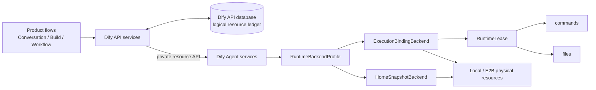
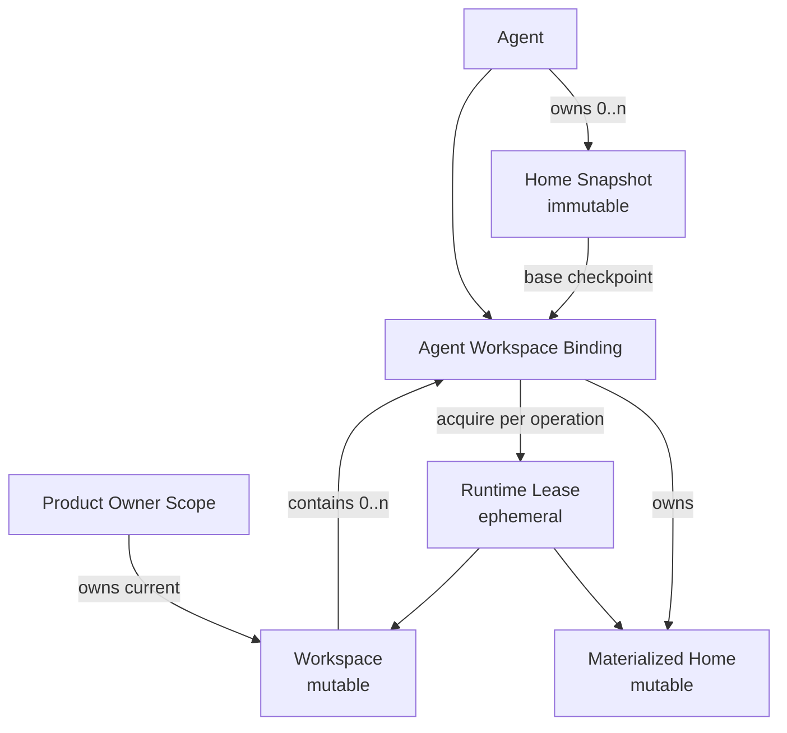
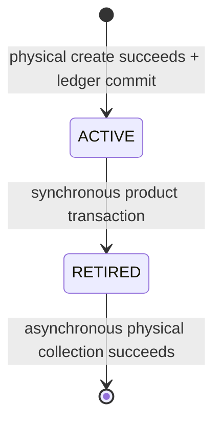
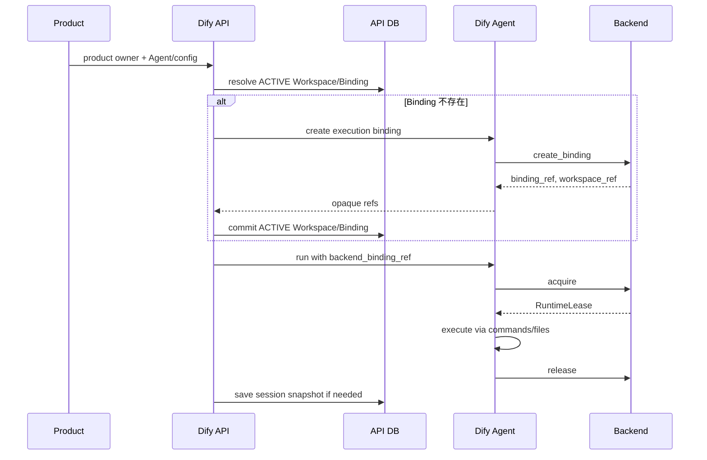

# Agent Working Environment Architecture Doc

## 1. 文档目标

本文描述 Agent Working Environment 的当前完整架构。它统一说明逻辑资源、物理后端、生命周期、所有权、数据库账本、服务边界与代码分层，并作为后续扩展共享 Workspace、资源回收和新运行后端时的设计基线。

这套架构解决的核心问题是：Agent 的 Home、用户可持续浏览的 Workspace，以及一次执行所需的运行环境，具有不同的语义和生命周期；某些物理后端会把它们装进同一个容器，但产品模型不能因此把它们合并成一个“Sandbox session”。

## 2. 核心结论

Agent Working Environment 采用四个逻辑概念：

- **Home Snapshot**：Agent 拥有的不可变 Home 检查点。
- **Workspace**：由产品上下文拥有的可变文件空间。
- **Agent Workspace Binding**：一个 Agent 参与某个 Workspace 的持久关联，同时拥有该 Agent 在该 Workspace 中的 Materialized Home。
- **Runtime Lease**：一次操作临时获得的运行能力，不落库、不拥有持久资源。

其中，Materialized Home 是 Binding 拥有的物理资源，不单独建表。Sandbox 不是产品层的持久资源模型；它只是某些后端用于承载 Binding、Home 和 Workspace 的物理设施。

最重要的不变量是：

1. Home Snapshot、Workspace 和 Runtime Lease 在逻辑上相互独立。
2. 物理耦合只能存在于 backend adapter 内，不能反向污染产品模型。
3. Dify API 是持久资源的控制平面和生命周期账本。
4. Dify Agent 是无产品数据库的轻量执行服务，负责调用部署选定的物理后端。
5. 一次 request 结束只释放 Runtime Lease，不自动删除 Workspace、Binding 或 Home Snapshot。
6. Home Snapshot 不可变；对 Home 的修改先发生在 Materialized Home，只有显式检查点动作才产生新 Snapshot。
7. 资源退出分为同步 `retire` 和异步 `collect`；物理回收成功后直接删除账本行，不保留 `cleaned` 状态。
8. 不做 backend fallback。所选后端不支持某项能力时应明确失败。

## 3. 总体架构



职责分界如下：

| 层 | 负责 | 不负责 |
|---|---|---|
| 产品调用方 | 提供 conversation、build draft、workflow run 等业务定位信息 | 不接触 backend ref，不管理物理资源 |
| Dify API | 鉴权、所有权判断、逻辑 ID、状态转换、配置引用、数据库事务、回收调度 | 不直接操作 E2B SDK 或本地目录 |
| Dify Agent | 暴露私有资源接口，选择一个部署后端，获得和释放 Runtime Lease | 不保存产品资源映射，不连接产品数据库 |
| Backend adapter | 把逻辑操作映射为本地目录、E2B Sandbox/Snapshot 和 shellctl 数据平面操作 | 不理解 conversation、draft、workflow 等产品语义 |
| Agenton runtime layer | 在执行上下文内持有 Runtime Lease | 不创建、retire 或 collect 持久资源 |

状态的存储位置是明确且单一的：

| 状态 | 存储位置 |
|---|---|
| 逻辑资源 ID、owner、状态、opaque ref、session snapshot | Dify API 数据库 |
| Home Snapshot 内容 | 所选物理后端 |
| Materialized Home 与 Workspace 文件 | 所选物理后端 |
| Runtime Lease、SDK client、连接和访问 token | Dify Agent 进程内，仅限当前操作 |
| 待执行的异步回收消息 | Celery `retention` 队列；RETIRED 数据库行仍是事实来源 |

Dify Agent 自身不需要持久进程状态或独立资源数据库；服务重启后仍能依靠 Dify API 提供的 opaque ref 重新 acquire 对应资源。

## 4. 逻辑资源模型



### 4.1 Home Snapshot

Home Snapshot 是某个 Agent 的不可变 Home 状态。它用于：

- 初始化新的 Materialized Home；
- 作为 Agent 配置版本的 Home 检查点；
- 在 Build Apply 时保存构建阶段对 Home 的修改。

一个 Agent 可以同时拥有多个有效 Snapshot，因为不同 draft 或已发布配置可能引用不同版本。创建新 Snapshot 不会修改旧 Snapshot，也不会因为一次 Binding 或 Workspace 结束而自动删除旧 Snapshot。

数据库中的 `snapshot_ref` 是物理后端返回的不透明标识。产品层只持有它，不解析其格式。

### 4.2 Workspace

Workspace 是独立于 Agent Home 的可变文件空间，由产品上下文拥有。当前支持三类 owner：

- `conversation`
- `build_draft`
- `workflow_run`

Workspace 使用 `(tenant_id, owner_type, owner_id, owner_scope_key)` 表达业务所有权：

- conversation 和 build draft 使用根 scope；
- workflow run 使用稳定的 node/binding scope，使同一 workflow run 中不同 Agent 节点拥有各自可定位的 Workspace。

产品只承诺访问当前 Workspace，不提供 Workspace 历史版本。一次 Agent request 结束后，conversation 或 build 场景的 Workspace 仍然存在，因此可以继续浏览最新文件；workflow run 到达终态后则不再要求继续浏览，其 Workspace 可以 retire。

### 4.3 Agent Workspace Binding

Binding 表达“某个 Agent 以某个配置和基础 Home Snapshot 参与某个 Workspace”。

它承担三项职责：

1. 保存 Workspace 与 Agent 的持久关联；
2. 表示并拥有该 Agent 的 Materialized Home；
3. 保存可恢复的 Agenton session snapshot，以及待处理 form/tool call 等连续执行状态。

同一个 Workspace 可以有多个 Agent Binding。每个 Binding 都有独立的 Materialized Home，但共享 Workspace。这是逻辑模型的能力，即使当前 E2B 后端尚不能物理实现共享 Workspace。

对于同一 `(tenant, workspace, agent)`，同一时刻最多存在一个 ACTIVE Binding。若已有 Binding 的基础 Home Snapshot 或配置 generation 与新请求不一致，服务会 fail fast，而不是隐式复用或迁移。

### 4.4 Materialized Home

Materialized Home 是从 Home Snapshot 物化出来的可变 Home。Agent 在运行期间对 Home 的写入发生在这里。

它没有独立数据库表，因为其：

- 生命周期完全从属于 Binding；
- 所有权没有独立于 Binding 的业务含义；
- 物理地址由 backend binding ref 和后端实现决定。

Binding retire 后，Materialized Home 随 Binding 一起进入待回收状态。

### 4.5 Runtime Lease

Runtime Lease 是一次执行、文件访问或检查点操作临时获得的能力对象。它暴露：

```python
RuntimeLease:
    layout: RuntimeLayout
    commands: ShellCommandProtocol
    files: FileSystem
```

其中 `RuntimeLayout` 只定义当前操作可见的 `home_dir` 和 `workspace_dir`。

Shell layer 需要的临时工作目录就是 `workspace_dir`；架构中不存在第三个 `temp_dir` 资源或配置。

Runtime Lease：

- 不生成数据库记录；
- 不序列化进 Agenton session；
- 不承担业务生命周期；
- 在操作开始时 acquire，在操作结束时 release；
- release 只关闭连接、暂停或归还物理执行资源，不 retire 持久逻辑资源。

同一个 Binding 可以在不同时间被多次 acquire。架构不额外引入 runtime writer 锁、lease 状态机或持久化 runtime session。

Agenton layer 的 `resource_context` 适合管理这类 operation-local handle。layer 的 create/resume/suspend/delete hook 不映射为持久资源的创建、暂停、retire 或物理删除；这些动作必须由 Dify API 的产品生命周期服务发起。

### 4.6 Sandbox 的位置

“Sandbox”只用于描述物理隔离和执行载体，不是独立的产品实体：

- 在 E2B 中，一个 Sandbox 当前同时承载 Binding 的 Materialized Home 和 Workspace；
- 在 Local 中，共享 shellctl 服务通过相互独立的目录物化多个 Home 和 Workspace；
- 对调用方而言，两者都只表现为相同的 Binding、Snapshot 和 Runtime Lease 契约。

因此不建立 `sandboxes` 表，也不把“一次 Agent request run”落为持久 Sandbox 生命周期。

## 5. 所有权与生命周期

### 5.1 所有权

| 资源 | 逻辑所有者 | 生命周期依据 |
|---|---|---|
| Home Snapshot | Agent | Agent 配置引用和 Agent 生命周期 |
| Workspace | Product owner scope | conversation、build draft 或 workflow run |
| Binding | Agent 与 Workspace 的参与关系 | Workspace/Agent 生命周期及 generation |
| Materialized Home | Binding | 与 Binding 同生共死 |
| Runtime Lease | 当前调用 | 当前操作的作用域 |
| 物理 Sandbox | Backend adapter | 由后端映射决定，不成为产品所有者 |

### 5.2 持久资源状态机

Home Snapshot、Workspace 和 Binding 使用同一条简洁状态链：



- `ACTIVE`：允许被业务流解析和使用。
- `RETIRED`：业务上不可再用，物理资源等待回收。
- 行删除：物理资源已完成幂等回收，不再保留账本记录。

不设置 `CREATING`、`FAILED` 或 `CLEANED` 状态。当前数据库是已成功纳入产品管理的资源账本，不是完整的外部资源审计日志。

### 5.3 主要触发点

| 产品事件 | Home Snapshot | Binding | Workspace | Runtime Lease |
|---|---|---|---|---|
| 首次创建 Agent | 创建初始 Snapshot | 无 | 无 | 无 |
| Agent request | 保留 | 创建或复用 | 创建或复用 | acquire / release |
| request 结束 | 保留 | 保留 | 保留 | release |
| request 后浏览文件 | 保留 | 复用 | 复用当前 Workspace | acquire / release |
| Build Apply | 从 build Binding 创建新 Snapshot | retire build Binding | 最后一个 Binding 退出时 retire | checkpoint 操作内 acquire / release |
| Build Discard | 保留 | retire | retire build Workspace | 无 |
| Conversation 删除 | 保留 | retire | retire | 无 |
| Workflow 到达终态 | 保留 | retire | retire run Workspace | 无 |
| Agent/App archive 或删除 | retire 无有效业务所有权的 Snapshot | retire | retire | 无 |

Binding retire 时，如果 Workspace 中已没有其他 ACTIVE Binding，Workspace 同时 retire。Workspace retire 时，其全部 ACTIVE Binding 一并 retire。

Home Snapshot collector 在物理删除前会再次检查配置引用。仍被 `AgentConfigDraft` 或 `AgentConfigSnapshot` 引用的 Snapshot 即使已标记 RETIRED，也不会被删除。

## 6. 数据模型

### 6.1 `agent_home_snapshots`

| 字段 | 含义 |
|---|---|
| `id` | 产品层 Home Snapshot ID |
| `tenant_id` | 租户边界 |
| `agent_id` | Snapshot 所属 Agent |
| `snapshot_ref` | 后端不透明物理引用 |
| `status` | `active` / `retired` |
| `retired_at` | 进入待回收状态的时间 |
| `created_at` | 创建时间 |

`AgentConfigDraft.home_snapshot_id` 和 `AgentConfigSnapshot.home_snapshot_id` 保存产品层 ID，而不是 backend ref。

### 6.2 `agent_workspaces`

| 字段 | 含义 |
|---|---|
| `id` | 产品层 Workspace ID |
| `tenant_id`, `app_id` | 租户与应用边界 |
| `owner_type`, `owner_id`, `owner_scope_key` | 产品所有权 |
| `backend_workspace_ref` | 后端不透明 Workspace 引用 |
| `status`, `active_guard`, `retired_at` | 生命周期与 ACTIVE 唯一性 |
| `created_at`, `updated_at` | 时间信息 |

唯一约束 `(tenant_id, owner_type, owner_id, owner_scope_key, active_guard)` 保证一个 owner scope 只有一个 ACTIVE Workspace。ACTIVE 行的 `active_guard=1`，RETIRED 行将其置为 `NULL`，从而兼容 PostgreSQL 和 MySQL 的唯一索引行为，同时允许已退役历史在等待回收期间存在。

### 6.3 `agent_workspace_bindings`

| 字段 | 含义 |
|---|---|
| `id` | 产品层 Binding ID，同时是 Materialized Home 的逻辑身份 |
| `tenant_id`, `app_id` | 租户与应用边界 |
| `workspace_id`, `agent_id` | 绑定双方 |
| `base_home_snapshot_id` | 物化 Home 的基础 Snapshot |
| `agent_config_version_id`, `agent_config_version_kind` | Binding 所属配置 generation |
| `backend_binding_ref` | 后端不透明 Binding 引用 |
| `session_snapshot` | 可恢复的 Agenton session 状态 |
| `pending_form_id`, `pending_tool_call_id` | 跨请求继续执行所需状态 |
| `status`, `active_guard`, `retired_at` | 生命周期与 ACTIVE 唯一性 |
| `created_at`, `updated_at` | 时间信息 |

唯一约束 `(tenant_id, workspace_id, agent_id, active_guard)` 保证一个 Agent 在一个 Workspace 中只有一个 ACTIVE Binding。

### 6.4 逻辑引用而非生命周期外键

Working Environment 表之间，以及它们与业务 owner、配置版本之间，使用逻辑 ID 关联而不设置生命周期外键。原因是这些对象的业务删除和物理回收不是同一事务：

- owner 或配置记录可以先结束；
- RETIRED 资源必须继续保留 backend ref，供异步 collector 完成清理；
- collector 不能因为业务记录已删除而失去回收资源所需的信息。

所有权、tenant 边界和 ACTIVE 状态由 service 查询显式校验。

## 7. 数据库与外部资源的一致性

数据库不能与 Local/E2B 资源创建组成原子事务，因此架构明确区分“后端内部创建失败”和“后端成功后数据库失败”。

### 7.1 创建路径

创建顺序为：

1. Dify API 校验业务输入并生成逻辑 ID；
2. Dify Agent 调用后端创建物理资源；
3. 后端返回不透明 ref；
4. Dify API 写入 ACTIVE 账本并提交。

如果后端在返回成功前失败，后端 adapter 负责清理本次调用中已经创建的局部资源，因为只有它能确定创建没有完成：

- Local 删除部分创建的目录；
- E2B kill 部分初始化的 Sandbox，初始化 Snapshot 时始终释放临时 Sandbox。

如果后端已返回成功，而后续 Python、flush 或 commit 失败，可能产生数据库中没有记录的外部 orphan。Dify API 不在这个窄窗口内做跨系统即时补偿，避免误删一个已经成功但提交结果不确定的资源。未来的全局 reconciler 应通过后端 inventory、账本和安全宽限期处理这类 orphan。

当前不引入 `creating` 状态、outbox 或分布式事务。

### 7.2 退出与回收路径

退出分为两个阶段：

1. **同步 retire**：在当前产品事务中把 ACTIVE 改为 RETIRED，清除 `active_guard`，写入 `retired_at`。
2. **异步 collect**：产品事务 commit 后，将逻辑资源 ID 投递到 Celery `retention` 队列；worker 重新读取 RETIRED 行，调用 Dify Agent 删除物理资源，成功后删除账本行。

task 只携带：

```text
tenant_id
binding_ids[]
workspace_ids[]
home_snapshot_ids[]
```

它不携带 ORM 对象或 backend ref。backend ref 必须在执行时从 RETIRED 账本重新读取。

collection 按 `Workspace -> Binding -> Home Snapshot` 的顺序执行，以兼容 Workspace 与 Binding 物理耦合的后端。单个资源失败只记录错误并保留 RETIRED 行，不阻止其他资源继续回收。

队列投递是 best effort：

- retire 事务失败：不投递；
- commit 成功但投递失败：资源保留为 RETIRED；
- 物理删除失败：资源保留为 RETIRED；
- 物理删除成功但账本删除失败：资源仍为 RETIRED，后续可依赖幂等删除再次执行。

未来 GC 只需扫描 `status=retired` 和 `retired_at`，并复用同一批 collector。当前阶段不实现周期 GC、TTL 或复杂重试状态机。

## 8. Dify API 应用服务

### 8.1 `AgentHomeSnapshotService`

主要接口：

```text
create_initial(session, tenant_id, agent_id) -> AgentHomeSnapshot
create_for_build_apply(session, build_draft, source_binding_id) -> AgentHomeSnapshot
retire_all_for_agent(session, tenant_id, agent_id) -> home_snapshot_ids
collect_retired_home_snapshot(tenant_id, home_snapshot_id)
```

它负责：

- 校验 Snapshot 的 Agent 所有权和状态；
- 为初始 Agent 或 Build Apply 创建后端 Snapshot；
- 写入和 retire Snapshot 账本；
- 在 collection 前检查配置引用；
- 将物理 ref 仅暴露给 Dify Agent 私有接口。

service 的产品调用方只使用 `home_snapshot_id`，不需要 resolve backend ref。

### 8.2 `AgentWorkspaceService`

主要接口：

```text
resolve_active_workspace(session, scope) -> Workspace?
resolve_active_binding(session, scope, agent_id) -> Binding?
create_or_resolve_binding(scope, agent_id, base_home_snapshot_id,
                          agent_config_version_id, agent_config_version_kind) -> Binding
save_binding_session_snapshot(tenant_id, binding_id, session_snapshot, ...)
retire_binding(session, tenant_id, binding_id) -> binding_id?
retire_workspace(session, tenant_id, workspace_id) -> workspace_id?
retire_all_for_app(session, tenant_id, app_id) -> workspace_ids
collect_retired_binding(tenant_id, binding_id)
collect_retired_workspace(tenant_id, workspace_id)
```

它是 Workspace 和 Binding 的产品生命周期服务，负责：

- 从业务 owner scope 解析当前 Workspace；
- 创建或复用与 config/Home generation 匹配的 Binding；
- 保存跨请求 Agenton session 状态；
- 在调用方事务内同步 retire；
- 在异步 worker 中执行物理 collection。

### 8.3 Product-specific stores

`AgentAppWorkspaceStore` 和 `WorkflowAgentWorkspaceStore` 把具体业务上下文转换为统一的 `WorkspaceOwnerScope`，并在运行请求构建前解析或创建 Binding。

它们不创建新的资源抽象，只负责：

- conversation/build/workflow scope 的映射；
- Binding session snapshot 的读取和保存；
- workflow terminal 时的 Workspace retirement。

### 8.4 文件访问服务

产品文件接口接受 conversation、workflow run、node 等产品定位信息。Dify API 先完成 tenant、app、account 和 owner 校验，再解析当前 ACTIVE Binding，最后把 `backend_binding_ref` 发送给 Dify Agent。

因此：

- 浏览器和公共 API 不接触 Workspace ID、Binding ID 或 backend ref；
- request 结束后仍可通过产品 locator 浏览当前 Workspace；
- 文件调用本身只临时 acquire Runtime Lease，不延长或改变 Workspace 的产品生命周期。

### 8.5 Retirement orchestration

`WorkflowAgentRetirementService` 负责 workflow-only Agent 的所有权重查与退役。它在主业务事务提交后使用新 session 再次检查 draft/published workflow 的真实引用，只处理确认已无业务所有者的 Agent 及其资源。

`enqueue_agent_resource_collection` 统一负责去重、过滤空 ID 并把回收任务路由到 `retention` 队列。retire service 不直接执行耗时的网络清理。

## 9. Dify Agent 私有服务接口

Dify Agent 不连接产品数据库。它接收 Dify API 已经完成鉴权和解析后的请求，并通过当前 `RuntimeBackendProfile` 执行。

### 9.1 Execution Binding

| 接口 | 作用 |
|---|---|
| `POST /execution-bindings` | 从 Home Snapshot 创建 Binding，并创建或接入 Workspace |
| `POST /execution-bindings/destroy` | 删除 Binding，可由后端能力决定是否同时删除 Workspace |

创建输入包含 `tenant_id`、`agent_id`、`binding_id`、`workspace_id`、可选 `existing_workspace_ref` 和 `home_snapshot_ref`；输出 `binding_ref` 与 `workspace_ref`。

### 9.2 Home Snapshot

| 接口 | 作用 |
|---|---|
| `POST /home-snapshots/initialize` | 从部署提供的初始环境创建 Snapshot |
| `POST /home-snapshots/from-binding` | 从指定 Binding 的当前 Materialized Home 创建 Snapshot |
| `POST /home-snapshots/delete` | 幂等删除物理 Snapshot |

Build Apply 使用 `from-binding`，因为它必须对准确的 build Binding 做检查点，而不是从文件列表或任意路径重建 Home。

### 9.3 Workspace files

| 接口 | 作用 |
|---|---|
| `POST /workspace/files/list` | 列出 lease 文件命名空间中的目录 |
| `POST /workspace/files/read` | 读取文件 |
| `POST /workspace/files/upload` | 把运行环境中的文件转存为产品文件 |

每次操作都以 `backend_binding_ref` acquire Runtime Lease，完成后 release。路径解释和可访问边界属于 backend `FileSystem`/shellctl 隔离契约，Dify Agent service 不额外把请求路径拼接到 `workspace_dir`。

这些接口都是 Dify API 到 Dify Agent 的私有协议，不是面向最终用户的资源 API。

## 10. 物理后端契约

一个部署选择一个完整且一致的 `RuntimeBackendProfile`：

```python
RuntimeBackendProfile:
    home_snapshots: HomeSnapshotBackend
    execution_bindings: ExecutionBindingBackend
```

后端必须实现以下最小接口。

### 10.1 `HomeSnapshotBackend`

```python
initialize(spec: InitializeHomeSnapshotSpec) -> snapshot_ref
create_from_runtime(spec: HomeSnapshotCreateSpec,
                    source: RuntimeLease) -> snapshot_ref
delete(snapshot_ref) -> None
```

语义要求：

- 返回的 ref 在该部署内可以稳定重用；
- Snapshot 创建后不可变；
- `create_from_runtime` 保存的是 lease 的逻辑 Home；
- delete 幂等；
- 创建未成功返回前，由 backend 清理自己产生的局部资源。

### 10.2 `ExecutionBindingBackend`

```python
create_binding(spec: ExecutionBindingCreateSpec)
    -> ExecutionBindingAllocation(binding_ref, workspace_ref)
acquire(binding_ref) -> RuntimeLease
release(lease) -> None
destroy_binding(spec: ExecutionBindingDestroySpec) -> None
```

`ExecutionBindingCreateSpec` 包含：

```text
tenant_id
agent_id
binding_id
workspace_id
existing_workspace_ref?
home_snapshot_ref
```

`destroy_binding` 显式携带 `destroy_workspace`，因为逻辑上删除 Materialized Home 和删除共享 Workspace 是两个动作。不能支持该组合的后端必须返回明确的 capability error，不能静默改变语义。

### 10.3 `FileSystem`

Runtime Lease 的文件能力至少包括：

```text
list_directory(path, limit)
read_file(path, max_bytes)
read_bytes(path, max_bytes)
upload(content, remote_path, cwd?)
download(remote_path, cwd?)
```

命令和文件均通过 lease 暴露。SDK client、网络连接、访问 token 等 operation-local 对象不得进入数据库或 session snapshot。

## 11. Local 物理实现

Local backend 使用一个共享 shellctl daemon，并把不同逻辑资源映射到不同目录：

```text
snapshot_root/<snapshot_ref>                  immutable Home Snapshot
materialized_home_root/<binding_id>           mutable Materialized Home
workspace_root/<workspace_id>                 mutable shared Workspace
```

创建 Binding 时：

1. 校验 Snapshot 目录存在；
2. 若没有现有 Workspace，则创建 Workspace 目录；否则校验其存在；
3. 把 Snapshot 内容复制到新的 Materialized Home；
4. 返回编码了 binding/workspace 身份的 `binding_ref`，以及独立的 `workspace_ref`。

这使 Local backend 能实际支持：

- 多个 Agent 在同一个 Workspace 上工作；
- 每个 Agent 拥有独立 Materialized Home；
- 删除单个 Binding 时保留共享 Workspace；
- 最后删除 Workspace 时一起清理对应目录。

acquire 只建立当前 shellctl 数据平面并校验 Home/Workspace 目录存在；release 关闭该操作的连接，目录继续保留。

Local Home Snapshot：

- 初始化时创建受保护的 Snapshot 目录；
- Build Apply 时仅复制 `source.layout.home_dir`；
- 删除时移除对应 Snapshot 目录。

## 12. Current E2B 物理实现

当前 E2B backend 使用模板：

```text
difys-default-team/dify-agent-local-sandbox
```

### 12.1 物理映射

| 逻辑对象 | E2B 物理对象 |
|---|---|
| Home Snapshot | E2B native Snapshot ID |
| Binding | retained E2B Sandbox ID |
| Workspace | 同一个 retained E2B Sandbox ID |
| Materialized Home | Sandbox 内 `/home/dify` |
| Workspace files | Sandbox 内 `/home/dify/workspace` |
| Runtime Lease | operation-local E2B SDK object + shellctl client |

因此当前 E2B 中：

```text
binding_ref == workspace_ref == sandbox_id
```

这是 adapter 内的物理耦合，不改变逻辑模型。

### 12.2 Snapshot

初始 Snapshot 的流程是：

1. 从配置的 E2B template 创建临时 Sandbox；
2. 确保 Home 目录存在；
3. 创建 E2B native Snapshot；
4. 无论成功失败都 kill 临时 Sandbox。

Build Apply 从 build Binding 的 Runtime Lease 调用 E2B native snapshot。E2B 的物理 Snapshot 可能包含整个 Sandbox，但对上层的契约仍然是 Home Snapshot。以后用该 Snapshot 创建新 Binding 时，adapter 会清空并重建 `/home/dify/workspace`，避免旧 Workspace 内容被误当作 Home 状态继承。

### 12.3 Binding 与 Lease

创建 Binding 时，从 `home_snapshot_ref` 创建 E2B Sandbox，清空 Workspace 目录，暂停 Sandbox，并返回 Sandbox ID。

acquire 连接到该 Sandbox 并建立 shellctl 数据平面；release 关闭数据平面并 pause Sandbox。active timeout 的含义也是自动 pause，而不是资源年龄 TTL。

物理删除通过 kill Sandbox 完成，并按资源不存在视为幂等成功。

### 12.4 当前能力限制

当前 E2B 无法让多个独立 Sandbox 共享同一个 Workspace，因此：

- `existing_workspace_ref` 会返回 `shared_workspace_unsupported`；
- 不能在保留 Workspace 的同时单独销毁 Binding；
- `destroy_workspace=false` 会返回 `workspace_preservation_unsupported`；
- 当前 E2B 用户路径实际上是一组 Binding 对应一组物理 Workspace。

这项限制只属于 current E2B adapter。上层模型仍保留共享 Workspace 能力，Local backend 已能实现该语义；未来 E2B Volume 或其他共享存储方案可以在不修改产品模型的前提下补齐。

## 13. 关键运行流程

### 13.1 Agent request



request 结束不会 retire Binding 或 Workspace。`run_id` 只用于本次执行的事件、状态、取消或观测，不参与 Working Environment 资源映射。

### 13.2 request 后浏览当前 Workspace

1. 客户端提交 conversation 或 workflow 节点等产品 locator；
2. Dify API 校验当前用户对该产品对象的访问权；
3. API 解析最新 ACTIVE Workspace/Binding；
4. Dify Agent acquire lease，执行一次文件操作并 release；
5. Workspace 与 Binding 继续保持 ACTIVE。

不存在“为了浏览文件而恢复一个持久 Runtime Session”的概念。

### 13.3 Build Draft Apply

Build Apply 是 Home 发生持久版本变化的明确检查点：

1. 查找并校验与当前 build draft、Agent、基础 Snapshot 和配置 generation 精确匹配的 ACTIVE Binding；
2. Dify Agent acquire 该 Binding 的 Runtime Lease；
3. `HomeSnapshotBackend.create_from_runtime` 创建不可变 Snapshot；
4. Dify API 写入新的 `agent_home_snapshots` ACTIVE 行；
5. normal draft 保存 build 配置，并把 `home_snapshot_id` 指向新 Snapshot；
6. 同一产品事务内 retire build Binding；如果它是最后一个 Binding，同时 retire build Workspace；
7. 删除 build draft 并提交；
8. commit 后投递 RETIRED Binding/Workspace 的 collection。

Publish 不再创建 Home Snapshot。发布只消费已经由 Build Apply 固化到 normal draft 的 Home Snapshot。

## 14. 代码分层

### 14.1 Dify API：产品控制平面

| 目录/文件 | 角色 |
|---|---|
| `api/models/agent.py` | Home Snapshot、Workspace、Binding 数据模型与枚举 |
| `api/services/agent/home_snapshot_service.py` | Snapshot 账本、创建、retire、collect |
| `api/services/agent/workspace_service.py` | Workspace/Binding 解析、创建、session 状态、retire、collect |
| `api/core/app/apps/agent_app/session_store.py` | conversation/build owner 到 Binding 的映射 |
| `api/core/workflow/nodes/agent_v2/session_store.py` | workflow owner 到 Binding 的映射和终态 retire |
| `api/services/agent_app_sandbox_service.py` | 产品 locator、鉴权与文件代理 |
| `api/services/agent/retirement_service.py` | workflow-only Agent 的所有权重查与资源 retire |
| `api/tasks/collect_agent_resources_task.py` | `retention` 队列上的统一异步 collector |

产品 runner 和 request builder 只把解析后的 `backend_binding_ref` 放入 Dify runtime layer config，不构造后端对象。

### 14.2 Dify Agent：执行与后端适配层

| 目录/文件 | 角色 |
|---|---|
| `dify_agent/protocol/` | Dify API 与 Dify Agent 的私有 DTO |
| `dify_agent/server/execution_bindings.py` | Binding 应用服务 |
| `dify_agent/server/home_snapshots.py` | Home Snapshot 应用服务 |
| `dify_agent/server/workspace_files.py` | lease-scoped 文件服务 |
| `dify_agent/server/routes/` | 私有 HTTP 路由 |
| `dify_agent/runtime_backend/protocols.py` | backend-neutral 协议 |
| `dify_agent/runtime_backend/profile.py` | 部署级后端选择与配置 |
| `dify_agent/runtime_backend/local.py` | Local 物理映射 |
| `dify_agent/runtime_backend/e2b.py` | E2B 物理映射 |
| `dify_agent/runtime_backend/shellctl.py` | 统一命令和文件数据平面 |
| `dify_agent/runtime_backend/leases.py` | acquire/release context manager |
| `dify_agent/layers/runtime/` | Agenton 中 operation-scoped Runtime Lease |
| `dify_agent/layers/shell/` | 消费 Runtime Lease 的 commands、files 和 layout |

依赖方向固定为：

```text
Product flow
  -> Dify API lifecycle services
  -> private Dify Agent protocol
  -> Dify Agent application services
  -> backend protocols
  -> Local / E2B adapters
  -> shellctl / backend SDK
```

后端实现不得反向依赖 Dify API model；Agenton layer 也不得承担 Workspace、Binding 或 Snapshot 的产品生命周期。

## 15. 隔离、封装与失败语义

### 15.1 封装

- backend ref 只存在于 Dify API 账本和 Dify Agent 私有请求中；
- E2B API key、traffic token、SDK Sandbox 对象和 shellctl client 只存在于 Dify Agent；
- 客户端只能使用产品 locator，不能指定任意 backend ref；
- tenant、app、account、owner 和 ACTIVE 状态由 Dify API 校验；
- 文件路径的最终隔离由 backend 数据平面负责。

### 15.2 Fail fast

以下情况明确失败，不做猜测或 fallback：

- 基础 Home Snapshot 不存在或不属于该 Agent；
- Binding 的配置/Home generation 不匹配；
- backend binding 已丢失；
- 当前后端不支持共享 Workspace；
- 当前后端不能保留 Workspace 而单独删除 Binding；
- 选定的 runtime backend 配置不完整。

部署只选择一个 coherent backend profile，不会在请求失败后切换到另一后端，也不会自动重建丢失资源。

## 16. 当前边界与演进方向

当前架构有意不实现：

- Workspace 历史版本；
- 持久 Runtime Lease 或 Sandbox session 表；
- runtime ABI 版本协商；
- request 级 writer 锁或执行互斥；
- 资源年龄 TTL；
- `CREATING` / `FAILED` / `CLEANED` 状态机；
- 周期 GC、全局 orphan reconciler、outbox；
- backend 兼容 fallback；
- current E2B 上的共享 Workspace。

Enterprise backend 保留相同的 profile/协议接入位置，但当前资源操作显式 `NotImplemented`；它不会回退到 Local 或 E2B。

数据模型已经为两项后续能力保留了自然扩展点：

1. **Retired resource GC**：按 `status` 与 `retired_at` 扫描，并复用现有 collector。
2. **Global orphan reconciliation**：对比后端 inventory 与 Dify API ledger，结合宽限期清理“物理创建成功但账本提交失败”的资源。

这些能力应在真实运维需求出现时独立加入，不改变当前 Home Snapshot、Workspace、Binding 和 Runtime Lease 的核心边界。

## 17. 架构判断标准

未来新增后端或修改资源流程时，应以以下问题判断设计是否仍然成立：

1. 产品逻辑是否仍能独立表达 Home、Workspace、Binding 和单次 Runtime Lease？
2. 某种物理耦合是否被限制在 adapter 内？
3. Dify API 是否仍是唯一的产品生命周期账本？
4. Dify Agent 是否仍可保持无产品数据库、无跨请求资源目录？
5. request 结束是否只释放 lease，而不会误删持久文件？
6. retire 是否在产品事务内同步完成，collect 是否只在 commit 后异步执行？
7. backend ref 和后端凭据是否仍未泄露给产品客户端？
8. 不支持的能力是否明确失败，而非用 fallback 模糊语义？

只要这些约束成立，Local、E2B 以及未来其他后端就可以拥有不同的物理实现，同时共享同一套清晰、稳定的 Agent Working Environment 产品模型。
