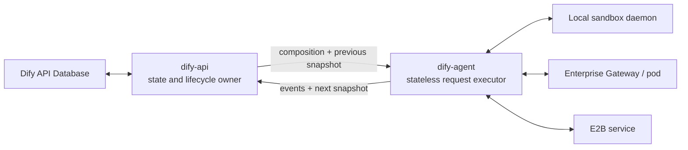
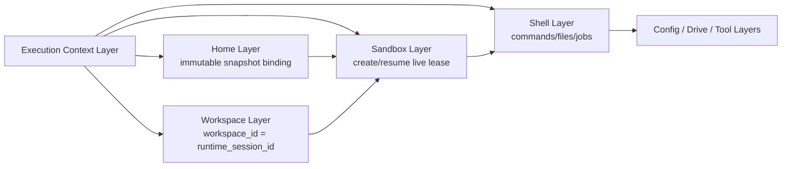
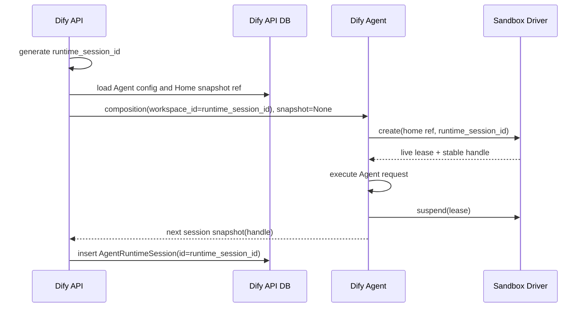
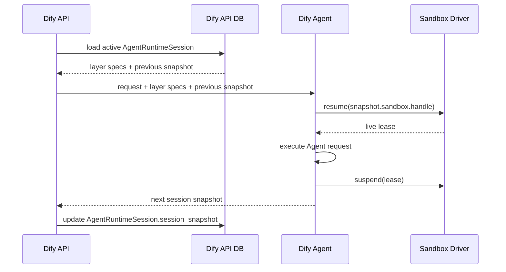
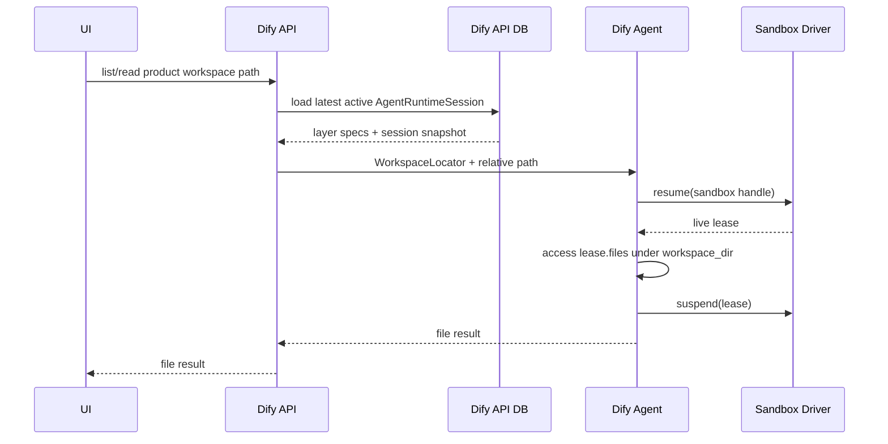
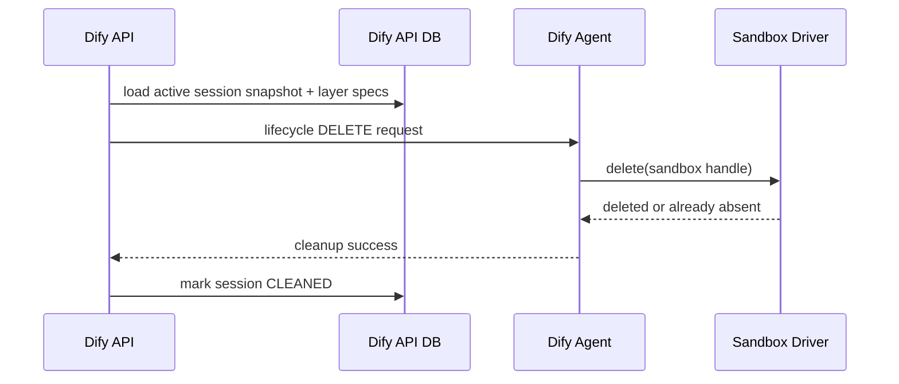

# Agent Home、Workspace、Sandbox 与 Runtime Backend 架构

## 状态

- 日期：2026-07-20
- 范围：Dify API、Dify Agent、Agenton layers、Local / Enterprise / E2B runtime backend
- 核心边界：Dify API 保存所有跨请求逻辑状态；Dify Agent 不连接数据库，只执行一次 Agent request 并返回下一份 session snapshot

## 1. 摘要

目标架构将当前 `DifyShellLayer` 中混合的职责拆成四个独立领域层：

- **Home Layer**：绑定跟随 Agent config version 的不可变 Home Snapshot。
- **Workspace Layer**：绑定当前 runtime session 的可变 workspace；`workspace_id` 直接等于 `runtime_session_id`。
- **Sandbox Layer**：创建或恢复物理 sandbox，并管理单次请求期间的 live lease。
- **Shell Layer**：只提供 commands、files、jobs、prompt 和 tools，不管理 sandbox 生命周期。

Dify Agent 采用 state-transition executor 模式：

```text
composition + previous session snapshot + request
    -> execute Agent request
    -> next session snapshot
```

跨请求状态由 Dify API 现有 `agent_runtime_sessions` 表保存。Dify Agent 不新增数据库、持久协调进程、Redis runtime records、分布式锁或 Reconciler。

请求结束后的 Workspace 文件访问复用现有 Dify API `AgentAppSandboxService`、Dify Agent `SandboxFileService`、`/sandbox/files/*` 路由和 client contract；本方案只迁移它们的 locator 与底层 Layer/backend 实现，不新增第二套 Workspace service。

物理资源仍由各 backend 保存：

- Local：现有 local-sandbox daemon 与本地 filesystem。
- Enterprise：现有 Sandbox Gateway 与 pod。
- E2B：E2B Snapshot 与 paused sandbox。

不同 backend 可以在物理上耦合 Home、Workspace 和 Sandbox，但 Layer 边界与公共协议保持独立。

## 2. 已确定的产品语义

### 2.1 Home Snapshot

- Home Snapshot 不可变。
- 生命周期跟随 Agent config version。
- 多个 runtime session 可以从同一个 Home Snapshot 创建 sandbox。
- Sandbox 内对 `$HOME` 的修改不回写 Home Snapshot。
- Agent 配置持久化通过显式配置 API 完成，并产生新的 config version 和 Home Snapshot。
- Agent 初始 backing config snapshot 即使尚未发布，也必须通过当前部署 backend materialize Home。
- Draft / build-draft 不创建独立 Home；运行时通过 `base_snapshot_id` 使用对应 immutable snapshot 的 ref。
- 不存在跨 Local / Enterprise / E2B 通用的默认 Home ref 或 E2B template fallback。
- Runtime base 假定稳定。

### 2.2 Workspace

- 一个 runtime session 对应一个 workspace。
- `workspace_id == runtime_session_id`，不生成第二套 workspace identity。
- 产品读取 workspace 的当前最新状态。
- 不保留 per-request workspace history。
- 请求结束后必须继续支持 workspace 文件浏览。
- 当前阶段 workspace 物理内容保存在 retained sandbox 内，不实现 E2B Volume、PVC 或 workspace archive。
- `workspace_dir` 同时是临时工作目录，不存在独立 `temp_dir`。

### 2.3 Sandbox

- 一次请求持有一个 live sandbox lease。
- 请求结束后释放 live connection，但保留或 pause 物理 sandbox。
- Sandbox handle 在整个 runtime session 内稳定。
- Sandbox handle 是非敏感资源标识，可以进入 Agenton session snapshot。
- Access token、API key、proxy token、SDK client 等不能进入 snapshot。
- 当前 workspace 依赖 retained sandbox；如果该 sandbox 被确认丢失，workspace 也不可恢复，不能从 Home Snapshot 静默创建空 workspace。
- 请求之间不承诺进程、内存、PTY 或后台 job 连续性；Shell Layer 在请求退出时清理追踪的 jobs。

### 2.4 Dify Agent service

- 不连接 Dify 产品数据库。
- 不拥有 Agent config、runtime session、workspace 或 Home Snapshot 的持久记录。
- 不新增常驻 runtime coordinator。
- 可以继续使用现有 Redis 处理 run scheduling/event stream，但 Redis 不是 Layer session state 的 source of truth。
- 任意 Dify Agent 实例都应能根据请求携带的 composition 和 session snapshot 恢复执行。
- 复用现有 `SandboxFileService` 为 Dify API 提供 Workspace list/read/upload；不新增 Workspace registry 或 Workspace 管理服务。
- 新增无状态 Home Snapshot control-plane service，供 Dify API 在 Agent config version 生命周期中调用 create/delete。

## 3. 目标与非目标

### 3.1 目标

- 从 Shell Layer 移除 Home、Workspace 和 Sandbox 生命周期职责。
- 支持 Local、Enterprise、E2B backend。
- 保持 Dify Agent 无数据库、轻量、可水平扩展。
- 复用 Dify API 现有 `AgentRuntimeSession.session_snapshot` 持久化机制。
- 复用现有 Workspace/Sandbox 文件 service、路由和 Dify Agent client contract。
- 请求结束后可以浏览当前最新 workspace。
- 允许 backend 内部实现 Home / Workspace / Sandbox 的物理耦合。
- 为未来独立 workspace storage 留下扩展点，但不提前实现。

### 3.2 非目标

- 不新增 Dify Agent 数据库或持久状态表。
- 不新增 Sandbox Session Manager 持久协调服务。
- 不实现 workspace 历史版本。
- 不实现分布式 workspace lock、CAS、generation 或 lease database。
- 不实现独立 Reconciler 或基于资源年龄的 sandbox 回收；当前阶段只在显式 runtime-session / app lifecycle 中做一次 best-effort cleanup。
- 不允许 Agent Soul 任意选择基础设施 backend。
- 不把任意 sandbox filesystem 暴露为产品文件 API。
- 第一阶段不实现 E2B Volume、PVC 或对象存储 workspace。

## 4. 核心不变量

1. Dify API 是 Agent config 和 runtime session 状态的唯一持久化 owner。
2. Dify Agent 只消费 previous snapshot，并返回 next snapshot。
3. Home Snapshot 的创建和删除不由 Agenton runtime session lifecycle 驱动。
4. Home Snapshot 删除只由 Agent config version lifecycle 驱动。
5. `workspace_id` 等于 `runtime_session_id`，在 session 内保持稳定。
6. Shell Layer 不知道当前使用 Local、Enterprise 还是 E2B。
7. Sandbox Layer 不解析 backend-specific Home ref，只将其传给当前部署的 Sandbox Driver。
8. 非敏感、稳定的 Sandbox handle 可以进入 Agenton session snapshot。
9. Credentials、live clients 和 SDK objects 不得进入 composition、session snapshot 或 API 数据库。
10. Retained sandbox 丢失时 workspace 不可用，不得静默重建为空 workspace。
11. Workspace 文件 API 只能访问 canonical `workspace_dir` 范围。
12. 当前阶段不提供跨 backend 的物理 sandbox age TTL 保证；Dify API 只在显式 runtime-session / app lifecycle 中尽力发起 cleanup，不保证成功或最终回收。

## 5. 服务边界与状态归属



### 5.1 状态分类

| 状态 | Owner | 保存位置 |
|---|---|---|
| Agent config | Dify API | 现有产品数据库 |
| Home Snapshot ref | Dify API | Agent config snapshot 或其关联记录 |
| Runtime session ID | Dify API | `agent_runtime_sessions.id` |
| Workspace ID | Dify API | 直接使用 runtime session ID |
| Agenton session snapshot | Dify API | `agent_runtime_sessions.session_snapshot` |
| Runtime layer specs | Dify API | `agent_runtime_sessions.composition_layer_specs` |
| Sandbox handle | Dify API | Sandbox Layer runtime state，包含在 session snapshot 中 |
| Home/Workspace 文件内容 | Runtime backend | Local filesystem、Enterprise pod、E2B sandbox/snapshot |
| Live lease/client | Dify Agent | 单次请求内存 |
| Backend credentials | Dify Agent deployment | 服务端 settings/secrets |

### 5.2 Dify Agent 无状态的含义

Dify Agent 可以在一个请求内持有状态，但请求结束后不依赖本机内存继续存在：

```text
允许：
- Layer instances
- E2B SDK client
- shellctl HTTP client
- command/file capability adapters
- live SandboxLease

禁止作为跨请求 source of truth：
- sandbox session database
- workspace mapping database
- Home Snapshot catalog database
- process-local resume registry
```

### 5.3 Dify Agent 资源操作服务

Dify Agent 保留两类独立的无状态操作入口：

| 操作入口 | 来源 | 职责 | 不负责 |
|---|---|---|---|
| `SandboxFileService` + `/sandbox/files/list|read|upload` | 复用现有实现 | 根据 Dify API 提供的 locator 恢复 sandbox，访问当前 workspace | 保存 workspace 映射、管理 workspace 生命周期 |
| `HomeSnapshotService` | 新增 | 调用当前 `HomeSnapshotDriver` create/delete，返回或消费稳定 `snapshot_ref` | 保存 snapshot ref、判断 config version 生命周期、引用计数 |

Dify API 负责从产品 owner locator 查询 `AgentRuntimeSession` 并构造 Workspace locator；Dify Agent 不根据 `workspace_id` 查询数据库。Home Snapshot create/delete 由 Dify API 的 Agent config version 生命周期触发，不进入 Agenton runtime session hooks。

## 6. Agenton Layer graph



进入顺序：

```text
Execution Context
  -> Home binding
  -> Workspace binding
  -> Sandbox create/resume
  -> Shell active
  -> Config / Drive / tools
```

退出顺序：

```text
Config / Drive / tools
  -> Shell terminates tracked jobs
  -> Sandbox suspend or delete
  -> Workspace unbind
  -> Home unbind
```

## 7. Runtime Backend Profile

部署选择一个 coherent backend profile：

```python
@dataclass(frozen=True, slots=True)
class RuntimeBackendProfile:
    backend_id: str
    home_snapshots: HomeSnapshotDriver
    sandboxes: SandboxDriver
```

Profile 在 Dify Agent application composition root 中由服务端 settings 创建。

它不是注入所有 Layer 的 god object：

- Home Snapshot 管理接口用于 Dify API 发起的 create/delete 管理请求。
- Home Layer 本身只持有 Dify API 传入的 snapshot ref。
- Sandbox Layer 只注入 `SandboxDriver`。
- Workspace Layer 不需要 backend dependency；它只绑定 runtime session ID。
- Shell Layer 不注入 backend。

Backend 在逻辑上统一，但允许物理耦合：

- E2B Home Snapshot ref 是 E2B Snapshot ID，创建 sandbox 时直接消费。
- Enterprise Gateway 创建 pod 时 materialize Home。
- 当前 Workspace 直接位于 retained sandbox filesystem 中。

## 8. Backend ports

### 8.1 Home Snapshot Driver

Home Snapshot 的逻辑记录由 Dify API 保存。Dify Agent 只提供无状态基础设施操作：

```python
@dataclass(frozen=True, slots=True)
class CreateHomeSnapshotRequest:
    tenant_id: str
    agent_id: str
    agent_config_version_id: str
    source_digest: str
    source: HomeSnapshotSource


class HomeSnapshotDriver(Protocol):
    async def create(self, request: CreateHomeSnapshotRequest) -> str: ...
    async def delete(self, snapshot_ref: str) -> None: ...
```

`HomeSnapshotService` 是 Dify Agent 面向 Dify API 的 application facade：选择当前 backend profile 的 `HomeSnapshotDriver`、执行 create/delete、完成错误映射，并保持 backend credentials 在 Dify Agent 内。它不建立 snapshot catalog，不持久化 `snapshot_ref`。

要求：

- 返回值是稳定、非敏感的 backend resource ref。
- Credentials 只来自 Dify Agent server settings。
- `delete()` 幂等，not-found 视为成功。
- 幂等性优先使用 backend native idempotency/metadata；Dify API 保存最终 ref。

### 8.2 Sandbox Driver

```python
@dataclass(frozen=True, slots=True)
class SandboxCreateSpec:
    tenant_id: str
    agent_id: str
    agent_config_version_id: str
    runtime_session_id: str
    home_snapshot_ref: str


class SandboxDriver(Protocol):
    async def create(self, spec: SandboxCreateSpec) -> SandboxLease: ...
    async def resume(self, handle: str) -> SandboxLease: ...
    async def suspend(self, lease: SandboxLease) -> None: ...
    async def delete(self, handle: str) -> None: ...
```

`handle` 在 sandbox 生命周期内稳定：

- Local：logical scope ID。
- Enterprise：sandbox/pod ID。
- E2B：sandbox ID。

`suspend()` 不返回会轮换的新 token。Backend credentials 和临时 connection tokens 由 driver 自己重新获取。

不设置独立 `idempotency_key`。`runtime_session_id` 已经是首次请求前生成的稳定 identity；driver 在 backend 支持时将它作为 create metadata 或去重键使用。Backend 不提供原生幂等能力时，正常错误路径尽力执行 cleanup；Dify API 尚未保存 handle 前发生的极小概率 orphan 是当前阶段接受的限制。

### 8.3 Sandbox Lease 与数据面 capabilities

```python
@dataclass(frozen=True, slots=True)
class SandboxLayout:
    home_dir: str
    workspace_dir: str


class SandboxLease(Protocol):
    @property
    def handle(self) -> str: ...

    @property
    def layout(self) -> SandboxLayout: ...

    @property
    def commands(self) -> CommandExecutor: ...

    @property
    def files(self) -> FileSystem: ...
```

Lease 只存在于当前 invocation 内，不进入 session snapshot。

`CommandExecutor` 和 `FileSystem` 统一由 shellctl adapters 实现：

- Local 连接 local-sandbox 内的 shellctl。
- Enterprise 通过 Gateway proxy 连接 sandbox 内的 shellctl。
- E2B 通过 E2B sandbox 暴露的 endpoint 连接 template 中预装并启动的 shellctl。
- E2B SDK 只负责 template/snapshot/sandbox 生命周期和 endpoint discovery，不实现 Shell 数据面。
- Shell Layer 只消费 capability，不感知 shellctl 的连接方式。

## 9. Layer 数据模型

### 9.1 Execution Context Layer

继续承载 tenant、user、app、workflow/conversation、Agent 和 config version identity。

`runtime_session_id` 由 Dify API 在构建 run request 时确定，并通过 Workspace Layer config 显式传入，不要求 Dify Agent 推导数据库 scope。

### 9.2 Home Layer

```python
class DifyHomeLayerConfig(LayerConfig):
    snapshot_ref: str


class DifyHomeRuntimeState(BaseModel):
    pass
```

Dependencies：`execution_context`。

行为：

- 提供不可变 `HomeSnapshotBinding(snapshot_ref=...)`。
- 不调用数据库。
- 不在 request lifecycle 中创建或删除 snapshot。
- `on_context_delete()` 不调用 Home Snapshot Driver。

### 9.3 Workspace Layer

```python
class DifyWorkspaceLayerConfig(LayerConfig):
    workspace_id: str


class DifyWorkspaceRuntimeState(BaseModel):
    pass
```

其中必须满足：

```text
workspace_id == runtime_session_id == AgentRuntimeSession.id
```

Dependencies：`execution_context`。

行为：

- 提供 `WorkspaceBinding(workspace_id=...)`。
- 不创建目录；物理目录由 Sandbox Driver 在 create 时准备。
- 不保存 `workspace_dir`；每次从 `SandboxLease.layout.workspace_dir` 获取。
- 不生成 `view_id` 或 workspace record。
- suspend/delete hooks 不访问数据库。

### 9.4 Sandbox Layer

```python
class DifySandboxLayerConfig(LayerConfig):
    pass


class DifySandboxRuntimeState(BaseModel):
    handle: str | None = None
```

Dependencies：`execution_context`、`home`、`workspace`。

行为：

- `handle is None` 时调用 `SandboxDriver.create()`。
- create spec 使用 Home snapshot ref 和 `workspace_id/runtime_session_id`。
- 创建成功后立即把稳定 handle 写入 runtime state。
- `handle is not None` 时调用 `SandboxDriver.resume(handle)`。
- 正常退出调用 `suspend(lease)`。
- Agenton DELETE 调用 `delete(handle)` 并清空 handle。
- Live lease 保存在 invocation-local field，不序列化。
- Backend not-found 映射为明确 `SandboxLostError`。

Sandbox policy 不进入公共 Layer config：

- command timeout 属于 Shell command；
- request timeout 属于 runtime scheduler；
- E2B active timeout 属于 server settings，只控制 sandbox 处于 running 状态时的超时动作，不表示保留期限或删除 TTL；
- network policy 属于 deployment backend settings。

### 9.5 Shell Layer

```python
class DifyShellRuntimeState(BaseModel):
    job_ids: list[str]
    job_offsets: dict[str, int]
```

Dependencies：`execution_context`、`sandbox`。

行为：

- 从 Sandbox Layer 获取 live lease。
- `HOME = lease.layout.home_dir`。
- 默认 cwd 为 `lease.layout.workspace_dir`。
- 不创建或推导 Home/Workspace path。
- 不调用 sandbox create/resume/suspend/delete。
- 请求退出前清理追踪的 jobs，并清空 job state。
- 保留 env、secret refs、redaction、Agent Stub env 和 shell tools。

## 10. Dify API 持久化模型

### 10.1 Agent config 与 Home Snapshot

Dify API 保存 Home Snapshot ref。可以放在 Agent config snapshot 字段或其关联表中，具体 schema 由现有 config lifecycle 决定。

最小逻辑字段：

```text
agent_config_snapshot
  id
  tenant_id
  agent_id
  home_snapshot_ref
  home_snapshot_status
```

Dify API 在 config version 发布时：

1. 调用 Dify Agent Home Snapshot create 接口。
2. Dify Agent 调用当前 backend driver。
3. Dify Agent 返回 snapshot ref。
4. Dify API 保存 ref。

Agent 初始 backing config snapshot 在创建时同样执行上述 materialize，即使它的产品发布状态仍是 draft。Normal draft 和 account build-draft 均通过 `base_snapshot_id` 解析这份 backend-native ref。这里禁止的是 Dify API 用 E2B template 或其他跨 backend 默认值代替真实 Home materialize；E2B 部署在 Dify Agent 服务端使用 `difys-default-team/dify-agent-local-sandbox` 作为默认构建 template 是合法且预期的部署配置。

删除 config version 时，由 Dify API 发起 Home Snapshot delete；runtime session cleanup 不删除 Home Snapshot。

### 10.2 AgentRuntimeSession

复用现有 `agent_runtime_sessions`：

```text
agent_runtime_sessions
  id                         runtime_session_id / workspace_id
  tenant_id
  owner_type
  agent_id
  agent_config_snapshot_id
  session_snapshot
  composition_layer_specs
  status
  cleaned_at
  existing owner-specific columns
```

不增加：

- workspace table；
- sandbox session table；
- backend handle table；
- Dify Agent database。

### 10.3 Runtime session ID 分配

第一次 Agent request 前，Dify API 必须得到稳定的 runtime session ID：

- 已存在 active session：使用现有 `AgentRuntimeSession.id`。
- 新 session：Dify API 预先生成将要用于 `AgentRuntimeSession.id` 的 UUID。
- 该 UUID 作为 `DifyWorkspaceLayerConfig.workspace_id` 发送给 Dify Agent。
- 请求完成后保存 snapshot 时，用同一个 UUID 创建 `AgentRuntimeSession` row。

这样不要求在执行前插入空 session row，也不需要 Dify Agent 访问数据库。

如果请求在 Dify API 保存 row 前失败，未保存的 runtime session ID 可以直接废弃；正常错误路径可以尽力删除已经创建的 backend sandbox，但不建立 retry 或补偿保证。若进程在 handle 返回后、row 保存前不可恢复地中断，可能留下无法通过产品状态定位的 orphan，当前阶段接受人工清理窗口。

### 10.4 Session snapshot

Layer configs 保存在 `composition_layer_specs`：

```json
{
  "home": {
    "snapshot_ref": "home_..."
  },
  "workspace": {
    "workspace_id": "<agent_runtime_session.id>"
  },
  "sandbox": {},
  "shell": {
    "env": [],
    "secret_refs": []
  }
}
```

Runtime states 保存在 `session_snapshot`：

```json
{
  "home": {},
  "workspace": {},
  "sandbox": {
    "handle": "sandbox_..."
  },
  "shell": {
    "job_ids": [],
    "job_offsets": {}
  }
}
```

禁止持久化：

- API keys；
- E2B access tokens；
- Gateway proxy tokens；
- HTTP/SDK clients；
- live leases；
- Workspace 文件内容。

## 11. Request lifecycle

### 11.1 第一次请求



### 11.2 后续请求



### 11.3 状态更新原则

- Dify Agent 成功完成资源退出后才返回 terminal event 和 next snapshot。
- Dify API 只持久化 terminal event 携带的完整 snapshot。
- Dify Agent 不直接更新 session row。
- Sandbox handle 在 session 内稳定，因此文件浏览不产生必须回写的新 handle。

## 12. Workspace 文件浏览

本方案不新增 `WorkspaceFileService`。继续复用现有调用链：

```text
Dify API AgentAppSandboxService
  -> Dify Agent client
  -> /sandbox/files/list|read|upload
  -> Dify Agent SandboxFileService
```

保留现有产品 API、Dify Agent 路由和 client 方法；恢复 locator 使用 execution context + Home + Workspace + Sandbox Layer 状态。list/read/upload 都直接使用 `SandboxLease.files`，不进入 Shell Layer。upload 先在 no-follow 文件边界内完成 whole-file byte capture，再只把 bytes、basename 和 MIME type 交给服务端 Agent Stub control plane。

### 12.1 Product locator

UI/API 继续使用现有产品 owner locator：

- Agent App：tenant、app、conversation。
- Workflow Agent：workflow run、node、binding/execution identity。

Dify API 根据 owner locator 查询最新 active `AgentRuntimeSession`，不向 UI 暴露 sandbox handle。

### 12.2 Backend locator

Dify API 使用已保存的 `composition_layer_specs + session_snapshot` 构造 Workspace locator：

```python
class WorkspaceLocator(BaseModel):
    composition: RunComposition
    session_snapshot: CompositorSessionSnapshot
```

最小 composition 包含：

```text
execution_context
home
workspace
sandbox
```

list/read/upload 都直接使用 Sandbox Lease 的 `FileSystem` capability。Agent Stub 只负责 captured bytes 后续的 ToolFile control-plane upload，不要求 locator 包含 Shell Layer。

### 12.3 浏览流程



由于 handle 稳定，浏览结束后不需要更新 Dify API session snapshot。

### 12.4 Path boundary

文件 API 只允许 workspace-relative path：

- 禁止绝对路径；
- 禁止 `..` traversal；
- 禁止 `~`；
- 路径遍历执行 descriptor-relative、no-follow open，拒绝任意 symlink component；
- 不允许通过该 API 浏览 Home 或系统目录。

## 13. Cleanup lifecycle

Cleanup 由 Dify API 现有 session lifecycle 驱动：



规则：

- `SandboxDriver.delete()` 幂等。
- Session cleanup 不删除 Home Snapshot。
- Runtime-session / app lifecycle 只尽力发出一次显式 cleanup；不提供 Celery 自动重试、cleanup 状态机或最终成功保证。
- 第一阶段不新增 Dify Agent Reconciler。
- Backend not-found 视为 cleanup 成功。
- Local / Enterprise 可以保留 deployment-native cleanup policy，但它属于各部署的运维能力，不是公共 contract 保证。
- E2B paused sandbox 在当前阶段没有 age TTL；显式 cleanup 未执行或失败时允许资源泄漏，并由运维人工清理。

## 14. Backend 映射

### 14.1 Local

```text
RuntimeBackendProfile
  home_snapshots: LocalHomeSnapshotDriver
  sandboxes: LocalSandboxDriver
  data plane: shellctl
```

行为：

- 复用现有 local-sandbox daemon，不新增持久进程。
- `runtime_session_id` 作为 workspace identity 和隔离 scope 输入。
- Driver 为 scope 准备 Home working copy 和 workspace directory。
- `handle` 是稳定 logical scope ID，不能再用 shellctl endpoint URL 冒充 sandbox ID。
- suspend 关闭当前 client，保留 scope/files。
- resume 重新连接同一 scope。
- delete 删除 scope、workspace 和残留 jobs。
- Path isolation 只允许对应 Home、Workspace 和必要系统只读目录。
- local-sandbox daemon 可以有部署自有的清理策略，但公共 driver contract 不保证按年龄回收。

### 14.2 Enterprise

```text
RuntimeBackendProfile
  home_snapshots: EnterpriseHomeSnapshotDriver
  sandboxes: EnterpriseSandboxDriver
  control plane: existing Enterprise Gateway
  data plane: shellctl proxy
```

Gateway create 请求接收：

```json
{
  "runtimeSessionId": "...",
  "tenantId": "...",
  "agentId": "...",
  "agentConfigVersionId": "...",
  "homeSnapshotRef": "..."
}
```

行为：

- Gateway 创建 pod 时 materialize Home，并建立 workspace directory。
- 返回稳定 sandbox ID。
- suspend 关闭 Dify Agent 数据面连接，保留 pod。
- resume 根据 sandbox ID 重建 shellctl proxy client。
- delete 通过 Gateway 删除 pod。
- Gateway 可以提供部署自有的 pod/orphan cleanup policy；该能力不是公共 driver contract 的保证，Dify Agent 也不保存 pod record。

### 14.3 E2B

```text
RuntimeBackendProfile
  home_snapshots: E2BHomeSnapshotDriver
  sandboxes: E2BSandboxDriver
  control plane: E2B SDK
  data plane: shellctl
```

前提：部署使用已经准备好并包含 shellctl 的 E2B template。当前 template 为 `difys-default-team/dify-agent-local-sandbox`。Template 负责安装并启动 shellctl，以及准备 Dify Agent 所需的基础运行环境。

行为：

- Home Snapshot Driver 从已准备的 template 创建构建 sandbox，materialize Agent Home 后生成 E2B Snapshot。
- Home Snapshot ref 是生成的 E2B Snapshot ID。
- create 从该 snapshot 创建 E2B sandbox。
- workspace 位于 sandbox filesystem，目录身份来自 runtime session ID。
- Driver 通过 E2B SDK 取得 sandbox shellctl endpoint，并构造与 Local/Enterprise 相同的 shellctl command/file adapters。
- 请求退出 pause sandbox，而不是 kill。
- 后续请求和文件浏览根据稳定 sandbox ID resume/connect。
- 操作结束后再次 pause。
- Runtime sandbox 的 E2B active timeout 到期时执行 pause；Home Snapshot 构建 sandbox 的 active timeout 到期时执行 kill。
- Active timeout 每次 create/connect 时设置，只约束连续 running 时间，不是资源保留期限或删除 TTL。
- Session / app cleanup 显式调用 kill；paused E2B sandbox 在当前阶段不会因为年龄自动删除。
- E2B credentials 只存在于 Dify Agent server settings。

物理映射：

```text
Home snapshot ref -> reusable E2B Snapshot, one-to-many
Sandbox handle    -> paused E2B Sandbox, one-to-one
Workspace         -> current files inside that E2B Sandbox
```

## 15. Backend 配置

统一部署选择：

```text
DIFY_AGENT_RUNTIME_BACKEND=local|enterprise|e2b
```

Backend-specific settings 保持服务端私有：

```text
Local:
  DIFY_AGENT_LOCAL_SANDBOX_ENDPOINT
  DIFY_AGENT_LOCAL_SANDBOX_AUTH_TOKEN

Enterprise:
  DIFY_AGENT_ENTERPRISE_SANDBOX_GATEWAY_ENDPOINT
  DIFY_AGENT_ENTERPRISE_SANDBOX_GATEWAY_AUTH_TOKEN

E2B:
  DIFY_AGENT_E2B_API_KEY
  DIFY_AGENT_E2B_TEMPLATE=difys-default-team/dify-agent-local-sandbox
  DIFY_AGENT_E2B_ACTIVE_TIMEOUT_SECONDS=3600
  DIFY_AGENT_E2B_SHELLCTL_AUTH_TOKEN
  DIFY_AGENT_E2B_SHELLCTL_PORT=5004

Workspace upload:
  DIFY_AGENT_SANDBOX_FILE_UPLOAD_MAX_BYTES=52428800
```

`DIFY_AGENT_E2B_ACTIVE_TIMEOUT_SECONDS` 最大为 E2B 当前支持的 3600 秒。Runtime sandbox 超时动作是 pause，临时 Home-build sandbox 超时动作是 kill；该配置不提供 paused sandbox 的 age TTL。Local / Enterprise 若需要额外回收策略，由各自部署后端配置，不进入公共 Dify Agent contract。

废弃 `DIFY_AGENT_SHELL_PROVIDER`。

Agent Soul 的 sandbox config 不选择 infrastructure backend。如果当前没有真实产品级 sandbox profile，`DifySandboxLayerConfig` 保持空配置。

## 16. 失败语义

稳定错误：

```text
HomeSnapshotCreateError
HomeSnapshotNotFoundError
SandboxCreateError
SandboxResumeError
SandboxLostError
SandboxBackendUnavailableError
WorkspaceUnavailableError
WorkspacePathError
SandboxCleanupError
```

行为：

- Backend 网络失败：请求失败但不修改原 session snapshot。
- Sandbox confirmed not-found/lost：返回 `SandboxLostError`；不能创建空 workspace 继续。
- Dify API 可以将对应 runtime session 标记为不可继续或 cleaned。
- Suspend 失败：Dify Agent 返回失败，不产生一个虚假的成功 terminal snapshot。
- Delete not-found：视为成功。
- Home Snapshot create 成功但 Dify API 尚未保存 ref 时，不实现 publication rollback compensation；资源可能泄漏，backend metadata 仅用于诊断或人工清理。

## 17. 安全边界

- Dify API 在访问 session row 前校验 tenant 和 owner identity。
- UI 只传产品 locator，不传 sandbox handle。
- Sandbox handle 可以持久化，但必须是非敏感资源 ID。
- Backend credentials、临时 tokens、clients 不进入数据库和 snapshot。
- Workspace 文件访问执行 canonical containment 和 symlink containment。
- Local/Enterprise/E2B 的 network 和 isolation policy 由 deployment backend 负责。
- Home Snapshot build 输入来自 canonical Agent config，不从任意 runtime filesystem diff 自动回写。
- Shell secrets 只在 command invocation 注入。

## 18. 水平扩展与故障窗口

### 18.1 Dify Agent 水平扩展

任意实例都可恢复同一 session：

```text
Request 1 -> Dify Agent instance A -> sandbox handle
Request 2 -> Dify Agent instance B -> resume(same handle)
```

条件：

- handle 不依赖 instance-local registry；
- 所有实例配置相同 backend credentials；
- backend 支持根据 handle 重建连接；
- live connection 可以随请求结束丢弃。

### 18.2 API 持久化前失败

可能出现：

```text
Dify Agent 已创建 sandbox
    -> 返回 snapshot 前后 API 失败
    -> AgentRuntimeSession 未保存 handle
```

第一阶段处理：

- create 携带稳定 `runtime_session_id` 作为 backend metadata，并在 backend 支持时用于去重；
- 正常错误路径可以执行一次 best-effort delete，但不排队重试；
- 如果进程在 Dify API 保存 handle 前不可恢复地中断，可能留下 orphan；这是当前阶段明确接受的人工清理窗口；
- 不为该窗口新增 Dify Agent 数据库。

## 19. 迁移方案

### Phase 1：提取数据面 capabilities 和 backend drivers

- 引入 `CommandExecutor`、`FileSystem`、`SandboxLease`、`SandboxDriver`。
- 将 shellctl command/file 实现从 provider lifecycle 中提取。
- 用 `LocalSandboxDriver` 包装现有 local shellctl。
- 用 `EnterpriseSandboxDriver` 包装 Gateway + shellctl proxy。
- 引入 `RuntimeBackendProfile` 和 `DIFY_AGENT_RUNTIME_BACKEND`。

### Phase 2：引入 Home、Workspace、Sandbox Layers

- 添加 `dify.home`、`dify.workspace`、`dify.sandbox`。
- Dify API 在首次请求前生成 runtime session ID。
- `DifyWorkspaceLayerConfig.workspace_id` 使用该 runtime session ID。
- 更新 composition graph 和 dependency mappings。
- 将 sandbox handle 从 Shell Runtime State 移至 Sandbox Runtime State。
- Shell Layer 改为只消费 Sandbox Lease。

### Phase 3：迁移 Workspace 文件访问

- 保留现有 Dify API `AgentAppSandboxService`、Dify Agent `SandboxFileService`、`/sandbox/files/*` 路由和 client contract，不创建第二套 Workspace service。
- Dify API 继续从现有 AgentRuntimeSession 解析最新 session。
- 最小 locator 改为 execution context + home + workspace + sandbox。
- 普通 list/read 直接使用 `SandboxLease.files`。
- upload 通过 `SandboxLease.files.read_bytes()` 捕获完整 bytes，再从服务端 Agent Stub control plane 上传；locator 不包含 Shell Layer。

### Phase 4：E2B Backend

- 实现 E2B Home Snapshot create/delete。
- 实现 Sandbox create/pause/resume/kill。
- 复用 shellctl command/file adapters，并实现 E2B endpoint discovery/connection wiring。
- 验证跨 Dify Agent 实例恢复和请求后 workspace 浏览。

### Future：独立 Workspace backend

只有产品需要在 sandbox 丢失后仍保留 workspace，或需要 E2B Volume/PVC 时，才引入独立 Workspace Driver。

届时保持：

```text
workspace_id == runtime_session_id
```

仅把 Sandbox Driver 的 workspace materialization 从 retained filesystem 替换为挂载持久 workspace。

## 20. 测试策略

### 20.1 Driver contract tests

- create 返回稳定 handle、layout 和 capabilities；
- suspend 后可以用同一 handle resume；
- resume 后 workspace 文件仍存在；
- delete 幂等；
- native not-found 映射为 `SandboxLostError`；
- handle serialization 不包含 credentials；
- partial create failure 尽力 cleanup。

### 20.2 Layer tests

- Home Layer 不创建或删除 snapshot。
- Workspace ID 精确等于 runtime session ID。
- Workspace Layer runtime state 为空。
- Sandbox handle 写入 Sandbox Layer runtime state。
- Live lease 不进入 snapshot。
- Shell 从 SandboxLayout 获取 HOME/cwd。
- Shell 不调用 sandbox lifecycle operations。
- Shell 请求退出清理 jobs。

### 20.3 Dify API tests

- 新 session 在请求前生成稳定 runtime session ID。
- 保存 snapshot 时使用同一个 ID 创建 AgentRuntimeSession row。
- 后续请求加载并传递完整 snapshot。
- 文件浏览从 product owner locator 解析最新 active session。
- 现有 Workspace/Sandbox 文件 controller 和 Dify Agent client 继续使用同一调用链。
- Cleanup 加载 snapshot、调用 Dify Agent DELETE、再标记 CLEANED；失败时不承诺重试或最终回收。

### 20.4 Workspace 文件安全测试

- 绝对路径被拒绝；
- `..` 和 `~` 被拒绝；
- symlink escape 被拒绝；
- 不能访问 Home 或系统目录；
- 浏览后仍能使用同一 handle resume。

### 20.5 Backend integration tests

- Local：两个 runtime session 的 workspace 隔离。
- Enterprise：create/detach/attach/delete。
- E2B：snapshot create、pause、resume、browse、re-pause、kill。
- Dify Agent instance A 创建、instance B 恢复。
- E2B active timeout：runtime sandbox 使用 pause，临时 Home-build sandbox 使用 kill，并拒绝超过平台上限的配置。
- Runtime-session / app cleanup 显式删除物理 sandbox，backend not-found 保持幂等成功。

## 21. 验收标准

1. Dify Agent 不新增数据库连接、持久状态表或 runtime coordinator。
2. Dify API 继续作为 session snapshot 的唯一持久化 owner。
3. `workspace_id == AgentRuntimeSession.id`。
4. `DifyShellLayer` 不再包含 sandbox ID、workspace ID/path 或 provider lifecycle。
5. Home、Workspace、Sandbox 有独立 Layer type 和 dependencies。
6. Sandbox handle 只存在于 Sandbox Layer runtime state，并由 Dify API 保存的 session snapshot 持久化。
7. 请求结束后可根据最新 AgentRuntimeSession 浏览 workspace。
8. 文件浏览不需要 Dify Agent 数据库或 process-local registry。
9. Local、Enterprise、E2B 使用同一 Sandbox Driver contract。
10. Home Snapshot 不随 runtime session cleanup 删除。
11. Sandbox 丢失时明确失败，不返回空 workspace。
12. Backend credentials 和 live resources 不进入数据库或 session snapshot。
13. 旧 ShellProvider 和 `DIFY_AGENT_SHELL_PROVIDER` 完成迁移后删除。
14. Workspace 文件访问复用现有 service、路由和 client；不新增 Workspace registry 或第二套 Workspace service。
15. E2B backend 默认使用 `difys-default-team/dify-agent-local-sandbox` template，并通过部署配置覆盖。

## 22. 最终架构

```text
Dify API Database
  ├── Agent config snapshot
  │     └── immutable Home Snapshot ref
  │
  └── AgentRuntimeSession
        ├── id = runtime_session_id = workspace_id
        ├── composition_layer_specs
        │     ├── Home Layer config
        │     └── Workspace Layer config
        └── session_snapshot
              └── Sandbox Layer stable handle

Dify Agent
  ├── RuntimeBackendProfile
  ├── Home Layer
  ├── Workspace Layer
  ├── Sandbox Layer + invocation-local SandboxLease
  └── Shell Layer + invocation-local command/file clients

Physical Runtime Backend
  ├── immutable Home Snapshot
  ├── retained Sandbox
  └── current mutable Workspace files
```

Dify Agent 只完成一次请求内的组合、执行和资源进入/退出。所有需要跨请求恢复的逻辑状态随 Agenton session snapshot 返回 Dify API；所有物理状态由选定 backend 保存。
