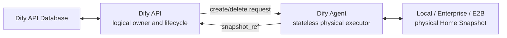
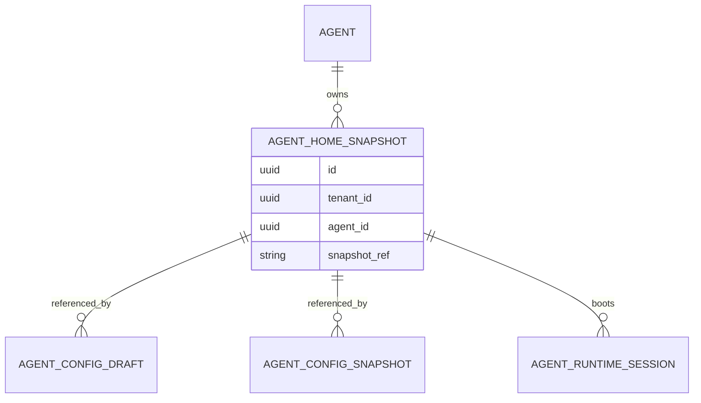
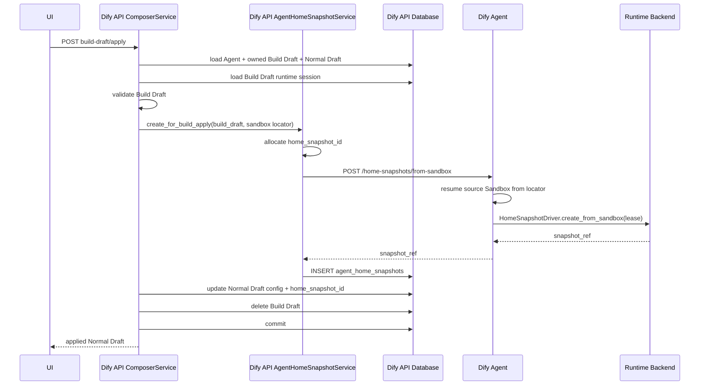
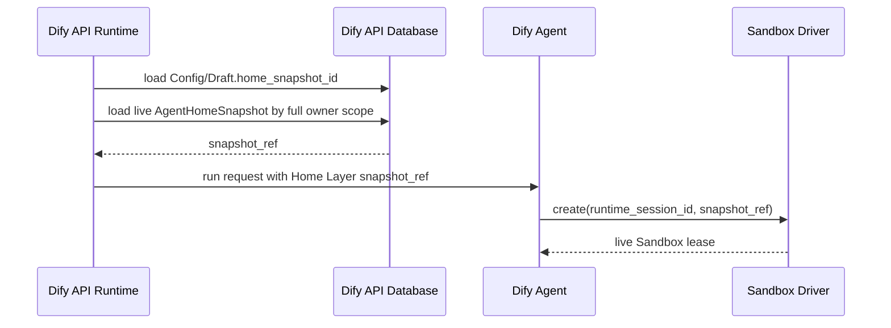

# Agent Home Snapshot 资源模型与 Build Apply 生命周期

## 状态

- 日期：2026-07-21
- 范围：Dify API、Dify Agent、Agent Composer、Agent runtime、Local / Enterprise / E2B backend
- 依赖架构：`.context/proposals/260720-home-sandbox-workspace-backends.md`
- 本文是 Home Snapshot 持久化、materialization 和回收语义的权威设计；Workspace、Sandbox 和 Shell Layer 的边界继续沿用依赖架构。
- 依赖架构及 `.context/impl/260721-home-sandbox-workspace-backends.md` 中与 Home Snapshot 有关的
  config-version ownership、file-source create、Publish materialization 和 Config Snapshot ref 设计均被本文直接替代，
  不构成兼容目标。

## 1. 摘要

Home Snapshot 是独立于 Agent config version 的不可变产品资源。Dify API 新增
`agent_home_snapshots` 表作为 Home Snapshot 的资源账本，并通过
`home_snapshot_id` 让 mutable draft 和 immutable config snapshot 引用同一份 Home。

核心语义如下：

1. 需要持久化到下一代 Home 的 filesystem 修改只发生在 Build Sandbox。
2. Build Draft save 只保存可变配置，不创建 Home Snapshot。
3. Build Draft apply 是常规编辑流程中唯一的 Home Snapshot materialization 边界。
4. Apply 创建新的 `AgentHomeSnapshot`，并让 Normal Draft 指向它。
5. Publish 只冻结 Normal Draft，并把同一个 `home_snapshot_id` 复制到新的
   `AgentConfigSnapshot`；Publish 不调用 Dify Agent 创建 Home。
6. 多个 Config Snapshot 可以引用同一个 Home Snapshot。
7. Home Snapshot 的创建、使用、删除和故障恢复都以 `agent_home_snapshots` 表为资源账本，
   不再通过扫描 `AgentConfigSnapshot.home_snapshot_ref` 推导。
8. Dify API 管理逻辑所有权和生命周期；Dify Agent 仍然无数据库，只执行 backend 物理操作。
9. Agent 初始化 Home 使用 backend-native initialize；只有 Build Draft Apply 强制从已有 Build Sandbox 创建 Snapshot。

```text
Build Draft --apply--> AgentHomeSnapshot H2
                         │
                         └── Normal Draft.home_snapshot_id = H2

Normal Draft --publish--> AgentConfigSnapshot V3.home_snapshot_id = H2
```

Apply 不创建隐藏 Config Snapshot。Home Snapshot 有自己的逻辑身份，不借用 Config Snapshot
作为 checkpoint 或资源账本。

## 2. 设计目标

- 解耦 Home Snapshot 与 Config Snapshot 的身份和生命周期。
- 让 Build Apply 成为清晰、唯一的常规 Home 持久化边界。
- 让 Publish 不产生重复的 E2B Snapshot 或其他 backend Home 资源。
- 保持 Dify Agent 轻量、无数据库、可水平扩展。
- 支持一个 Home 被同一 Agent 的 Normal Draft 和多个 Config Snapshot 共享引用。
- 在 Agent 归档后仍保留配置历史与 Home 的逻辑审计记录。
- 让 Local、Enterprise 和 E2B 使用相同的逻辑资源模型，同时允许物理实现不同。
- 保持 runtime session、Workspace 和 Home Snapshot 三种生命周期相互独立。
- 对缺失、错配或不可恢复的 Home/Sandbox 状态 fail fast，不用猜测、重建或跨来源 fallback 掩盖错误。

## 3. 非目标

- 不为 Dify Agent 增加数据库、资源 catalog 或持久进程。
- 不增加面向前端的 Home Snapshot CRUD API。
- 不允许用户直接选择、删除或替换任意 Home Snapshot。
- 不实现基于年龄的 TTL、定时 GC、引用计数或 Reconciler。
- 不在每次 Build Draft save 时创建 Snapshot。
- 不在 Publish 时重新 materialize Home。
- 不允许从任意 runtime Sandbox 创建 Home；只有 owner-scoped Build Sandbox 可以成为 Apply 来源。
- 不支持已有 Home rows 的数据库原地切换 backend。
- 不处理已有数据、协议、runtime session 或 physical resource 的兼容、迁移、backfill 或兼容性测试。
- 不保留旧 route、DTO、数据库字段或 service method 的 alias、dual-read、dual-write 或 fallback。
- 不做业务语义 fallback：Build Apply 不回退到 initialize/file replay/builder Sandbox，runtime 不回退到
  base/active Config Snapshot，backend 不回退到另一 driver。

### 3.1 直接替换原则

上一版 proposal/implementation 是未进入兼容承诺的中间状态。本方案实现时以 fresh database、由最终协议创建的
新 runtime session 和新 backend resource 为基线，直接把中间状态替换为最终模型：

- 数据库只出现最终表和最终列，不先落旧 schema 再迁移、复制或回填。
- 代码只读取 `home_snapshot_id`，不在其为空时尝试 `home_snapshot_ref`、`base_snapshot_id`、active version
  或其他旧位置。
- Dify API 与 Dify Agent 只实现最终 route 和 DTO，不保留 deprecated endpoint、payload adapter 或 client alias。
- 已由上一版创建的开发数据库、runtime session 和 physical snapshot 可以直接丢弃；不提供自动发现、导入或删除逻辑。
- 旧测试直接删除或改写为最终 contract 测试，不同时保留一套中间实现断言。

### 3.2 中间设计替换矩阵

| 上一版中间设计 | 最终设计 | 必须执行的删改 |
|---|---|---|
| `AgentConfigSnapshot.home_snapshot_ref/home_snapshot_status` 保存 backend 状态 | `agent_home_snapshots` 保存 immutable ref，Draft / Config Snapshot 保存 `home_snapshot_id` | 删除旧字段设想及所有直接读写；不做 ref 到 row 的 backfill |
| Home 属于 config version，创建版本时 materialize | Home 是 Agent-owned 独立资源；初始化或 Build Apply 创建 | 删除 config-version create hook；Publish、restore、save-version 只复制 Home ID |
| Draft 通过 `base_snapshot_id` 间接解析 Home | Normal / Build Draft 直接持有 `home_snapshot_id` | 删除 base snapshot fallback；`base_snapshot_id` 只保留 config ancestry 语义 |
| API 组装 config、skill ZIP、文件和 manifest | Build Apply snapshot retained Build Sandbox；初始化为 backend-native | 删除 file-source builder、对象存储读取、canonical manifest 和 digest 逻辑 |
| `source_digest` 参与请求和 Local ref | 每次创建由新的 `home_snapshot_id` 标识 | 删除字段、hash 计算、digest-derived ref 和 digest 测试 |
| `POST /home-snapshots` 接受通用 create payload | `/initialize` 与 `/from-sandbox` 两个明确 use case | 删除旧 route、旧 client method 和旧 request type，不保留 alias |
| E2B Build Apply 启动 builder、写 API 文件后 snapshot | 对用户实际 retained E2B Build Sandbox 调用 `create_snapshot()` | 删除 Apply 的 builder-write-files 流程；初始化内部仍可自由使用 template/native 能力 |
| Config Snapshot/version 删除驱动 Home delete | Config Snapshot 不拥有 Home；Agent retirement 批量清理该 Agent 的 Home rows | 删除 per-version delete hook；版本删除不创建、删除或改写 Home row |
| cleanup 扫描 Config Snapshot refs 并清空字段 | cleanup 查询 `agent_home_snapshots` 并幂等删除 physical refs，ledger rows 不变 | 删除 ref 扫描、去重和清空 binding 的逻辑 |
| runtime 只按 mutable Draft identity 复用 session | mutable Agent App session scope 包含 `home_snapshot_id` | 不复用或迁移旧 session；Workflow 仍由 immutable Config Snapshot ID 定位 |
| Alembic revision `bcd96196b7cd` 只增加旧 ref 列 | 一个最终 revision 创建资源表和 ID 引用列 | 删除该中间 revision 后从其 parent 重新生成；不追加 bridge migration |
| 测试验证 file payload、digest、Publish materialize 和 E2B builder | 测试 initialize、Build Apply from sandbox、Publish reuse 和 table lifecycle | 删除或改写旧测试；不增加兼容性测试 |

## 4. 核心不变量

1. `AgentHomeSnapshot` 是不可变逻辑资源；创建后 `tenant_id`、`agent_id` 和
   `snapshot_ref` 不可修改。
2. 一个 `AgentHomeSnapshot` 只属于一个 Agent，不允许跨 Agent 引用。
3. 一个 physical Home Snapshot 只属于一个 `AgentHomeSnapshot` 记录；backend 不得在不同逻辑记录间
   进行无引用计数的物理共享。
4. Normal Draft 和 Build Draft 是可变指针；它们引用的 Home Snapshot 本身不可变。
5. `AgentConfigSnapshot.config_snapshot` 与 `AgentConfigSnapshot.home_snapshot_id` 共同构成
   一份不可变、可运行的 Agent 配置。
6. `home_snapshot_id` 是产品层身份；`snapshot_ref` 是 backend opaque handle。
7. Composer、Publish、Workflow 等产品逻辑只传递 `home_snapshot_id`。
8. 只有构造 Dify Agent runtime/control-plane 请求的基础设施边界可以读取和传递 `snapshot_ref`。
9. Publish、Restore、runtime-session cleanup 和 Build Draft discard 都不创建或删除 Home Snapshot。
10. Agent retirement 是第一阶段唯一的批量物理回收边界；被新 Apply 替代的 Home 保留到 Agent retirement。
11. Dify Agent 不持久化 `home_snapshot_id -> snapshot_ref` 映射。
12. Runtime 必须先验证 owner Agent 为 ACTIVE，并在完整 owner scope 内找到 Home row。
13. 初始化 Home 不要求存在 source Sandbox；Build Apply Home 必须来自该 Build Draft 的 retained Sandbox。
14. Dify API 不向 Dify Agent 发送 Home 文件列表来重建 Snapshot。
15. Home row、Build source session、Sandbox 或 backend operation 不可用时立即失败，不选择替代来源。

## 5. 状态所有权



| 信息或动作 | Owner | 保存或执行位置 |
|---|---|---|
| Agent 与 Home 的所有权 | Dify API | `agent_home_snapshots` |
| Draft / Config Snapshot 对 Home 的引用 | Dify API | `home_snapshot_id` |
| backend `snapshot_ref` 映射 | Dify API | `agent_home_snapshots.snapshot_ref` |
| Build Apply Snapshot 来源 | Dify API | Build Draft 对应的 retained runtime session locator |
| physical snapshot create/delete | Dify Agent | 当前 Runtime Backend Profile |
| physical Home 内容 | Backend | Local filesystem、Enterprise、E2B Snapshot |
| backend credentials | Dify Agent deployment | settings / secrets |

Dify API 决定何时创建和删除资源，因为它理解 Build Apply、Publish、Agent archive 等产品事件。
Dify Agent 只理解如何对当前 backend 执行 create/delete，以及如何用 `snapshot_ref` 创建 Sandbox。

## 6. 数据模型

### 6.1 `agent_home_snapshots`

新增 Dify API 表：

```text
agent_home_snapshots
  id                StringUUID, primary key
  tenant_id         StringUUID, not null
  agent_id          StringUUID, not null
  snapshot_ref      varchar(255), not null
  created_at        datetime, not null
```

索引：

```text
(tenant_id, agent_id)
```

字段意义：

- `id`：Dify 产品层稳定身份，API 内部和其他产品表只引用它。
- `tenant_id`、`agent_id`：逻辑所有权；所有查询必须同时按 tenant 和 Agent scope。
- `snapshot_ref`：Dify Agent 返回的 backend-native opaque handle，例如 E2B Snapshot ID。
- `created_at`：逻辑 Home 创建时间，只用于记录，不参与资源状态判断。

Row 创建后不再更新。表记录逻辑 Home 与最后已知 backend ref 的映射，但不跟踪 physical resource
当前是否仍存在；Agent 是否可运行由 `Agent.status` 决定。

不增加：

- `backend_profile_id`：当前 backend 是 Dify Agent deployment setting，不是数据库实体。
- `status` / `deleted_at`：第一阶段不持久化 physical cleanup 状态。
- `ref_count`：不做 eager GC，引用计数没有必要。
- `expires_at`：不实现基于年龄的 TTL。

### 6.2 Draft 与 Config Snapshot 引用

`agent_config_drafts` 新增：

```text
home_snapshot_id StringUUID, not null
```

Normal Draft 和 per-account Build Draft 都引用一个 immutable Home Snapshot：

- Normal Draft 指向最近一次成功 Apply 的 Home。
- Build Draft checkout 时复制 Normal Draft 的 `home_snapshot_id`，作为 Build runtime 的 base Home。
- Build Draft save 不改变 `home_snapshot_id`。

`agent_config_snapshots` 使用：

```text
home_snapshot_id StringUUID, not null
```

并删除：

```text
home_snapshot_ref
```

`snapshot_ref` 不再散落在 Config Snapshot 上。Config Snapshot 只引用逻辑 Home 资源。

`base_snapshot_id` 保留，但只表达 Draft 的 config ancestry，不再承担 Home ref 解析职责。

### 6.3 Runtime Session 绑定

`agent_runtime_sessions` 增加当前运行所基于的：

```text
home_snapshot_id StringUUID, not null
```

这不是一个只落库但不参与 identity 的审计列。使用 mutable Normal/Build Draft 的 Agent App session
必须在 `AgentAppSessionScope`、lookup/write query 和 conversation unique index 中包含 `home_snapshot_id`。

原因是 Normal Draft 的 row ID 在 Apply 前后不变，但其 Home 已经切换；如果只按 draft ID 复用 session，
会恢复从旧 Home 创建的 Sandbox。conversation unique index 若不包含 Home ID，也会在旧 session 尚未 cleanup
时阻止新 Home 对应的 session row 创建。

Workflow runtime 绑定 immutable `AgentConfigSnapshot`，其 Config Snapshot ID 已经唯一确定 Home，因此
workflow session lookup 和 unique index 不再重复加入 Home ID。Workflow session row 仍记录
`home_snapshot_id` 作为创建 Sandbox 时的输入，但不把它扩散到 stored DTO 或 `SandboxLocator` identity。

Workspace 文件浏览仍按产品 locator 选择当前最新 ACTIVE session，不要求浏览请求提交 Home ID；被选中的
session row 自身携带 `home_snapshot_id`，并按该 row 的最终 layer specs 和 session snapshot 恢复。Build Apply
则必须额外按 Build Draft identity、account owner 和其 base `home_snapshot_id` 选择 retained source session，
不能把另一个 Draft 或另一个 Home generation 的 Workspace 当作 Snapshot 来源。

Apply 成功后：

- 新请求因为 `home_snapshot_id` 不同而创建新 runtime session / Sandbox。
- 旧 Build Draft session 和旧 Normal Draft session 可以进入现有 best-effort cleanup 流程。
- `workspace_id == runtime_session_id` 不变；新 Home generation 对应新的 runtime session 和 Workspace。

### 6.4 引用关系



数据库列不是授权凭证。读取 Draft、Config Snapshot 或 Runtime Session 后，仍必须使用完整的
`tenant_id + agent_id + home_snapshot_id` 查询 Home row，禁止只按 `home_snapshot_id` 跨租户读取。

## 7. Home Snapshot 创建来源

Home Snapshot 有两种明确的创建语义，不能合并成一个可选字段众多的通用请求。

### 7.1 Agent 初始化

Agent、backing Agent、imported Agent 或 workflow-only Agent 创建时，需要一份初始 Home。初始化由当前
backend 的 native 能力完成，不要求先存在 bootstrap Sandbox：

```text
Dify API initialize request
    -> Dify Agent HomeSnapshotDriver.initialize(...)
    -> backend-native initial Home resource
    -> snapshot_ref
```

Backend 可以使用 template、native clone、预置 image 或内部临时 Sandbox，但这些实现细节不进入公共
协议。初始化不接受 Dify API 提供的 `HomeSnapshotSourceFile` 列表。

### 7.2 Build Draft Apply

Build Draft Apply 必须 snapshot 当前 Build Draft 对应的 retained Sandbox：

```text
Build Draft runtime session
    -> SandboxLocator
    -> resume source Sandbox
    -> backend snapshot(source Sandbox)
    -> snapshot_ref
```

Build Sandbox filesystem 是 Apply 时 Home 的事实来源。Dify API 不根据 Agent Soul、对象存储文件列表或
manifest 重建 Home；Apply 也不创建新的 builder Sandbox 代替用户实际使用的 Build Sandbox。

`SandboxLocator` 复用现有 Workspace 文件访问 contract，包含恢复 source Sandbox 所需的安全 composition
子集和匹配的 session snapshot。只传 `runtime_session_id` 不足够，因为 Dify Agent 不连接 Dify API 数据库。

Home 与配置的一致性由 Apply 写入边界保证：同一次 Apply 将 source Sandbox 创建出的
`home_snapshot_id` 和 Build Draft config 一起写入 Normal Draft；Publish 原样复制两者。

## 8. Dify API 内部服务

保留并重构 `api/services/agent/home_snapshot_service.py`，使其成为 Dify API 内部 application service，
而不是独立部署服务：

```python
class AgentHomeSnapshotService:
    @classmethod
    def create_initial(...) -> AgentHomeSnapshot:
        ...

    @classmethod
    def create_for_build_apply(
        ...,
        build_draft: AgentConfigDraft,
        source_sandbox: SandboxLocator,
    ) -> AgentHomeSnapshot:
        ...

    @classmethod
    def delete_all_for_agent(..., tenant_id: str, agent_id: str) -> None:
        ...
```

公开方法围绕产品 use case 命名，不提供通用 CRUD，也不提供给任意调用者使用的
`resolve_backend_ref()`。

Runtime 调用链在构造 Dify Agent request 的基础设施边界内：

1. 验证 owner Agent 为 ACTIVE。
2. 使用 `tenant_id + agent_id + home_snapshot_id` 读取 Home row。
3. 读取 `snapshot_ref`，立即写入 Dify Agent request 的 Home Layer config。

Composer、Workflow、Publish 等上层服务只持有 `home_snapshot_id`。

Dify API 不新增外部 Home Snapshot HTTP controller。现有 Build Apply、Publish 和 Agent lifecycle API
继续作为产品入口。

资源解析不返回 optional ref，也不做隐式修复。Home row、Build source session、source Sandbox 或 backend
operation 不可用时抛出对应 domain error，当前 use case 失败且数据库不变；不读取旧字段、不选择其他 session、
不 initialize 替代 Home，也不切换 backend。best-effort compensation delete 只撤销已经发生的外部副作用，
不改变原操作的失败结果。

## 9. Dify Agent Home Snapshot Service

Dify Agent 保持无状态 facade：

```text
POST   /home-snapshots/initialize
POST   /home-snapshots/from-sandbox
DELETE /home-snapshots/{snapshot_ref}
```

两种 create request 分开定义：

```python
class InitializeHomeSnapshotRequest(BaseModel):
    tenant_id: str
    agent_id: str
    home_snapshot_id: str


class CreateHomeSnapshotFromSandboxRequest(BaseModel):
    tenant_id: str
    agent_id: str
    home_snapshot_id: str
    source_sandbox: SandboxLocator
```

两种请求都不包含 `agent_config_version_id` 或 `HomeSnapshotSourceFile`。Home 不从属于单个 Config Snapshot，
Build Apply 的内容也不由 API 文件 payload 定义。

Backend port 明确提供两种操作：

```python
class HomeSnapshotDriver(Protocol):
    async def initialize(self, spec: InitializeHomeSnapshotSpec) -> str:
        ...

    async def create_from_sandbox(
        self,
        *,
        spec: HomeSnapshotCreateSpec,
        source: SandboxLease,
    ) -> str:
        ...

    async def delete(self, snapshot_ref: str) -> None:
        ...
```

Dify Agent 的 `from-sandbox` service 使用 request locator 进入最小 runtime layer graph，恢复 source
Sandbox，取得 invocation-local `SandboxLease`，调用 `create_from_sandbox()`，最后释放连接并保留 source
Sandbox。Backend 可以在实现内部直接按 stable handle snapshot，但不能把 handle catalog 持久化在
Dify Agent。

Dify Agent 的职责：

- 使用 deployment-selected `HomeSnapshotDriver` 创建 physical snapshot；
- 返回稳定 `snapshot_ref`；
- 按 `snapshot_ref` 幂等删除 physical snapshot；
- 将 backend 错误映射为稳定的 control-plane error。

Dify Agent 不负责：

- 保存 `AgentHomeSnapshot` row；
- 判断 Build Draft 是否可以 Apply；
- 判断哪些 Config Snapshot 引用了 Home；
- list、GC、TTL、引用计数；
- 根据 `home_snapshot_id` 在数据库中解析 `snapshot_ref`。

## 10. Build Draft 生命周期

### 10.1 Checkout

```text
Normal Draft
  config_snapshot = C1
  home_snapshot_id = H1

        checkout
           │
           ▼

Build Draft
  config_snapshot = copy(C1)
  home_snapshot_id = H1
  base_snapshot_id = Normal Draft.base_snapshot_id
```

Checkout 不创建 Home。Build runtime 从 H1 启动；Build 过程中对 Sandbox Home 的修改保留在该
retained Build Sandbox。Agent Config / Agent Stub API 仍负责 Build Draft 的结构化配置修改，但不是
Home Snapshot 的文件传输通道。

### 10.2 Save

Build Draft save 只更新 Build Draft 的 `config_snapshot` 和审计字段：

- 不调用 Dify Agent；
- 不创建 `AgentHomeSnapshot` row；
- 不改变 `home_snapshot_id`；
- 不影响 Normal Draft 或 published Config Snapshot。

### 10.3 Discard

Discard 删除 Build Draft，并清理该 Build Draft 的 debug runtime session：

- 不创建或删除 Home Snapshot；
- H1 仍由 Normal Draft / Config Snapshot 引用；
- Build Sandbox / Workspace 属于 runtime session cleanup，不属于 Home cleanup。

## 11. Build Draft Apply

Build Apply 是常规编辑流程中唯一创建 Home Snapshot 的动作。

### 11.1 成功流程



详细顺序：

1. 按 `tenant_id + agent_id + account_id` 加载 Build Draft，并加载 shared Normal Draft。
2. 查询该 Build Draft 当前最新的 retained runtime session，并构造 `SandboxLocator`。
3. 执行与 Publish 一致的结构和资源引用校验，但不要求发布态业务条件。
4. 生成新的 `home_snapshot_id`。
5. 调用 Dify Agent `from-sandbox`，传入稳定 Home ID 和 source Sandbox locator。
6. Dify Agent 恢复 source Sandbox，并让当前 backend 从该 Sandbox 创建 Snapshot。
7. 收到 `snapshot_ref` 后插入 `AgentHomeSnapshot` row。
8. 将 Build Draft 的完整 `AgentSoulConfig` 写入 Normal Draft。
9. 将 Normal Draft 的 `home_snapshot_id` 更新为新 row ID。
10. `base_snapshot_id` 继续表示 Build Draft 基于的最后一个 Config Snapshot；Apply 不创建隐藏版本。
11. 删除 Build Draft。
12. `active_config_is_published` 按 `(AgentSoulConfig, home_snapshot_id)` 与 active Config Snapshot 比较。
13. 提交数据库事务。
14. 让旧 Build/Normal Draft runtime sessions 进入 cleanup；新请求因 Home ID 改变而使用新 session。

Apply 每次成功都创建一个新的逻辑 Home Snapshot，即使 source Sandbox 的 Home 内容相同。这样资源所有权简单明确，
也避免 backend 按相同内容跨记录共享后，一个 Agent cleanup 删除另一个 Agent 仍在使用的资源。

### 11.2 失败语义

- Build Draft 没有可恢复的 retained Sandbox：Apply 失败，不调用 backend，不修改 Draft。
- source Sandbox 已丢失：Apply 返回明确的 sandbox-not-found，不用初始化 Home 代替。
- Dify Agent create 失败：Apply 失败，不插入 row，不修改 Normal Draft，不删除 Build Draft。
- physical create 成功但数据库 flush/commit 失败：执行一次 best-effort delete compensation；如果 compensation
  也失败，记录 `home_snapshot_id` 和已返回的 `snapshot_ref` 供人工诊断。第一阶段不增加 Reconciler。
- response 丢失导致 backend 已创建但 API 未收到 ref：属于允许的极小概率 orphan 窗口；不增加 Dify Agent DB。
- Apply 成功后清理旧 runtime session 失败：不回滚 Apply；旧 session 标记为不可再匹配，新请求仍使用新 Home。

## 12. Publish 与 Config Snapshot

Publish 不创建 Home Snapshot。它只冻结 Normal Draft 当前已经确认的 Soul + Home binding：

```python
version = AgentConfigSnapshot(
    tenant_id=normal_draft.tenant_id,
    agent_id=normal_draft.agent_id,
    version=next_version,
    config_snapshot=normal_draft.config_snapshot,
    home_snapshot_id=normal_draft.home_snapshot_id,
    created_by=account_id,
)
```

Publish 流程：

1. 加载 Normal Draft。
2. 按完整 owner scope 加载 live `AgentHomeSnapshot`。
3. 创建 immutable `AgentConfigSnapshot`，原样复制 Normal Draft config 和 `home_snapshot_id`。
4. 创建 `PUBLISH_DRAFT` revision。
5. 更新 `Agent.active_config_snapshot_id`。
6. 更新 Normal Draft 的 `base_snapshot_id` 为新 Config Snapshot ID；`home_snapshot_id` 不变。
7. 提交。

Publish 路径禁止调用：

```text
AgentHomeSnapshotService.create_*
Dify Agent POST /home-snapshots/initialize
Dify Agent POST /home-snapshots/from-sandbox
HomeSnapshotDriver.initialize
HomeSnapshotDriver.create_from_sandbox
```

因此一次 Apply 后无论发布多少次非 Home 配置修改，都可以共享同一个 Home：

```text
H2 <- Normal Draft
H2 <- Config Snapshot V3
H2 <- Config Snapshot V4
```

`home_snapshot_id` 保存为 `AgentConfigSnapshot` 的独立列，不写进
`AgentConfigSnapshot.config_snapshot` 的 Agent Soul JSON。

## 13. 其他 Config Snapshot 创建路径

所有创建 Config Snapshot 的代码路径必须显式选择 Home 来源，不再因“创建了版本”而自动 materialize：

| 场景 | Home 行为 |
|---|---|
| Publish Normal Draft | 复制 Normal Draft `home_snapshot_id` |
| Save current/new version from existing Agent | 复制来源 Draft/Config Snapshot 的 `home_snapshot_id` |
| Restore version | 使用被 restore 的 Config Snapshot `home_snapshot_id` |
| 新建空 Agent / backing Agent | 调用 backend-native initialize，并让 version 1 引用 |
| DSL import 创建新 Agent | 调用 backend-native initialize，创建新 Agent 自己的初始 Home |
| Duplicate Agent | 为 target Agent 调用 backend-native initialize，不跨 Agent 复用 source Agent Home row |
| Workflow-only Agent 创建 | 调用 backend-native initialize 创建初始 Home |
| Scope promotion of same Agent | 保留原 Agent 的 Home 引用 |

“Home 修改只发生在 Build”指已有 Agent 的常规编辑语义。新 Agent provisioning、import 和 duplicate
必须创建初始 Home，才能生成可运行的 version 1；这些是资源初始化，不是对现有 Home 的修改。

## 14. Runtime 使用流



Runtime 规则：

- Product locator 是 `home_snapshot_id`，不接受 UI 提交 `snapshot_ref`。
- `snapshot_ref` 只出现在 Dify API 到 Dify Agent 的私有请求和 Dify Agent layer state 中。
- Runtime 先验证 owner Agent 为 ACTIVE，再按完整 owner scope 读取 Home row。
- Config Snapshot runtime 使用该版本的 `home_snapshot_id`。
- Normal/Build Draft runtime 使用各自 Draft 的 `home_snapshot_id`。
- Sandbox 创建后对 `$HOME` 的修改不回写 `AgentHomeSnapshot`。
- Runtime session cleanup 只清理 Sandbox/Workspace，不删除 Home。
- Home ID 或 owner-scoped row 缺失时不发送 runtime request。

## 15. Home Snapshot 删除与回收

第一阶段不做 per-version 或 unreferenced GC。`agent_home_snapshots` 是 append-only 资源账本：

- 新 Apply 不删除旧 Home。
- Publish 不删除 Home。
- Config Snapshot 删除不直接删除 Home。
- Build Draft discard 不删除 Home。
- Runtime Session cleanup 不删除 Home。
- Agent retirement 触发该 Agent 全部 Home 的物理清理。

Agent retirement 包括：

- Roster Agent archive；
- Agent App 删除导致 backing Agent retirement；
- workflow-only Agent 被 binding replacement、DSL replacement 或 Workflow App 删除淘汰。

cleanup task 流程：

1. 查询 `tenant_id + agent_id` 的所有 `AgentHomeSnapshot` rows。
2. 对每一行调用 Dify Agent `DELETE /home-snapshots/{snapshot_ref}`。
3. backend not-found 视为成功。
4. Ledger rows 保持不变，不持久化逐项 cleanup 状态。
5. 任一删除失败时记录 owner 与 ref 并让 task 失败；人工重跑会重新幂等删除全部 refs。

Agent archive 后 Config Snapshot 和 revision 历史仍然引用原 Home row，但 archived Agent 不可运行。
保留 row 可以维持逻辑引用和最后已知 physical ref；它不承诺 backend resource 在 retirement 后仍然存在。

## 16. Backend 行为

### 16.1 Local

Local initialize 创建 backend-defined 初始 Home 目录；Build Apply 从 source Sandbox 的 canonical
`home_dir` 复制不可变目录。目标路径直接使用 `home_snapshot_id`：

```text
/home/dify/.dify-agent-home-snapshots/home-<home_snapshot_id>
```

相同内容的两个逻辑 Home 仍拥有不同目录，保证 Agent 级所有权和删除安全。

### 16.2 Enterprise

Enterprise Gateway 分别提供 initialize 和 snapshot-from-sandbox 操作。Build Apply 请求携带
`home_snapshot_id` 和 source Sandbox handle，Gateway 对该 Sandbox 创建 backend-native Snapshot 并返回
opaque ref。delete 保持幂等。Gateway 内部可以物理优化，但如果共享底层内容，必须自己保证引用安全，
不能改变 Dify API 的一记录一资源语义。

### 16.3 E2B

E2B initialize 可以使用 deployment template `difys-default-team/dify-agent-local-sandbox` 和 E2B native
能力创建初始 Home ref；公共协议不要求初始化资源来自一个外部可见的 bootstrap Sandbox。

Build Apply 必须：

1. 从 `SandboxLocator` 恢复当前 retained E2B Build Sandbox。
2. 对该 Sandbox 调用 E2B `create_snapshot()`。
3. 返回 E2B Snapshot ID 作为 `snapshot_ref`。
4. 保留 source Build Sandbox，随后按既有 runtime session 语义 suspend 或 cleanup。

E2B Snapshot 捕获整个 Sandbox filesystem 和 memory；snapshot 期间 source Sandbox 短暂 pause，完成后继续
running。该能力不是目录级 `$HOME` archive。因此 E2B 下 Home Snapshot 与 Sandbox 在物理上耦合，但
Dify API 的 Home、Runtime Session 和 Workspace 逻辑生命周期仍然独立。行为依据
[E2B Sandbox snapshots](https://e2b.dev/docs/sandbox/snapshots)。

从 E2B Home Snapshot 创建新 runtime Sandbox 时，`E2BSandboxDriver.create()` 必须在返回 lease 前清空并
重建 `workspace_dir`，不能把 Build Workspace 暴露成新 runtime Workspace。Build 请求退出时继续清理
Shell Layer 跟踪的 jobs；本方案不承诺从 Snapshot 恢复任意进程连续性。

E2B physical Snapshot 内仍可能包含 source Workspace 的底层数据，这是当前允许的 backend 物理耦合；
逻辑 Workspace 访问必须在清空完成后才开放。若未来要求物理 Snapshot 也不保留 Workspace，需要增加
backend-specific staging/sanitization，不属于第一阶段。

## 17. Backend 切换约束

`agent_home_snapshots` 不保存 `backend_profile_id`。当前一个 Dify Agent deployment 只配置一个
`RuntimeBackendProfile`，Dify API 也只连接该 deployment。

因此已有 Home rows 的数据库不支持原地切换 backend。切换 Local、Enterprise 或 E2B 时使用新的数据库和
新建资源；本方案不设计多 backend routing。

## 18. 事务与一致性

数据库事务内必须原子保持：

```text
AgentHomeSnapshot row 创建
Normal Draft.config_snapshot 更新
Normal Draft.home_snapshot_id 更新
Build Draft 删除
Agent.active_config_is_published 更新
```

不能出现已提交的 Normal Draft 指向不存在的 Home row。

外部 backend create 无法与数据库 commit 构成分布式事务。第一阶段采用：

- backend create 在 DB commit 前完成；
- DB 失败时做一次 best-effort compensation delete；
- 不增加 outbox、Saga、Reconciler 或 Dify Agent database；
- Dify API 日志记录 `home_snapshot_id` 和已经返回的 `snapshot_ref`，用于诊断 compensation 失败。

Retirement cleanup 不修改 Home ledger。backend delete 是幂等操作；失败时 task 失败并记录 ref，重跑整批即可。

## 19. 代码改造范围

### 19.1 Dify API

- `api/models/agent.py`
  - 新增 immutable `AgentHomeSnapshot`，不包含 `created_by`、`deleted_at` 或 status。
  - Draft、Config Snapshot、Runtime Session 增加 `home_snapshot_id`。
  - 删除 `AgentConfigSnapshot.home_snapshot_ref`。
- `api/migrations/versions/`
  - 删除中间 revision
    `2026_07_20_1448-bcd96196b7cd_add_home_snapshot_ref_to_agent_config_.py`。
  - 从该 revision 的 parent 重新使用 Alembic generation 生成一个最终 revision：创建
    `agent_home_snapshots`，并为 Draft、Config Snapshot、Runtime Session 增加 required
    `home_snapshot_id`。
  - 最终 revision 从未增加 `home_snapshot_ref`，因此不包含先 add 再 drop、数据复制、backfill、
    transitional nullable column 或 compatibility default。
- `api/services/agent/home_snapshot_service.py`
  - 从 config-version-owned materializer 改成 table-backed resource service。
  - 初始化调用 backend-native initialize。
  - Build Apply 根据 retained runtime session 构造 `SandboxLocator`，不再构造文件 payload。
  - 删除 `materialize()`、`require_ref()`、`resolve_runtime_ref()`、旧版 `delete_agent_snapshots()`、
    `_build_source_files()`、`_source_digest()` 以及只服务于 canonical manifest/config/skill/file payload 的 helper。
  - runtime boundary 先验证 ACTIVE Agent，再使用 owner-scoped Home row lookup 构造 Agent request；不提供
    旧字段 fallback 或面向产品 service caller 的通用 ref resolver。
- `api/services/agent/composer_service.py`
  - Build Apply materialize；Publish 复制 ID。
  - Draft checkout/save/discard 按新语义处理。
  - published-state 比较包含 Home ID。
  - 从 `_create_config_version()` 及其他 Publish/save-version 路径删除对 `materialize()` 的调用；
    Config Snapshot 创建本身继续保留。
- `api/services/agent/roster_service.py`
  - Agent 初始化、duplicate、archive 使用新资源模型。
  - 删除“每创建一个 Config Snapshot 就 materialize Home”的调用。
- `api/services/agent/dsl_service.py`
  - import provisioning 和 workflow-only retirement 使用新模型。
  - 删除 import version creation 对旧 materializer 的调用。
- `api/clients/agent_backend/` 及生成的 protocol/client artifacts
  - 用仓库对应 generation 工具生成 initialize/from-sandbox contract。
  - 删除 `create_home_snapshot[_sync]` 旧 client method 和 file-source request types；不手工维护
    legacy overload 或 adapter。
- Agent App / Workflow runtime request builders 和 session stores
  - 产品层使用 `home_snapshot_id`，request boundary 解析 ref。
  - mutable Agent App session scope、lookup/save query 和 conversation unique index 包含 `home_snapshot_id`。
  - Workflow session row 记录 Home ID，但 lookup 和 unique index 继续由 immutable Config Snapshot identity 决定。
  - 为 Build Apply 提供 owner-scoped latest Sandbox locator。
  - 删除从 `AgentConfigSnapshot.home_snapshot_ref` 或 Draft `base_snapshot_id` 解析 Home 的路径。
- `api/tasks/agent_backend_session_cleanup_task.py`
  - cleanup 直接查询 Agent 的全部 `agent_home_snapshots` rows 并幂等删除 physical refs。
  - 不更新 Home rows；删除扫描 Config Snapshot refs、字符串去重、清空 binding 和逐项状态持久化逻辑。
- Agent/App/Workflow retirement paths
  - 所有 Agent 所有权终止路径都触发同一 cleanup task。

### 19.2 Dify Agent

- `dify_agent/protocol/home_snapshot.py`
  - 拆分 initialize 和 from-sandbox request。
  - from-sandbox request 复用 `SandboxLocator`，删除 file source DTO 和 config version ownership。
  - 删除 `HomeSnapshotSourceFile`、`HomeSnapshotFile`、`HomeSnapshotSource`、
    `CreateHomeSnapshotRequest.agent_config_version_id` 和 `source_digest`。
- `dify_agent/protocol/__init__.py`、`dify_agent/runtime_backend/__init__.py`
  - 只导出最终 request/spec/driver types，删除旧 create/source symbols。
- `dify_agent/client/_client.py`
  - 用 initialize 与 from-sandbox client methods 替换 `create_home_snapshot[_sync]`；delete method 保留。
- `dify_agent/server/home_snapshots.py`、`dify_agent/server/routes/home_snapshots.py`
  - 保持无状态 initialize/from-sandbox/delete facade。
  - from-sandbox 恢复最小 layer graph 并取得 invocation-local Sandbox lease。
  - 删除旧 `POST /home-snapshots` handler；不保留 redirect、兼容 payload parser 或 deprecated route。
- `dify_agent/server/app.py`
  - 只注册最终 Home router；不额外挂载 legacy router。
- `dify_agent/runtime_backend/protocols.py`
  - `HomeSnapshotDriver` 拆分 `initialize()` 和 `create_from_sandbox()`。
  - 删除接受 file source 的通用 `create()` contract。
- Local / Enterprise / E2B drivers
  - initialize 使用 backend-native 能力。
  - Build Apply 从 source Sandbox snapshot，并使用逻辑 Home ID 作为操作身份输入。
  - 从 whole-Sandbox Snapshot 创建 runtime 时，在返回 lease 前重建空 Workspace。
  - Local 删除 digest-derived ref 和 API file replay；Build Apply 复制 source lease 的 `home_dir`。
  - Enterprise 删除旧 file-source create payload，分别对接 initialize 与 source-sandbox snapshot。
  - E2B 删除 Build Apply 的 template builder、API file upload 和 builder snapshot 流程；直接 snapshot
    retained source Sandbox。初始化内部是否使用 template 不进入公共 contract。
- docs
  - 明确 API logical owner、Build Apply materialization、Publish reuse 和无状态 cleanup 语义。
  - 更新 `.context/proposals/260720-home-sandbox-workspace-backends.md` 中冲突的 Home lifecycle、
    create request 和 E2B builder 段落，使其明确由本文取代；Workspace/Sandbox/Shell Layer 设计继续保留。
  - 最终 implementation report 直接描述最终状态，不把
    `.context/impl/260721-home-sandbox-workspace-backends.md` 的中间行为列为受支持模式。

### 19.3 Fresh-schema 与资源处理

- 本次实现和 E2B 验证使用新的数据库，不运行旧 ref 列到资源表的 migration，也不导入旧数据。
- 不为旧 `AgentConfigSnapshot.home_snapshot_ref`、旧 runtime session snapshot 或旧 E2B Snapshot ID 写
  一次性 conversion script。
- 旧开发数据库和中间实现创建的 physical resources 不属于自动 cleanup 范围，可在部署环境外直接废弃。
- required `home_snapshot_id` 从最终 schema 起即为非空；不通过 nullable + fallback 制造迁移窗口。

## 20. 测试计划

测试只覆盖最终 contract。上一版测试不是 regression compatibility suite：与 file-source create、digest、
Config Snapshot ref ownership、Publish materialize 或 E2B builder 有关的 case 直接删除或原位改写，不保留
旧 endpoint/payload 仍可使用、旧数据库可升级、旧 session 可恢复或新旧逻辑可并存的测试。

### 20.1 Dify API unit tests

- Agent provisioning/duplicate 使用 initialize 创建各自的 Home row，不要求 source Sandbox。
- Build Draft checkout 继承 Home ID；save/discard 不创建或删除 Home。
- Build Apply 从 owner-scoped retained Sandbox 创建 Home，并原子更新 Normal Draft。
- Build Apply 缺 source session、Sandbox 已丢失或 backend create 失败时数据库不变且不选择替代来源。
- Publish 不创建 Home，只复制 Normal Draft Home ID；连续 Publish 可共享同一个 Home。
- Restore 使用目标 Config Snapshot 的 Home ID。
- Runtime 先验证 ACTIVE Agent，再按 tenant + Agent + Home ID 解析 ref。
- Normal Draft Apply 后，mutable Agent App session 不复用旧 Home 的 runtime session。
- Retirement cleanup 查询 Home table 幂等删除全部 refs，不扫描 Config Snapshot，也不修改 Home rows。
- Agent/App/Workflow 的 retirement 入口触发同一个 cleanup task。

### 20.2 Dify Agent unit tests

- initialize request 使用 `home_snapshot_id` 且不要求 Sandbox locator。
- from-sandbox request 使用 `home_snapshot_id + SandboxLocator`，不接受 file payload。
- from-sandbox service 恢复 source Sandbox、创建 Snapshot 并保留 source Sandbox；失败时不选择替代来源。
- Local initialize/from-sandbox/delete 符合 driver contract，不同 Home ID 使用不同 physical refs。
- Enterprise initialize 和 snapshot-from-sandbox 正确透传 Home ID 与 source handle。
- E2B initialize 使用 deployment-native 能力；Build Apply 对 source Sandbox 调用 `create_snapshot()`。
- 从 E2B Snapshot 创建 runtime Sandbox 时，在 lease 可用前清空 inherited Workspace。
- Dify Agent route 不访问数据库或 process-local catalog。

### 20.3 Integration tests

- Local：Build Sandbox -> Apply snapshot -> row -> Publish reuse -> runtime create -> Agent cleanup。
- E2B：Apply snapshot 真实 Build Sandbox；Publish 不产生第二个 Snapshot；runtime 从同一个 ref 启动且
  Workspace 已重置；
  Agent cleanup 删除 Snapshot。
- 请求结束后 Workspace 仍由 runtime session 访问，Home cleanup 不进入 Workspace 文件路径。
- 集成环境从 fresh database 和新建 backend resources 开始；不运行中间 schema、旧 ref、旧 session 或旧
  physical snapshot 的 compatibility fixture。

### 20.4 旧测试的处理边界

- `api/tests/unit_tests/services/agent/test_home_snapshot_service.py` 原位重写为 table-backed initialize、
  from-sandbox、owner-scoped resolve-at-boundary 和 immutable-ledger cleanup 测试；删除 manifest、skill ZIP、对象存储
  file payload、digest、`materialize()`、`require_ref()`、`resolve_runtime_ref()` 和扫描 Config Snapshot refs 的断言。
- `api/tests/unit_tests/services/agent/test_agent_services.py` 与
  `test_agent_dsl_service.py` 删除 Publish/version-creation materialize monkeypatch，改测 provisioning initialize、
  Build Apply 创建和 Publish copy-ID。
- Agent App / Workflow runtime tests 保留“私有 request boundary 最终得到 `snapshot_ref`”的断言，但输入从
  owner-scoped `home_snapshot_id` lookup 获得；删除直接从 Config Snapshot ref 或 Draft base snapshot 读取的 case。
- Dify Agent client/server tests 删除通用 `create_home_snapshot`、file-source payload 和旧
  `POST /home-snapshots` case，原位替换为 initialize/from-sandbox/delete 最终 route。
- Local / Enterprise / E2B driver tests 删除 digest-derived ref、API file replay 和 E2B template builder Apply
  case，改测 backend-native initialize 与真实 source `SandboxLease` snapshot。
- 不增加“旧 route 返回什么”“旧 payload 是否还能解析”“旧 ref 是否 fallback”“旧 migration 能否升级”之类测试；
  这些行为不属于产品 contract。

## 21. 验收标准

1. `agent_home_snapshots` 是 immutable Home ledger，只保存 owner、opaque ref 和创建时间，不保存 cleanup 状态。
2. Draft 和 Config Snapshot 保存 `home_snapshot_id`；旧 `home_snapshot_ref` 字段、migration 和兼容代码被删除。
3. Agent 初始化通过 backend-native initialize 创建 Home，不要求 source Sandbox。
4. Build Draft save/discard 不创建 Home；Apply 只从该 Draft 的 retained Sandbox 创建 Home，并原子更新 Normal Draft。
5. Apply 缺少 source 或 backend 失败时 fail fast，不读取旧字段、不选择其他 session、不 initialize 或切换 backend。
6. Publish 不创建 Home，只复制 Home ID；多个 Config Snapshot 可以共享同一个 Home。
7. Runtime 先验证 ACTIVE Agent 并按完整 owner scope 解析 Home；mutable Draft session 不复用旧 Home Sandbox。
8. 从 whole-Sandbox Snapshot 创建的新 runtime 在对外可用前重建空 Workspace。
9. Agent retirement 按 Home ledger 幂等删除 physical refs，ledger rows 保持不变；runtime-session cleanup 不删除 Home。
10. Dify Agent 保持无数据库、无 catalog；Dify API 不新增面向前端的 Home CRUD API。
11. Local、Enterprise、E2B 使用同一无状态 contract；E2B Build Apply、Publish reuse、Workspace reset 和 cleanup 链路通过。
12. 测试只验证最终 contract，不包含旧数据、协议、session 或 physical resource 的兼容性测试。

## 22. 最终架构

```text
Dify API Database
  └── Agent
        ├── AgentHomeSnapshot H1
        │     └── snapshot_ref -> backend opaque ref (resource may be retired)
        ├── AgentHomeSnapshot H2
        │     └── snapshot_ref -> physical backend resource
        ├── Normal Draft -------- home_snapshot_id = H2
        ├── Build Draft --------- home_snapshot_id = H2 (base only)
        ├── Config Snapshot V1 -- home_snapshot_id = H1
        ├── Config Snapshot V2 -- home_snapshot_id = H2
        └── Config Snapshot V3 -- home_snapshot_id = H2

Dify API AgentHomeSnapshotService
  ├── create_initial
  ├── create_for_build_apply
  └── delete_all_for_agent

Dify Agent (stateless)
  ├── POST /home-snapshots/initialize -> HomeSnapshotDriver.initialize
  ├── POST /home-snapshots/from-sandbox -> HomeSnapshotDriver.create_from_sandbox
  ├── DELETE /home-snapshots/{snapshot_ref} -> driver.delete
  └── runtime request consumes snapshot_ref

Physical Runtime Backend
  ├── immutable Home Snapshot H1
  ├── immutable Home Snapshot H2
  └── Sandboxes booted from a selected Home Snapshot
```

该模型让 Home Snapshot 成为一等资源：Build Apply 决定新的 Home identity，Publish 只冻结引用，
Agent retirement 通过资源账本统一清理。Dify Agent 继续只负责物理执行，不承担产品状态和生命周期决策。
