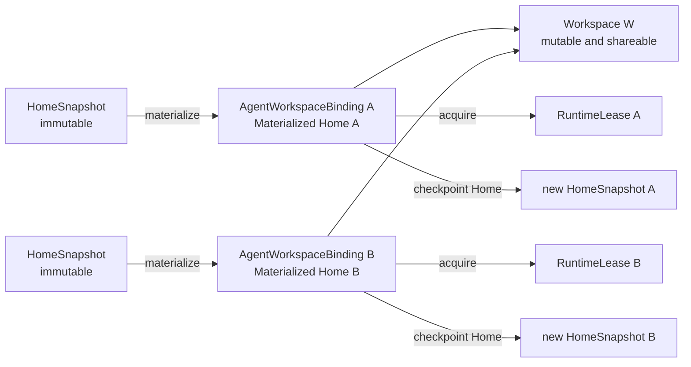
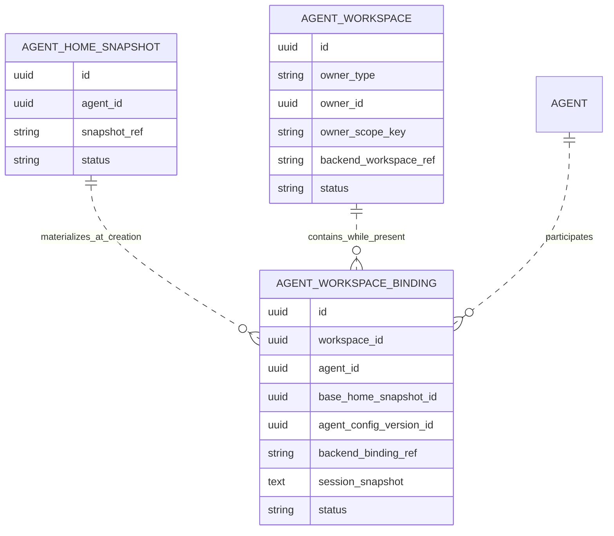

# Agent Working Environment Architecture

## 1. 结论

Agent 的执行环境由四个逻辑对象组成：

- `HomeSnapshot`：不可变的 Agent Home 版本。
- `Workspace`：独立、可变、可由多个 Agent 共享的工作区。
- `AgentWorkspaceBinding`：一个 Agent 使用自己物化的 Home 连接到一个 Workspace 的持久关联。
- `RuntimeLease`：一次操作期间对该关联的临时执行访问。

`AgentWorkspaceBinding` 是逻辑模型与物理 backend 的组合边界。它拥有一个 Agent 专属的 Materialized Home，引用一个独立的 Workspace，并保存 backend 返回的 opaque `backend_binding_ref`。Workspace 自己保存 opaque `backend_workspace_ref`。Local backend 可以让两个 ref 指向不同目录；当前 E2B backend 可以让两个 ref 都指向同一台 E2B Sandbox。

物理耦合不能改变逻辑语义。当前 E2B 不支持多个 Binding 连接同一个 Workspace；当 `create_binding` 收到已有 `backend_workspace_ref` 时直接返回 `shared_workspace_unsupported`，不能静默创建第二份 Workspace。

`RuntimeLease` 是唯一的运行时对象。Agent request、Workspace 文件操作和 Build Apply Home checkpoint 各自 acquire 一个 Runtime Lease，操作结束后 release。Runtime Lease 不进入数据库，也不进入 Agenton session snapshot。

## 2. 目标

- 多个 Agent 可以使用各自的 Materialized Home 操作同一个 Workspace。
- Home Snapshot、Materialized Home、Workspace 和 Runtime Lease 的所有权与生命周期互不混淆。
- 当前 E2B 可以继续用一台 retained Sandbox 物理承载一个 Binding，而不污染领域模型。
- Local、Enterprise 和 E2B 通过同一组接口实现不同的物理存储方式。
- Dify API 负责产品状态、授权、所有权和 backend ref 持久化。
- Dify Agent 保持无数据库，只执行 deployment-selected backend 操作。
- 单次 Agent request 或文件操作结束不销毁 Workspace；只要产品 owner 和 Binding 仍为 ACTIVE，最新 Workspace 就可继续浏览。
- Build Apply 只 checkpoint 指定 Agent Binding 的 Materialized Home，不把 Workspace 变成 Home Snapshot 的逻辑内容。
- 所有缺失资源、不支持的 Workspace 复用请求和 owner 不匹配都直接失败，不自动替换或 fallback。

## 3. 非目标

- 不实现当前 E2B 的共享 Workspace。
- 不引入 E2B Volume。
- 不支持 Materialized Home 脱离 AgentWorkspaceBinding 独立迁移或复用。
- 不增加 Materialized Home 独立数据库表。
- 不持久化 Runtime Lease、SDK client、HTTP transport、shellctl client 或 active/paused 状态。
- 不增加 `backend_profile_id`、runtime ABI 版本或资源 digest。
- 本阶段不运行定时扫描 GC、TTL、复杂重试队列、资源对账或引用计数；每次 retire 提交后只触发一次立即的 collection attempt。数据库保留失败后的 RETIRED rows 和 backend refs，供 future GC 重试；物理清理成功后删除 row。
- 不做 runtime 与文件浏览的分布式互斥。
- 第一阶段不保证同一 Binding 上多个 RuntimeLease 并发执行；当前产品动线按顺序执行 Agent request、文件浏览和 Build Apply。
- 不在仍存续的 Workspace 内热替换 Binding generation；配置或 Home 基线变化只影响新的产品 session。
- 不为当前中间实现保留旧表、旧字段、旧 route、dual-read、dual-write 或兼容性测试。
- 不在不支持共享的 backend 上用复制 Workspace 模拟共享。
- 不承诺当前 E2B native Snapshot 在物理 artifact 中剔除 Workspace bytes；本阶段只保证这些 bytes 不会作为新 Workspace 状态暴露。

## 4. 术语

### 4.1 HomeSnapshot

一个 Agent-owned、不可变的 Home checkpoint。它可以初始化多个 AgentWorkspaceBinding，也可以由 Build Apply 从一个 Binding 的 Materialized Home 创建。

HomeSnapshot 是值对象式资源：创建后内容和 backend ref 不再修改，只能创建新的 Snapshot。

### 4.2 Workspace

由产品 owner 管理的可变文件空间。Workspace 不属于任意单个 Agent；同一个 Workspace 可以被多个 AgentWorkspaceBinding 引用。

Workspace 的产品 owner 可以是：

- conversation；
- build draft/build session；
- workflow run 中的 Agent node/binding scope。

Workspace 是否能被多个 Binding 物理共享，由 backend 是否接受带 `existing_workspace_ref` 的 `create_binding` 请求决定。

### 4.3 Materialized Home

从 HomeSnapshot 复制或克隆得到的可变 Home working copy。每个 AgentWorkspaceBinding 拥有一个 Materialized Home。

第一阶段 Materialized Home 不是独立 aggregate：

- 它的逻辑 identity 使用 `AgentWorkspaceBinding.id`。
- 它随 Binding 创建和销毁。
- 它不能被两个 Binding 共享。
- 它的物理定位由 `backend_binding_ref` 封装。

### 4.4 AgentWorkspaceBinding

表示“某个 Agent 使用自己的 Materialized Home 加入某个 Workspace”的持久关联：

```text
AgentWorkspaceBinding
  agent_id
  base_home_snapshot_id
  materialized_home owned by this binding
  workspace_id
  backend_binding_ref
  Agenton session snapshot
```

它不是 Runtime Lease，也不是 Workspace 的所有者。

### 4.5 RuntimeLease

一次操作期间由 backend acquire 的临时执行能力：

```text
RuntimeLease
  layout.home_dir
  layout.workspace_dir
  commands
  files
  invocation-local clients/transports/tokens
```

Runtime Lease 的生命周期由调用栈和 async context manager 管理。

## 5. 关系模型



基数：

```text
HomeSnapshot           1 -> N AgentWorkspaceBinding
Workspace              1 -> N AgentWorkspaceBinding
AgentWorkspaceBinding  1 -> N RuntimeLease             # sequential operations over time
AgentWorkspaceBinding  1 -> 1 Materialized Home
```

当前 E2B 拒绝复用已有 Workspace，因此在该部署中把 `Workspace 1 -> N Binding` 限制为 `Workspace 1 -> 1 Binding`。这是 deployment 限制，不是领域模型变化。

## 6. 核心不变量

1. HomeSnapshot 不可变，创建后不原地更新。
2. Workspace 与 Materialized Home 是不同逻辑资源，路径、owner 和生命周期均独立。
3. 创建 AgentWorkspaceBinding 时必须解析同 tenant 的 ACTIVE Workspace 和 base HomeSnapshot；创建完成后，`workspace_id` 与 `base_home_snapshot_id` 都只保留为逻辑 identity。
4. 一个 AgentWorkspaceBinding 只拥有自己的 Materialized Home，不拥有 Workspace 或 HomeSnapshot。
5. 多个 Binding 可以引用同一个 `workspace_id`，但不能共享 Materialized Home。
6. Binding ID 与 Workspace ID 是 N:1 关系；删除 `runtime_session_id == workspace_id` alias，不再用 session ID 暴露 Workspace identity。
7. `backend_binding_ref` 代表 backend 对一个 AgentWorkspaceBinding/Materialized Home 的物理实现，Dify API 不解析其格式。
8. `backend_workspace_ref` 代表 backend 对 Workspace 的物理实现，Dify API 不解析其格式。
9. backend 可以用不同物理资源实现两个 ref，也可以像当前 E2B 一样让两个 ref 指向同一个物理资源；这种差异不能泄漏为领域对象 identity。
10. Runtime Lease 永不落库或序列化，只存在于一次操作的调用栈。
11. Runtime Lease release 不改变 Binding、Workspace 或 HomeSnapshot 的产品生命周期。
12. 一个 ACTIVE Workspace 至少有一个 ACTIVE Binding；Workspace 与第一个 Binding 一起创建，最后一个 ACTIVE Binding retire 时 Workspace 一起 retire。RETIRED Binding row 可以晚于 Workspace row 被物理收集。
13. 删除 Binding 时由 Dify API 显式传入是否同时删除 Workspace；backend 不推断产品生命周期。
14. 从 Binding 创建 HomeSnapshot 时只赋予 `home_dir` 逻辑语义；`workspace_dir` 不成为新 Snapshot 的可观察 Workspace 状态。
15. Home checkpoint 只能读取 `RuntimeLease.layout.home_dir`。
16. 不支持共享的 backend 收到 attach-existing-workspace 请求时返回明确错误，不创建替代 Workspace。
17. 第一阶段不保证同一 Binding 上多个 RuntimeLease 的并发正确性，也不增加锁或引用计数。
18. Workspace/Binding ACTIVE row 必须满足 `active_guard=1, retired_at=NULL`；RETIRED row 必须满足 `active_guard=NULL, retired_at!=NULL`。HomeSnapshot 不需要 ACTIVE 唯一性 guard，但同样使用 ACTIVE/RETIRED 和 `retired_at`。
19. Dify Agent `run_id` 只标识一次 Agent request execution，用于当前调用栈中的 status/events/cancel 和可观测性 metadata；不进入 AgentWorkspaceBinding 或其他资源生命周期表。
20. 一个 Dify API database deployment 在其生命周期内绑定一个固定的 `RuntimeBackendProfile`，所有对应的 Dify Agent replicas 使用同一 profile。不同 backend 部署使用不同或 fresh database；backend migration 和原地切换不属于本方案。

## 7. Workspace 创建与复用语义

`ExecutionBindingBackend.create_binding` 只用 `existing_workspace_ref` 表达意图：

- `None`：创建新的 Workspace，并返回新的 `workspace_ref`。
- 非空：将新的 Materialized Home 连接到该 Workspace，返回值必须保持同一个 `workspace_ref`。

Backend 如果不能复用已有 Workspace，收到非空 `existing_workspace_ref` 时直接返回 `shared_workspace_unsupported`；支持与否由 create 操作本身表达。

`existing_workspace_ref` 不是业务 `workspace_id`。`workspace_id` 是 Dify API 生成和授权的逻辑 identity；`existing_workspace_ref` 是 backend 首次创建 Workspace 时返回、由 Dify API 原样保存在 `agent_workspaces.backend_workspace_ref` 中的 opaque handle。后续 Binding 创建时，Dify API 只把这个 handle 原样传回同一个 backend，不解析、拼接或向外暴露。当前 E2B 的 handle 是 Sandbox ID，但该 backend 不支持用它连接第二个 Binding。

## 8. 所有权与生命周期

| 对象 | 逻辑 Owner | 创建事件 | 结束事件 | 物理清理决定者 |
| --- | --- | --- | --- | --- |
| HomeSnapshot | Agent config lifecycle | Agent 初始化、Build Apply | Agent/App 永久退役（archive/delete） | Dify API |
| Workspace | conversation/build/workflow node-binding owner | 第一个 Binding 创建 | owner 完成、删除、discard 或最后一个 ACTIVE Binding retire | Dify API |
| AgentWorkspaceBinding | Agent 在 Workspace 中的 session | Agent 加入 Workspace | Apply/删除、owner 结束 | Dify API |
| Materialized Home | AgentWorkspaceBinding | Binding 创建 | Binding retire | 随 Binding |
| RuntimeLease | 当前操作 | acquire | release | Dify Agent 调用栈 |
| Agenton session snapshot | AgentWorkspaceBinding | 首次成功/deferred run | Binding retire | Dify API |

### 8.1 HomeSnapshot 生命周期

- Agent 初始化创建初始 HomeSnapshot。
- Binding 创建时从指定 HomeSnapshot materialize 一份私有 Home working copy。
- Binding 对 Materialized Home 的修改不修改 base Snapshot。
- Build Apply 从指定 Binding 创建新的 HomeSnapshot ledger row。
- Workspace、Binding 或 Runtime Lease 的结束都不删除 HomeSnapshot。
- `Agent retirement` 仅指 Agent 或所属 App 的永久退役（archive/delete），不包括从某次 Build Draft 暂时移除节点或结束一次 Workspace。
- Agent retirement 时批量 retire HomeSnapshot rows；相关 Binding/Workspace 也由同一产品操作 retire。
- retire 提交后，Binding/Workspace 与 HomeSnapshot 分别执行 collection，不要求固定顺序。仍被 AgentConfigDraft 或 AgentConfigSnapshot row 引用的 HomeSnapshot 保持 RETIRED，不执行物理删除。
- Binding 的 Materialized Home 在创建完成后不再依赖 base Snapshot artifact；Binding row 的 `base_home_snapshot_id` 不阻塞 HomeSnapshot collection。
- 无配置引用时调用幂等 delete；physical Snapshot 删除成功后删除对应 ledger row，失败时保留 RETIRED row 和 `snapshot_ref`，供 future GC 重试。

### 8.2 Workspace 生命周期

- Workspace 由 conversation、build 或 workflow Agent node/binding scope 管理。
- Workspace ID 可以在调用 backend 前生成，但 Workspace row 与第一个 Binding allocation 成功后一起落库，不存在无 Binding 的 ACTIVE Workspace。
- Backend 接受 `existing_workspace_ref` 时，后续 Binding 可以连接已存在 Workspace。
- 删除非最后一个 ACTIVE Binding 时保留 Workspace；删除最后一个 ACTIVE Binding 或 owner retire 时同时 retire Workspace。
- Workspace owner retire 时结束全部 ACTIVE Bindings，并选择其中一个 Binding 承载 `destroy_workspace=true` 的 Workspace 清理意图；其余 RETIRED Bindings 可独立清理 Materialized Home。
- Workspace 物理清理成功后即可删除 Workspace row 和承载该次清理的 Binding row，不等待其他 RETIRED Binding rows；剩余 rows 只依赖各自的 `backend_binding_ref` 继续清理。
- 当前 E2B 中一个 Workspace 只有一个 Binding，因此 Binding retire 总是同时 retire Workspace。

### 8.3 AgentWorkspaceBinding 生命周期

- 创建时解析 base HomeSnapshot ref，并请求 backend 创建 Binding。
- 创建成功后持久化 `backend_binding_ref`。
- Agent request 之间保持 ACTIVE，保存 Materialized Home、Workspace 关联和 Agenton session snapshot。
- 每次操作只 acquire/release Runtime Lease。
- retire 后保留 RETIRED row 和 backend ref；事务提交后只执行一次立即的 best-effort collection attempt，成功后删除 row，失败时保留 row 供 future GC 接续。

### 8.4 RuntimeLease 生命周期

Runtime Lease 是 operation-scoped，而不只限于 Agent request：

- Agent request acquire/release 一次；
- Workspace list/read/upload acquire/release 一次；
- Build Apply Home checkpoint acquire/release 一次。

任何操作成功、失败或取消都必须 release Runtime Lease。release 失败按主异常优先级传播或记录 cleanup error，但不能清空持久 Binding ref。

## 9. Dify API 数据模型

### 9.1 `agent_home_snapshots`

保留现有不可变 ledger：

```text
agent_home_snapshots
  id            StringUUID, primary key
  tenant_id     StringUUID, not null
  agent_id      StringUUID, not null
  snapshot_ref  varchar(255), not null
  status        varchar(32), not null       # active | retired
  retired_at    datetime, nullable
  created_at    datetime, not null
```

索引：

```text
(tenant_id, agent_id)
(status, retired_at)
```

`snapshot_ref` 是 backend-native opaque ref，只在 Dify API 到 Dify Agent 的基础设施边界使用。HomeSnapshot artifact 和 ref 始终不可变；只有 ledger row 的 lifecycle metadata 可从 ACTIVE 变为 RETIRED。`ACTIVE` 表示 Snapshot 仍被保留并允许作为 Binding 基线，不表示它是 Agent 的唯一或最新版本；同一 Agent 可以有多个 ACTIVE rows。Agent retirement 或未来明确的 snapshot retention policy 将 row 标记 RETIRED。无 AgentConfigDraft 或 AgentConfigSnapshot 引用且物理删除成功后删除 row；失败时 row 和 ref 保留为 GC 输入。

### 9.2 `agent_workspaces`

新增 Workspace 逻辑资源表：

```text
agent_workspaces
  id          StringUUID, primary key
  tenant_id   StringUUID, not null
  app_id      StringUUID, not null
  owner_type  varchar(32), not null
  owner_id    StringUUID, not null
  owner_scope_key varchar(255), not null
  backend_workspace_ref varchar(255), not null
  status      varchar(32), not null       # active | retired
  active_guard smallint, nullable         # active=1, retired=null
  retired_at  datetime, nullable
  created_at  datetime, not null
  updated_at  datetime, not null
```

`owner_type` 第一阶段允许：

```text
conversation
build_draft
workflow_run
```

`owner_scope_key` 固定为：

- conversation/build draft：`root`；
- workflow run：由当前 `node_id + workflow_binding_id` 形成的稳定 node/binding scope key；这里的 `workflow_binding_id` 是 Workflow 执行 scope，不是 `AgentWorkspaceBinding.id`。

因此 Workflow 保持现有 Agent node/binding 级 Workspace，不在本阶段把整个 Workflow Run 改成共享 Workspace。

索引：

```text
unique (tenant_id, owner_type, owner_id, owner_scope_key, active_guard)
(tenant_id, status)
(tenant_id, app_id, status)
(status, retired_at)
```

当前产品一个 owner scope 只有一个 ACTIVE Workspace。ACTIVE row 的 `active_guard=1`，RETIRED row 的 `active_guard=NULL`；PostgreSQL 和 MySQL-family unique indexes 都允许多个 NULL，因此同一 owner 可以保留多条历史 row，同时数据库仍约束最多一个 ACTIVE row。`backend_workspace_ref` 是 Workspace-owned opaque handle：Local 可以使用由 `workspace_id` 推导的目录 handle，Enterprise 可以使用 Gateway Workspace ID，未来 E2B 可以使用 Volume ID。当前 E2B 中它与唯一 Binding 的 `backend_binding_ref` 都是同一个 Sandbox ID；唯一 ACTIVE Binding retire 时两者一起结束。

### 9.3 `agent_workspace_bindings`

用最终语义替换当前中间态 `agent_runtime_sessions`：

```text
agent_workspace_bindings
  id                         StringUUID, primary key
  tenant_id                  StringUUID, not null
  app_id                     StringUUID, not null
  workspace_id               StringUUID, not null
  agent_id                   StringUUID, not null
  base_home_snapshot_id      StringUUID, not null
  agent_config_version_id    StringUUID, not null
  agent_config_version_kind  varchar(32), not null
  backend_binding_ref        varchar(255), not null
  session_snapshot           long text, nullable
  status                     varchar(32), not null       # active | retired
  active_guard               smallint, nullable         # active=1, retired=null
  retired_at                 datetime, nullable
  pending_form_id            StringUUID, nullable
  pending_tool_call_id       varchar(255), nullable
  created_at                 datetime, not null
  updated_at                 datetime, not null
```

索引：

```text
unique (tenant_id, workspace_id, agent_id, active_guard)
(tenant_id, workspace_id, status)
(tenant_id, agent_id, status)
(status, retired_at)
```

字段语义：

- `id`：Binding identity，同时作为 Materialized Home 的逻辑 identity 和 Agenton session identity。
- `workspace_id`：可被多个 Binding 共享，不再等于 `id`。
- `agent_id`：第一阶段一个 Agent 在一个 Workspace 中最多有一个 ACTIVE Binding。
- `base_home_snapshot_id`：物化 Home 时使用的不可变基线和 session generation identity。
- `agent_config_version_kind/id`：Binding 使用的 Draft 或 immutable Config Snapshot identity，始终非空。
- `backend_binding_ref`：backend 对 Home + Workspace 执行关联的 opaque handle。
- `session_snapshot`：Agenton 检查点；Binding 在首次运行前已存在，因此允许为空。
- `status/retired_at`：Binding 是否仍属于产品 owner，不表示 Runtime 正在运行或暂停。
- `active_guard`：仅用于跨 PostgreSQL/MySQL 的 ACTIVE 唯一性约束，不是额外生命周期状态。

`base_home_snapshot_id` 和 `agent_config_version_kind/id` 在 Binding 创建后不可修改。同一 owner scope 和 Agent 以不同 config/Home 请求现有 Binding 时返回 `binding_generation_mismatch`；调用方必须开始新的产品 session/Workspace，不在原 Workspace 内热替换。

不保存：

- Materialized Home 独立 row；
- Runtime Lease；
- Dify Agent `run_id`；
- backend active/paused 状态；
- composition layer specs；
- backend profile/version。

### 9.4 关系



虚线表示由 application service 校验的逻辑关联，不表示数据库外键；RETIRED Binding 保留逻辑 ID 时，对应 Workspace 或 HomeSnapshot row 允许已经被删除。

所有产品请求中的查询都必须携带 `tenant_id`。未来受信任的 GC 可以跨 tenant 扫描 RETIRED rows，但每个候选仍保留 `tenant_id` 用于审计和 backend 调用。数据库 ID 不是授权凭证。

关系删除约束：

- `agent_workspace_bindings.workspace_id` 与 `base_home_snapshot_id` 都是 Dify API 管理的逻辑关联，不建立数据库外键。创建 ACTIVE Binding 时，application service 必须在同一 tenant 下解析到 ACTIVE Workspace 和 HomeSnapshot。
- Workspace 或 HomeSnapshot row 后续删除不受 RETIRED Binding row 阻塞；Binding 继续保留两个逻辑 ID，其中 `base_home_snapshot_id` 只表示 materialization generation，不用于重新构建丢失的 Binding。
- `AgentConfigDraft.home_snapshot_id` 和 `AgentConfigSnapshot.home_snapshot_id` 同样不建立数据库外键，但由 AgentHomeSnapshotService 在 collection 前检查；这些配置仍可能创建新 Binding，因此仍被引用时跳过物理删除。
- 新增 lifecycle tables 不向其他 lifecycle table 或业务 owner/config/form table 建立数据库外键。`workspace_id`、`base_home_snapshot_id`、`tenant_id`、`app_id`、`owner_id`、`agent_id`、`agent_config_version_id` 以及 HITL correlation IDs 都保存为逻辑 identity。业务 row 可以先被 hard delete，RETIRED lifecycle row 继续保留逻辑 ID 和 backend ref，直到 collection 成功。

## 10. Dify Agent Backend 接口

### 10.1 RuntimeLease

将当前 `SandboxLease` 重命名并收敛为：

```python
class RuntimeLease(Protocol):
    @property
    def layout(self) -> RuntimeLayout: ...

    @property
    def commands(self) -> ShellCommandProtocol: ...

    @property
    def files(self) -> FileSystem: ...
```

```python
@dataclass(frozen=True, slots=True)
class RuntimeLayout:
    home_dir: str
    workspace_dir: str
```

`RuntimeLease` 只通过调用栈中的 async context 使用，不定义序列化 schema，也不能放进数据库、请求 payload 或 layer runtime state。

### 10.2 ExecutionBindingBackend

```python
class ExecutionBindingBackend(Protocol):
    async def create_binding(self, spec: ExecutionBindingCreateSpec) -> ExecutionBindingAllocation: ...
    async def acquire(self, binding_ref: str) -> RuntimeLease: ...
    async def release(self, lease: RuntimeLease) -> None: ...
    async def destroy_binding(self, spec: ExecutionBindingDestroySpec) -> None: ...
```

`ExecutionBindingCreateSpec`：

```python
@dataclass(frozen=True, slots=True)
class ExecutionBindingCreateSpec:
    tenant_id: str
    agent_id: str
    binding_id: str
    workspace_id: str
    existing_workspace_ref: str | None
    home_snapshot_ref: str
```

返回值：

```python
@dataclass(frozen=True, slots=True)
class ExecutionBindingAllocation:
    binding_ref: str
    workspace_ref: str
```

删除输入：

```python
@dataclass(frozen=True, slots=True)
class ExecutionBindingDestroySpec:
    binding_ref: str
    destroy_workspace: bool
    workspace_ref: str | None = None
```

语义：

- `existing_workspace_ref=None`：创建该 Workspace 的第一个 Binding，并返回新 Workspace ref。
- `existing_workspace_ref` 非空：把新的 Materialized Home 连接到该 Workspace，返回值必须保持同一个 Workspace ref。
- 不支持复用 Workspace 的 backend 必须拒绝非空 `existing_workspace_ref`。
- `destroy_workspace=false`：只删除 Binding-owned Materialized Home，必须保留 Workspace；该操作不需要读取 `workspace_ref`。
- `destroy_workspace=true`：删除 Binding 和 Workspace；用于最后一个 ACTIVE Binding 或 Workspace owner retire，此时 `workspace_ref` 必填。
- `destroy_binding` 必须幂等；backend 中资源 already-not-found 视为成功。
- Backend 只执行调用方传入的生命周期意图，不根据 ref 是否相等推断产品状态。当前 E2B 收到 `destroy_workspace=false` 时 fail fast。

### 10.3 HomeSnapshotBackend

```python
class HomeSnapshotBackend(Protocol):
    async def initialize(self, spec: InitializeHomeSnapshotSpec) -> str: ...
    async def create_from_runtime(
        self,
        *,
        spec: HomeSnapshotCreateSpec,
        source: RuntimeLease,
    ) -> str: ...
    async def delete(self, snapshot_ref: str) -> None: ...
```

HomeSnapshotBackend 只读取 `source.layout.home_dir` 的逻辑 Home 状态。Backend 使用粗粒度 native snapshot 时，必须在后续 materialize 时保证 Workspace 不作为新 Workspace 状态暴露。`delete` 必须幂等；physical Snapshot already-not-found 视为成功。

### 10.4 RuntimeBackendProfile

```python
@dataclass(frozen=True, slots=True)
class RuntimeBackendProfile:
    home_snapshots: HomeSnapshotBackend
    execution_bindings: ExecutionBindingBackend
```

profile 在 Dify Agent 部署启动时选定，保证两个 backend 实现可以交换 `home_snapshot_ref` 和 `RuntimeLease`。具体 backend 类型只存在于依赖注入配置和实现类，不进入该 contract 或业务表。

## 11. Dify Agent 应用服务与私有协议

### 11.1 ExecutionBindingService

```text
ExecutionBindingService
  create_binding(request) -> backend_binding_ref, backend_workspace_ref
  destroy_binding(request)
```

私有 routes：

```text
POST /execution-bindings
POST /execution-bindings/destroy
```

使用 request body 传 opaque ref，不把 ref 放在 URL path 中。

DTO：

```text
CreateExecutionBindingRequest
  tenant_id
  agent_id
  binding_id
  workspace_id
  existing_workspace_ref: optional
  home_snapshot_ref

CreateExecutionBindingResponse
  binding_ref
  workspace_ref

DestroyExecutionBindingRequest
  binding_ref
  destroy_workspace
  workspace_ref: optional
```

DTO 只在 Dify API/Dify Agent 私有边界使用。Dify API service 在发送前完成逻辑 ID 的 tenant/owner 校验，Dify Agent 只把请求交给当前 backend profile。

### 11.2 Runtime Lease helper

```python
@asynccontextmanager
async def open_runtime_lease(binding_ref: str) -> AsyncIterator[RuntimeLease]:
    lease = await backend.acquire(binding_ref)
    try:
        yield lease
    finally:
        await backend.release(lease)
```

真实实现必须保留主异常优先级：body 已失败时 release 错误记录日志；body 成功时 release 错误向调用方传播。

共享 helper 被以下组件使用：

- `DifyRuntimeLayer`；
- `WorkspaceFileService`；
- `HomeSnapshotService.create_from_binding`。

### 11.3 Workspace 文件协议

删除 `SandboxLocator` 和 composition/session snapshot rebuild。私有 DTO 改为：

```text
WorkspaceListRequest
  backend_binding_ref
  path

WorkspaceReadRequest
  backend_binding_ref
  path
  max_bytes

WorkspaceUploadRequest
  backend_binding_ref
  path
```

Dify Agent 使用 `open_runtime_lease`，并把请求中的 path 交给 `lease.files`。FileSystem 的 list/read/read-bytes contract 不接收 `workspace_dir` 参数，WorkspaceFileService 也不把 path rebasing 或 containment 到 `lease.layout.workspace_dir`；path 由 backend 在当前 RuntimeLease 的 filesystem namespace 中解释。

### 11.4 Home Snapshot 协议

初始化：

```text
InitializeHomeSnapshotRequest
  tenant_id
  agent_id
  home_snapshot_id
```

从 Binding checkpoint：

```text
CreateHomeSnapshotFromBindingRequest
  tenant_id
  agent_id
  home_snapshot_id
  backend_binding_ref
```

删除：

```text
POST /home-snapshots/delete

DeleteHomeSnapshotRequest
  snapshot_ref
```

HomeSnapshotService acquire Runtime Lease，调用 `create_from_runtime`，最后 release。它不改变 Binding 或 Workspace 状态。

Delete route 只接受 Dify API 已完成 owner/reference 校验后解析出的 opaque `snapshot_ref`。physical Snapshot 不存在时仍返回成功，确保 retire 后的单次 collection attempt 和 future GC 可以安全重试。

所有私有接口继续使用现有 Dify API -> Dify Agent 认证。浏览器永远看不到 `backend_binding_ref` 或 `snapshot_ref`。

## 12. Agenton Layers

HomeSnapshot、Workspace 和 AgentWorkspaceBinding 是 Dify API control-plane 资源，不因为它们是独立概念就各自创建无行为的 Agenton layer。运行期只有真正持有 invocation-local 资源的 Runtime layer。

### 12.1 DifyRuntimeLayer

替换当前 `DifySandboxLayer`：

```text
DifyRuntimeLayerConfig
  backend_binding_ref
```

`binding_id`、`workspace_id`、Agent 和 config identity 继续由 Dify API request context 与持久 Binding row 管理，不在 layer graph 中重复建模。资源上下文固定为：

1. acquire `RuntimeLease`；
2. 向 shell/tool layers 暴露 lease；
3. 退出时 release lease。

Runtime layer runtime state 为空。删除：

- layer 内 create physical Sandbox；
- persisted handle；
- `_delete_on_exit`；
- `on_context_delete` 的物理删除语义；
- 根据 Agenton SUSPEND/DELETE 决定 backend resource 生命周期。

Agenton layer lifecycle 只管理本次 compositor slot。Binding 和 Workspace 的 retire 由 Dify API 产品 service 显式触发。

## 13. Dify API 服务边界

### 13.1 AgentWorkspaceService

统一负责 Workspace 及其 AgentWorkspaceBinding。数据库模型和 repository 仍然分开，但业务调用方不需要在两个 application service 之间编排事务。

```text
resolve_active_workspace(owner_scope) -> Workspace
create_or_resolve_binding(owner_scope, agent/config scope) -> AgentWorkspaceBinding
resolve_active_binding(owner_scope, agent_id) -> AgentWorkspaceBinding
save_binding_session_snapshot(binding_id, session_snapshot)
retire_binding(binding_id)
retire_workspace(workspace_id)
collect_retired_binding(binding_id)
collect_retired_workspace(workspace_id)
```

职责：

- tenant/owner scope 校验；
- 查询 `agent_workspaces` 与 `agent_workspace_bindings`；首次创建 Binding 时生成 Workspace ID，并在 allocation 成功后一起写入两张表；
- 解析 `base_home_snapshot_id -> snapshot_ref`；
- owner 已有 Workspace row 时读取其 `backend_workspace_ref` 作为 `existing_workspace_ref`；没有 Workspace row 时传 `None`；
- 请求 Dify Agent 创建物理 Binding，保存返回的 opaque Binding/Workspace refs；
- 管理 Agenton session snapshot 和 HITL pending state；
- `retire_binding` 在事务中更新 Binding/Workspace lifecycle；
- `retire_workspace` 在事务中收集并 retire 全部 ACTIVE Bindings，选择一个 Binding 的物理删除意图携带 `destroy_workspace=true`；
- `retire_*` 只参加调用方持有的数据库事务，不在事务中调用 Dify Agent；
- `collect_retired_binding` 在 retire commit 后重新读取 Binding。对应 Workspace 为 ACTIVE 或 row 已不存在时执行 binding-only collection；Workspace 为 RETIRED 时转入同一个 `collect_retired_workspace` 路径；
- `collect_retired_workspace` 选择一个 RETIRED Binding 承载 Workspace collection；成功后删除 Workspace 与该 Binding rows，再逐个尝试收集剩余 RETIRED Bindings；
- `collect_*` 调用 Dify Agent 幂等物理删除，成功后在自己的短数据库事务中删除对应 RETIRED rows；失败时记录错误并保留 rows，不改变已经提交的产品结果；
- immediate application flow 和 future GC 调用相同的 `collect_*` 方法；不创建第二套 cleanup 逻辑。

### 13.2 AgentHomeSnapshotService

继续负责：

- 初始化 Agent Home Snapshot；
- owner-scoped snapshot ref resolve；
- 从指定 ACTIVE AgentWorkspaceBinding 创建 snapshot；
- 创建 `agent_home_snapshots` ledger row；
- Agent retirement 时批量 retire snapshot rows；相关 Binding/Workspace 先进入 retire 流程；
- 提供 `collect_retired_home_snapshot(home_snapshot_id)`；它只处理 RETIRED row，仍有 AgentConfigDraft 或 AgentConfigSnapshot 引用时跳过，否则调用 Dify Agent 幂等删除 physical Snapshot；成功后在自己的数据库事务中删除 row，失败保留给 future GC；
- retire snapshot 的产品事务提交后由调用方显式调用该方法；future GC 复用同一方法。

service 用户只传 `home_snapshot_id` 或 Binding identity，不直接接触 backend ref。

### 13.3 WorkspaceFileService

Public/Console 调用方传入的是现有产品 locator 和 path，不直接构造 lifecycle table 的 owner scope：Agent App 使用 Agent/conversation locator，Workflow 使用 app/workflow-run/node-binding locator。Dify API 先通过现有鉴权与产品上下文把 locator 映射为持久化的 `(tenant_id, owner_type, owner_id, owner_scope_key)`，再执行 Workspace 查询：

1. 按映射后的 tenant 和 owner scope resolve ACTIVE Workspace；
2. 选择与产品 locator 中 Agent/node-binding 对应的 ACTIVE Binding；
3. 将其 `backend_binding_ref` 发送给 Dify Agent；
4. 不要求调用方传入或接收 `workspace_id`、Binding ID 或 backend ref。

ACTIVE Workspace 至少存在一个 ACTIVE Binding。Backend 接受 Workspace 复用时，任意 ACTIVE Binding 都必须看到同一 Workspace；当前 E2B 只允许存在一个 Binding。

Workflow Run 结束会按 16.3 的产品事件 retire 其 node/binding Workspaces；文件接口只解析仍为 ACTIVE 的 Workflow Run Workspace，不支持 Run 结束后的浏览。

## 14. 创建与事务边界

### 14.1 统一创建顺序

Workspace/Binding 和 HomeSnapshot 都采用相同顺序：

1. Dify API 在内存中生成逻辑 ID，不先插入数据库占位 row。
2. 请求 Dify Agent/backend 创建物理资源并取得完整 opaque ref。
3. 在数据库事务中插入带最终 ref 的 ACTIVE row，并完成同一业务操作中的关联写入。
4. 发起该业务操作的 application service 持有完整数据库事务边界。只有事务明确未提交并已完成 rollback 时，才按原创建意图立即执行一次幂等补偿删除，然后返回原始错误；不能只处理 `flush()` 异常。
5. `commit()` 成功时不补偿。`commit()` 抛出且提交结果无法确定时，不执行破坏性补偿，只记录逻辑 ID、backend ref 和错误供 future orphan reconciler 使用。补偿自身失败也只记录错误；本阶段不增加 CREATING row 或重试状态。

### 14.2 创建第一个 Binding

1. Dify API 生成 `workspace_id` 和 `binding_id`。
2. 解析该 Agent 的 base HomeSnapshot ref。
3. 请求 Dify Agent `create_binding(existing_workspace_ref=None)`。
4. Dify Agent materialize Home 并创建 Workspace carrier。
5. Dify Agent 返回 `backend_binding_ref` 和 `backend_workspace_ref`。
6. Dify API 在一个数据库事务中插入 Workspace 和 Binding rows，分别保存两个 ref。
7. 数据库事务明确 rollback 时，同步补偿 `destroy_binding(binding_ref, workspace_ref, destroy_workspace=true)`，然后返回原始错误；commit 结果不确定时不补偿。
8. 数据库成功后才开始 Agent request。

### 14.3 共享 Workspace 添加第二个 Agent

1. Dify API resolve 已存在 ACTIVE Workspace。
2. 为第二个 Agent 生成新的 `binding_id`。
3. 解析第二个 Agent 的 base HomeSnapshot ref。
4. 请求 `create_binding(workspace_id=same, existing_workspace_ref=existing)`。
5. Backend 创建新的 Materialized Home，连接现有 Workspace，并返回与输入相同的 Workspace ref。
6. Dify API 插入第二个 Binding row。
7. 数据库事务明确 rollback 时补偿 `destroy_binding(binding_ref, destroy_workspace=false)`，只删除新建的 Materialized Home，不依赖 Workspace ref，也不影响已有 Workspace 和其他 Bindings；commit 结果不确定时不补偿。

若 backend 不支持复用已有 Workspace，第 4 步直接返回 `shared_workspace_unsupported`，Dify API 不写 Binding row，也不进行 fallback。

### 14.4 HomeSnapshot 创建

初始化和 Build Apply 使用同一创建顺序：

1. Dify API 生成 `home_snapshot_id`。
2. Dify Agent/backend 创建 physical Snapshot 并返回 `snapshot_ref`。
3. Dify API 插入 ACTIVE `agent_home_snapshots` row；Build Apply 同一事务还写 normal draft/config snapshot。
4. 数据库事务明确 rollback 时立即调用一次幂等 Snapshot delete；commit 结果不确定时不补偿。补偿失败可能留下没有 ledger row 的 backend orphan，记录错误但不引入 CREATING row。

### 14.5 分布式事务边界

Dify API、Dify Agent 和物理 backend 之间没有分布式事务：

- create 成功且 DB 事务明确 rollback 时做一次同步补偿；
- DB commit 结果不确定时不做破坏性补偿，记录足够信息供 future orphan reconciler 判断；
- create 已发生但响应丢失时可能产生物理孤儿；
- DB retire 已提交后、单次 collection attempt 完成前进程退出时，物理资源可能保留；RETIRED row 和 backend ref 仍是 future GC 的输入。

第一阶段接受这些边界，不增加 outbox、reconciler 或 Dify Agent resource catalog。

## 15. 运行流程

### 15.1 Agent Request

1. Dify API 按 owner scope resolve/create 当前 Agent 的 Binding；若 owner 尚无 Workspace，则同时创建 Workspace。
2. Dify API 从 Binding 取得 `binding_id`、`workspace_id` 和 `backend_binding_ref`；前两个只保留在 Dify API 的 request context 与持久 Binding row 中。
3. Run composition 只配置 DifyRuntimeLayer 的 `backend_binding_ref`；如 execution metadata 需要业务关联，可另外记录 `binding_id`/`workspace_id`，但它们不进入 layer config。
4. Dify API 调用 Dify Agent `create_run` 并取得本次 request 的 invocation-local `run_id`；Dify API 在当前调用栈中用它读取 events/status，并在取消时调用 `cancel_run(run_id)`。
5. Dify Agent execution task 进入 DifyRuntimeLayer 并 acquire Runtime Lease。
6. Shell/tools 使用：

```text
HOME     = lease.layout.home_dir
cwd      = lease.layout.workspace_dir
temp_dir = lease.layout.workspace_dir
```

7. Agent execution 成功、失败或取消后，Runtime layer release Runtime Lease。
8. 成功或 deferred 时尝试保存最新 Agenton session snapshot 和 HITL state，不保存 `run_id`；保存失败时记录结构化错误，保留原有 snapshot 或 null，不改变本次 Agent execution 的既有结果，也不增加新的 lifecycle 状态。Agent execution 失败或取消时同样保留原有 snapshot 或 null。
9. Binding 和 Workspace 继续 ACTIVE。

### 15.2 Workspace 文件浏览

1. 浏览器使用现有产品 owner scope 请求 list/read/upload，不传 `workspace_id`。
2. Dify API 按 tenant/owner scope resolve ACTIVE Workspace，并选择与产品 locator 对应的 ACTIVE Binding。
3. Dify Agent acquire Runtime Lease。
4. 文件服务通过 `lease.files` 访问请求 path，不注入或强制使用 `lease.layout.workspace_dir`。
5. Dify Agent release Runtime Lease。

请求结束后无需保留 Runtime Lease，Workspace 状态由 Binding backend carrier 或共享 storage 保留。

### 15.3 Build Draft Apply

1. Build Agent request 结束并 release Runtime Lease；Binding 和 Workspace 保持 ACTIVE。
2. Apply 严格解析目标 Agent 的 ACTIVE Binding。
3. Dify Agent acquire Runtime Lease。
4. HomeSnapshotBackend 从 `lease.layout.home_dir` 创建新的不可变 snapshot。
5. Dify Agent release Runtime Lease。
6. Dify API 判断该 Workspace 是否还有其他 ACTIVE Binding，并在一个业务事务中：
   - 插入 `agent_home_snapshots` ledger row；
   - 将新 `home_snapshot_id` 保存到 normal draft/config snapshot；
   - 完成目标 Agent 的 Build Draft Apply；
   - 按产品流程将目标 Binding 标记 RETIRED、清空 `active_guard` 并写入 `retired_at`。
   - 目标是最后一个 ACTIVE Binding 时同时 retire Workspace。
7. retire commit 后，Build Apply service 显式调用 `collect_retired_binding(binding_id)`；该方法根据 Workspace 当前是 ACTIVE、RETIRED 或 row 已不存在，选择 binding-only 或 Workspace collection。
8. backend 确认成功后删除目标 Binding row；同时删除 Workspace 时，在同一数据库事务中删除目标 Binding 和 Workspace rows，不要求先删除更早遗留的 RETIRED Binding rows。
9. 其他 Agent 仍在使用时 Workspace 保持 ACTIVE；目标 Binding 是最后一个 ACTIVE Binding 时 Workspace 一起结束。Workspace row 删除后，遗留的 RETIRED Binding rows 继续凭各自 `backend_binding_ref` 做 binding-only collection。

当前 E2B 拒绝复用已有 Workspace，因此一个 Workspace 只有一个 Binding；Build Apply retire Binding 时总是携带 `destroy_workspace=true`。

Home Snapshot 创建失败时 Apply 失败，Binding 和 Workspace 保持 ACTIVE。Snapshot 创建成功但数据库事务明确 rollback 时，补偿删除新 physical Snapshot，Binding 和 Workspace 仍保持 ACTIVE；commit 结果不确定时不补偿。

## 16. Retire 与 collection 流程

Retire 和 collection 是两个明确分离的 application-service 阶段：

1. 产品 use case 在自己的数据库事务中调用 `retire_binding`、`retire_workspace` 或 snapshot retire，提交 RETIRED 状态和 backend refs。
2. commit 成功后，产品 use case 显式调用对应 `collect_*` 方法；不在数据库事务内执行网络删除，也不使用 ORM `after_commit` hook。
3. immediate collection 的失败不改变已经提交的产品结果。RETIRED row 保留后，future GC 使用相同方法重试。

Dify Agent 和 backend adapter 不发起状态转移：它们只执行 Dify API 已决定的幂等 destroy/delete。`RETIRED -> row 删除` 的判断和数据库写入始终由 Dify API resource service 完成。

### 16.1 Binding retire

1. 数据库事务锁定 ACTIVE Binding 所属 Workspace，并查询其他 ACTIVE Bindings。
2. 若仍有其他 ACTIVE Binding，只将目标 Binding 标记 RETIRED，清空 `active_guard` 并写入 `retired_at`。
3. 若目标 Binding 是最后一个 ACTIVE Binding，同时 retire Binding 和 Workspace。
4. retire commit 后，产品 use case 调用 `collect_retired_binding(binding_id)`。非最后一个 ACTIVE Binding 走 `destroy_workspace=false`；最后一个 ACTIVE Binding 已使 Workspace RETIRED，因此转入 `collect_retired_workspace(workspace_id)` 并使用 Workspace ref 执行 `destroy_workspace=true`。
5. backend 确认成功后删除 Binding row；同时删除 Workspace 时，在同一数据库事务中删除目标 Binding 和 Workspace rows，即使同一 `workspace_id` 下仍有更早遗留的 RETIRED Binding rows。失败时保留本次所需的 RETIRED row 和 ref。

Dify API 只表达产品生命周期意图。Local/Enterprise 根据 bool 清理独立资源；当前 E2B 只有唯一 Binding，因此只会收到 `destroy_workspace=true`。若 E2B 意外收到 `false`，必须 fail fast，不得 kill Workspace。

### 16.2 Workspace retire

1. 数据库事务查询 Workspace 的所有 ACTIVE Bindings。
2. 将 Workspace 和这些 Bindings 标记 RETIRED，清空 `active_guard`，写入 `retired_at`，并保留所有 backend refs。
3. 提交事务。
4. retire commit 后，产品 use case 调用 `collect_retired_workspace(workspace_id)`；该方法从 RETIRED Bindings 中选择一个承载 Workspace 清理，先调用 `destroy_binding(binding_ref, destroy_workspace=true, workspace_ref=...)`。
5. Workspace collection 成功后，在一个数据库事务中删除 Workspace row 和该 Binding row；不等待其他 RETIRED Binding rows。
6. 对剩余 RETIRED Bindings 分别调用 `destroy_binding(binding_ref, destroy_workspace=false)`；每次成功只删除对应 Binding row，失败则保留该 row 和 `backend_binding_ref`。
7. Workspace collection 失败时保留 Workspace row 和承载本次清理的 Binding row，不因其他 Binding 的清理结果回滚产品 retire。

第一阶段只在 retire 后执行这一次 best-effort collection attempt。失败通过结构化日志记录 tenant、workspace、binding 和 backend ref，保留 RETIRED row，但不回滚已经提交的产品操作，也不在本阶段自动重试或调度独立任务。

### 16.3 明确的触发点

| 产品事件 | HomeSnapshot | Binding | Workspace |
| --- | --- | --- | --- |
| 单次 Agent request 结束/失败/取消 | 保留 | 保留 | 保留 |
| Workspace 文件操作结束 | 保留 | 保留 | 保留 |
| Build Finalize | 保留 | 保留 | 保留 |
| 单个 Agent Build Apply | 创建新的 ACTIVE Snapshot | retire 目标 Binding | 目标是最后一个 ACTIVE Binding 时 retire |
| Agent 从共享 Workspace 移除 | 保留 | retire 该 Binding | 仍有其他 Binding 时保留，否则 retire |
| Build Discard | 保留 | retire相关 Bindings | retire Build Workspace |
| Conversation 删除 | 保留 | retire全部 Bindings | retire Conversation Workspace |
| Workflow Run 结束 | 保留 | retire全部 node/binding Bindings | retire该 Run 的全部 node/binding Workspaces |
| App/Agent 永久退役（archive/delete） | retire相关 Snapshots | retire相关 Bindings | 最后一个 ACTIVE Binding 被 retire 或 owner 一并结束时 retire |

Agenton layer DELETE、Runtime Lease release 和 backend pause 都不是产品 retire 事件。

### 16.4 显式调用点

| 产品 use case | retire 事务内 | commit 后立即调用 |
| --- | --- | --- |
| 单个 Agent Build Apply | retire 目标 Binding；若为最后一个 ACTIVE Binding，同时 retire Workspace | `collect_retired_binding(binding_id)` |
| Agent 从共享 Workspace 移除 | retire 目标 Binding；必要时 retire Workspace | `collect_retired_binding(binding_id)` |
| Build Discard | retire Build Workspace 及其 ACTIVE Bindings | 对每个 Workspace 调用 `collect_retired_workspace(workspace_id)` |
| Conversation 删除 | retire Conversation Workspace 及其 ACTIVE Bindings | `collect_retired_workspace(workspace_id)` |
| Workflow Run 结束 | retire该 Run 的 node/binding Workspaces 及其 ACTIVE Bindings | 对每个 Workspace 调用 `collect_retired_workspace(workspace_id)` |
| App/Agent 永久退役 | retire相关 Bindings、Workspaces 和 HomeSnapshots | 对每个 RETIRED Workspace 调用 `collect_retired_workspace`；对 Workspace 仍 ACTIVE 的目标 Binding 调用 `collect_retired_binding`；对每个 Snapshot 调用 `collect_retired_home_snapshot`，三者无固定先后依赖 |
| 未来 Snapshot retention policy | retire选中的 HomeSnapshots | 对每个 Snapshot 调用 `collect_retired_home_snapshot(home_snapshot_id)` |

普通 Agent request、Workspace 文件操作和 Build Finalize 不调用任何 `retire_*` 或 `collect_*` 方法。调用方只传逻辑 row ID；`collect_*` 内部重新读取 RETIRED row 和 backend ref，不让产品 use case 持有或拼装 backend ref。

### 16.5 Future GC 数据入口

未来 GC 直接查询各资源表中的：

```text
status = retired
```

Future GC 只扫描 RETIRED row ID，并调用与 immediate flow 相同的 `collect_retired_home_snapshot`、`collect_retired_workspace` 和 `collect_retired_binding`。HomeSnapshot collection 只检查 AgentConfigDraft 和 AgentConfigSnapshot 引用；无配置引用时使用 `snapshot_ref` 重试幂等 delete，成功后删除 row。

Workspace/Binding 候选按以下简单顺序处理：

1. 先扫描 RETIRED Workspace；选择其任一 RETIRED Binding，用 Workspace ref 调用 `destroy_workspace=true`。成功后删除 Workspace row 和该 Binding row，其他 RETIRED Binding rows 不阻塞该操作。
2. 再扫描 RETIRED Binding。对应 Workspace 为 ACTIVE 或 Workspace row 已不存在时，只用 `backend_binding_ref` 调用 `destroy_workspace=false`；对应 Workspace 仍为 RETIRED 时跳过，由第 1 步保留至少一个可承载 Workspace 清理的 Binding。

若 RETIRED Workspace 已无任何 Binding row，记录 lifecycle invariant violation 并停止清理该 Workspace，不猜测 backend ref。重试次数、退避时间、错误详情和 TTL 留到实现 GC 时再增加，本阶段不预先建模。

## 17. 物理 Backend 实现

### 17.1 Local

物理布局：

```text
<home_snapshot_root>/<home_snapshot_id>/
<materialized_home_root>/<binding_id>/
<workspace_root>/<workspace_id>/
```

Binding A 与 B 共享 Workspace：

```text
RuntimeLease A
  home_dir      = <materialized_home_root>/binding-A
  workspace_dir = <workspace_root>/workspace-W

RuntimeLease B
  home_dir      = <materialized_home_root>/binding-B
  workspace_dir = <workspace_root>/workspace-W
```

接口实现：

- `create_binding(existing_workspace_ref=None)`：创建 Workspace 目录，复制 HomeSnapshot 到 Binding Home。
- `create_binding(existing_workspace_ref=existing)`：要求 Workspace 已存在，只创建新的 Binding Home。
- `backend_binding_ref`：可使用经过校验的 `binding_id`，Materialized Home 路径由 backend 推导。
- `backend_workspace_ref`：可使用经过校验的 `workspace_id`，共享目录路径由 backend 推导。
- `acquire`：创建 invocation-local shellctl lease，layout 指向独立 Home 和共享 Workspace。
- `release`：关闭 shellctl client/transport，不删除目录。
- `destroy_binding(..., destroy_workspace=false)`：只删除 `<materialized_home_root>/<binding_id>`。
- `destroy_binding(..., destroy_workspace=true)`：删除 Binding Home 和 `<workspace_root>/<workspace_id>`。
- `create_from_runtime`：只复制 `lease.layout.home_dir` 到新的 immutable Home Snapshot 目录。

Local shellctl path isolation 必须允许 lease 同时访问指定 Home 和 Workspace roots，不允许通过一个 Binding 访问另一个 Binding 的 Home。

### 17.2 Enterprise

Enterprise Gateway 实现同一协议：

- `create_binding` 把 `binding_id`、`workspace_id`、`existing_workspace_ref` 和 Home Snapshot ref 发送给 Gateway。
- Gateway 返回 opaque Binding ref 和 Workspace ref。
- `acquire` 创建 invocation-local proxy/shellctl clients。
- `release` 关闭 clients，不改变产品资源。
- `destroy_binding` 按 `destroy_workspace` 参数删除 Materialized Home/carrier，并在参数为 true 时删除 Gateway-owned Workspace storage。
- Home checkpoint 只针对 binding 的 Home mount。

Enterprise Gateway 可以有自己的资源数据库；该数据库是 backend 实现细节。Dify Agent 本身仍不持久化资源映射。

如果 Gateway 只支持 pod 内私有 Workspace，则收到非空 `existing_workspace_ref` 时必须返回 `shared_workspace_unsupported`。

### 17.3 Current E2B

物理映射：

```text
HomeSnapshot          = E2B Snapshot ID
AgentWorkspaceBinding = retained E2B Sandbox ID
Workspace ref         = the same retained E2B Sandbox ID
Materialized Home     = Sandbox /home/dify
Workspace             = Sandbox /home/dify/workspace
RuntimeLease          = connected Sandbox + invocation-local shellctl clients
```

接口实现：

- `create_binding(existing_workspace_ref=None)`：从 Home Snapshot ID 创建 E2B Sandbox，清除 snapshot 中可能存在的 Workspace 目录并创建新的 Workspace；Binding ref 与 Workspace ref 都返回 Sandbox ID。
- `create_binding(existing_workspace_ref=existing)`：返回 `shared_workspace_unsupported`。
- `backend_binding_ref`：E2B Sandbox ID。
- `backend_workspace_ref`：同一个 E2B Sandbox ID。
- `acquire`：connect/resume 同一 Sandbox，校验 Workspace 存在。
- `release`：关闭数据面 client，pause Sandbox 并保留磁盘和 Workspace。
- `destroy_binding(..., destroy_workspace=true)`：kill Sandbox；这会同时删除 Materialized Home 和该 Sandbox 内的 Workspace。
- `destroy_binding(..., destroy_workspace=false)`：返回 `workspace_preservation_unsupported`，不得 kill Sandbox。
- `create_from_runtime`：调用 E2B native `create_snapshot()`。

E2B native snapshot 是整台 Sandbox 的粗粒度 artifact，物理上可能包含 Workspace 数据。Adapter 必须保证从该 Home Snapshot 创建新 Binding 时清除旧 Workspace，使上层只能观察到 Home checkpoint 语义。

这只是逻辑隔离，不是物理擦除：原 Workspace/Sandbox retire 后，已创建的 immutable E2B Snapshot 仍可能保留当时的 Workspace bytes，直到该 HomeSnapshot artifact 被删除。当前 E2B 部署明确接受这一限制，不修改 Snapshot、不增加二次清洗流程，也不把其中内容暴露给 Workspace API。若未来要求 Snapshot artifact 物理上只含 Home，backend 必须提供 home-only snapshot 或独立 Home 存储能力。

当前 E2B 上 Binding 和 Workspace 物理生命周期耦合；由于一个 Workspace 只有一个 Binding，正常 retire 总是携带 `destroy_workspace=true`。第一阶段不保证同一 Binding 多个 RuntimeLease 并发执行，仍保留 release 后 pause 的当前行为，不增加锁或引用计数。

### 17.4 Future E2B Shared Workspace

这一节只验证抽象没有绑定当前 E2B Sandbox，不属于本方案的实现范围。未来 E2B 可以用独立 Volume 或等价存储承载 `backend_workspace_ref`：

```text
Binding A Home ─┐
                ├── shared Workspace Volume W
Binding B Home ─┘
```

届时 adapter 接受非空 `existing_workspace_ref`，每个 Binding 使用独立 Home，acquire 时组合 Home 与共享 Volume；`destroy_binding` 根据 `destroy_workspace` 参数决定是否删除 Volume。领域表和接口不变，本阶段不创建相关代码、配置或测试替身。

## 18. 错误与 Fail-fast 语义

| 情况 | 行为 |
| --- | --- |
| HomeSnapshot 不存在或 owner 不匹配 | 失败，不创建 Binding |
| Workspace owner 不匹配 | 失败，不返回 Binding/ref |
| backend 不支持非空 `existing_workspace_ref` | `shared_workspace_unsupported` |
| backend 无法在删除 Binding 时保留 Workspace | `workspace_preservation_unsupported`，不删除任何资源 |
| 同一 owner/Agent 请求不同 config 或 base Home | `binding_generation_mismatch`，不热替换 Binding |
| create Binding 失败 | 不写数据库，直接失败 |
| create 成功但响应丢失 | 记录失败；可能留下物理孤儿，不猜测 ref |
| create Binding 成功且 DB 事务明确 rollback | 首个 Binding 补偿 `destroy_workspace=true`；连接已有 Workspace 时补偿 `false` |
| create Binding 后 DB commit 结果不确定 | 不执行破坏性补偿；记录逻辑 ID、refs 和错误供 future orphan reconciler 使用 |
| acquire 报 Binding 丢失 | `binding_lost`，不自动重建 |
| Agent request 失败 | release RuntimeLease，Binding/Workspace 保持 ACTIVE |
| release 失败 | 保留 backend ref；按主异常优先级传播或记录 |
| session snapshot 保存失败 | 记录结构化错误并保留原有 snapshot 或 null；不改变本次 execution 结果，Binding/Workspace 保持 ACTIVE |
| Home checkpoint 失败 | release RuntimeLease，Apply 失败，资源保持 ACTIVE |
| checkpoint 后 DB 事务明确 rollback | 补偿删除新 HomeSnapshot；commit 结果不确定时不补偿 |
| home snapshot collection 失败 | HomeSnapshot RETIRED row 和 `snapshot_ref` 保留；记录错误 |
| binding collection 失败 | RETIRED row 和 ref 保留；记录错误 |
| workspace collection 失败 | Workspace 与承载该次清理的 Binding 的 RETIRED rows 和 refs 保留；记录错误 |

禁止：

- 自动 provision 新 Binding 替换丢失资源；
- 从其他 Agent Binding checkpoint Home；
- 从其他 Workspace 选择可用 binding；
- 在 E2B 上复制 Workspace 冒充共享；
- backend 失败后切换到 Local/Enterprise/E2B 其他实现。

## 19. 安全边界

- 所有产品请求中的 Workspace、Binding 和 HomeSnapshot 查询必须包含 `tenant_id`；future GC 是受信任的系统扫描。
- HomeSnapshot 必须额外验证 `agent_id`。
- Build Apply 必须验证 Binding 属于目标 Agent、Build Draft 和 Workspace owner。
- 浏览器只使用产品 owner scope；业务 `workspace_id` 和 backend ref 均由 Dify API 内部 resolve，backend ref 仅在 Dify API 与 Dify Agent 私有链路传输。
- WorkspaceFileService 不规定 path 必须相对，也不把 `workspace_dir` 设为 containment root；可访问范围由当前 RuntimeLease 的 FileSystem/backend filesystem namespace 决定，不能越过 backend 提供的 runtime 隔离边界。
- Home checkpoint 不接受用户路径，只使用 backend-provided canonical `home_dir`。
- Runtime Lease 中的 token、transport 和 SDK object 不得进入日志、数据库或 session snapshot。

## 20. 需要删除或替换的当前设计

- `runtime_session_id == workspace_id` 假设。
- 现有 Agent sandbox/workspace info Public/Console response 中的 `session_id` 字段及其测试；不增加替代 identity 字段。
- `AgentRuntimeSession` 同时代表 Agent session、Workspace 和 physical Sandbox 的语义。
- `SandboxLease`、`SandboxLayout` 和 `SandboxDriver` 命名。
- Sandbox layer 内的 create/resume/suspend/delete 所有权。
- Sandbox handle 的 Agenton runtime-state 持久化。
- `SandboxLocator`、`RuntimeLayerSpec` 和 composition/session rebuild。
- `composition_layer_specs` 数据库列。
- `backend_run_id` 数据库列、索引和 session-store plumbing。
- lifecycle-only cleanup compositor 和 `AgentBackendSessionCleanupRequest`。
- `on_context_delete -> physical delete` 映射。
- HomeSnapshot `create_from_sandbox` 命名，替换为 `create_from_binding/create_from_runtime`。
- Dify API 内部文件 service 中把 Sandbox 资源语义替换为 Workspace；现有 owner-scoped Public/Console route identity 不改成 `workspace_id` 参数。

## 21. 数据库与代码实施原则

当前实现尚未形成兼容承诺，直接落最终模型：

- 通过模型修改后运行项目规定的 Alembic 生成工具创建最终 migration，不手工维护生成文件。
- 新建 `agent_workspaces`。
- 用 `agent_workspace_bindings` 最终 schema 替换中间态 `agent_runtime_sessions`。
- RETIRED HomeSnapshot/Workspace/Binding rows 保留 backend refs 和 `retired_at`，为 future GC 提供稳定输入；物理清理成功后删除 row。
- 不 backfill、迁移或兼容已有开发 runtime rows 和 physical resources。
- 删除旧 DTO、route、client alias 和旧测试，不保留 deprecated adapter。
- 使用 fresh database 验证 Local、Enterprise contract fake 和 E2B 部署。

## 22. 代码实现步骤

实现遵循 red -> green -> refactor，并按下列顺序推进。每一步必须通过该步骤列出的 gate 后再进入下一步；不在同一阶段同时保留旧协议和新协议的可运行分支。

### 22.1 建立最终 Backend Contract

修改：

- `dify-agent/src/dify_agent/runtime_backend/protocols.py`
- `dify-agent/src/dify_agent/runtime_backend/errors.py`
- runtime backend test fakes

工作：

1. 将 `SandboxLease`、`SandboxLayout` 替换为 `RuntimeLease`、`RuntimeLayout`。
2. 将 `SandboxDriver` 替换为 `ExecutionBindingBackend`。
3. 增加 `ExecutionBindingCreateSpec`、`ExecutionBindingAllocation` 和携带 `destroy_workspace` 的 `ExecutionBindingDestroySpec`；只用 `existing_workspace_ref` 是否为空区分创建与复用。Destroy spec 的 `workspace_ref` 可选：`destroy_workspace=false` 不需要它，`true` 时必须提供。
4. 从 `FileSystem.list_directory/read_file/read_bytes` 删除 `workspace_dir` 参数；path 直接在当前 backend runtime filesystem namespace 中解释。
5. 将 `HomeSnapshotDriver.create_from_sandbox` 替换为 `HomeSnapshotBackend.create_from_runtime`。
6. 定义稳定 backend 错误：`binding_lost`、`binding_create_failed`、`binding_destroy_failed`、`shared_workspace_unsupported`、`workspace_preservation_unsupported`。
7. 更新 `RuntimeBackendProfile`，只暴露 `home_snapshots` 和 `execution_bindings`。

Gate：

- protocol/type tests 通过；
- RuntimeLease 不出现在 DTO、持久模型或 layer runtime state 中；
- 代码中不再新增 `SandboxDriver`/`SandboxLease` 使用点。

### 22.2 落最终数据库模型

修改：

- `api/models/agent.py`
- 对应 enum/model exports
- Alembic generated revision

工作：

1. 新增 `AgentWorkspace`/`agent_workspaces`。
2. 用 `AgentWorkspaceBinding`/`agent_workspace_bindings` 替换中间态 `AgentRuntimeSession`。
3. 增加 `owner_scope_key`、`active_guard` portable unique indexes 和 owner lookup indexes；Workflow 的 key 保持 `node_id + workflow_binding_id` scope。
4. `session_snapshot` 改为 nullable，并删除 `backend_run_id` 及其索引。
5. 为 HomeSnapshot、Workspace 和 Binding 增加 ACTIVE/RETIRED 与 `retired_at`；只为 Workspace/Binding 增加 `active_guard`，不增加物理清理完成状态、retry/TTL/error-detail 字段。
6. 不在新增 lifecycle tables 之间或它们到业务 rows 之间建立数据库外键；`workspace_id`、`base_home_snapshot_id`、tenant、app、owner、agent、config-version 和 HITL correlation 字段都保存逻辑 identity，并由 application service 在 ACTIVE 资源创建/读取边界校验。
7. 删除 `composition_layer_specs` 和 runtime-session-to-workspace identity 假设。
8. 修改模型后运行项目规定的 Alembic generation command，检查生成结果，不手写 migration。

Gate：

- fresh database upgrade 成功；
- ORM schema tests 通过；
- PostgreSQL/MySQL-family 下 `active_guard` unique index 都允许多条 RETIRED row、拒绝第二条 ACTIVE row；
- Workspace、HomeSnapshot 和业务 owner/config/form rows 的删除不级联删除或阻塞 RETIRED Binding rows；Binding 保留逻辑 ID，collection 只依赖自身 backend ref；
- 没有 backfill、旧表 alias、bridge column 或兼容 migration。

### 22.3 实现 Local Backend

修改：

- `dify-agent/src/dify_agent/runtime_backend/local.py`
- Local backend unit tests

工作：

1. 分离 snapshot、materialized Home 和 Workspace roots。
2. `existing_workspace_ref=None` 时创建 Workspace 与 Binding Home。
3. `existing_workspace_ref` 非空时验证 Workspace 存在，只创建新的 Binding Home。
4. acquire 返回同时指向独立 Home 和共享 Workspace 的 RuntimeLease。
5. destroy Binding 根据 `destroy_workspace` 只用 Binding ref 删除 Home，或同时使用 Binding/Workspace refs 删除 Home 与 Workspace。
6. Home checkpoint 只复制 `home_dir`。

Gate：

- 两个 Binding 使用不同 Home、同一 Workspace；
- 双方能观察 Workspace 修改；
- 删除一个 Binding 不影响另一个 Binding 或 Workspace。

### 22.4 实现 Current E2B Backend

修改：

- `dify-agent/src/dify_agent/runtime_backend/e2b.py`
- E2B backend unit/contract tests

工作：

1. `existing_workspace_ref=None` 时从 Home Snapshot 创建 retained E2B Sandbox。
2. 返回相同的 Sandbox ID 作为 Binding ref 和 Workspace ref。
3. `existing_workspace_ref` 非空时直接返回 `shared_workspace_unsupported`。
4. acquire/connect、release/pause、destroy/kill 映射到 RuntimeLease contract；destroy 只接受 `destroy_workspace=true`。
5. checkpoint 使用 native snapshot；新 Binding 创建时清空旧 Workspace。

Gate：

- 复用已有 Workspace 明确失败且不创建资源；
- `destroy_workspace=false` 明确失败且不删除资源；
- 多次 acquire/release 保留同一 Workspace；
- destroy 幂等；
- RuntimeLease 不持久化 SDK object、token 或 client。

### 22.5 调整 Enterprise Backend

修改：

- `dify-agent/src/dify_agent/runtime_backend/enterprise.py`
- Enterprise Gateway client DTOs
- Enterprise contract tests

工作：

1. Gateway create 返回 Binding ref 和 Workspace ref。
2. Gateway 根据 `existing_workspace_ref` 是否为空执行创建或复用；不支持复用时返回稳定错误。
3. acquire/release 只管理 invocation-local proxy client。
4. destroy Binding 把 `destroy_workspace` 意图传给 Gateway；两个 ref 指向同一物理资源时由 Gateway 原子执行。

Gate：

- 支持复用的 fake 满足多 Binding contract；
- 不支持复用的 fake 拒绝非空 `existing_workspace_ref`；
- Dify Agent 没有 Enterprise resource catalog。

### 22.6 实现 Dify Agent Control-plane Services

修改：

- `dify-agent/src/dify_agent/protocol/`
- `dify-agent/src/dify_agent/server/`
- `dify-agent/src/dify_agent/client/`

工作：

1. 实现 Execution Binding create/destroy DTO/routes/client；destroy request 始终携带 Binding ref 和 `destroy_workspace`，仅在 `destroy_workspace=true` 时携带 Workspace ref。
2. 实现共享 `open_runtime_lease` helper 与异常优先级。
3. Home Snapshot create route 改为 `create_from_binding`，内部 acquire RuntimeLease。
4. 增加幂等 Home Snapshot delete route/DTO/client；already-not-found 返回成功。
5. Workspace file DTO 直接接收 `backend_binding_ref`；WorkspaceFileService 把 request path 直接交给 `lease.files`，不传 `layout.workspace_dir` 或做 Workspace-relative rebasing。
6. 删除 `SandboxLocator`、composition rebuild 和 locator builder。

Gate：

- 私有 protocol round-trip tests 通过；
- invalid/lost binding 使用稳定错误码；
- routes 不接收 Agenton composition/session snapshot 作为资源 locator。

### 22.7 替换 Runtime Layer

修改：

- `dify-agent/src/dify_agent/layers/`
- compositor provider/factory
- layer lifecycle tests

工作：

1. 用 `DifyRuntimeLayer` 替换 `DifySandboxLayer`。
2. layer config 只携带 `backend_binding_ref`。
3. resource context 只 acquire/release RuntimeLease。
4. 删除 handle runtime state、create、delete 和 `_delete_on_exit`。
5. 从 run composition 删除无行为的 Home/Workspace identity layers。
6. Shell/tools 从 RuntimeLease 获取 `home_dir`、`workspace_dir`、commands 和 files。

Gate：

- Agenton CREATE/RESUME/SUSPEND/DELETE 都不会 destroy 物理资源；
- run snapshot 不包含 backend handle 或 RuntimeLease state；
- tool/shell tests 使用新的 RuntimeLease dependency。

### 22.8 实现 Dify API Private Clients

修改：

- `api/clients/agent_backend/`
- request/response entity tests

工作：

1. 增加 Execution Binding create/destroy clients。
2. Home Snapshot client 改为 from-binding DTO，并增加只供 AgentHomeSnapshotService 使用的 delete client。
3. Workspace file client 改为直接发送 Binding ref。
4. 删除 session cleanup client、SandboxLocator 和 layer-spec payload builder。

Gate：

- client tests 只断言最终 DTO；
- 不保留旧 method alias 或 payload adapter；
- backend ref 不进入 console/public API response。

### 22.9 实现统一 AgentWorkspaceService

修改：

- `api/services/agent/`
- Agent App/workflow session stores
- repository/query tests

工作：

1. 在 `AgentWorkspaceService` 中实现 Workspace 和 Binding 的 owner-scoped resolve/retire，以及统一的 Binding create-or-resolve；不提供独立 Workspace create。
2. 第一个 Binding 传 `existing_workspace_ref=None`，allocation 成功后原子写入 Workspace + Binding rows。
3. 后续 Binding 传已有 `backend_workspace_ref`；backend 不支持时传播 `shared_workspace_unsupported`。
4. backend create 成功且 DB 事务明确 rollback 时同步补偿：首次创建 Workspace 使用 `destroy_workspace=true`，连接已有 Workspace 使用 `false`；commit 结果不确定时不补偿并记录 orphan reconciliation 信息。
5. 保存 Agenton session snapshot 和 HITL state 到 Binding row；不保存 Dify Agent `run_id`。
6. Conversation/Build 使用 root owner scope；Workflow 使用现有 `node_id + workflow_binding_id` owner scope。
7. 同一 owner/Agent 的 config 或 base Home 与现有 Binding 不一致时返回 `binding_generation_mismatch`。
8. ACTIVE Binding 的创建与读取在 application service 中校验同 tenant ACTIVE Workspace；RETIRED Binding collection 不要求 Workspace row 仍存在。
9. 实现 `collect_retired_binding(binding_id)`：重新读取 RETIRED Binding；Workspace ACTIVE 或 row 不存在时执行 binding-only collection，Workspace RETIRED 时调用同一 service 的 Workspace collection 路径。
10. 实现 `collect_retired_workspace(workspace_id)`：选择一个 RETIRED Binding 承载 `destroy_workspace=true`，成功后删除 Workspace 与该 Binding rows，再尝试其余 binding-only collection。

Gate：

- Local contract 下一个 Workspace 可有两个 Agent Bindings；
- E2B contract 下第二个 Binding fail fast；
- 一个 Workspace 中同一 Agent 只有一个 ACTIVE Binding；
- 首次 Agent run 失败前 Binding 已落库；
- 所有产品请求查询包含 tenant 和 owner scope。
- collection 方法只接受逻辑 row ID，在内部解析 backend ref；物理删除失败时保留 RETIRED row。

### 22.10 接入 Agent App 与 Workflow Run

修改：

- `api/core/app/apps/agent_app/`
- `api/core/workflow/nodes/agent_v2/`
- `api/clients/agent_backend/request_builder.py`

工作：

1. 用独立 Workspace ID 和 Binding ID 替换 `runtime_session_id == workspace_id`。
2. Agent App 在 conversation/build owner scope 下 resolve 当前 Agent Binding；Workflow 保持现有 `node_id + workflow_binding_id` Workspace scope。
3. Run composition 只配置 DifyRuntimeLayer 的 Binding ref。
4. `create_run` 返回的 `run_id` 只在当前调用栈用于 status/events/cancel 和 observability metadata。
5. 成功/deferred 时尝试保存 Binding session snapshot；保存失败时记录错误并保留旧 snapshot，不改变既有 execution 结果。Agent execution 失败时保留 Binding/Workspace，不把 `run_id` 写入 Binding。

Gate：

- Agent App 多轮请求复用 Binding，但每次获得新的 RuntimeLease；
- Agent App/Workflow cancel 使用当前 `create_run` 返回的 `run_id`，不查询 Binding row；
- Workflow node session resume 继续使用正确 Binding；
- session snapshot 保存失败时不覆盖旧 snapshot，通过日志和现有 metadata 暴露持久化失败，不改变本次 execution 结果；
- 配置变化不在仍存续的 Workspace 内热替换 Binding；
- 请求失败不会丢失 Workspace 定位。

### 22.11 切换 Workspace 文件访问

修改：

- Dify API Workspace file services/controllers
- Dify Agent WorkspaceFileService
- file access tests

工作：

1. Public/Console API 保持现有 Agent/conversation 或 workflow-run/node-binding 产品 locator，不增加 `workspace_id` 参数或响应字段。
2. Dify API 通过现有鉴权和产品上下文把 locator 映射为持久化 owner scope，resolve ACTIVE Workspace 后选择与 locator 中 Agent/node-binding 对应的 ACTIVE Binding。
3. Dify Agent 通过 Binding ref acquire RuntimeLease。
4. list/read/upload 把 request path 直接交给 `lease.files`；删除 Workspace-relative path normalization、`workspace_dir` 参数和 containment 检查。
5. 删除 Dify API 内部 file service/private DTO 中的 Sandbox 资源语义和 locator reconstruction；保留现有 owner-scoped Public/Console route identity。
6. 从现有 Agent sandbox/workspace info 的 Public/Console response schema 删除 `session_id` 字段，不用 `workspace_id` 或 Binding ID 填充替代字段。

Gate：

- Agent request 结束后，只要产品 owner 和 Binding 仍为 ACTIVE，就可继续浏览最新 Workspace；
- shared Local 中，请求相同 Workspace path 时不同 Binding 仍看到相同 Workspace 内容；访问其他 runtime path 时使用 locator 对应的 Binding，不任意选择另一个 Agent 的 Binding；
- E2B 使用唯一 Binding；
- Public/Console file routes 不要求或返回 `session_id`、业务 `workspace_id`、Binding ID 和 backend ref；
- Workflow Run 结束后 locator 不再解析到 ACTIVE Workspace；
- FileSystem tests 不再断言 Workspace-relative path、`workspace_dir` 参数或 workspace containment；保留 backend runtime isolation、entry limit 和 size-limit tests。

### 22.12 切换 HomeSnapshot 创建与 Build Apply Checkpoint

修改：

- `api/services/agent/home_snapshot_service.py`
- Agent composer/apply service
- Dify Agent HomeSnapshotService
- HomeSnapshot initialization/Apply tests

工作：

1. Agent 初始化先创建 physical Snapshot，再插入 ACTIVE ledger row；application service 持有完整事务边界，仅在事务明确 rollback 时幂等删除新 Snapshot，commit 结果不确定时不补偿。
2. Apply resolve 目标 Agent 的 ACTIVE Binding，不再构造 SandboxLocator。
3. Dify Agent acquire RuntimeLease 并 checkpoint `home_dir`。
4. Dify API 在同一事务写 HomeSnapshot ledger、normal draft/config snapshot 和 Binding status。
5. DB 事务明确 rollback 时补偿删除新 Snapshot；commit 结果不确定时只记录 orphan reconciliation 信息。
6. 仍有其他 ACTIVE Binding 时传 `destroy_workspace=false`；目标是最后一个 ACTIVE Binding 时传 `true` 并一起 retire Workspace。
7. current E2B 只有一个 Binding，因此 Apply retire 总是同时删除 Workspace。
8. Apply 的数据库事务 commit 成功后显式调用 `collect_retired_binding(binding_id)`；collection 失败不把已经成功的 Apply 改为失败。

Gate：

- Build Finalize 只 release RuntimeLease；
- Agent 初始化 create 成功、DB 事务明确 rollback 的补偿测试通过；
- Apply 使用同一 Binding 的 Materialized Home；
- 有其他 ACTIVE Binding 的 Workspace 不因单个 Agent Apply 被删除；
- snapshot/DB 明确 rollback 补偿测试以及 commit 结果不确定时不补偿的测试通过。

### 22.13 切换显式 Retire 与单次 Collection Attempt

修改：

- conversation/build/workflow/app deletion services
- retire/collection behavior tests

工作：

1. 所有产品事件调用 Binding/Workspace retire service。
2. DB transaction 先标记 RETIRED、清空 `active_guard`、写 `retired_at` 并保留 refs。
3. 在 Build Apply、Agent 移除、Build Discard、Conversation 删除、Workflow Run 结束和 App/Agent 永久退役的 application use case 中，按 16.4 表格在 retire commit 后显式调用对应 `collect_*`；不使用 ORM transaction hook。
4. Workspace RETIRED 时，`collect_retired_workspace` 先选择一个 Binding 调用 `destroy_workspace=true`；成功后删除 Workspace row 和该 Binding row，再对剩余 Bindings 做不需要 Workspace ref 的 binding-only collection。
5. Workspace 仍为 ACTIVE 或 Workspace row 已删除时，`collect_retired_binding` 直接做 binding-only collection；collection 成功后删除对应 row，失败时保留 row 和 ref 并记录结构化日志。
6. 实现 `collect_retired_home_snapshot(home_snapshot_id)`；有 AgentConfigDraft 或 AgentConfigSnapshot 引用时跳过，无配置引用时调用幂等 delete，成功后删除 ledger row；Binding 引用不阻塞 collection。
7. 删除 lifecycle-only compositor、session cleanup payload 和 Agenton DELETE 资源语义。
8. Agent retirement 同时 retire 相关 Binding/Workspace 和 HomeSnapshot；commit 后分别调用对应 collection，不规定 Binding/Workspace 与 HomeSnapshot 的 collection 顺序。
9. 不实现独立 cleanup task、扫描、自动重试或 TTL worker；future GC 直接调用相同的 `collect_*` 方法。

Gate：

- 每个明确 retire 事件有行为测试；
- 每个明确 retire 事件验证 commit 后调用了正确的 `collect_*` 方法；rollback 时不调用 collection；
- 普通请求、文件访问、Build Finalize 不触发 destroy；
- 仍有其他 ACTIVE Binding 时，Binding collection 保留 Workspace；
- 当前 E2B 的 Workspace collection 不重复报错。
- Workspace collection 不被其他 RETIRED Binding 的失败阻塞；Workspace row 删除后，遗留 Binding 仍可只凭 `backend_binding_ref` 清理。
- collection 失败的 RETIRED row 保留 ref 且可由 `status=retired` 查询。
- collection 成功后直接删除资源 row，不保留表示“物理清理已完成”的状态或 tombstone。

### 22.14 删除中间实现并做全栈验证

删除：

- `agent_runtime_sessions` 中间模型与 store 名称；
- `SandboxLocator`、`RuntimeLayerSpec`、`composition_layer_specs`；
- `DifySandboxLayer` 和 handle runtime state；
- session cleanup client/runner special path；
- `backend_run_id` model field、index、store DTO/parameters 和 cleanup metadata；
- Agent sandbox/workspace info response 中的 `session_id` 字段；
- 旧 Home Snapshot from-sandbox route/DTO/client；
- 旧测试和 compatibility fixtures。

验证顺序：

1. Dify Agent unit/type/lint tests。
2. API targeted unit tests。
3. API model/migration tests和 fresh database upgrade。
4. Local shared Workspace contract scenario。
5. Enterprise backend contract fakes。
6. 重新构建并拉起 fresh E2B Docker Compose stack。
7. E2B 完整场景：Build request -> Finalize -> Workspace browse -> Apply -> new HomeSnapshot -> retire/collection。
8. 确认当前 E2B 以非空 `existing_workspace_ref` 创建第二个 Agent 时返回 `shared_workspace_unsupported`，以 `destroy_workspace=false` 删除时返回 `workspace_preservation_unsupported`。

最终 Gate：

- repository 中没有旧协议调用点或 compatibility fallback；
- fresh database 和 E2B deployment 使用同一最终 schema/protocol；
- 所有验收标准通过后再提交实现。

## 23. 测试范围

### 23.1 Domain/API

- 一个 Workspace 可以创建两个不同 Agent 的 Bindings。
- 一个 Workspace 中同一 Agent 只能有一个 ACTIVE Binding。
- 同一 Workspace owner scope 或 workspace-agent scope 可以保留多条 RETIRED row，但只能有一条 `active_guard=1` 的 ACTIVE row。
- 两个 Binding 拥有不同 `id/base_home_snapshot_id/backend_binding_ref`，共享同一 `workspace_id`。
- 旧 `runtime_session_id == workspace_id` 假设和 Public/Console `session_id` response 字段被删除；不增加新的 Workspace/Binding identity response 字段。
- Binding 创建前严格校验 HomeSnapshot 和 Workspace owner。
- 不支持复用 Workspace 的 backend 拒绝第二个 Binding。
- 首个 Binding create 成功、DB 事务明确 rollback 时补偿删除 Binding 和新 Workspace；连接已有 Workspace 时只补偿删除新 Binding。
- HomeSnapshot 初始化或 Build Apply create 成功、DB 事务明确 rollback 时执行幂等 delete 补偿；commit 结果不确定时不执行破坏性补偿。
- Agent request 失败时 Binding 和 Workspace 保持 ACTIVE。
- cancel 使用当前调用栈中的 Dify Agent `run_id`；Binding row 不保存该 ID。
- session resume 只依赖 `session_snapshot`，不依赖上一轮 Dify Agent `run_id`。
- session snapshot 保存失败时记录错误、保留原有 snapshot 或 null，并保持本次 execution 的既有结果。
- 非最后一个 ACTIVE Binding retire 不删除 Workspace。
- 最后一个 ACTIVE Binding retire 时 Workspace 一起 retire。
- collection 成功删除 RETIRED row；失败保留 row 和 backend ref，成为 future GC 候选。
- Workspace collection 成功后可先删除 Workspace row 和承载该次清理的 Binding row；其他 RETIRED Binding rows 可在 Workspace row 不存在时只凭 `backend_binding_ref` 继续清理。
- retire 事务 commit 前不调用 Dify Agent；commit 成功后产品 use case 调用对应 `collect_*`，rollback 时不调用。
- Build Apply、Agent 移除、Build Discard、Conversation 删除、Workflow Run 结束和 App/Agent 永久退役分别覆盖 16.4 定义的显式 collection 调用点。
- immediate flow 与 future GC 调用同一组 `collect_retired_binding`、`collect_retired_workspace` 和 `collect_retired_home_snapshot` 方法。
- Agent retirement 将其 HomeSnapshot rows 标记 RETIRED 并写入 `retired_at`。
- 仍被 AgentConfigDraft 或 AgentConfigSnapshot 引用的 RETIRED HomeSnapshot 不执行物理删除。
- Binding 的 `base_home_snapshot_id` 不阻塞 RETIRED HomeSnapshot collection；无配置引用的 HomeSnapshot 物理删除成功后删除 ledger row，失败时保留 RETIRED row 和 `snapshot_ref`。
- Build Apply checkpoint 正确 Agent Binding 的 Home，并保留仍被其他 Agent 使用的 Workspace。
- 文件 API owner scope 和 tenant scope 校验。
- 不存在 compatibility/fallback 路径。

### 23.2 Dify Agent contracts

- RuntimeLease 只在 async context 中使用，不进入 DTO、持久模型或 layer runtime state。
- `open_runtime_lease` 对成功、异常和取消都调用 release。
- Runtime layer 的 Agenton SUSPEND/DELETE 都不调用 destroy。
- Workspace 文件操作把 request path 直接交给 RuntimeLease FileSystem，不强制以 `workspace_dir` 为根目录。
- Home checkpoint 只使用 `home_dir` 的逻辑语义。
- invalid/lost binding 和不支持的 Workspace 复用请求产生稳定错误码。
- `workspace_preservation_unsupported` 不删除任何物理资源。
- 同一 owner/Agent 的 generation mismatch fail fast，不创建或替换 Binding。
- `destroy_workspace=false` 的 request 不需要 Workspace ref；`true` 缺少 Workspace ref 时 fail fast。

### 23.3 Local

- 两个 Binding 使用不同 Home 目录和同一 Workspace 目录。
- Agent A 修改 Home 不影响 Agent B Home。
- Agent A/B 对 Workspace 的修改彼此可见。
- destroy Binding A 后 Binding B 与 Workspace 仍可用。
- destroy 最后一个 Binding 时共享 Workspace 目录删除。
- checkpoint A 不包含 B Home，且不把 Workspace 恢复为新 Workspace。

### 23.4 E2B

- `existing_workspace_ref=None` 时创建 Sandbox，非空时 fail fast。
- `destroy_workspace=true` 时 kill Sandbox，false 时 fail fast 且不删除资源。
- 多次 acquire/release 连接同一 Sandbox 并保留 Workspace。
- RuntimeLease 不持久化 SDK client 或 token。
- checkpoint 后的新 Binding 使用 Snapshot Home，但获得新的空 Workspace。
- E2B Snapshot 的验收只覆盖新 Workspace 不暴露旧 Workspace 状态，不断言 immutable native Snapshot artifact 已物理剔除旧 Workspace bytes。
- destroy Binding kill Sandbox，重复调用幂等。
- Build Finalize 只 release，Build Apply 之后才按 owner 流程 destroy。

### 23.5 Enterprise

- 支持复用的 Gateway 满足多 Binding 同 Workspace contract。
- 不支持复用的 Gateway 拒绝非空 `existing_workspace_ref`。
- proxy client 只存在于 RuntimeLease。

不增加 TTL/GC worker、自动重试、资源对账、旧 schema、旧 payload、并发互斥或同一 Binding 多 Lease 并发正确性测试；保留 RETIRED GC 候选查询、collection 成功删 row 和失败保留 row 的模型测试。

## 24. 验收标准

- 代码、协议和数据库中明确存在 HomeSnapshot、Workspace、AgentWorkspaceBinding 和 RuntimeLease 四个概念。
- Materialized Home 与 Workspace 有不同 identity、owner 和路径。
- 两个 Local Agent 可以使用各自 Home 操作同一 Workspace，并观察彼此的 Workspace 变更。
- 当前 E2B adapter 拒绝非空 `existing_workspace_ref`，无法创建第二个共享 Binding。
- E2B 的物理 Home/Workspace 耦合只存在于 adapter 和 opaque binding ref 内。
- RuntimeLease 不出现在数据库、Agenton session snapshot 或 cleanup payload 中。
- Dify Agent `run_id` 不出现在 Workspace/Binding/HomeSnapshot lifecycle tables 中。
- 单次 Agent request 或文件操作结束后，只要产品 owner 和 Binding 仍为 ACTIVE，Workspace 就可继续浏览；每次操作独立 acquire/release RuntimeLease。
- Build Apply 从目标 Agent Binding 的 Materialized Home 创建不可变 HomeSnapshot。
- 删除非最后一个 ACTIVE Binding 不级联删除 Workspace；删除最后一个 ACTIVE Binding 时清理 Workspace。
- 任意 Binding retire 都不删除不可变 HomeSnapshot。
- Workspace owner retire 会结束全部 ACTIVE Bindings，并由其中一个 Binding 的删除操作清理 Workspace；其他 RETIRED Binding 不阻塞 Workspace 清理。
- 任意 Agenton layer exit signal 都不能直接销毁 Binding、Workspace 或 HomeSnapshot。
- Dify Agent 无数据库且不保存跨请求资源映射。
- Local、Enterprise 和 E2B 只在 backend adapter 对创建、复用和物理清理的实现上不同，上层业务流程不根据物理资源类型分支。
