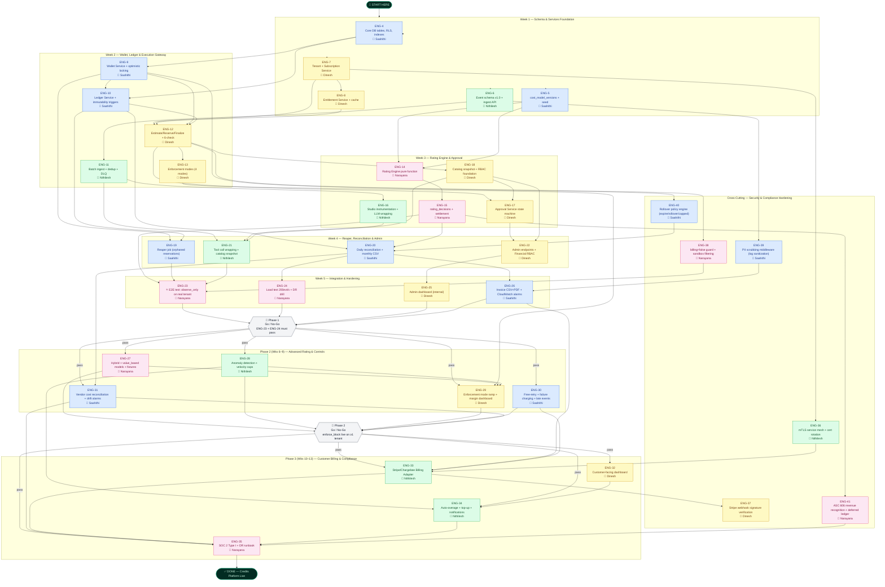

# Nexoraa Credits Platform — Issue Dependency Map



---

## Reading the Map

| Colour | Owner | Track |
|--------|-------|-------|
| 🔵 Blue | Saahithi | Data Model (DB, Wallet, Ledger, Reconciliation) |
| 🟢 Green | Nithilesh | Instrumentation (Event pipeline, LLM/tool wrapping, Billing adapter) |
| 🟡 Yellow | Dinesh | Gateway (Execution control, Approvals, Admin, Customer dashboard) |
| 🩷 Pink | Narayana | Rating Engine + Architecture oversight |

## Critical Path (longest chain to END)

```
START → ENG-4 → ENG-9 → ENG-10 → ENG-20 → ENG-26 → ENG-33 → ENG-35 → END
```
The ledger is the foundation of everything — delay ENG-10 and every downstream issue slips.

## Phase Gates

| Gate | What must be true to proceed |
|------|------------------------------|
| 🚦 Phase 1 | ENG-23 (E2E test) passes + ENG-24 (load test + DR drill) passes |
| 🚦 Phase 2 | ENG-29 confirms `enforce_block` live on ≥1 production tenant |
