# Dify Product Architecture

## Functional Diagram

## Data Flow Diagrams

### Chat/Conversation Flow

### RAG Document Indexing Flow

### RAG Retrieval Flow

### Agent Execution Flow

## Component Architecture

### Multi-Tenancy Model

### Workflow Node Types

```mermaid
graph LR
    subgraph "I/O Nodes"
        Start["🟢 Start"]
        End["🔴 End"]
        Answer["💬 Answer"]
        HumanInput["👤 Human Input"]
    end

    subgraph "Logic Nodes"
        IfElse["🔀 If/Else"]
        Iteration["🔁 Iteration"]
        Loop["♻️ Loop"]
        Classifier["🏷️ Question Classifier"]
    end

    subgraph "AI Nodes"
        LLM["🤖 LLM"]
        Agent["🦾 Agent"]
        KnowledgeRetrieval["📚 Knowledge Retrieval"]
        ParameterExtractor["📋 Parameter Extractor"]
    end

    subgraph "Tool Nodes"
        Tool["🔧 Tool"]
        HTTP["🌐 HTTP Request"]
        Code["💻 Code"]
        Template["📝 Template Transform"]
    end

    subgraph "Data Nodes"
        VarAssigner["📥 Variable Assigner"]
        ListOp["📊 List Operator"]
        DocExtractor["📄 Document Extractor"]
    end

    subgraph "Trigger Nodes"
        Webhook["🔗 Webhook Trigger"]
        Schedule["⏰ Schedule Trigger"]
        Plugin["🔌 Plugin Trigger"]
    end
```

### Deployment Architecture

## Layer Summary

| Layer | Technology | Responsibility |
|-------|-----------|----------------|
| **Frontend** | Next.js, React, TypeScript | User interface, workflow editor, chat UI |
| **API** | Flask, SQLAlchemy | REST endpoints, authentication, request handling |
| **Service** | Python | Business logic orchestration, validation |
| **Core** | Python | Domain logic: workflows, RAG, agents, tools |
| **Async** | Celery, Redis | Background tasks, scheduling, queues |
| **Storage** | PostgreSQL, Redis, Vector DBs, S3 | Persistence, caching, embeddings, files |
| **External** | LLM APIs, Tool APIs | AI models, external integrations |
