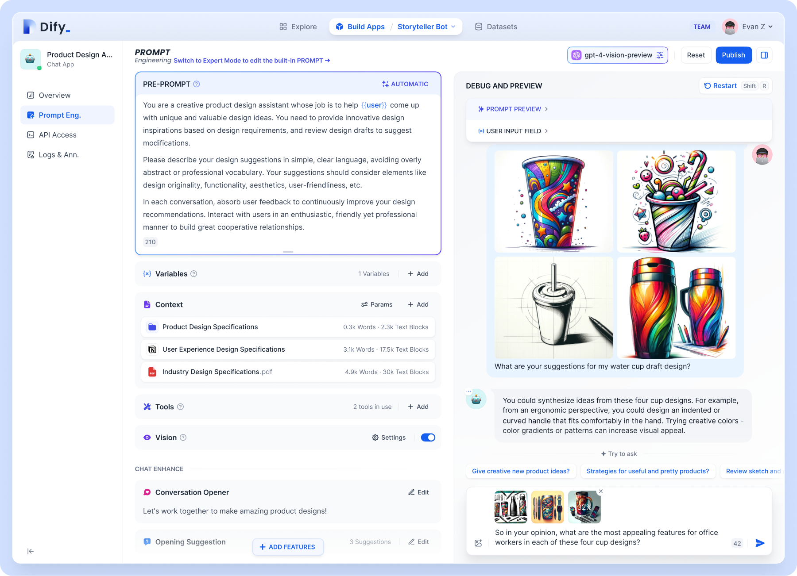
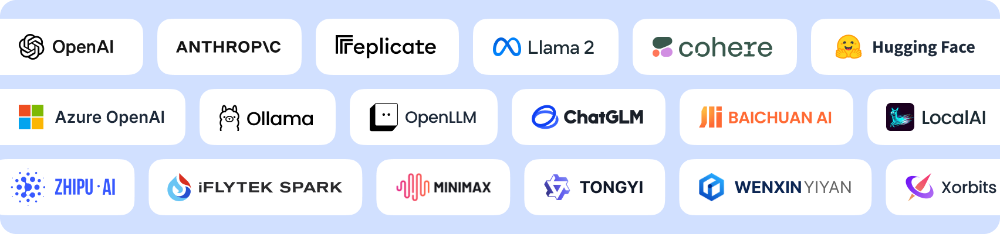

[](https://dify.ai)
<p align="center">
  <a href="./README.md">English</a> |
  <a href="./README_CN.md">简体中文</a> |
  <a href="./README_JA.md">日本語</a> |
  <a href="./README_ES.md">Español</a> |
  <a href="./README_KL.md">Klingon</a> |
  <a href="./README_FR.md">Français</a>
</p>

<p align="center">
    <a href="https://dify.ai" target="_blank">
        </a>
    <a href="https://discord.gg/FngNHpbcY7" target="_blank">
        </a>
    <a href="https://twitter.com/intent/follow?screen_name=dify_ai" target="_blank">
        </a>
    <a href="https://hub.docker.com/u/langgenius" target="_blank">
        </a>
</p>

<p align="center">
   <a href="https://dify.ai/blog/dify-ai-unveils-ai-agent-creating-gpts-and-assistants-with-various-llms" target="_blank">
   Dify.AI Unveils AI Agent: Creating GPTs and Assistants with Various LLMs
  </a>
</p>

**Dify** es una plataforma de desarrollo de aplicaciones para modelos de lenguaje de gran tamaño (LLM) que ya ha visto la creación de más de **100,000** aplicaciones basadas en Dify.AI. Integra los conceptos de Backend como Servicio y LLMOps, cubriendo el conjunto de tecnologías esenciales requerido para construir aplicaciones nativas de inteligencia artificial generativa, incluyendo un motor RAG incorporado. Con Dify, **puedes auto-desplegar capacidades similares a las de Assistants API y GPTs basadas en cualquier LLM.**



## Utilizar Servicios en la Nube

Usar [Dify.AI Cloud](https://dify.ai) proporciona todas las capacidades de la versión de código abierto, e incluye un complemento de 200 créditos de prueba para GPT.

## Por qué Dify

Dify se caracteriza por su neutralidad de modelo y es un conjunto tecnológico completo e ingenierizado, en comparación con las bibliotecas de desarrollo codificadas como LangChain. A diferencia de la API de Assistants de OpenAI, Dify permite el despliegue local completo de los servicios.

| Característica | Dify.AI | API de Assistants | LangChain |
|----------------|---------|------------------|-----------|
| **Enfoque de Programación** | Orientado a API | Orientado a API | Orientado a Código en Python |
| **Estrategia del Ecosistema** | Código Abierto | Cerrado y Comercial | Código Abierto |
| **Motor RAG** | Soportado | Soportado | No Soportado |
| **IDE de Prompts** | Incluido | Incluido | Ninguno |
| **LLMs Soportados** | Gran Variedad | Solo GPT | Gran Variedad |
| **Despliegue Local** | Soportado | No Soportado | No Aplicable |

## Características



**1. Soporte LLM**: Integración con la familia de modelos GPT de OpenAI, o los modelos de la familia Llama2 de código abierto. De hecho, Dify soporta modelos comerciales convencionales y modelos de código abierto (desplegados localmente o basados en MaaS).

**2. IDE de Prompts**: Orquestación visual de aplicaciones y servicios basados en LLMs con tu equipo.

**3. Motor RAG**: Incluye varias capacidades RAG basadas en indexación de texto completo o incrustaciones de base de datos vectoriales, permitiendo la carga directa de PDFs, TXTs y otros formatos de texto.

**4. Agente de IA**: Basado en la llamada de funciones y ReAct, el marco de inferencia del Agente permite a los usuarios personalizar las herramientas, lo que ves es lo que obtienes. Dify proporciona más de una docena de capacidades de llamada de herramientas incorporadas, como Búsqueda de Google, DELL·E, Difusión Estable, WolframAlpha, etc.

**5. Operaciones Continuas**: Monitorear y analizar registros de aplicaciones y rendimiento, mejorando continuamente Prompts, conjuntos de datos o modelos usando datos de producción.

## Antes de Empezar

**¡Danos una estrella, y recibirás notificaciones instantáneas de todos los nuevos lanzamientos en GitHub!**


- [Sitio web](https://dify.ai)
- [Documentación](https://docs.dify.ai)
- [Documentación de Implementación](https://docs.dify.ai/getting-started/install-self-hosted)
- [Preguntas Frecuentes](https://docs.dify.ai/getting-started/faq)

## Instalar la Edición Comunitaria

### Requisitos del Sistema

Antes de instalar Dify, asegúrate de que tu máquina cumpla con los siguientes requisitos mínimos del sistema:

- CPU >= 2 núcleos
- RAM >= 4GB

### Inicio Rápido

La forma más sencilla de iniciar el servidor de Dify es ejecutar nuestro archivo [docker-compose.yml](docker/docker-compose.yaml). Antes de ejecutar el comando de instalación, asegúrate de que [Docker](https://docs.docker.com/get-docker/) y [Docker Compose](https://docs.docker.com/compose/install/) estén instalados en tu máquina:

```bash
cd docker
docker compose up -d
```

Después de ejecutarlo, puedes acceder al panel de control de Dify en tu navegador en [http://localhost/install](http://localhost/install) y comenzar el proceso de instalación de inicialización.

### Gráfico Helm

Un gran agradecimiento a @BorisPolonsky por proporcionarnos una versión del [Gráfico Helm](https://helm.sh/), que permite implementar Dify en Kubernetes. Puedes visitar https://github.com/BorisPolonsky/dify-helm para obtener información sobre la implementación.

### Configuración

Si necesitas personalizar la configuración, consulta los comentarios en nuestro archivo [docker-compose.yml](docker/docker-compose.yaml) y configura manualmente la configuración del entorno. Después de realizar los cambios, ejecuta nuevamente `docker-compose up -d`. Puedes ver la lista completa de variables de entorno en nuestra [documentación](https://docs.dify.ai/getting-started/install-self-hosted/environments).

## Historial de Estrellas

[](https://star-history.com/#langgenius/dify&Date)

## Comunidad y Soporte

Te damos la bienvenida a contribuir a Dify para ayudar a hacer que Dify sea mejor de diversas maneras, enviando código, informando problemas, proponiendo nuevas ideas o compartiendo las aplicaciones de inteligencia artificial interesantes y útiles que hayas creado basadas en Dify. Al mismo tiempo, también te invitamos a compartir Dify en diferentes eventos, conferencias y redes sociales.

- [Problemas en GitHub](https://github.com/langgenius/dify/issues). Lo mejor para: errores y problemas que encuentres al usar Dify.AI, consulta la [Guía de Contribución](CONTRIBUTING.md).
- [Soporte por Correo Electrónico](mailto:hello@dify.ai?subject=[GitHub]Preguntas%20sobre%20Dify). Lo mejor para: preguntas que tengas sobre el uso de Dify.AI.
- [Discord](https://discord.gg/FngNHpbcY7). Lo mejor para: compartir tus aplicaciones y socializar con la comunidad.
- [Twitter](https://twitter.com/dify_ai). Lo mejor para: compartir tus aplicaciones y socializar con la comunidad.
- [Licencia Comercial](mailto:business@dify.ai?subject=[GitHub]Consulta%20de%20Licencia%20Comercial). Lo mejor para: consultas comerciales sobre la licencia de Dify.AI para uso comercial.

## Divulgación de Seguridad

Para proteger tu privacidad, evita publicar problemas de seguridad en GitHub. En su lugar, envía tus preguntas a security@dify.ai y te proporcionaremos una respuesta más detallada.

## Licencia

Este repositorio está disponible bajo la [Licencia de Código Abierto Dify](LICENSE), que es esencialmente Apache 2.0 con algunas restricciones adicionales.
