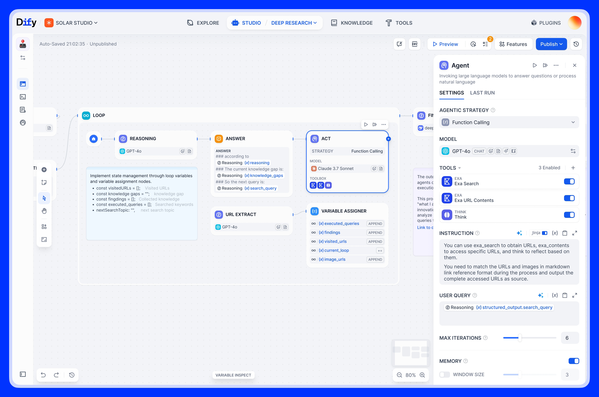

[](https://dify.ai)
<p align="center">
  <a href="./README.md">English</a> |
  <a href="./README_CN.md">简体中文</a> |
  <a href="./README_JA.md">日本語</a> |
  <a href="./README_ES.md">Español</a> |
  <a href="./README_KL.md">Klingon</a> |
  <a href="./README_FR.md">Français</a>
</p>

<p align="center">
    <a href="https://dify.ai" target="_blank">
        </a>
    <a href="https://discord.gg/FngNHpbcY7" target="_blank">
        </a>
    <a href="https://twitter.com/intent/follow?screen_name=dify_ai" target="_blank">
        </a>
    <a href="https://hub.docker.com/u/langgenius" target="_blank">
        </a>
</p>

<p align="center">
   <a href="https://dify.ai/blog/dify-ai-unveils-ai-agent-creating-gpts-and-assistants-with-various-llms" target="_blank">
   Dify.AI Unveils AI Agent: Creating GPTs and Assistants with Various LLMs
  </a>
</p>


**Dify** est une plateforme de développement d'applications LLM qui a déjà vu plus de **100,000** applications construites sur Dify.AI. Elle intègre les concepts de Backend as a Service et LLMOps, couvrant la pile technologique de base requise pour construire des applications natives d'IA générative, y compris un moteur RAG intégré. Avec Dify, **vous pouvez auto-déployer des capacités similaires aux API Assistants et GPT basées sur n'importe quels LLM.**


## Utiliser les services cloud  

L'utilisation de [Dify.AI Cloud](https://dify.ai) fournit toutes les capacités de la version open source, et comprend un essai gratuit de 200 crédits GPT.

## Pourquoi Dify

Dify présente une neutralité de modèle et est une pile technologique complète et conçue par rapport à des bibliothèques de développement codées en dur comme LangChain. Contrairement à l'API Assistants d'OpenAI, Dify permet un déploiement local complet des services.

| Fonctionnalité | Dify.AI | API Assistants | LangChain |
|---------------|----------|-----------------|------------|
| **Approche de programmation** | Orientée API | Orientée API | Orientée code Python |  
| **Stratégie écosystème** | Open source | Fermé et commercial | Open source |
| **Moteur RAG** | Pris en charge | Pris en charge | Non pris en charge |
| **IDE d'invite** | Inclus | Inclus | Aucun |
| **LLM pris en charge** | Grande variété | Seulement GPT | Grande variété |
| **Déploiement local** | Pris en charge | Non pris en charge | Non applicable |

 ## Fonctionnalités  


**1\. Support LLM**: Intégration avec la famille de modèles GPT d'OpenAI, ou les modèles de la famille open source Llama2. En fait, Dify prend en charge les modèles commerciaux grand public et les modèles open source (déployés localement ou basés sur MaaS).  

**2\. IDE d'invite**: Orchestration visuelle d'applications et de services basés sur LLMs avec votre équipe.  

**3\. Moteur RAG**: Comprend diverses capacités RAG basées sur l'indexation de texte intégral ou les embeddings de base de données vectorielles, permettant le chargement direct de PDF, TXT et autres formats de texte.

**4\. AI Agent**: Basé sur l'appel de fonction et ReAct, le framework d'inférence de l'Agent permet aux utilisateurs de personnaliser les outils, ce que vous voyez est ce que vous obtenez. Dify propose plus d'une douzaine de capacités d'appel d'outils intégrées, telles que la recherche Google, DELL·E, Diffusion Stable, WolframAlpha, etc.

**5\. Opérations continues**: Surveillez et analysez les journaux et les performances des applications, améliorez en continu les invites, les datasets ou les modèles à l'aide de données de production.  

## Avant de commencer

**Étoilez-nous, et vous recevrez des notifications instantanées pour toutes les nouvelles sorties sur GitHub !**


- [Site web](https://dify.ai)  
- [Documentation](https://docs.dify.ai)  
- [Documentation de déploiement](https://docs.dify.ai/getting-started/install-self-hosted)   
- [FAQ](https://docs.dify.ai/getting-started/faq)  


## Installer la version Communauté  

### Configuration système  

Avant d'installer Dify, assurez-vous que votre machine répond aux exigences minimales suivantes:  

- CPU >= 2 cœurs
- RAM >= 4 Go 

### Démarrage rapide 

La façon la plus simple de démarrer le serveur Dify est d'exécuter notre fichier [docker-compose.yml](docker/docker-compose.yaml). Avant d'exécuter la commande d'installation, assurez-vous que [Docker](https://docs.docker.com/get-docker/) et [Docker Compose](https://docs.docker.com/compose/install/) sont installés sur votre machine:  

```bash
cd docker
docker compose up -d
```

Après l'exécution, vous pouvez accéder au tableau de bord Dify dans votre navigateur à l'adresse [http://localhost/install](http://localhost/install) et démarrer le processus d'installation initiale.  

### Chart Helm 

Un grand merci à @BorisPolonsky pour nous avoir fourni une version [Helm Chart](https://helm.sh/) qui permet le déploiement de Dify sur Kubernetes.
Vous pouvez accéder à https://github.com/BorisPolonsky/dify-helm pour des informations de déploiement.  

### Configuration  

Si vous avez besoin de personnaliser la configuration, veuillez vous référer aux commentaires de notre fichier [docker-compose.yml](docker/docker-compose.yaml) et définir manuellement la configuration de l'environnement. Après avoir apporté les modifications, veuillez exécuter à nouveau `docker-compose up -d`. Vous trouverez la liste complète des variables d'environnement dans notre [documentation](https://docs.dify.ai/getting-started/install-self-hosted/environments).  

## Historique d'étoiles  

[](https://star-history.com/#langgenius/dify&Date)  


## Communauté & Support  

Nous vous invitons à contribuer à Dify pour aider à améliorer Dify de diverses manières, en soumettant du code, des problèmes, de nouvelles idées ou en partageant les applications d'IA intéressantes et utiles que vous avez créées sur la base de Dify. En même temps, nous vous invitons également à partager Dify lors de différents événements, conférences et réseaux sociaux.  

- [Problèmes GitHub](https://github.com/langgenius/dify/issues). Idéal pour : les bogues et les erreurs que vous rencontrez en utilisant Dify.AI, voir le [Guide de contribution](CONTRIBUTING.md).  
- [Support par courriel](mailto:hello@dify.ai?subject=[GitHub]Questions%20About%20Dify). Idéal pour : les questions que vous avez au sujet de l'utilisation de Dify.AI.   
- [Discord](https://discord.gg/FngNHpbcY7). Idéal pour : partager vos applications et discuter avec la communauté.   
- [Twitter](https://twitter.com/dify_ai). Idéal pour : partager vos applications et discuter avec la communauté.
- [Licence commerciale](mailto:business@dify.ai?subject=[GitHub]Business%20License%20Inquiry). Idéal pour : les demandes commerciales de licence de Dify.AI pour un usage commercial.  

## Divulgation de la sécurité  

Pour protéger votre vie privée, veuillez éviter de publier des problèmes de sécurité sur GitHub. Envoyez plutôt vos questions à security@dify.ai et nous vous fournirons une réponse plus détaillée.  

## Licence  

Ce référentiel est disponible sous la [Licence open source Dify](LICENSE), qui est essentiellement Apache 2.0 avec quelques restrictions supplémentaires.
