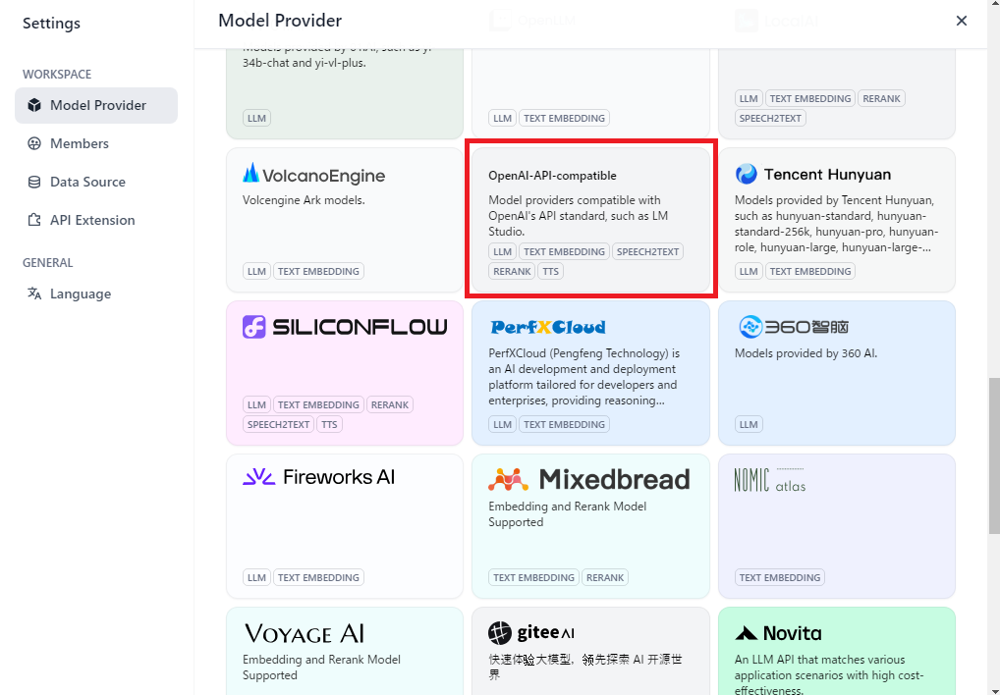

# OpenVINO Model Server (OVMS) integration

### What is OpenVINO Model Server?
OpenVINO model server (OVMS) is a deep learning inferencing service server powered by Intel OpenVINO Toolkit.  
The OVMS prebuilt docker image is available, so it is very easy to install and get OVMS up and running.  
This project integrates OVMS together with Dify so you can run LLM inferencing locally on your PC (without having any cloud LLM API services).

## Overview of workflow to get Dify running with OVMS
1. Replace `docker-compose-template.yaml` with `docker-compose-template-ovms-integration.yaml`
2. Regenerate `docker-compose.yaml` from `docker-compose-template.yaml` with `generate_docker_compose` Python script
3. Prepare OpenVINO format LLM model(s)
4. Start Dify with `docker-compose`


## Step 1 and 2. Replace `docker-compose-template.yaml` and regenerate `docker-compose.yaml` file.
```sh
cd docker
cp docker-compose-template.yaml docker-compose-template.orig.yaml
cp docker-compose-template-ovms-integration.yaml docker-compose-template.yaml
python3 generate_docker_compose
```

## Step 3. Prepare the LLM models for OpenVINO Model Server.
Refer the [Deployment on a Model Server / QuickStart - LLM models](https://docs.openvino.ai/2025/openvino-workflow/model-server/ovms_docs_llm_quickstart.html) section in the OpenVINO document web site to prepare a model and configuration files for the OVMS.
You need to place the models in the `'./docker/models'` directory.

Here's the quick summary of command lines described in the model preparation instruction in the above web page.  
**Run the commands below in `'./docker'` directory** (so that the `models` directory is created under `./docker` directory)
### Linux
```sh
# Optional - Creating a virtual environment
python3 -m venv venv-ovms
source venv-ovms/bin/activate
python3 -m pip install -U pip
pip3 install -U setuptools wheel

# Install prerequisites
pip3 install -r https://raw.githubusercontent.com/openvinotoolkit/model_server/refs/heads/releases/2025/0/demos/common/export_models/requirements.txt

# Obtain model conversion script (convert to OpenVINO model format)
curl https://raw.githubusercontent.com/openvinotoolkit/model_server/refs/heads/releases/2025/0/demos/common/export_models/export_model.py -o export_model.py

# Download and convert the model (DeepSeek-R1-Distill-Qwen-7B)
mkdir models
python3 export_model.py text_generation --source_model deepseek-ai/DeepSeek-R1-Distill-Qwen-7B --weight-format int4 --config_file_path models/config.json --model_repository_path models --target_device CPU --cache 2
```

### Windows
```sh
# Optional - Creating a virtual environment
python -m venv venv-ovms
venv-ovms\Scripts\activate
python -m pip install -U pip
pip install -U setuptools wheel

# Install prerequisites
pip install -r https://raw.githubusercontent.com/openvinotoolkit/model_server/refs/heads/releases/2025/0/demos/common/export_models/requirements.txt

# Obtain model conversion script (convert to OpenVINO model format)
powershell -c Invoke-WebRequest -Uri https://raw.githubusercontent.com/openvinotoolkit/model_server/refs/heads/releases/2025/0/demos/common/export_models/export_model.py -OutFile export_model.py

# Download and convert the model (DeepSeek-R1-Distill-Qwen-7B)
mkdir models
python export_model.py text_generation --source_model deepseek-ai/DeepSeek-R1-Distill-Qwen-7B --weight-format int4 --config_file_path models/config.json --model_repository_path models --target_device CPU --cache 2
```
#### Hint
You can check the other LLM models at [HiggingFace web site](https://huggingface.co/). Followings are some other LLM files that you can try.
- deepseek-ai/DeepSeek-R1-Distill-Llama-8B
- TinyLlama/TinyLlama-1.1B-Chat-v1.0

#### Modify model `./docker/config.json` file - Windows users only
The `base_path` contains `\\`, the Windows file path separator. Replace `\\` with `/`.
- Wrong
```sh
            "base_path": "deepseek-ai\\DeepSeek-R1-Distill-Qwen-7B"
```
- Correct
```sh
            "base_path": "deepseek-ai/DeepSeek-R1-Distill-Qwen-7B"
```

## 4. Start Dify with `docker-compose`
```bash
cp .env.example .env
docker compose up -d
```

-----------------------------------------

## How to setup model provider for OpenVINO Model Server in Dify

1. Go to `Settings` and select `OpenAI-API-compatible` model provider
Hit `+ Add Model` button.


2. Fill `Model Name` and `API endpoint URL` text box  
Model Name : `deepseek-ai/DeepSeek-R1-Distill-Qwen-7B`
API endpoint URL: `http://docker-ovms-1:8000/v3`
Other items can be left as it is.


