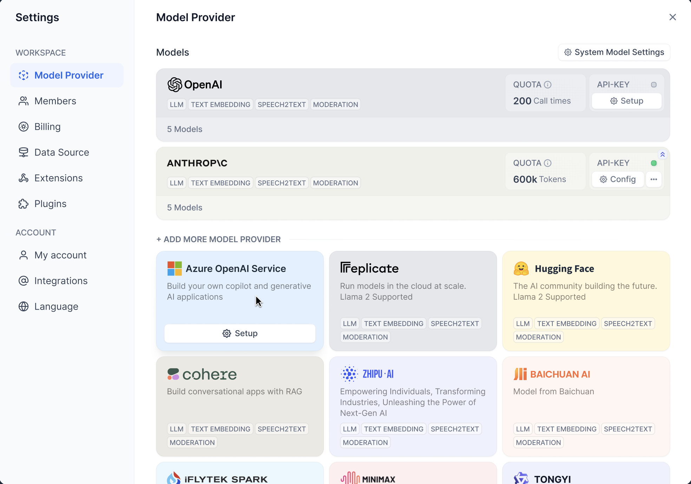

# Model Runtime

This module provides the interface for invoking and authenticating various models, and offers Dify a unified information and credentials form rule for model providers.

- On one hand, it decouples models from upstream and downstream processes, facilitating horizontal expansion for developers,
- On the other hand, it allows for direct display of providers and models in the frontend interface by simply defining them in the backend, eliminating the need to modify frontend logic.

## Features

- Supports capability invocation for 6 types of models

  - `LLM` - LLM text completion, dialogue, pre-computed tokens capability
  - `Text Embedding Model` - Text Embedding, pre-computed tokens capability
  - `Rerank Model` - Segment Rerank capability
  - `Speech-to-text Model` - Speech to text capability
  - `Text-to-speech Model` - Text to speech capability
  - `Moderation` - Moderation capability

- Model provider display

  

  Displays a list of all supported providers, including provider names, icons, supported model types list, predefined model list, configuration method, and credentials form rules, etc. For detailed rule design, see: [Schema](./docs/en_US/schema.md).

- Selectable model list display

  

  After configuring provider/model credentials, the dropdown (application orchestration interface/default model) allows viewing of the available LLM list. Greyed out items represent predefined model lists from providers without configured credentials, facilitating user review of supported models.

  In addition, this list also returns configurable parameter information and rules for LLM, as shown below:

  

  These parameters are all defined in the backend, allowing different settings for various parameters supported by different models, as detailed in: [Schema](./docs/en_US/schema.md#ParameterRule).

- Provider/model credential authentication

  

  

  The provider list returns configuration information for the credentials form, which can be authenticated through Runtime's interface. The first image above is a provider credential DEMO, and the second is a model credential DEMO.

## Structure

Model Runtime is divided into three layers:

- The outermost layer is the factory method

  It provides methods for obtaining all providers, all model lists, getting provider instances, and authenticating provider/model credentials.

- The second layer is the provider layer

  It provides the current provider's model list, model instance obtaining, provider credential authentication, and provider configuration rule information, **allowing horizontal expansion** to support different providers.

- The bottom layer is the model layer

  It offers direct invocation of various model types, predefined model configuration information, getting predefined/remote model lists, model credential authentication methods. Different models provide additional special methods, like LLM's pre-computed tokens method, cost information obtaining method, etc., **allowing horizontal expansion** for different models under the same provider (within supported model types).

## Next Steps

- Add new provider configuration: [Link](./docs/en_US/provider_scale_out.md)
- Add new models for existing providers: [Link](./docs/en_US/provider_scale_out.md#AddModel)
- View YAML configuration rules: [Link](./docs/en_US/schema.md)
- Implement interface methods: [Link](./docs/en_US/interfaces.md)
