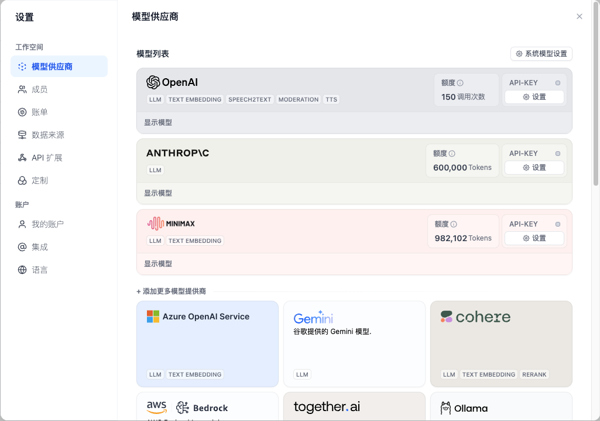
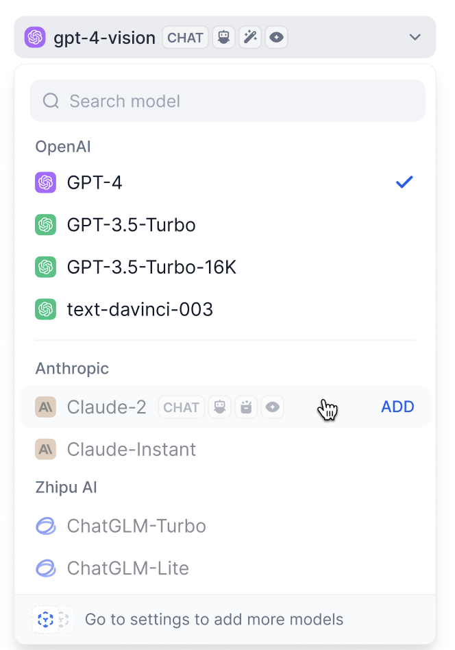
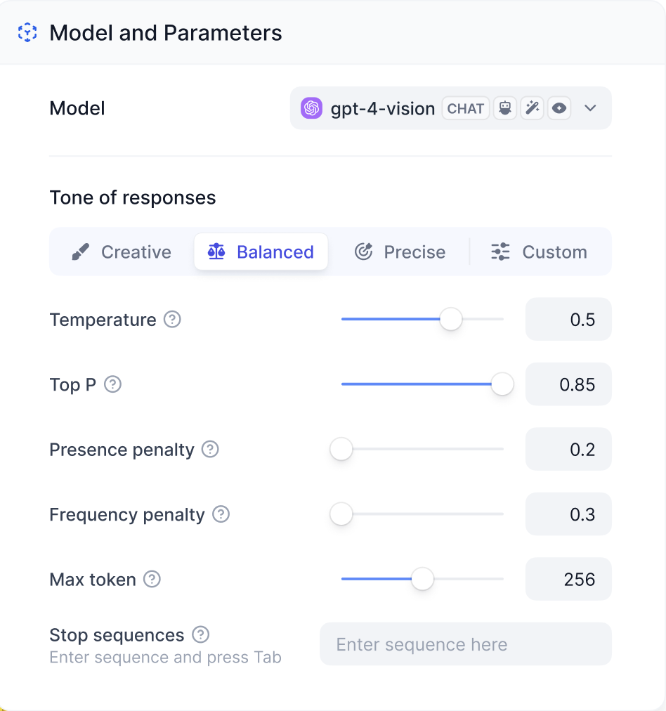
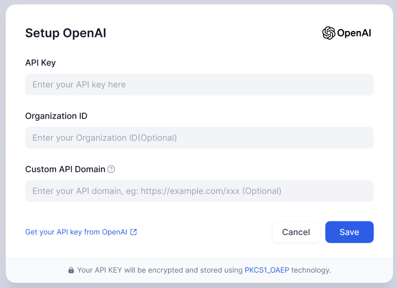
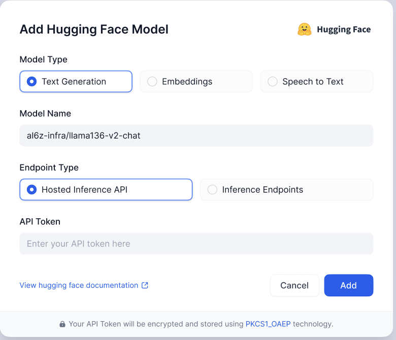
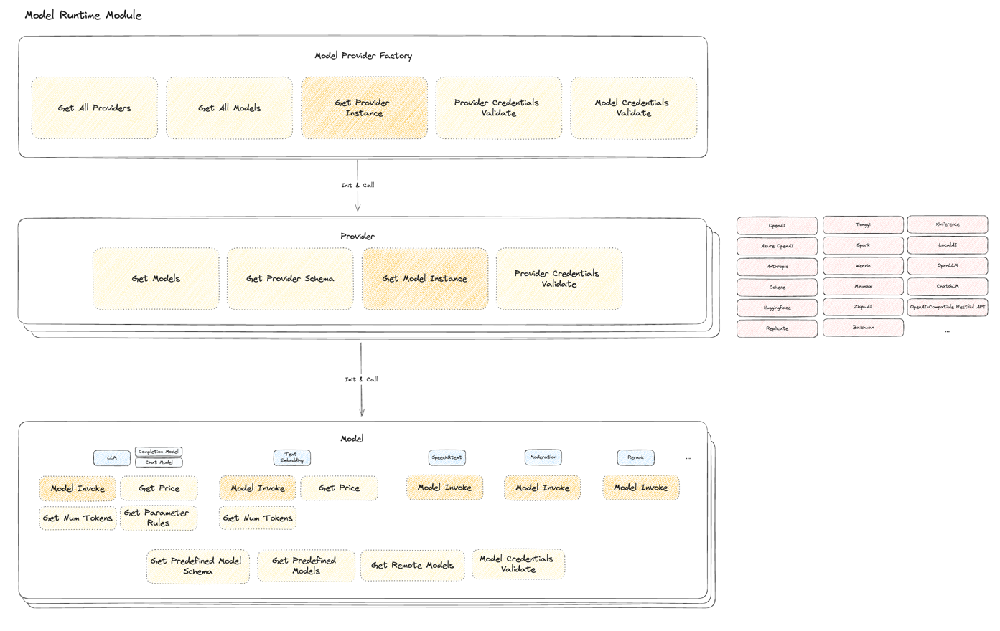
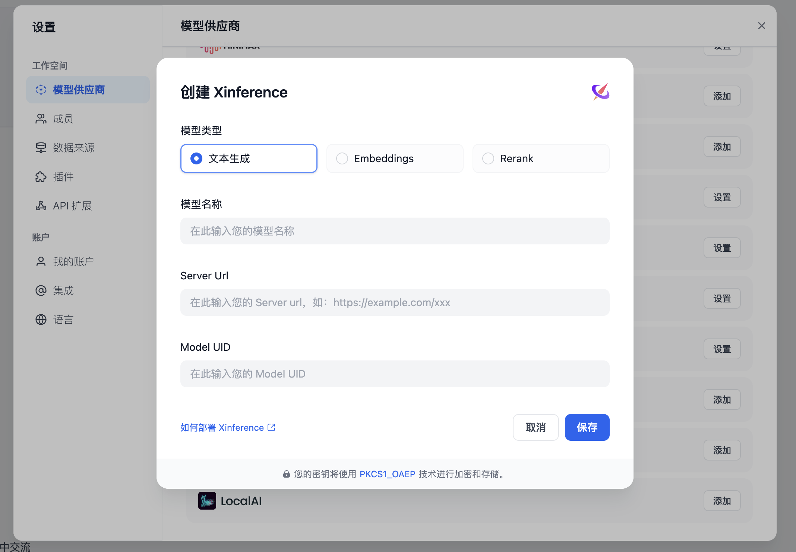
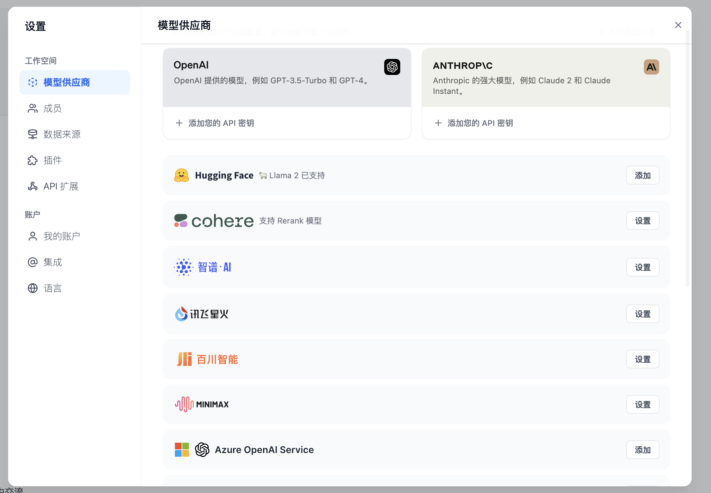
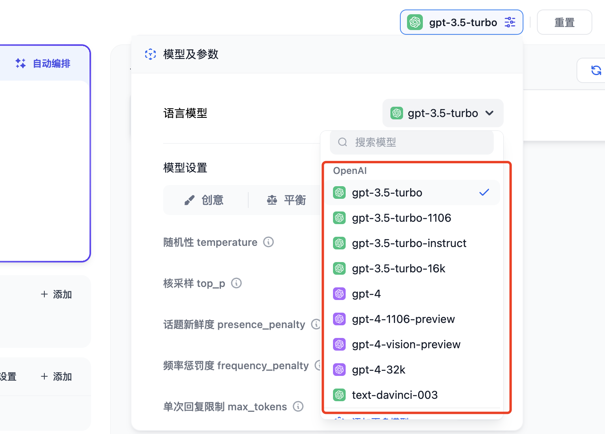

# Model Runtime

该模块提供了各模型的调用、鉴权接口，并为 Dify 提供了统一的模型供应商的信息和凭据表单规则。

- 一方面将模型和上下游解耦，方便开发者对模型横向扩展，
- 另一方面提供了只需在后端定义供应商和模型，即可在前端页面直接展示，无需修改前端逻辑。

## 功能介绍

- 支持 5 种模型类型的能力调用

  - `LLM` - LLM 文本补全、对话，预计算 tokens 能力
  - `Text Embedding Model` - 文本 Embedding ，预计算 tokens 能力
  - `Rerank Model` - 分段 Rerank 能力
  - `Speech-to-text Model` - 语音转文本能力
  - `Text-to-speech Model` - 文本转语音能力
  - `Moderation` - Moderation 能力

- 模型供应商展示

  

​	展示所有已支持的供应商列表，除了返回供应商名称、图标之外，还提供了支持的模型类型列表，预定义模型列表、配置方式以及配置凭据的表单规则等等，规则设计详见：[Schema](./docs/zh_Hans/schema.md)。

- 可选择的模型列表展示

  

​	配置供应商/模型凭据后，可在此下拉（应用编排界面/默认模型）查看可用的 LLM 列表，其中灰色的为未配置凭据供应商的预定义模型列表，方便用户查看已支持的模型。

​	除此之外，该列表还返回了 LLM 可配置的参数信息和规则，如下图：

​		

​	这里的参数均为后端定义，相比之前只有 5 种固定参数，这里可为不同模型设置所支持的各种参数，详见：[Schema](./docs/zh_Hans/schema.md#ParameterRule)。

- 供应商/模型凭据鉴权

  

​	供应商列表返回了凭据表单的配置信息，可通过 Runtime 提供的接口对凭据进行鉴权，上图 1 为供应商凭据 DEMO，上图 2 为模型凭据 DEMO。

## 结构

Model Runtime 分三层：

- 最外层为工厂方法

  提供获取所有供应商、所有模型列表、获取供应商实例、供应商/模型凭据鉴权方法。

- 第二层为供应商层

  提供获取当前供应商模型列表、获取模型实例、供应商凭据鉴权、供应商配置规则信息，**可横向扩展**以支持不同的供应商。

  对于供应商/模型凭据，有两种情况
  - 如OpenAI这类中心化供应商，需要定义如**api_key**这类的鉴权凭据
  - 如[**Xinference**](https://github.com/xorbitsai/inference)这类本地部署的供应商，需要定义如**server_url**这类的地址凭据，有时候还需要定义**model_uid**之类的模型类型凭据，就像下面这样，当在供应商层定义了这些凭据后，就可以在前端页面上直接展示，无需修改前端逻辑。
  

  当配置好凭据后，就可以通过DifyRuntime的外部接口直接获取到对应供应商所需要的**Schema**（凭据表单规则），从而在可以在不修改前端逻辑的情况下，提供新的供应商/模型的支持。

- 最底层为模型层

  提供各种模型类型的直接调用、预定义模型配置信息、获取预定义/远程模型列表、模型凭据鉴权方法，不同模型额外提供了特殊方法，如 LLM 提供预计算 tokens 方法、获取费用信息方法等，**可横向扩展**同供应商下不同的模型（支持的模型类型下）。

  在这里我们需要先区分模型参数与模型凭据。

  - 模型参数(**在本层定义**)：这是一类经常需要变动，随时调整的参数，如 LLM 的 **max_tokens**、**temperature** 等，这些参数是由用户在前端页面上进行调整的，因此需要在后端定义参数的规则，以便前端页面进行展示和调整。在DifyRuntime中，他们的参数名一般为**model_parameters: dict[str, any]**。

  - 模型凭据(**在供应商层定义**)：这是一类不经常变动，一般在配置好后就不会再变动的参数，如 **api_key**、**server_url** 等。在DifyRuntime中，他们的参数名一般为**credentials: dict[str, any]**，Provider层的credentials会直接被传递到这一层，不需要再单独定义。

## 下一步

### [增加新的供应商配置 👈🏻](./docs/zh_Hans/provider_scale_out.md)
当添加后，这里将会出现一个新的供应商

### [为已存在的供应商新增模型 👈🏻](./docs/zh_Hans/provider_scale_out.md#增加模型)
当添加后，对应供应商的模型列表中将会出现一个新的预定义模型供用户选择，如GPT-3.5 GPT-4 ChatGLM3-6b等，而对于支持自定义模型的供应商，则不需要新增模型。

### [接口的具体实现 👈🏻](./docs/zh_Hans/interfaces.md)
你可以在这里找到你想要查看的接口的具体实现，以及接口的参数和返回值的具体含义。
