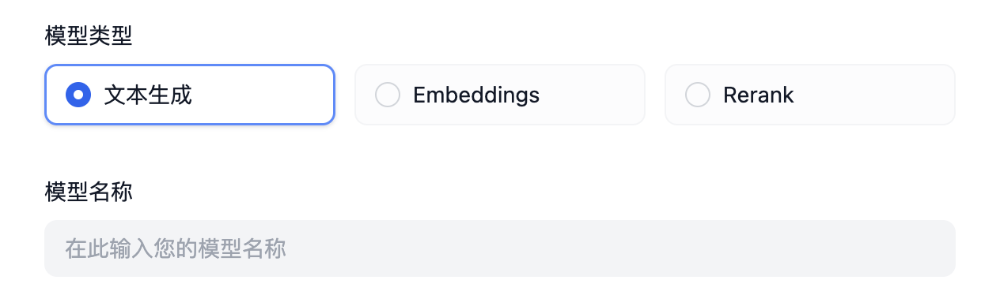

## Custom Integration of Pre-defined Models

### Introduction

After completing the vendors integration, the next step is to connect the vendor's models. To illustrate the entire connection process, we will use Xinference as an example to demonstrate a complete vendor integration.

It is important to note that for custom models, each model connection requires a complete vendor credential.

Unlike pre-defined models, a custom vendor integration always includes the following two parameters, which do not need to be defined in the vendor YAML file.



As mentioned earlier, vendors do not need to implement validate_provider_credential. The runtime will automatically call the corresponding model layer's validate_credentials to validate the credentials based on the model type and name selected by the user.

### Writing the Vendor YAML

First, we need to identify the types of models supported by the vendor we are integrating.

Currently supported model types are as follows:

- `llm` Text Generation Models

- `text_embedding` Text Embedding Models

- `rerank` Rerank Models

- `speech2text` Speech-to-Text

- `tts` Text-to-Speech

- `moderation` Moderation

Xinference supports LLM, Text Embedding, and Rerank. So we will start by writing xinference.yaml.

```yaml
provider: xinference #Define the vendor identifier
label: # Vendor display name, supports both en_US (English) and zh_Hans (Simplified Chinese). If zh_Hans is not set, it will use en_US by default.
  en_US: Xorbits Inference
icon_small: # Small icon, refer to other vendors' icons stored in the _assets directory within the vendor implementation directory; follows the same language policy as the label
  en_US: icon_s_en.svg
icon_large: # Large icon
  en_US: icon_l_en.svg
help: # Help information
  title:
    en_US: How to deploy Xinference
    zh_Hans: 如何部署 Xinference
  url:
    en_US: https://github.com/xorbitsai/inference
supported_model_types: # Supported model types. Xinference supports LLM, Text Embedding, and Rerank
- llm
- text-embedding
- rerank
configurate_methods: # Since Xinference is a locally deployed vendor with no predefined models, users need to deploy whatever models they need according to Xinference documentation. Thus, it only supports custom models.
- customizable-model
provider_credential_schema:
  credential_form_schemas:
```

Then, we need to determine what credentials are required to define a model in Xinference.

- Since it supports three different types of models, we need to specify the model_type to denote the model type. Here is how we can define it:

```yaml
provider_credential_schema:
  credential_form_schemas:
  - variable: model_type
    type: select
    label:
      en_US: Model type
      zh_Hans: 模型类型
    required: true
    options:
    - value: text-generation
      label:
        en_US: Language Model
        zh_Hans: 语言模型
    - value: embeddings
      label:
        en_US: Text Embedding
    - value: reranking
      label:
        en_US: Rerank
```

- Next, each model has its own model_name, so we need to define that here:

```yaml
  - variable: model_name
    type: text-input
    label:
      en_US: Model name
      zh_Hans: 模型名称
    required: true
    placeholder:
      zh_Hans: 填写模型名称
      en_US: Input model name
```

- Specify the Xinference local deployment address:

```yaml
  - variable: server_url
    label:
      zh_Hans: 服务器 URL
      en_US: Server url
    type: text-input
    required: true
    placeholder:
      zh_Hans: 在此输入 Xinference 的服务器地址，如 https://example.com/xxx
      en_US: Enter the url of your Xinference, for example https://example.com/xxx
```

- Each model has a unique model_uid, so we also need to define that here:

```yaml
  - variable: model_uid
    label:
      zh_Hans: 模型 UID
      en_US: Model uid
    type: text-input
    required: true
    placeholder:
      zh_Hans: 在此输入您的 Model UID
      en_US: Enter the model uid
```

Now, we have completed the basic definition of the vendor.

### Writing the Model Code

Next, let's take the `llm` type as an example and write `xinference.llm.llm.py`.

In `llm.py`, create a Xinference LLM class, we name it `XinferenceAILargeLanguageModel` (this can be arbitrary), inheriting from the `__base.large_language_model.LargeLanguageModel` base class, and implement the following methods:

- LLM Invocation

Implement the core method for LLM invocation, supporting both stream and synchronous responses.

```python
def _invoke(self, model: str, credentials: dict,
            prompt_messages: list[PromptMessage], model_parameters: dict,
            tools: Optional[list[PromptMessageTool]] = None, stop: Optional[list[str]] = None,
            stream: bool = True, user: Optional[str] = None) \
        -> Union[LLMResult, Generator]:
    """
    Invoke large language model
    
    :param model: model name
	:param credentials: model credentials
	:param prompt_messages: prompt messages
	:param model_parameters: model parameters
	:param tools: tools for tool usage
	:param stop: stop words
	:param stream: is the response a stream
	:param user: unique user id
	:return: full response or stream response chunk generator result
	"""
```

When implementing, ensure to use two functions to return data separately for synchronous and stream responses. This is important because Python treats functions containing the `yield` keyword as generator functions, mandating them to return `Generator` types. Here’s an example (note that the example uses simplified parameters; in real implementation, use the parameter list as defined above):

```python
def _invoke(self, stream: bool, **kwargs) \
        -> Union[LLMResult, Generator]:
    if stream:
          return self._handle_stream_response(**kwargs)
    return self._handle_sync_response(**kwargs)

def _handle_stream_response(self, **kwargs) -> Generator:
    for chunk in response:
          yield chunk
def _handle_sync_response(self, **kwargs) -> LLMResult:
    return LLMResult(**response)
```

- Pre-compute Input Tokens

If the model does not provide an interface for pre-computing tokens, you can return 0 directly.

```python
def get_num_tokens(self, model: str, credentials: dict, prompt_messages: list[PromptMessage],tools: Optional[list[PromptMessageTool]] = None) -> int:
  """
  Get number of tokens for given prompt messages

  :param model: model name
  :param credentials: model credentials
  :param prompt_messages: prompt messages
  :param tools: tools for tool usage
  :return: token count
  """
```

Sometimes, you might not want to return 0 directly. In such cases, you can use `self._get_num_tokens_by_gpt2(text: str)` to get pre-computed tokens and ensure environment variable `PLUGIN_BASED_TOKEN_COUNTING_ENABLED` is set to `true`, This method is provided by the `AIModel` base class, and it uses GPT2's Tokenizer for calculation. However, it should be noted that this is only a substitute and may not be fully accurate.

- Model Credentials Validation

Similar to vendor credentials validation, this method validates individual model credentials.

```python
def validate_credentials(self, model: str, credentials: dict) -> None:
    """
    Validate model credentials
    
    :param model: model name
	:param credentials: model credentials
	:return: None
	"""
```

- Model Parameter Schema

Unlike custom types, since the YAML file does not define which parameters a model supports, we need to dynamically generate the model parameter schema.

For instance, Xinference supports `max_tokens`, `temperature`, and `top_p` parameters.

However, some vendors may support different parameters for different models. For example, the `OpenLLM` vendor supports `top_k`, but not all models provided by this vendor support `top_k`. Let's say model A supports `top_k` but model B does not. In such cases, we need to dynamically generate the model parameter schema, as illustrated below:

```python
    def get_customizable_model_schema(self, model: str, credentials: dict) -> Optional[AIModelEntity]:
        """
            used to define customizable model schema
        """
        rules = [
            ParameterRule(
                name='temperature', type=ParameterType.FLOAT,
                use_template='temperature',
                label=I18nObject(
                    zh_Hans='温度', en_US='Temperature'
                )
            ),
            ParameterRule(
                name='top_p', type=ParameterType.FLOAT,
                use_template='top_p',
                label=I18nObject(
                    zh_Hans='Top P', en_US='Top P'
                )
            ),
            ParameterRule(
                name='max_tokens', type=ParameterType.INT,
                use_template='max_tokens',
                min=1,
                default=512,
                label=I18nObject(
                    zh_Hans='最大生成长度', en_US='Max Tokens'
                )
            )
        ]

        # if model is A, add top_k to rules
        if model == 'A':
            rules.append(
                ParameterRule(
                    name='top_k', type=ParameterType.INT,
                    use_template='top_k',
                    min=1,
                    default=50,
                    label=I18nObject(
                        zh_Hans='Top K', en_US='Top K'
                    )
                )
            )

        """
            some NOT IMPORTANT code here
        """

        entity = AIModelEntity(
            model=model,
            label=I18nObject(
                en_US=model
            ),
            fetch_from=FetchFrom.CUSTOMIZABLE_MODEL,
            model_type=model_type,
            model_properties={ 
                ModelPropertyKey.MODE:  ModelType.LLM,
            },
            parameter_rules=rules
        )

        return entity
```

- Exception Error Mapping

When a model invocation error occurs, it should be mapped to the runtime's specified `InvokeError` type, enabling Dify to handle different errors appropriately.

Runtime Errors:

- `InvokeConnectionError` Connection error during invocation
- `InvokeServerUnavailableError` Service provider unavailable
- `InvokeRateLimitError` Rate limit reached
- `InvokeAuthorizationError` Authorization failure
- `InvokeBadRequestError` Invalid request parameters

```python
  @property
  def _invoke_error_mapping(self) -> dict[type[InvokeError], list[type[Exception]]]:
      """
      Map model invoke error to unified error
      The key is the error type thrown to the caller
      The value is the error type thrown by the model,
      which needs to be converted into a unified error type for the caller.
  
      :return: Invoke error mapping
      """
```

For interface method details, see: [Interfaces](./interfaces.md). For specific implementations, refer to: [llm.py](https://github.com/langgenius/dify-runtime/blob/main/lib/model_providers/anthropic/llm/llm.py).
