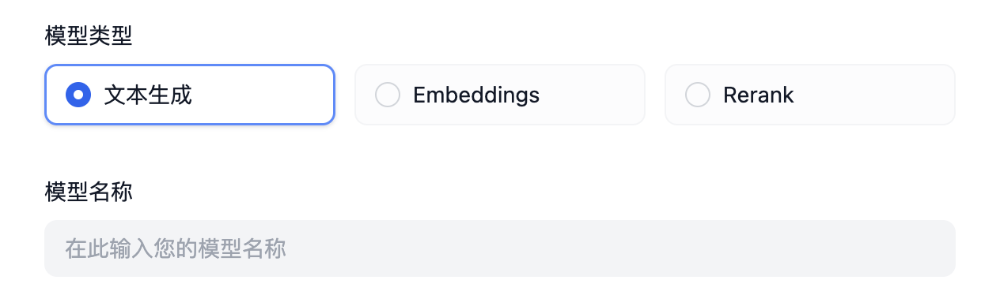

## 自定义预定义模型接入

### 介绍

供应商集成完成后，接下来为供应商下模型的接入，为了帮助理解整个接入过程，我们以`Xinference`为例，逐步完成一个完整的供应商接入。

需要注意的是，对于自定义模型，每一个模型的接入都需要填写一个完整的供应商凭据。

而不同于预定义模型，自定义供应商接入时永远会拥有如下两个参数，不需要在供应商 yaml 中定义。



在前文中，我们已经知道了供应商无需实现`validate_provider_credential`，Runtime 会自行根据用户在此选择的模型类型和模型名称调用对应的模型层的`validate_credentials`来进行验证。

### 编写供应商 yaml

我们首先要确定，接入的这个供应商支持哪些类型的模型。

当前支持模型类型如下：

- `llm` 文本生成模型
- `text_embedding` 文本 Embedding 模型
- `rerank` Rerank 模型
- `speech2text` 语音转文字
- `tts` 文字转语音
- `moderation` 审查

`Xinference`支持`LLM`和`Text Embedding`和 Rerank，那么我们开始编写`xinference.yaml`。

```yaml
provider: xinference #确定供应商标识
label: # 供应商展示名称，可设置 en_US 英文、zh_Hans 中文两种语言，zh_Hans 不设置将默认使用 en_US。
  en_US: Xorbits Inference
icon_small: # 小图标，可以参考其他供应商的图标，存储在对应供应商实现目录下的 _assets 目录，中英文策略同 label
  en_US: icon_s_en.svg
icon_large: # 大图标
  en_US: icon_l_en.svg
help: # 帮助
  title:
    en_US: How to deploy Xinference
    zh_Hans: 如何部署 Xinference
  url:
    en_US: https://github.com/xorbitsai/inference
supported_model_types: # 支持的模型类型，Xinference 同时支持 LLM/Text Embedding/Rerank
- llm
- text-embedding
- rerank
configurate_methods: # 因为 Xinference 为本地部署的供应商，并且没有预定义模型，需要用什么模型需要根据 Xinference 的文档自己部署，所以这里只支持自定义模型
- customizable-model
provider_credential_schema:
  credential_form_schemas:
```

随后，我们需要思考在 Xinference 中定义一个模型需要哪些凭据

- 它支持三种不同的模型，因此，我们需要有`model_type`来指定这个模型的类型，它有三种类型，所以我们这么编写

```yaml
provider_credential_schema:
  credential_form_schemas:
  - variable: model_type
    type: select
    label:
      en_US: Model type
      zh_Hans: 模型类型
    required: true
    options:
    - value: text-generation
      label:
        en_US: Language Model
        zh_Hans: 语言模型
    - value: embeddings
      label:
        en_US: Text Embedding
    - value: reranking
      label:
        en_US: Rerank
```

- 每一个模型都有自己的名称`model_name`，因此需要在这里定义

```yaml
  - variable: model_name
    type: text-input
    label:
      en_US: Model name
      zh_Hans: 模型名称
    required: true
    placeholder:
      zh_Hans: 填写模型名称
      en_US: Input model name
```

- 填写 Xinference 本地部署的地址

```yaml
  - variable: server_url
    label:
      zh_Hans: 服务器 URL
      en_US: Server url
    type: text-input
    required: true
    placeholder:
      zh_Hans: 在此输入 Xinference 的服务器地址，如 https://example.com/xxx
      en_US: Enter the url of your Xinference, for example https://example.com/xxx
```

- 每个模型都有唯一的 model_uid，因此需要在这里定义

```yaml
  - variable: model_uid
    label:
      zh_Hans: 模型 UID
      en_US: Model uid
    type: text-input
    required: true
    placeholder:
      zh_Hans: 在此输入您的 Model UID
      en_US: Enter the model uid
```

现在，我们就完成了供应商的基础定义。

### 编写模型代码

然后我们以`llm`类型为例，编写`xinference.llm.llm.py`

在 `llm.py` 中创建一个 Xinference LLM 类，我们取名为 `XinferenceAILargeLanguageModel`（随意），继承 `__base.large_language_model.LargeLanguageModel` 基类，实现以下几个方法：

- LLM 调用

  实现 LLM 调用的核心方法，可同时支持流式和同步返回。

  ```python
  def _invoke(self, model: str, credentials: dict,
              prompt_messages: list[PromptMessage], model_parameters: dict,
              tools: Optional[list[PromptMessageTool]] = None, stop: Optional[list[str]] = None,
              stream: bool = True, user: Optional[str] = None) \
          -> Union[LLMResult, Generator]:
      """
      Invoke large language model

      :param model: model name
      :param credentials: model credentials
      :param prompt_messages: prompt messages
      :param model_parameters: model parameters
      :param tools: tools for tool calling
      :param stop: stop words
      :param stream: is stream response
      :param user: unique user id
      :return: full response or stream response chunk generator result
      """
  ```

  在实现时，需要注意使用两个函数来返回数据，分别用于处理同步返回和流式返回，因为 Python 会将函数中包含 `yield` 关键字的函数识别为生成器函数，返回的数据类型固定为 `Generator`，因此同步和流式返回需要分别实现，就像下面这样（注意下面例子使用了简化参数，实际实现时需要按照上面的参数列表进行实现）：

  ```python
  def _invoke(self, stream: bool, **kwargs) \
          -> Union[LLMResult, Generator]:
      if stream:
            return self._handle_stream_response(**kwargs)
      return self._handle_sync_response(**kwargs)

  def _handle_stream_response(self, **kwargs) -> Generator:
      for chunk in response:
            yield chunk
  def _handle_sync_response(self, **kwargs) -> LLMResult:
      return LLMResult(**response)
  ```

- 预计算输入 tokens

  若模型未提供预计算 tokens 接口，可直接返回 0。

  ```python
  def get_num_tokens(self, model: str, credentials: dict, prompt_messages: list[PromptMessage],
                   tools: Optional[list[PromptMessageTool]] = None) -> int:
    """
    Get number of tokens for given prompt messages

    :param model: model name
    :param credentials: model credentials
    :param prompt_messages: prompt messages
    :param tools: tools for tool calling
    :return:
    """
  ```

  有时候，也许你不需要直接返回 0，所以你可以使用`self._get_num_tokens_by_gpt2(text: str)`来获取预计算的 tokens，并确保环境变量`PLUGIN_BASED_TOKEN_COUNTING_ENABLED`设置为`true`，这个方法位于`AIModel`基类中，它会使用 GPT2 的 Tokenizer 进行计算，但是只能作为替代方法，并不完全准确。

- 模型凭据校验

  与供应商凭据校验类似，这里针对单个模型进行校验。

  ```python
  def validate_credentials(self, model: str, credentials: dict) -> None:
      """
      Validate model credentials

      :param model: model name
      :param credentials: model credentials
      :return:
      """
  ```

- 模型参数 Schema

  与自定义类型不同，由于没有在 yaml 文件中定义一个模型支持哪些参数，因此，我们需要动态时间模型参数的 Schema。

  如 Xinference 支持`max_tokens` `temperature` `top_p` 这三个模型参数。

  但是有的供应商根据不同的模型支持不同的参数，如供应商`OpenLLM`支持`top_k`，但是并不是这个供应商提供的所有模型都支持`top_k`，我们这里举例 A 模型支持`top_k`，B 模型不支持`top_k`，那么我们需要在这里动态生成模型参数的 Schema，如下所示：

  ```python
  def get_customizable_model_schema(self, model: str, credentials: dict) -> Optional[AIModelEntity]:
      """
          used to define customizable model schema
      """
      rules = [
          ParameterRule(
              name='temperature', type=ParameterType.FLOAT,
              use_template='temperature',
              label=I18nObject(
                  zh_Hans='温度', en_US='Temperature'
              )
          ),
          ParameterRule(
              name='top_p', type=ParameterType.FLOAT,
              use_template='top_p',
              label=I18nObject(
                  zh_Hans='Top P', en_US='Top P'
              )
          ),
          ParameterRule(
              name='max_tokens', type=ParameterType.INT,
              use_template='max_tokens',
              min=1,
              default=512,
              label=I18nObject(
                  zh_Hans='最大生成长度', en_US='Max Tokens'
              )
          )
      ]

      # if model is A, add top_k to rules
      if model == 'A':
          rules.append(
              ParameterRule(
                  name='top_k', type=ParameterType.INT,
                  use_template='top_k',
                  min=1,
                  default=50,
                  label=I18nObject(
                      zh_Hans='Top K', en_US='Top K'
                  )
              )
          )

      """
          some NOT IMPORTANT code here
      """

      entity = AIModelEntity(
          model=model,
          label=I18nObject(
              en_US=model
          ),
          fetch_from=FetchFrom.CUSTOMIZABLE_MODEL,
          model_type=model_type,
          model_properties={ 
              ModelPropertyKey.MODE:  ModelType.LLM,
          },
          parameter_rules=rules
      )

      return entity
  ```

- 调用异常错误映射表

  当模型调用异常时需要映射到 Runtime 指定的 `InvokeError` 类型，方便 Dify 针对不同错误做不同后续处理。

  Runtime Errors:

  - `InvokeConnectionError` 调用连接错误
  - `InvokeServerUnavailableError ` 调用服务方不可用
  - `InvokeRateLimitError ` 调用达到限额
  - `InvokeAuthorizationError` 调用鉴权失败
  - `InvokeBadRequestError ` 调用传参有误

  ```python
  @property
  def _invoke_error_mapping(self) -> dict[type[InvokeError], list[type[Exception]]]:
      """
      Map model invoke error to unified error
      The key is the error type thrown to the caller
      The value is the error type thrown by the model,
      which needs to be converted into a unified error type for the caller.

      :return: Invoke error mapping
      """
  ```

接口方法说明见：[Interfaces](./interfaces.md)，具体实现可参考：[llm.py](https://github.com/langgenius/dify-runtime/blob/main/lib/model_providers/anthropic/llm/llm.py)。
