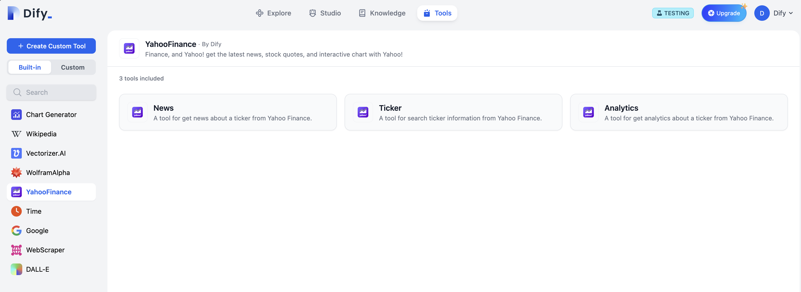
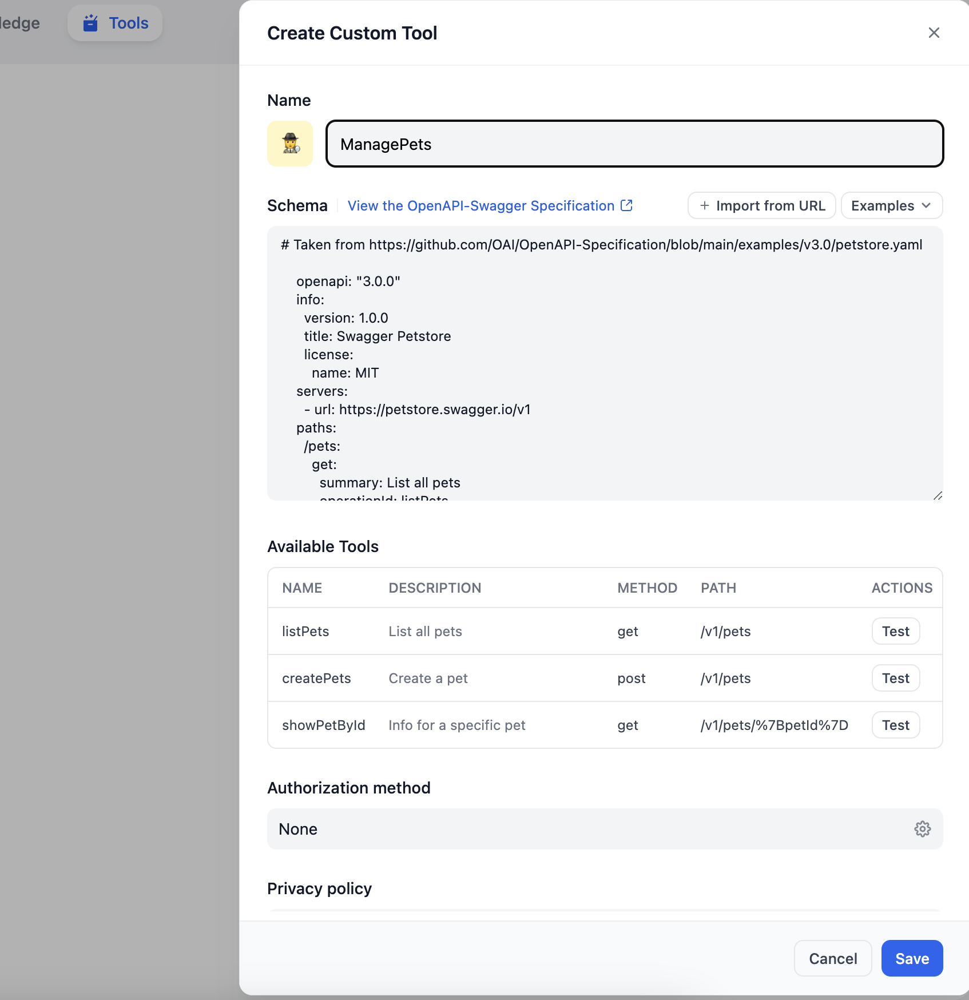

# Tools

This module provides the invocation and authentication interfaces for built-in tools used in various Agents and Workflows. It also provides Dify with a unified information and credential form rules for tool providers.

- On one hand, it decouples tools from business code, making it easier for developers to scale out models.
- On the other hand, it allows for tool and provider definitions to be made in the backend, which can then be directly displayed on the frontend page without modifying frontend logic.

## Feature Introduction

The tools provided for Agents and Workflows are currently divided into two categories:
- `Built-in Tools` are tools implemented internally by Dify, provided to Agents and Workflows through hard coding.
- `Api-Based Tools` are tools implemented by calling third-party APIs. `Api-Based Tools` do not need to be defined additionally, only the provision of interface documents such as `OpenAPI`, `Swagger`, `OpenAI plugin` is required.

### Built-in Tool Providers

### API Tool Providers

## Tool Integration

To achieve more flexible and powerful features, Tools provides a series of interfaces to help developers quickly build the tools they want. This guide for developers will introduce how to integrate tools in two parts: [Quick Integration](./docs/en_US/tool_scale_out.md) and [Advanced Integration](./docs/en_US/advanced_scale_out.md).

### [Quick Integration 👈🏻](./docs/en_US/tool_scale_out.md)
Quick integration can help you complete tool integration in 10~20 minutes. However, this method can only implement simple features. If you want to implement more complex features, you can refer to the advanced integration below.

### [Advanced Integration 👈🏻](./docs/en_US/advanced_scale_out.md)
Advanced integration will introduce how to implement more complex feature configurations, including generating graphs, combining multiple tools, and implementing the flow of parameters, images, and files between multiple tools.