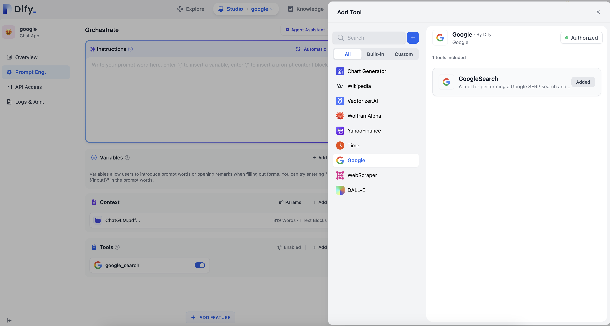

# Quick Tool Integration

Here, we will use GoogleSearch as an example to demonstrate how to quickly integrate a tool.

## 1. Prepare the Tool Provider yaml

### Introduction

This yaml declares a new tool provider, and includes information like the provider's name, icon, author, and other details that are fetched by the frontend for display.

### Example

We need to create a `google` module (folder) under `core/tools/provider/builtin`, and create `google.yaml`. The name must be consistent with the module name.

Subsequently, all operations related to this tool will be carried out under this module.

```yaml
identity: # Basic information of the tool provider
  author: Dify # Author
  name: google # Name, unique, no duplication with other providers
  label: # Label for frontend display
    en_US: Google # English label
    zh_Hans: Google # Chinese label
  description: # Description for frontend display
    en_US: Google # English description
    zh_Hans: Google # Chinese description
  icon: icon.svg # Icon, needs to be placed in the _assets folder of the current module
  tags:
    - search

```

- The `identity` field is mandatory, it contains the basic information of the tool provider, including author, name, label, description, icon, etc.
  - The icon needs to be placed in the `_assets` folder of the current module, you can refer to [here](../../provider/builtin/google/_assets/icon.svg).
  - The `tags` field is optional, it is used to classify the provider, and the frontend can filter the provider according to the tag, for all tags, they have been listed below:

    ```python
    class ToolLabelEnum(Enum):
      SEARCH = 'search'
      IMAGE = 'image'
      VIDEOS = 'videos'
      WEATHER = 'weather'
      FINANCE = 'finance'
      DESIGN = 'design'
      TRAVEL = 'travel'
      SOCIAL = 'social'
      NEWS = 'news'
      MEDICAL = 'medical'
      PRODUCTIVITY = 'productivity'
      EDUCATION = 'education'
      BUSINESS = 'business'
      ENTERTAINMENT = 'entertainment'
      UTILITIES = 'utilities'
      OTHER = 'other'
    ```

## 2. Prepare Provider Credentials

Google, as a third-party tool, uses the API provided by SerpApi, which requires an API Key to use. This means that this tool needs a credential to use. For tools like `wikipedia`, there is no need to fill in the credential field, you can refer to [here](../../provider/builtin/wikipedia/wikipedia.yaml).

After configuring the credential field, the effect is as follows:

```yaml
identity:
  author: Dify
  name: google
  label:
    en_US: Google
    zh_Hans: Google
  description:
    en_US: Google
    zh_Hans: Google
  icon: icon.svg
credentials_for_provider: # Credential field
  serpapi_api_key: # Credential field name
    type: secret-input # Credential field type
    required: true # Required or not
    label: # Credential field label
      en_US: SerpApi API key # English label
      zh_Hans: SerpApi API key # Chinese label
    placeholder: # Credential field placeholder
      en_US: Please input your SerpApi API key # English placeholder
      zh_Hans: 请输入你的 SerpApi API key # Chinese placeholder
    help: # Credential field help text
      en_US: Get your SerpApi API key from SerpApi # English help text
      zh_Hans: 从 SerpApi 获取您的 SerpApi API key # Chinese help text
    url: https://serpapi.com/manage-api-key # Credential field help link

```

- `type`: Credential field type, currently can be either `secret-input`, `text-input`, or `select` , corresponding to password input box, text input box, and drop-down box, respectively. If set to `secret-input`, it will mask the input content on the frontend, and the backend will encrypt the input content.

## 3. Prepare Tool yaml

A provider can have multiple tools, each tool needs a yaml file to describe, this file contains the basic information, parameters, output, etc. of the tool.

Still taking GoogleSearch as an example, we need to create a `tools` module under the `google` module, and create `tools/google_search.yaml`, the content is as follows.

```yaml
identity: # Basic information of the tool
  name: google_search # Tool name, unique, no duplication with other tools
  author: Dify # Author
  label: # Label for frontend display
    en_US: GoogleSearch # English label
    zh_Hans: 谷歌搜索 # Chinese label
description: # Description for frontend display
  human: # Introduction for frontend display, supports multiple languages
    en_US: A tool for performing a Google SERP search and extracting snippets and webpages.Input should be a search query.
    zh_Hans: 一个用于执行 Google SERP 搜索并提取片段和网页的工具。输入应该是一个搜索查询。
  llm: A tool for performing a Google SERP search and extracting snippets and webpages.Input should be a search query. # Introduction passed to LLM, in order to make LLM better understand this tool, we suggest to write as detailed information about this tool as possible here, so that LLM can understand and use this tool
parameters: # Parameter list
  - name: query # Parameter name
    type: string # Parameter type
    required: true # Required or not
    label: # Parameter label
      en_US: Query string # English label
      zh_Hans: 查询语句 # Chinese label
    human_description: # Introduction for frontend display, supports multiple languages
      en_US: used for searching
      zh_Hans: 用于搜索网页内容
    llm_description: key words for searching # Introduction passed to LLM, similarly, in order to make LLM better understand this parameter, we suggest to write as detailed information about this parameter as possible here, so that LLM can understand this parameter
    form: llm # Form type, llm means this parameter needs to be inferred by Agent, the frontend will not display this parameter
  - name: result_type
    type: select # Parameter type
    required: true
    options: # Drop-down box options
      - value: text
        label:
          en_US: text
          zh_Hans: 文本
      - value: link
        label:
          en_US: link
          zh_Hans: 链接
    default: link
    label:
      en_US: Result type
      zh_Hans: 结果类型
    human_description:
      en_US: used for selecting the result type, text or link
      zh_Hans: 用于选择结果类型，使用文本还是链接进行展示
    form: form # Form type, form means this parameter needs to be filled in by the user on the frontend before the conversation starts

```

- The `identity` field is mandatory, it contains the basic information of the tool, including name, author, label, description, etc.
- `parameters` Parameter list
  - `name` (Mandatory) Parameter name, must be unique and not duplicate with other parameters.
  - `type` (Mandatory) Parameter type, currently supports `string`, `number`, `boolean`, `select`, `secret-input` five types, corresponding to string, number, boolean, drop-down box, and encrypted input box, respectively. For sensitive information, we recommend using the `secret-input` type
  - `label` (Mandatory) Parameter label, for frontend display
  - `form` (Mandatory) Form type, currently supports `llm`, `form` two types.
    - In an agent app, `llm` indicates that the parameter is inferred by the LLM itself, while `form` indicates that the parameter can be pre-set for the tool.
    - In a workflow app, both `llm` and `form` need to be filled out by the front end, but the parameters of `llm` will be used as input variables for the tool node.
  - `required` Indicates whether the parameter is required or not
    - In `llm` mode, if the parameter is required, the Agent is required to infer this parameter
    - In `form` mode, if the parameter is required, the user is required to fill in this parameter on the frontend before the conversation starts
  - `options` Parameter options
    - In `llm` mode, Dify will pass all options to LLM, LLM can infer based on these options
    - In `form` mode, when `type` is `select`, the frontend will display these options
  - `default` Default value
  - `min` Minimum value, can be set when the parameter type is `number`.
  - `max` Maximum value, can be set when the parameter type is `number`.
  - `placeholder` The prompt text for input boxes. It can be set when the form type is `form`, and the parameter type is `string`, `number`, or `secret-input`. It supports multiple languages.
  - `human_description` Introduction for frontend display, supports multiple languages
  - `llm_description` Introduction passed to LLM, in order to make LLM better understand this parameter, we suggest to write as detailed information about this parameter as possible here, so that LLM can understand this parameter
  

## 4. Add Tool Logic

After completing the tool configuration, we can start writing the tool code that defines how it is invoked.

Create `google_search.py` under the `google/tools` module, the content is as follows.

```python
from core.tools.tool.builtin_tool import BuiltinTool
from core.tools.entities.tool_entities import ToolInvokeMessage

from typing import Any, Dict, List, Union

class GoogleSearchTool(BuiltinTool):
    def _invoke(self, 
                user_id: str,
               tool_parameters: Dict[str, Any], 
        ) -> Union[ToolInvokeMessage, List[ToolInvokeMessage]]:
        """
            invoke tools
        """
        query = tool_parameters['query']
        result_type = tool_parameters['result_type']
        api_key = self.runtime.credentials['serpapi_api_key']
        # Search with serpapi
        result = SerpAPI(api_key).run(query, result_type=result_type)

        if result_type == 'text':
            return self.create_text_message(text=result)
        return self.create_link_message(link=result)
```

### Parameters

The overall logic of the tool is in the `_invoke` method, this method accepts two parameters: `user_id` and `tool_parameters`, which represent the user ID and tool parameters respectively

### Return Data

When the tool returns, you can choose to return one message or multiple messages, here we return one message, using `create_text_message` and `create_link_message` can create a text message or a link message. If you want to return multiple messages, you can use `[self.create_text_message('msg1'), self.create_text_message('msg2')]` to create a list of messages.

## 5. Add Provider Code

Finally, we need to create a provider class under the provider module to implement the provider's credential verification logic. If the credential verification fails, it will throw a `ToolProviderCredentialValidationError` exception.

Create `google.py` under the `google` module, the content is as follows.

```python
from core.tools.provider.builtin_tool_provider import BuiltinToolProviderController
from core.tools.errors import ToolProviderCredentialValidationError

from core.tools.provider.builtin.google.tools.google_search import GoogleSearchTool

from typing import Any, Dict

class GoogleProvider(BuiltinToolProviderController):
    def _validate_credentials(self, credentials: Dict[str, Any]) -> None:
        try:
            # 1. Here you need to instantiate a GoogleSearchTool with GoogleSearchTool(), it will automatically load the yaml configuration of GoogleSearchTool, but at this time it does not have credential information inside
            # 2. Then you need to use the fork_tool_runtime method to pass the current credential information to GoogleSearchTool
            # 3. Finally, invoke it, the parameters need to be passed according to the parameter rules configured in the yaml of GoogleSearchTool
            GoogleSearchTool().fork_tool_runtime(
                meta={
                    "credentials": credentials,
                }
            ).invoke(
                user_id='',
                tool_parameters={
                    "query": "test",
                    "result_type": "link"
                },
            )
        except Exception as e:
            raise ToolProviderCredentialValidationError(str(e))
```

## Completion

After the above steps are completed, we can see this tool on the frontend, and it can be used in the Agent.

Of course, because google_search needs a credential, before using it, you also need to input your credentials on the frontend.


