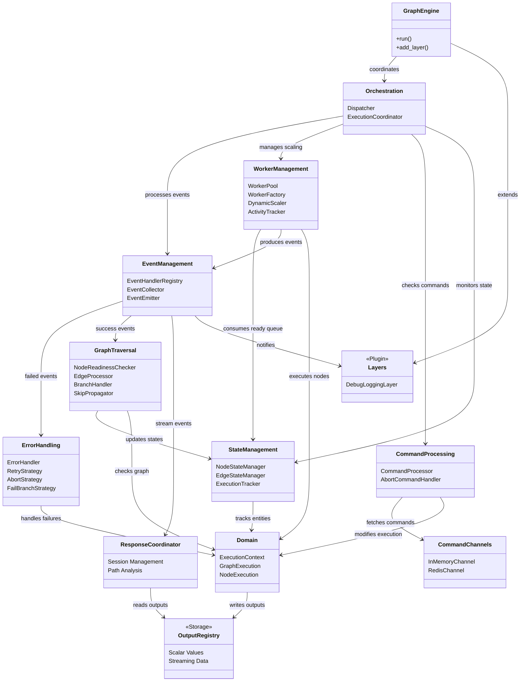

# Graph Engine

Queue-based workflow execution engine for parallel graph processing.

## Architecture

The engine uses a modular architecture with specialized packages:

### Core Components

- **Domain** (`domain/`) - Core models: ExecutionContext, GraphExecution, NodeExecution
- **Event Management** (`event_management/`) - Event handling, collection, and emission
- **State Management** (`state_management/`) - Thread-safe state tracking for nodes and edges
- **Error Handling** (`error_handling/`) - Strategy-based error recovery (retry, abort, fail-branch, default-value)
- **Graph Traversal** (`graph_traversal/`) - Node readiness, edge processing, branch handling
- **Command Processing** (`command_processing/`) - External command handling (abort, pause, resume)
- **Worker Management** (`worker_management/`) - Dynamic worker pool with auto-scaling
- **Orchestration** (`orchestration/`) - Main event loop and execution coordination

### Supporting Components

- **Output Registry** (`output_registry/`) - Thread-safe storage for node outputs
- **Response Coordinator** (`response_coordinator/`) - Ordered streaming of response nodes
- **Command Channels** (`command_channels/`) - Command transport (InMemory/Redis)
- **Layers** (`layers/`) - Pluggable middleware for extensions

## Architecture Diagram



## Package Relationships

### Core Dependencies

- **Orchestration** acts as the central coordinator, managing all subsystems
- **Domain** provides the core business entities used by all packages
- **EventManagement** serves as the communication backbone between components
- **StateManagement** maintains thread-safe state for the entire system

### Data Flow

1. **Commands** flow from CommandChannels → CommandProcessing → Domain
1. **Events** flow from Workers → EventHandlerRegistry → State updates
1. **Node outputs** flow from Workers → OutputRegistry → ResponseCoordinator
1. **Ready nodes** flow from GraphTraversal → StateManagement → WorkerManagement

### Extension Points

- **Layers** observe all events for monitoring, logging, and custom logic
- **ErrorHandling** strategies can be extended for custom failure recovery
- **CommandChannels** can be implemented for different transport mechanisms

## Execution Flow

1. **Initialization**: GraphEngine creates all subsystems with the workflow graph
1. **Node Discovery**: Traversal components identify ready nodes
1. **Worker Execution**: Workers pull from ready queue and execute nodes
1. **Event Processing**: Dispatcher routes events to appropriate handlers
1. **State Updates**: Managers track node/edge states for next steps
1. **Completion**: Coordinator detects when all nodes are done

## Usage

```python
from core.workflow.graph_engine import GraphEngine
from core.workflow.graph_engine.command_channels import InMemoryChannel

# Create and run engine
engine = GraphEngine(
    tenant_id="tenant_1",
    app_id="app_1",
    workflow_id="workflow_1",
    graph=graph,
    command_channel=InMemoryChannel(),
)

# Stream execution events
for event in engine.run():
    handle_event(event)
```
