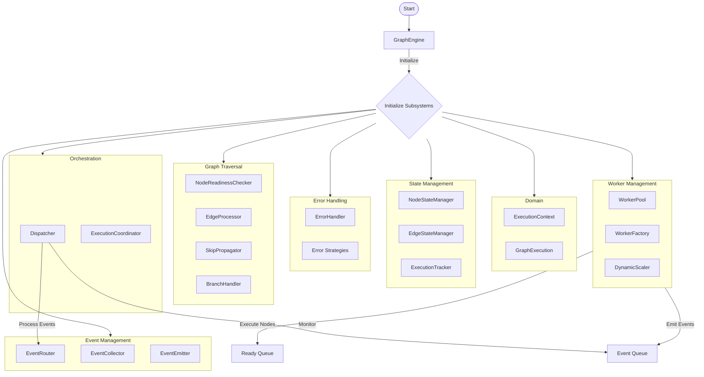

# Graph Engine

Queue-based workflow execution engine that orchestrates the parallel execution of workflow graphs using a modular, domain-driven architecture.

## Architecture Overview

The Graph Engine uses a clean, modular architecture following Domain-Driven Design principles. The engine is organized into 10 specialized packages, each with a single responsibility.

### Core Packages

#### 1. **Domain** (`domain/`)

Core domain models representing the business entities:

- `ExecutionContext`: Immutable context for workflow execution
- `GraphExecution`: Aggregate root tracking overall execution state
- `NodeExecution`: Entity tracking individual node execution state

#### 2. **Event Management** (`event_management/`)

Handles all event-related operations:

- `EventRouter`: Routes events to appropriate handlers
- `EventCollector`: Thread-safe event collection and buffering
- `EventEmitter`: Manages event emission to consumers
- `EventHandlerRegistry`: Central registry of event handlers

#### 3. **State Management** (`state_management/`)

Manages execution state throughout the workflow:

- `NodeStateManager`: Tracks and manages node states
- `EdgeStateManager`: Manages edge states and transitions
- `ExecutionTracker`: Tracks currently executing nodes

#### 4. **Error Handling** (`error_handling/`)

Strategy-based error handling system:

- `ErrorHandler`: Coordinates error handling strategies
- `AbortStrategy`: Stops execution on error
- `RetryStrategy`: Retries failed nodes with backoff
- `FailBranchStrategy`: Routes to failure branches
- `DefaultValueStrategy`: Uses default values on failure

#### 5. **Graph Traversal** (`graph_traversal/`)

Handles graph navigation and execution flow:

- `NodeReadinessChecker`: Determines when nodes are ready
- `EdgeProcessor`: Processes edges after node completion
- `SkipPropagator`: Propagates skip states through graph
- `BranchHandler`: Handles branch node logic

#### 6. **Command Processing** (`command_processing/`)

Processes external control commands:

- `CommandProcessor`: Routes commands to handlers
- `AbortCommandHandler`: Handles workflow abort commands

#### 7. **Worker Management** (`worker_management/`)

Dynamic worker pool management:

- `WorkerPool`: Manages worker thread lifecycle
- `WorkerFactory`: Creates workers with proper context
- `DynamicScaler`: Scales workers based on load
- `ActivityTracker`: Tracks worker activity

#### 8. **Orchestration** (`orchestration/`)

High-level execution coordination:

- `Dispatcher`: Main event loop processing events
- `ExecutionCoordinator`: Coordinates subsystems

### Supporting Components

#### **Output Registry** (`output_registry/`)

Thread-safe storage for node outputs supporting both scalar values and streaming data.

#### **Response Coordinator** (`response_coordinator/`)

Manages ordered streaming of response nodes based on execution paths, ensuring proper output ordering.

#### **Command Channels** (`command_channels/`)

Abstraction for sending control commands:

- `InMemoryChannel`: For testing and single-process execution
- `RedisChannel`: For distributed execution control

#### **Layers** (`layers/`)

Pluggable middleware for extending engine functionality:

- `Layer`: Base abstraction for engine extensions
- `DebugLoggingLayer`: Example layer for debugging

## Architecture Flow



## Key Design Principles

### 1. Domain-Driven Design

- Clear bounded contexts for each subsystem
- Domain models isolated from infrastructure
- Ubiquitous language throughout the codebase

### 2. Single Responsibility

- Each package has one clear purpose
- Minimal coupling between packages
- High cohesion within packages

### 3. Dependency Injection

- All dependencies explicitly injected
- Interfaces/protocols for abstraction
- Easy testing and mocking

### 4. Thread Safety

- Proper synchronization primitives
- Thread-safe state management
- Lock-free designs where possible

### 5. Event-Driven Architecture

- Loosely coupled event flow
- Clean separation of concerns
- Extensible through event handlers

## Usage Example

```python
from core.workflow.graph_engine import GraphEngine
from core.workflow.graph_engine.command_channels import InMemoryChannel

# Create engine with all subsystems
engine = GraphEngine(
    tenant_id="tenant_1",
    app_id="app_1",
    workflow_id="workflow_1",
    user_id="user_1",
    user_from=UserFrom.ACCOUNT,
    invoke_from=InvokeFrom.WEB_APP,
    call_depth=0,
    graph=graph,
    graph_config=config,
    graph_runtime_state=runtime_state,
    max_execution_steps=500,
    max_execution_time=60,
    command_channel=InMemoryChannel(),
)

# Add layers for extended functionality
engine.layer(DebugLoggingLayer())

# Run workflow
for event in engine.run():
    # Process events as they occur
    handle_event(event)
```

## External Control

The `GraphEngineManager` provides external control over running workflows:

```python
from core.workflow.graph_engine.manager import GraphEngineManager

manager = GraphEngineManager()

# Stop a running workflow
manager.stop_workflow(workflow_id="workflow_123")
```

## Testing

The modular architecture makes testing straightforward:

```python
# Test individual components in isolation
error_handler = ErrorHandler(graph)
error_handler.register_strategy(ErrorStrategy.RETRY, RetryStrategy())

# Test with mock dependencies
mock_graph = MagicMock(spec=Graph)
edge_processor = EdgeProcessor(
    graph=mock_graph,
    edge_state_manager=mock_edge_manager,
    node_state_manager=mock_node_manager,
    response_coordinator=mock_coordinator,
)
```
