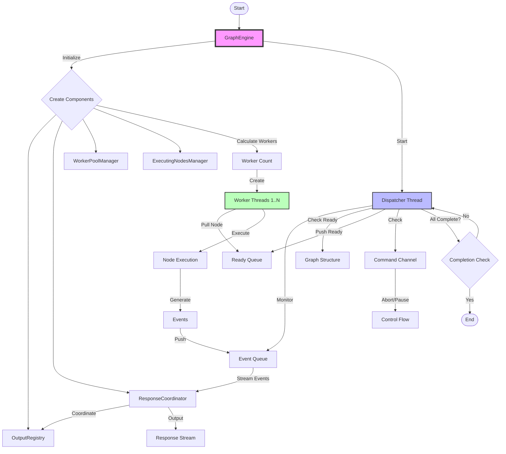
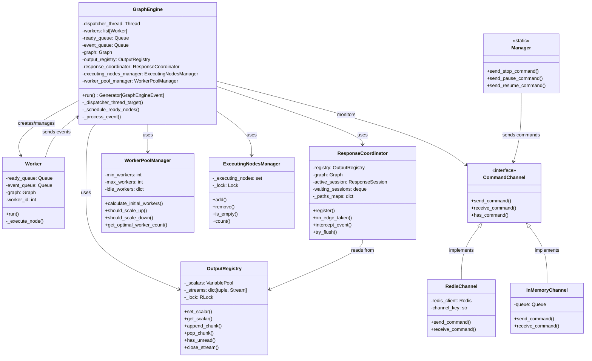
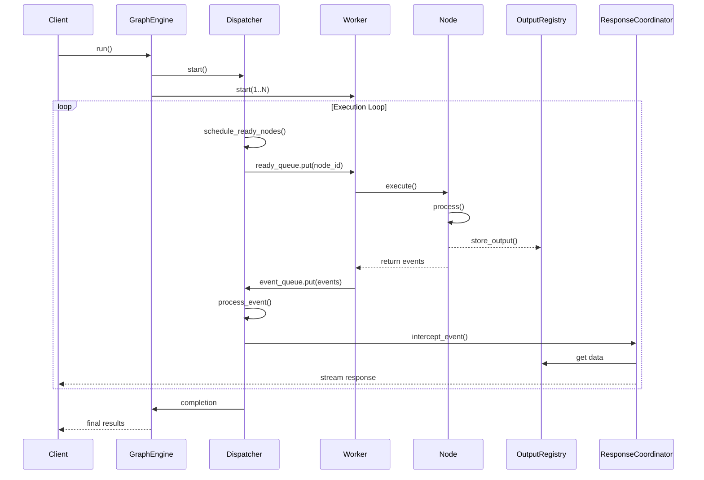

# Graph Engine

Queue-based workflow execution engine that orchestrates the parallel execution of workflow graphs using a dispatcher-worker architecture.

## Components Overview

### Core Components

- **GraphEngine** (`graph_engine.py`): Main orchestrator that coordinates workflow execution using dispatcher and worker threads
- **Manager** (`manager.py`): External interface for sending control commands to running workflows via Redis
- **Worker** (`worker.py`): Thread that pulls nodes from ready queue, executes them, and pushes events to event queue
- **WorkerPoolManager** (`worker_pool_manager.py`): Dynamically manages worker pool size based on graph complexity and runtime metrics
- **ExecutingNodesManager** (`executing_nodes_manager.py`): Thread-safe tracker for nodes currently being executed

### Data Management

- **OutputRegistry** (`output_registry/`): Thread-safe storage for node outputs supporting both scalar values and streaming data
- **ResponseCoordinator** (`response_coordinator/`): Manages ordered streaming of response nodes based on execution paths

### Communication

- **CommandChannel** (`command_channels/`): Abstraction for sending control commands (stop/pause/resume) to running workflows
- **Commands** (`entities/commands.py`): Command definitions for workflow control operations

### Extensions

- **Layers** (`layers/`): Pluggable middleware for extending engine functionality (debugging, monitoring)

## Architecture Flow

## Component Relationships (UML)

## Execution Sequence

## Key Design Principles

### 1. Queue-Based Architecture

Replaces traditional thread pool with explicit queues for better control and coordination of parallel execution.

### 2. Event-Driven Processing

All node executions generate events that drive the workflow forward, enabling reactive and responsive execution.

### 3. Separation of Concerns

Each component has a single, well-defined responsibility, making the system modular and maintainable.

### 4. Thread Safety

All shared state is protected by appropriate locking mechanisms to ensure correct concurrent execution.

### 5. Dynamic Scaling

Worker pool size adapts to workload, optimizing resource usage for both simple and complex workflows.

### 6. Streaming Support

Native support for streaming responses allows progressive output delivery for better user experience.

## Usage Pattern

1. **Initialization**: GraphEngine creates all necessary components and calculates optimal worker count
2. **Execution Start**: Dispatcher thread and worker threads begin processing
3. **Node Scheduling**: Dispatcher identifies ready nodes and queues them for execution
4. **Node Execution**: Workers pull nodes from queue and execute them in parallel
5. **Event Processing**: Execution events update graph state and trigger downstream nodes
6. **Response Streaming**: ResponseCoordinator manages ordered output delivery
7. **Completion**: Engine detects workflow completion and returns final results

## Control Commands

The engine supports external control through the Manager interface:

- **Stop**: Immediately abort workflow execution
- **Pause**: Suspend execution (preserves state)
- **Resume**: Continue paused execution

Commands are delivered via pluggable CommandChannel implementations (Redis for distributed, InMemory for local).
