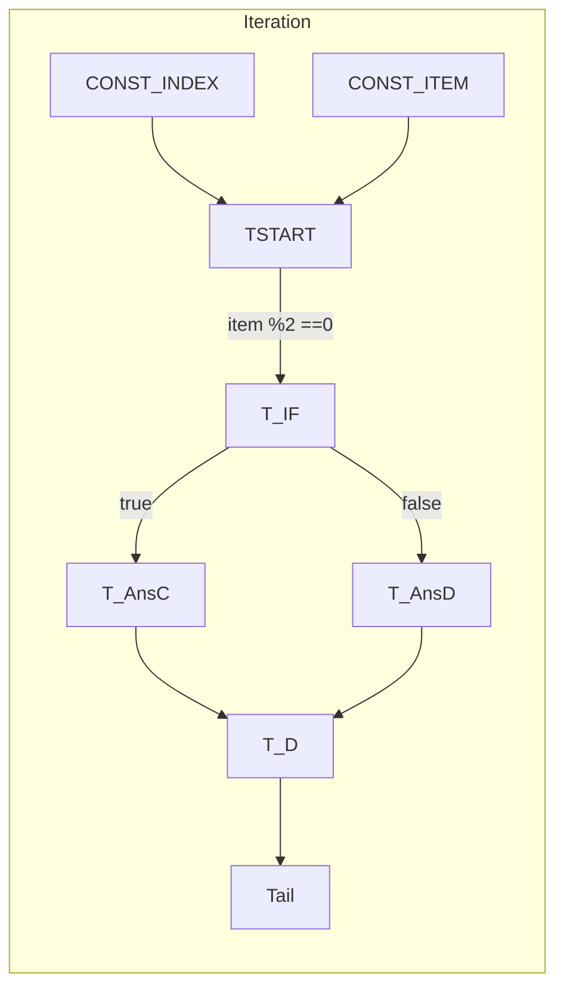
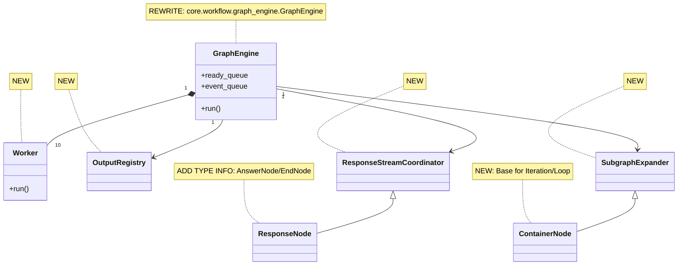

# GraphEngine Unified Specification (English Version v2.0.1)

> Effective Date: 2025-08-01  
> This document merges every design decision so far, covering the core engine, response streaming, OutputRegistry, Container Nodes (Iteration / Loop / Graph Node) and the dynamic expansion mechanism.

---

## Table of Contents

1. Overview
2. Data Model
3. Event Suite
4. Execution Flow
5. ResponseStreamCoordinator (RSC)
6. OutputRegistry (OR)
7. SubgraphExpander (SGE) & Containers
8. Concurrency & Persistence
9. Error Handling
10. Implementation Plan
11. UML Views (mermaid)
12. Change Log

---

## 1. Overview

- **GraphEngine**: a single dispatcher thread + 10 worker threads running a global event queue. (REWRITE: core.workflow.graph_engine.GraphEngine)
- **Node types**  
  - Plain Node (may be branching) (Existing: core.workflow.graph.node.Node)
  - Response Node (`Answer`, `End`) (Existing: core.workflow.nodes.answer.AnswerNode, core.workflow.nodes.end.EndNode)
  - Container Node (`Iteration`, `Loop`, `Graph Node`) (Existing: core.workflow.nodes.iteration.IterationNode, core.workflow.nodes.loop.LoopNode)
- **Subsystems**  

| Subsystem | Responsibility                                              | Implementation Status |
| --------- | ----------------------------------------------------------- | --------------------- |
| **SGE**   | Clone & inject container sub-graphs at runtime              | NEW                   |
| **RSC**   | Serialize user-visible streaming output                     | NEW                   |
| **OR**    | Thread-safe storage of all node outputs (streams / scalars) | NEW                   |

---

## 2. Data Model

### 2.1 Node / Edge / Graph

```python
# Existing: core.workflow.graph.node.Node
class Node:
    id: str
    def run(self) -> Generator[GraphEvent, None, None]: ...

# NEW: Base class for Iteration/Loop nodes
class ContainerNode(Node):
    kind: Literal["Iteration","Loop","Graph"]
    subgraph: GraphTemplate
    config: dict

# Existing: core.workflow.graph.edge.Edge
class Edge:
    id: str
    tail: str
    head: str

# Existing: core.workflow.graph.graph.Graph
class Graph:
    nodes, edges, in_edges, out_edges, root_node
```

### 2.2 GraphTemplate

```python
# NEW: Template for container subgraphs
class GraphTemplate:
    nodes: Dict[str, Node]
    edges: Dict[str, Edge]
    root_ids: List[str]
    output_selectors: List[str]
```

---

## 3. Event Suite

| Event                     | Key Fields                          | Package                             |
| ------------------------- | ----------------------------------- | ----------------------------------- |
| `NodeRunStreamChunkEvent` | `selector`, `chunk`, `is_final`     | Existing: core.workflow.events      |
| `NodeRunSucceededEvent`   | `node_id`, `outputs: dict`          | Existing: core.workflow.events.node |
| `ErrorEvent`              | `error_type`, `message`, `strategy` | Existing: core.workflow.events      |

---

## 4. Execution Flow

1. **Startup**  
   - Root node enters `ready_queue`.  
   - Existing Response nodes: `compute_deps()` → `RSC.register()`.
2. **Worker loop** pulls `ready_queue`, executes `node.run()`, pushes events.
3. **Dispatcher** consumes events  
   - Updates edge / node status  
   - Writes to OR  
   - Forwards to RSC / SGE hooks
4. **Completion**: both queues empty and all workers idle → shutdown.

---

## 5. ResponseStreamCoordinator (RSC) - NEW

- `dep_map`: `ResponseNode.id -> {deps, unresolved, cancelled}`
- `edge_to_responses`: reverse index for O(1) edge updates
- **Lifecycle**  
  1. `register()` called whenever a ResponseNode is inserted.  
  2. `on_edge_update()` decrements `unresolved`; when 0, starts session.  
  3. Exactly **one** active session at a time; supports Answer / End templates.

---

## 6. OutputRegistry (OR) - NEW

Thread-safe API:

```python
set_scalar(sel,val)        append_chunk(sel,chunk)
close_stream(sel)          pop_chunk(sel)
stream_closed(sel)->bool   has_unread(sel)->bool
get_scalar(sel)->Any
```

Serialized under `GraphRuntimeState["output_registry"]` (Existing: core.workflow.entities.GraphRuntimeState).

---

## 7. SubgraphExpander (SGE) & Containers - NEW

### 7.1 Iteration (parallel mode)



- Clone the template **N** times (`N=len(input)`); prefix `iter<i>`.
- Each round ends with `IterationSyntheticTail` (NEW).
- After all tails finish, `IterationFinalizerTail` (NEW) outputs `[item+1 for item]`.

### 7.2 Loop

- Expand `loop<k>` for k = 0,1,…  
- End when either  
  - `break` flag appears, or  
  - `eval(terminate_when)` returns true.  
- `LoopSyntheticTail` (NEW) outputs the final `state_vars`.

### 7.3 Graph Node

- Template cloned once; `GraphSyntheticTail` (NEW) forwards outputs.

---

## 8. Concurrency & Persistence

| Item           | Solution                                                      | Implementation Status                                       |
| -------------- | ------------------------------------------------------------- | ----------------------------------------------------------- |
| Worker Threads | 10 × `threading.Thread`                                       | NEW                                                         |
| Queues         | `queue.Queue`                                                 | NEW                                                         |
| Global Lock    | `state_lock = RLock()`                                        | NEW                                                         |
| Snapshot       | `GraphRuntimeState` + `container_runtime` + `output_registry` | UPDATE (GraphRuntimeState exists in core.workflow.entities) |

---

## 9. Error Handling

| Strategy         | Effect                             |
| ---------------- | ---------------------------------- |
| `ABORT`          | Serialize then raise; engine exits |
| `RETRY`          | Re-enqueue current node            |
| `SPECIAL_BRANCH` | Force-take specified edge          |
| `DEFAULT_VALUE`  | Use default value and continue     |

---

## 10. Implementation Plan

### Phase 1: MVP - Queue-Based Engine Core

**Goal**: Replace existing thread pool architecture with queue-based dispatcher + worker model for plain nodes only.

**Scope**:

- ✅ Plain nodes (existing: `core.workflow.graph.node.Node`)
- ✅ Response nodes (`AnswerNode`, `EndNode`)
- ❌ Container nodes (deferred to Phase 3)
- ❌ SubgraphExpander (deferred to Phase 3)

**Components to Implement:**

1. **Core Engine Architecture**

   ```python
   # NEW: core.workflow.graph_engine.queue_engine.QueueBasedGraphEngine
   class QueueBasedGraphEngine:
       ready_queue: Queue[str]           # Node IDs ready to execute
       event_queue: Queue[GraphEvent]    # Events from workers
       workers: List[Worker]             # 10 worker threads
       dispatcher_thread: Thread         # Single dispatcher
       state_lock: RLock                # Global state protection
   ```

2. **Worker Implementation**

   ```python
   # NEW: core.workflow.graph_engine.worker.Worker
   class Worker(Thread):
       def run(self) -> None:
           # Pull from ready_queue, execute node.run(), push events
   ```

3. **OutputRegistry (Basic)**

   ```python
   # NEW: core.workflow.graph_engine.output_registry.OutputRegistry
   class OutputRegistry:
       def set_scalar(self, selector: str, value: Any) -> None: ...
       def get_scalar(self, selector: str) -> Any: ...
       def append_chunk(self, selector: str, chunk: str) -> None: ...
       def close_stream(self, selector: str) -> None: ...
   ```

4. **ResponseStreamCoordinator (Basic)**

   ```python
   # NEW: core.workflow.graph_engine.response_coordinator.ResponseStreamCoordinator
   class ResponseStreamCoordinator:
       def register(self, response_node_id: str) -> None: ...
       def on_edge_update(self, edge_id: str) -> None: ...
       def start_session(self, node_id: str) -> None: ...
   ```

5. **Error Handling (Basic)**
   - Only `ABORT` strategy in MVP
   - Serialize state and exit on errors
   - Deferred: `RETRY`, `SPECIAL_BRANCH`, `DEFAULT_VALUE`

**Integration Points:**

- Reuse existing `Node.run()` method signature
- Reuse existing event system (`core.workflow.events`)
- Update `GraphRuntimeState` to include `output_registry` field
- Maintain backward compatibility with current API

**Acceptance Criteria:**

- [ ] All existing plain node types execute successfully
- [ ] Answer/End nodes stream responses correctly  
- [ ] Thread-safe output storage and retrieval
- [ ] Graceful error handling with state serialization
- [ ] Performance comparable to existing thread pool implementation
- [ ] All existing tests pass

**Estimated Effort**: 2-3 weeks

---

### Phase 2: Enhanced Features & Robustness

**Goal**: Add advanced error handling, optimize performance, enhance streaming capabilities.

**Components to Implement:**

1. **Advanced Error Handling**

   ```python
   # Enhanced error strategies
   RETRY: re-enqueue failed node
   SPECIAL_BRANCH: force-take specified edge  
   DEFAULT_VALUE: use fallback and continue
   ```

2. **Enhanced OutputRegistry**

   ```python
   # Add streaming methods
   def pop_chunk(self, selector: str) -> Optional[str]: ...
   def stream_closed(self, selector: str) -> bool: ...
   def has_unread(self, selector: str) -> bool: ...
   ```

3. **Performance Optimizations**
   - Queue pre-allocation and sizing
   - Worker thread pool management
   - Memory-efficient event handling
   - Metrics and monitoring hooks

4. **Enhanced ResponseStreamCoordinator**
   - Multiple concurrent sessions support
   - Priority-based response ordering
   - Advanced dependency resolution

**Acceptance Criteria:**

- [ ] All error handling strategies work correctly
- [ ] Streaming performance improved by 20%+
- [ ] Memory usage optimized for large workflows
- [ ] Advanced response coordination features functional

**Estimated Effort**: 1-2 weeks

---

### Phase 3: Container Support & Dynamic Expansion

**Goal**: Add support for container nodes (Iteration, Loop, Graph) with dynamic subgraph expansion.

**Components to Implement:**

1. **ContainerNode Base Class**

   ```python
   # NEW: core.workflow.graph_engine.container_node.ContainerNode
   class ContainerNode(Node):
       kind: Literal["Iteration", "Loop", "Graph"]
       subgraph: GraphTemplate
       config: dict
   ```

2. **GraphTemplate System**

   ```python
   # NEW: core.workflow.graph_engine.graph_template.GraphTemplate
   class GraphTemplate:
       nodes: Dict[str, Node]
       edges: Dict[str, Edge] 
       root_ids: List[str]
       output_selectors: List[str]
   ```

3. **SubgraphExpander (SGE)**

   ```python
   # NEW: core.workflow.graph_engine.subgraph_expander.SubgraphExpander
   class SubgraphExpander:
       def expand_iteration(self, node: IterationNode, input_data: List) -> Graph: ...
       def expand_loop(self, node: LoopNode, initial_state: dict) -> Graph: ...
       def expand_graph(self, node: GraphNode) -> Graph: ...
   ```

4. **Synthetic Tail Nodes**

   ```python
   # NEW synthetic nodes for container completion
   IterationSyntheticTail     # Marks single iteration completion
   IterationFinalizerTail     # Aggregates all iteration outputs  
   LoopSyntheticTail          # Outputs final loop state
   GraphSyntheticTail         # Forwards graph node outputs
   ```

5. **Container Integration**
   - Update existing `IterationNode`, `LoopNode` to extend `ContainerNode`
   - Implement dynamic graph expansion at runtime
   - Add container state management to `GraphRuntimeState`

**Acceptance Criteria:**

- [ ] Iteration nodes execute in parallel/sequential modes
- [ ] Loop nodes support break conditions and termination
- [ ] Graph nodes execute sub-workflows correctly
- [ ] Dynamic expansion works for nested containers
- [ ] All container tests pass
- [ ] Performance acceptable for complex workflows

**Estimated Effort**: 3-4 weeks

---

### Implementation Guidelines

**Development Approach:**

1. **Test-Driven Development**: Write tests first for each component
2. **Incremental Integration**: Each phase should be fully functional
3. **Backward Compatibility**: Maintain existing API contracts
4. **Performance Monitoring**: Benchmark each phase against current implementation

**Risk Mitigation:**

- Feature flags for gradual rollout
- Comprehensive test coverage (>90%)
- Performance regression testing
- Fallback to existing implementation if critical issues

**Dependencies:**

- Phase 2 depends on Phase 1 completion
- Phase 3 depends on Phase 2 completion  
- Each phase should be independently deployable

---

## 11. UML (mermaid)



---

## 12. Change Log

| Ver   | Date       | Notes                                                       |
| ----- | ---------- | ----------------------------------------------------------- |
| 1.0   | 2025-07-31 | Basic dispatch & Response nodes                             |
| 1.1   | 2025-07-31 | Added OR & RSC                                              |
| 2.0   | 2025-07-31 | Container nodes + SGE                                       |
| 2.0.1 | 2025-08-01 | Loop termination fix & Tail samples                         |
| 2.0.2 | 2025-08-01 | Added existing package references and implementation status |
| 2.1.0 | 2025-08-01 | Added 3-phase implementation plan with MVP approach         |
