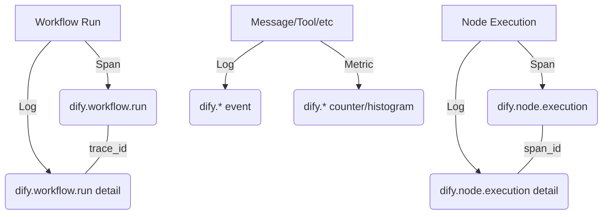

# Dify Enterprise Telemetry Data Dictionary

This document provides a comprehensive reference for all telemetry signals emitted by the Dify Enterprise OpenTelemetry (OTEL) exporter. It is intended for platform engineers and data scientists integrating Dify with observability stacks like Prometheus, Grafana, Jaeger, or Honeycomb.

## 1. Overview

Dify Enterprise uses a "slim span + rich companion log" architecture to provide high-fidelity observability without overwhelming trace storage.

- **Traces (Spans)**: Capture the structure, identity, and timing of high-level operations (Workflows and Nodes).
- **Structured Logs**: Provide deep context (inputs, outputs, metadata) for every event, correlated to spans via `trace_id` and `span_id`.
- **Metrics**: Provide 100% accurate counters and histograms for usage, performance, and error tracking.

### Signal Architecture



## 2. Configuration

The Enterprise OTEL exporter is configured via environment variables.

| Variable | Description | Default |
|----------|-------------|---------|
| `ENTERPRISE_ENABLED` | Master switch for all enterprise features. | `false` |
| `ENTERPRISE_TELEMETRY_ENABLED` | Master switch for enterprise telemetry. | `false` |
| `ENTERPRISE_OTLP_ENDPOINT` | OTLP collector endpoint (e.g., `http://otel-collector:4318`). | - |
| `ENTERPRISE_OTLP_HEADERS` | Custom headers for OTLP requests (e.g., `x-scope-orgid=tenant1`). | - |
| `ENTERPRISE_OTLP_PROTOCOL` | OTLP transport protocol (`http` or `grpc`). | `http` |
| `ENTERPRISE_OTLP_API_KEY` | Bearer token for authentication. | - |
| `ENTERPRISE_INCLUDE_CONTENT` | Whether to include sensitive content (inputs/outputs) in logs. | `true` |
| `ENTERPRISE_SERVICE_NAME` | Service name reported to OTEL. | `dify` |
| `ENTERPRISE_OTEL_SAMPLING_RATE` | Sampling rate for traces (0.0 to 1.0). Metrics are always 100%. | `1.0` |

## 3. Resource Attributes

These attributes are attached to every signal (Span, Metric, Log) emitted by the exporter.

| Attribute | Description | Example |
|-----------|-------------|---------|
| `service.name` | The name of the service. | `dify` |
| `host.name` | The hostname of the container/machine. | `dify-api-7f8b` |

## 4. Traces (Spans)

Dify emits spans for long-running or structural operations.

### 4.1 `dify.workflow.run`

Represents the full execution of a workflow.

| Attribute | Type | Description |
|-----------|------|-------------|
| `dify.trace_id` | string | The business trace ID (Workflow Run ID). |
| `dify.tenant_id` | string | Tenant identifier. |
| `dify.app_id` | string | Application identifier. |
| `dify.workflow.id` | string | Workflow definition ID. |
| `dify.workflow.run_id` | string | Unique ID for this specific run. |
| `dify.workflow.status` | string | Final status (`succeeded`, `failed`, `stopped`, etc.). |
| `dify.workflow.error` | string | Error message if the run failed. |
| `dify.workflow.elapsed_time` | float | Total execution time in seconds. |
| `dify.invoke_from` | string | Source of the trigger (`api`, `webapp`, `debug`). |
| `dify.conversation.id` | string | Conversation ID (if applicable). |
| `dify.message.id` | string | Message ID (if applicable). |
| `dify.invoked_by` | string | User ID who triggered the run. |
| `dify.parent.trace_id` | string | (Optional) Trace ID of the parent workflow. |
| `dify.parent.workflow.run_id` | string | (Optional) Run ID of the parent workflow. |
| `dify.parent.node.execution_id` | string | (Optional) Execution ID of the parent node. |
| `dify.parent.app.id` | string | (Optional) App ID of the parent workflow. |

### 4.2 `dify.node.execution`

Represents the execution of a single node within a workflow.

| Attribute | Type | Description |
|-----------|------|-------------|
| `dify.trace_id` | string | The business trace ID. |
| `dify.tenant_id` | string | Tenant identifier. |
| `dify.app_id` | string | Application identifier. |
| `dify.workflow.id` | string | Workflow definition ID. |
| `dify.workflow.run_id` | string | Workflow Run ID this node belongs to. |
| `dify.message.id` | string | Message ID (if applicable). |
| `dify.conversation.id` | string | Conversation ID (if applicable). |
| `dify.node.execution_id` | string | Unique ID for this node execution. |
| `dify.node.id` | string | Node ID in the workflow graph. |
| `dify.node.type` | string | Type of node (`llm`, `knowledge-retrieval`, `tool`, etc.). |
| `dify.node.title` | string | Display title of the node. |
| `dify.node.status` | string | Execution status (`succeeded`, `failed`). |
| `dify.node.error` | string | Error message if the node failed. |
| `dify.node.elapsed_time` | float | Execution time in seconds. |
| `dify.node.index` | int | Execution order index. |
| `dify.node.predecessor_node_id` | string | ID of the node that triggered this one. |
| `dify.node.iteration_id` | string | (Optional) ID of the iteration this node belongs to. |
| `dify.node.loop_id` | string | (Optional) ID of the loop this node belongs to. |
| `dify.node.parallel_id` | string | (Optional) ID of the parallel branch. |
| `dify.node.invoked_by` | string | User ID who triggered the execution. |

### 4.3 `dify.node.execution.draft`

Identical to `dify.node.execution`, but emitted during "Preview" or "Debug" runs of a single node.

## 5. Correlation Model

Dify uses deterministic ID generation to ensure signals are correlated across different services and asynchronous tasks.

### ID Generation Rules
- `trace_id`: Derived from the correlation ID (workflow_run_id or node_execution_id for drafts) using `int(UUID(correlation_id))`
- `span_id`: Derived from the source ID using `SHA256(source_id)[:8]`

### Scenario A: Simple Workflow
A single workflow run with multiple nodes. All spans and logs share the same `trace_id` (derived from `workflow_run_id`).

```
trace_id = UUID(workflow_run_id)
├── [root span] dify.workflow.run (span_id = hash(workflow_run_id))
│   ├── [child] dify.node.execution - "Start" (span_id = hash(node_exec_id_1))
│   ├── [child] dify.node.execution - "LLM" (span_id = hash(node_exec_id_2))
│   └── [child] dify.node.execution - "End" (span_id = hash(node_exec_id_3))
```

### Scenario B: Nested Sub-Workflow
A workflow calling another workflow via a Tool or Sub-workflow node. The child workflow's spans are linked to the parent via `parent_span_id`. Both workflows share the same trace_id.

```
trace_id = UUID(outer_workflow_run_id)     ← shared across both workflows
├── [root] dify.workflow.run (outer) (span_id = hash(outer_workflow_run_id))
│   ├── dify.node.execution - "Start Node"
│   ├── dify.node.execution - "Tool Node" (triggers sub-workflow)
│   │   └── [child] dify.workflow.run (inner) (span_id = hash(inner_workflow_run_id))
│   │       ├── dify.node.execution - "Inner Start"
│   │       └── dify.node.execution - "Inner End"
│   └── dify.node.execution - "End Node"
```

**Key attributes for nested workflows:**
- Inner workflow's `dify.parent.trace_id` = outer `workflow_run_id`
- Inner workflow's `dify.parent.node.execution_id` = tool node's `execution_id`
- Inner workflow's `dify.parent.workflow.run_id` = outer `workflow_run_id`
- Inner workflow's `dify.parent.app.id` = outer `app_id`

### Scenario C: Draft Node Execution
A single node run in isolation (debugger/preview mode). It creates its own trace where the node span is the root.

```
trace_id = UUID(node_execution_id)   ← own trace, NOT part of any workflow
└── dify.node.execution.draft (span_id = hash(node_execution_id))
```

**Key difference:** Draft executions use `node_execution_id` as the correlation_id, so they are NOT children of any workflow trace.

## 6. Counters

All counters are cumulative and emitted at 100% accuracy.

### 6.1 Token Counters

⚠️ **Warning on Double-Counting**: `dify.tokens.total` at the workflow level includes all tokens from its nodes. To get the true total usage for a tenant, you **MUST** filter by `operation_type`.

| Metric | Unit | Description |
|--------|------|-------------|
| `dify.tokens.total` | `{token}` | Total tokens consumed. |
| `dify.tokens.input` | `{token}` | Input (prompt) tokens. |
| `dify.tokens.output` | `{token}` | Output (completion) tokens. |

**Labels for Token Counters:**
- `tenant_id`: Tenant identifier.
- `app_id`: Application identifier.
- `operation_type`: `workflow`, `node_execution`, `message`, `rule_generate`, `code_generate`, `structured_output`, `instruction_modify`.
- `model_provider`: LLM provider (e.g., `openai`).
- `model_name`: LLM model (e.g., `gpt-4`).
- `node_type`: Workflow node type (if `operation_type=node_execution`).

**PromQL Example (Total Input Tokens per Tenant):**
```promql
sum(dify_tokens_input_total{tenant_id="my-tenant", operation_type="workflow"})
```

### 6.2 Request Counters

| Metric | Unit | Description |
|--------|------|-------------|
| `dify.requests.total` | `{request}` | Total number of operations. |

**Labels vary by `type`:**

| `type` | Additional Labels |
|--------|-------------------|
| `workflow` | `tenant_id`, `app_id`, `status`, `invoke_from` |
| `node` | `tenant_id`, `app_id`, `node_type`, `model_provider`, `status` |
| `draft_node` | `tenant_id`, `app_id`, `node_type`, `model_provider`, `status` |
| `message` | `tenant_id`, `app_id`, `model_provider`, `model_name`, `status`, `invoke_from` |
| `tool` | `tenant_id`, `app_id`, `tool_name` |
| `moderation` | `tenant_id`, `app_id` |
| `suggested_question` | `tenant_id`, `app_id` |
| `dataset_retrieval` | `tenant_id`, `app_id` |
| `generate_name` | `tenant_id`, `app_id` |
| `prompt_generation` | `tenant_id`, `app_id`, `operation_type`, `model_provider`, `model_name`, `status` |

### 6.3 Error Counters

| Metric | Unit | Description |
|--------|------|-------------|
| `dify.errors.total` | `{error}` | Total number of failed operations. |

**Labels vary by `type`:**

| `type` | Additional Labels |
|--------|-------------------|
| `workflow` | `tenant_id`, `app_id` |
| `node` | `tenant_id`, `app_id`, `node_type`, `model_provider` |
| `draft_node` | `tenant_id`, `app_id`, `node_type`, `model_provider` |
| `message` | `tenant_id`, `app_id`, `model_provider`, `model_name` |
| `tool` | `tenant_id`, `app_id`, `tool_name` |
| `prompt_generation` | `tenant_id`, `app_id`, `operation_type`, `model_provider`, `model_name` |

### 6.4 Other Counters

| Metric | Unit | Labels |
|--------|------|--------|
| `dify.feedback.total` | `{feedback}` | `tenant_id`, `app_id`, `rating` |
| `dify.dataset.retrievals.total` | `{retrieval}` | `tenant_id`, `app_id`, `dataset_id` |
| `dify.app.created.total` | `{app}` | `tenant_id`, `app_id`, `mode` |
| `dify.app.updated.total` | `{app}` | `tenant_id`, `app_id` |
| `dify.app.deleted.total` | `{app}` | `tenant_id`, `app_id` |

## 7. Histograms

Histograms measure the distribution of durations and latencies.

| Metric | Unit | Labels |
|--------|------|--------|
| `dify.workflow.duration` | `s` | `tenant_id`, `app_id`, `status` |
| `dify.node.duration` | `s` | `tenant_id`, `app_id`, `node_type`, `model_provider`, `plugin_name` (if tool/knowledge) |
| `dify.message.duration` | `s` | `tenant_id`, `app_id`, `model_provider`, `model_name` |
| `dify.message.time_to_first_token` | `s` | `tenant_id`, `app_id`, `model_provider`, `model_name` |
| `dify.tool.duration` | `s` | `tenant_id`, `app_id`, `tool_name` |
| `dify.prompt_generation.duration` | `s` | `tenant_id`, `app_id`, `operation_type`, `model_provider`, `model_name` |

**PromQL Example (P95 Node Duration by Type):**
```promql
histogram_quantile(0.95, sum by (le, node_type) (rate(dify_node_duration_bucket[5m])))
```

## 8. Structured Logs

Dify emits 13 types of structured logs. Logs are categorized as "Span Companion" (accompanying a span) or "Standalone" (metric-only events).

### 8.1 Span Companion Logs

These logs contain the full payload for spans, providing rich detail beyond what is captured in the span attributes.

#### 8.1.1 `dify.workflow.run` Companion Log

**Signal Type:** `span_detail`

This log accompanies the `dify.workflow.run` span and includes ALL span attributes PLUS additional detail attributes.

**Additional Attributes (beyond span attributes):**

| Additional Attribute | Type | Always Present | Description |
|---------------------|------|----------------|-------------|
| `dify.user.id` | string | No | User identifier (when available) |
| `gen_ai.usage.total_tokens` | int | No | Total tokens consumed by this workflow (sum of all nodes) |
| `dify.workflow.version` | string | Yes | Workflow version identifier |
| `dify.workflow.inputs` | string/JSON | Yes | Workflow input parameters (content-gated) |
| `dify.workflow.outputs` | string/JSON | Yes | Workflow output results (content-gated) |
| `dify.workflow.query` | string | No | User query text (content-gated, for chat workflows) |

**Common Log Attributes:**
- `dify.event.name`: `"dify.workflow.run"`
- `dify.event.signal`: `"span_detail"`
- `trace_id`: Correlated OTEL trace ID (32-char hex)
- `span_id`: Correlated OTEL span ID (16-char hex)
- `tenant_id`: Tenant identifier
- `user_id`: User identifier (when available)

#### 8.1.2 `dify.node.execution` and `dify.node.execution.draft` Companion Logs

**Signal Type:** `span_detail`

These logs accompany node execution spans and include ALL span attributes PLUS additional detail attributes.

**Additional Attributes (beyond span attributes):**

| Additional Attribute | Type | Always Present | Description |
|---------------------|------|----------------|-------------|
| `dify.user.id` | string | No | User identifier (when available) |
| `gen_ai.provider.name` | string | No | LLM provider name (for LLM nodes only) |
| `gen_ai.request.model` | string | No | LLM model name (for LLM nodes only) |
| `gen_ai.usage.input_tokens` | int | No | Input tokens for this node (for LLM nodes only) |
| `gen_ai.usage.output_tokens` | int | No | Output tokens for this node (for LLM nodes only) |
| `gen_ai.usage.total_tokens` | int | No | Total tokens for this node (for LLM nodes only) |
| `dify.node.total_price` | float | No | Cost in currency units (for LLM nodes only) |
| `dify.node.currency` | string | No | Currency code (for LLM nodes only) |
| `dify.node.plugin_name` | string | No | Plugin name (for tool/knowledge-retrieval nodes only) |
| `dify.node.plugin_id` | string | No | Plugin identifier (for tool/knowledge-retrieval nodes only) |
| `dify.dataset.id` | string | No | Dataset identifier (for knowledge-retrieval nodes only) |
| `dify.dataset.name` | string | No | Dataset name (for knowledge-retrieval nodes only) |
| `dify.node.inputs` | string/JSON | Yes | Node input data (content-gated) |
| `dify.node.outputs` | string/JSON | Yes | Node output data (content-gated) |
| `dify.node.process_data` | string/JSON | No | Internal processing data (content-gated) |

**Common Log Attributes:**
- `dify.event.name`: `"dify.node.execution"` or `"dify.node.execution.draft"`
- `dify.event.signal`: `"span_detail"`
- `trace_id`: Correlated OTEL trace ID (32-char hex)
- `span_id`: Correlated OTEL span ID (16-char hex)
- `tenant_id`: Tenant identifier
- `user_id`: User identifier (when available)

### 8.2 Standalone Logs

These logs represent events that do not have a structural span. They are emitted as `metric_only` signals.

#### 8.2.1 `dify.message.run`

**Signal Type:** `metric_only`

Emitted for each message execution (LLM interaction).

**Attributes:**
- `dify.event.name`: `"dify.message.run"`
- `dify.event.signal`: `"metric_only"`
- `trace_id`: OTEL trace ID (32-char hex)
- `span_id`: OTEL span ID (16-char hex)
- `tenant_id`: Tenant identifier
- `user_id`: User identifier (when available)
- `dify.app_id`: Application identifier
- `dify.message.id`: Message identifier
- `dify.conversation.id`: Conversation identifier (when available)
- `dify.workflow.run_id`: Workflow run identifier (when part of workflow)
- `dify.invoke_from`: Source of invocation (`"service-api"`, `"web-app"`, `"debugger"`, `"explore"`)
- `gen_ai.provider.name`: LLM provider name
- `gen_ai.request.model`: LLM model name
- `gen_ai.usage.input_tokens`: Input tokens consumed
- `gen_ai.usage.output_tokens`: Output tokens generated
- `gen_ai.usage.total_tokens`: Total tokens consumed
- `dify.message.status`: Execution status (`"succeeded"`, `"failed"`)
- `dify.message.error`: Error message (when status is `"failed"`)
- `dify.message.duration`: Execution duration in seconds
- `dify.message.time_to_first_token`: Time to first token in seconds
- `dify.message.inputs`: Message inputs (content-gated)
- `dify.message.outputs`: Message outputs (content-gated)

**Example:**
```json
{
  "trace_id": "a1b2c3d4e5f6g7h8i9j0k1l2m3n4o5p6",
  "span_id": "a1b2c3d4e5f6g7h8",
  "attributes": {
    "dify.event.name": "dify.message.run",
    "dify.event.signal": "metric_only",
    "tenant_id": "550e8400-e29b-41d4-a716-446655440000",
    "user_id": "660e8400-e29b-41d4-a716-446655440001",
    "dify.app_id": "770e8400-e29b-41d4-a716-446655440002",
    "dify.message.id": "880e8400-e29b-41d4-a716-446655440003",
    "dify.conversation.id": "990e8400-e29b-41d4-a716-446655440004",
    "dify.invoke_from": "web-app",
    "gen_ai.provider.name": "openai",
    "gen_ai.request.model": "gpt-4",
    "gen_ai.usage.input_tokens": 120,
    "gen_ai.usage.output_tokens": 85,
    "gen_ai.usage.total_tokens": 205,
    "dify.message.status": "succeeded",
    "dify.message.duration": 2.45,
    "dify.message.time_to_first_token": 0.32,
    "dify.message.inputs": "{\"query\": \"What is the weather?\"}",
    "dify.message.outputs": "{\"answer\": \"The weather is sunny.\"}"
  }
}
```

#### 8.2.2 `dify.tool.execution`

**Signal Type:** `metric_only`

Emitted for each tool invocation.

**Attributes:**
- `dify.event.name`: `"dify.tool.execution"`
- `dify.event.signal`: `"metric_only"`
- `trace_id`: OTEL trace ID
- `span_id`: OTEL span ID
- `tenant_id`: Tenant identifier
- `dify.app_id`: Application identifier
- `dify.message.id`: Message identifier
- `dify.tool.name`: Tool name
- `dify.tool.duration`: Execution duration in seconds
- `dify.tool.status`: Execution status (`"succeeded"`, `"failed"`)
- `dify.tool.error`: Error message (when failed)
- `dify.tool.inputs`: Tool inputs (content-gated)
- `dify.tool.outputs`: Tool outputs (content-gated)
- `dify.tool.parameters`: Tool parameters (content-gated)
- `dify.tool.config`: Tool configuration (content-gated)

**Example:**
```json
{
  "trace_id": "b2c3d4e5f6g7h8i9j0k1l2m3n4o5p6q7",
  "span_id": "b2c3d4e5f6g7h8i9",
  "attributes": {
    "dify.event.name": "dify.tool.execution",
    "dify.event.signal": "metric_only",
    "tenant_id": "550e8400-e29b-41d4-a716-446655440000",
    "dify.app_id": "770e8400-e29b-41d4-a716-446655440002",
    "dify.message.id": "880e8400-e29b-41d4-a716-446655440003",
    "dify.tool.name": "weather_api",
    "dify.tool.duration": 0.85,
    "dify.tool.status": "succeeded",
    "dify.tool.inputs": "{\"location\": \"San Francisco\"}",
    "dify.tool.outputs": "{\"temperature\": 72, \"condition\": \"sunny\"}",
    "dify.tool.parameters": "{\"api_key\": \"***\"}",
    "dify.tool.config": "{\"timeout\": 30}"
  }
}
```

#### 8.2.3 `dify.moderation.check`

**Signal Type:** `metric_only`

Emitted for content moderation checks.

**Attributes:**
- `dify.event.name`: `"dify.moderation.check"`
- `dify.event.signal`: `"metric_only"`
- `trace_id`: OTEL trace ID
- `span_id`: OTEL span ID
- `tenant_id`: Tenant identifier
- `dify.app_id`: Application identifier
- `dify.message.id`: Message identifier
- `dify.moderation.type`: Moderation type (`"input"`, `"output"`)
- `dify.moderation.action`: Action taken (`"pass"`, `"block"`, `"flag"`)
- `dify.moderation.flagged`: Whether content was flagged (boolean)
- `dify.moderation.categories`: Flagged categories (JSON array)
- `dify.moderation.query`: Content being moderated (content-gated)

**Example:**
```json
{
  "trace_id": "c3d4e5f6g7h8i9j0k1l2m3n4o5p6q7r8",
  "span_id": "c3d4e5f6g7h8i9j0",
  "attributes": {
    "dify.event.name": "dify.moderation.check",
    "dify.event.signal": "metric_only",
    "tenant_id": "550e8400-e29b-41d4-a716-446655440000",
    "dify.app_id": "770e8400-e29b-41d4-a716-446655440002",
    "dify.message.id": "880e8400-e29b-41d4-a716-446655440003",
    "dify.moderation.type": "input",
    "dify.moderation.action": "pass",
    "dify.moderation.flagged": false,
    "dify.moderation.categories": "[]",
    "dify.moderation.query": "What is the weather?"
  }
}
```

#### 8.2.4 `dify.suggested_question.generation`

**Signal Type:** `metric_only`

Emitted when suggested questions are generated.

**Attributes:**
- `dify.event.name`: `"dify.suggested_question.generation"`
- `dify.event.signal`: `"metric_only"`
- `trace_id`: OTEL trace ID
- `span_id`: OTEL span ID
- `tenant_id`: Tenant identifier
- `dify.app_id`: Application identifier
- `dify.message.id`: Message identifier
- `dify.suggested_question.count`: Number of questions generated
- `dify.suggested_question.duration`: Generation duration in seconds
- `dify.suggested_question.status`: Generation status (`"succeeded"`, `"failed"`)
- `dify.suggested_question.error`: Error message (when failed)
- `dify.suggested_question.questions`: Generated questions (content-gated, JSON array)

**Example:**
```json
{
  "trace_id": "d4e5f6g7h8i9j0k1l2m3n4o5p6q7r8s9",
  "span_id": "d4e5f6g7h8i9j0k1",
  "attributes": {
    "dify.event.name": "dify.suggested_question.generation",
    "dify.event.signal": "metric_only",
    "tenant_id": "550e8400-e29b-41d4-a716-446655440000",
    "dify.app_id": "770e8400-e29b-41d4-a716-446655440002",
    "dify.message.id": "880e8400-e29b-41d4-a716-446655440003",
    "dify.suggested_question.count": 3,
    "dify.suggested_question.duration": 1.2,
    "dify.suggested_question.status": "succeeded",
    "dify.suggested_question.questions": "[\"What about tomorrow?\", \"How about next week?\", \"Is it raining?\"]"
  }
}
```

#### 8.2.5 `dify.dataset.retrieval`

**Signal Type:** `metric_only`

Emitted for knowledge base retrieval operations.

**Attributes:**
- `dify.event.name`: `"dify.dataset.retrieval"`
- `dify.event.signal`: `"metric_only"`
- `trace_id`: OTEL trace ID
- `span_id`: OTEL span ID
- `tenant_id`: Tenant identifier
- `dify.app_id`: Application identifier
- `dify.message.id`: Message identifier
- `dify.dataset.id`: Dataset identifier
- `dify.dataset.name`: Dataset name
- `dify.retrieval.query`: Search query (content-gated)
- `dify.retrieval.document_count`: Number of documents retrieved
- `dify.retrieval.duration`: Retrieval duration in seconds
- `dify.retrieval.status`: Retrieval status (`"succeeded"`, `"failed"`)
- `dify.retrieval.error`: Error message (when failed)
- `dify.dataset.documents`: Retrieved documents (content-gated, JSON array)

**Example:**
```json
{
  "trace_id": "e5f6g7h8i9j0k1l2m3n4o5p6q7r8s9t0",
  "span_id": "e5f6g7h8i9j0k1l2",
  "attributes": {
    "dify.event.name": "dify.dataset.retrieval",
    "dify.event.signal": "metric_only",
    "tenant_id": "550e8400-e29b-41d4-a716-446655440000",
    "dify.app_id": "770e8400-e29b-41d4-a716-446655440002",
    "dify.message.id": "880e8400-e29b-41d4-a716-446655440003",
    "dify.dataset.id": "aa0e8400-e29b-41d4-a716-446655440005",
    "dify.dataset.name": "Product Documentation",
    "dify.retrieval.query": "installation guide",
    "dify.retrieval.document_count": 5,
    "dify.retrieval.duration": 0.45,
    "dify.retrieval.status": "succeeded",
    "dify.dataset.documents": "[{\"id\": \"doc1\", \"score\": 0.95}, {\"id\": \"doc2\", \"score\": 0.87}]"
  }
}
```

#### 8.2.6 `dify.generate_name.execution`

**Signal Type:** `metric_only`

Emitted when conversation names are auto-generated.

**Attributes:**
- `dify.event.name`: `"dify.generate_name.execution"`
- `dify.event.signal`: `"metric_only"`
- `trace_id`: OTEL trace ID
- `span_id`: OTEL span ID
- `tenant_id`: Tenant identifier
- `dify.app_id`: Application identifier
- `dify.conversation.id`: Conversation identifier
- `dify.generate_name.duration`: Generation duration in seconds
- `dify.generate_name.status`: Generation status (`"succeeded"`, `"failed"`)
- `dify.generate_name.error`: Error message (when failed)
- `dify.generate_name.inputs`: Generation inputs (content-gated)
- `dify.generate_name.outputs`: Generated name (content-gated)

**Example:**
```json
{
  "trace_id": "f6g7h8i9j0k1l2m3n4o5p6q7r8s9t0u1",
  "span_id": "f6g7h8i9j0k1l2m3",
  "attributes": {
    "dify.event.name": "dify.generate_name.execution",
    "dify.event.signal": "metric_only",
    "tenant_id": "550e8400-e29b-41d4-a716-446655440000",
    "dify.app_id": "770e8400-e29b-41d4-a716-446655440002",
    "dify.conversation.id": "990e8400-e29b-41d4-a716-446655440004",
    "dify.generate_name.duration": 0.75,
    "dify.generate_name.status": "succeeded",
    "dify.generate_name.inputs": "{\"first_message\": \"What is the weather?\"}",
    "dify.generate_name.outputs": "Weather Inquiry"
  }
}
```

#### 8.2.7 `dify.prompt_generation.execution`

**Signal Type:** `metric_only`

Emitted for prompt engineering operations.

**Attributes:**
- `dify.event.name`: `"dify.prompt_generation.execution"`
- `dify.event.signal`: `"metric_only"`
- `trace_id`: OTEL trace ID
- `span_id`: OTEL span ID
- `tenant_id`: Tenant identifier
- `dify.app_id`: Application identifier
- `dify.prompt_generation.operation_type`: Operation type (`"rule_generate"`, `"code_generate"`, `"structured_output"`, `"instruction_modify"`)
- `gen_ai.provider.name`: LLM provider name
- `gen_ai.request.model`: LLM model name
- `gen_ai.usage.input_tokens`: Input tokens consumed
- `gen_ai.usage.output_tokens`: Output tokens generated
- `gen_ai.usage.total_tokens`: Total tokens consumed
- `dify.prompt_generation.duration`: Generation duration in seconds
- `dify.prompt_generation.status`: Generation status (`"succeeded"`, `"failed"`)
- `dify.prompt_generation.error`: Error message (when failed)
- `dify.prompt_generation.instruction`: Prompt instruction (content-gated)
- `dify.prompt_generation.output`: Generated output (content-gated)

**Example:**
```json
{
  "trace_id": "g7h8i9j0k1l2m3n4o5p6q7r8s9t0u1v2",
  "span_id": "g7h8i9j0k1l2m3n4",
  "attributes": {
    "dify.event.name": "dify.prompt_generation.execution",
    "dify.event.signal": "metric_only",
    "tenant_id": "550e8400-e29b-41d4-a716-446655440000",
    "dify.app_id": "770e8400-e29b-41d4-a716-446655440002",
    "dify.prompt_generation.operation_type": "rule_generate",
    "gen_ai.provider.name": "openai",
    "gen_ai.request.model": "gpt-4",
    "gen_ai.usage.input_tokens": 50,
    "gen_ai.usage.output_tokens": 30,
    "gen_ai.usage.total_tokens": 80,
    "dify.prompt_generation.duration": 1.1,
    "dify.prompt_generation.status": "succeeded",
    "dify.prompt_generation.instruction": "Generate validation rules",
    "dify.prompt_generation.output": "{\"rules\": [\"check_length\", \"validate_format\"]}"
  }
}
```

#### 8.2.8 `dify.app.created`

**Signal Type:** `metric_only`

Emitted when an application is created.

**Attributes:**
- `dify.event.name`: `"dify.app.created"`
- `dify.event.signal`: `"metric_only"`
- `tenant_id`: Tenant identifier
- `dify.app_id`: Application identifier
- `dify.app.mode`: Application mode (`"chat"`, `"completion"`, `"agent-chat"`, `"workflow"`)
- `dify.app.created_at`: Creation timestamp (ISO 8601)

**Example:**
```json
{
  "attributes": {
    "dify.event.name": "dify.app.created",
    "dify.event.signal": "metric_only",
    "tenant_id": "550e8400-e29b-41d4-a716-446655440000",
    "dify.app_id": "770e8400-e29b-41d4-a716-446655440002",
    "dify.app.mode": "workflow",
    "dify.app.created_at": "2026-02-10T19:30:00Z"
  }
}
```

#### 8.2.9 `dify.app.updated`

**Signal Type:** `metric_only`

Emitted when an application is updated.

**Attributes:**
- `dify.event.name`: `"dify.app.updated"`
- `dify.event.signal`: `"metric_only"`
- `tenant_id`: Tenant identifier
- `dify.app_id`: Application identifier
- `dify.app.updated_at`: Update timestamp (ISO 8601)

**Example:**
```json
{
  "attributes": {
    "dify.event.name": "dify.app.updated",
    "dify.event.signal": "metric_only",
    "tenant_id": "550e8400-e29b-41d4-a716-446655440000",
    "dify.app_id": "770e8400-e29b-41d4-a716-446655440002",
    "dify.app.updated_at": "2026-02-10T20:15:00Z"
  }
}
```

#### 8.2.10 `dify.app.deleted`

**Signal Type:** `metric_only`

Emitted when an application is deleted.

**Attributes:**
- `dify.event.name`: `"dify.app.deleted"`
- `dify.event.signal`: `"metric_only"`
- `tenant_id`: Tenant identifier
- `dify.app_id`: Application identifier
- `dify.app.deleted_at`: Deletion timestamp (ISO 8601)

**Example:**
```json
{
  "attributes": {
    "dify.event.name": "dify.app.deleted",
    "dify.event.signal": "metric_only",
    "tenant_id": "550e8400-e29b-41d4-a716-446655440000",
    "dify.app_id": "770e8400-e29b-41d4-a716-446655440002",
    "dify.app.deleted_at": "2026-02-10T21:00:00Z"
  }
}
```

#### 8.2.11 `dify.feedback.created`

**Signal Type:** `metric_only`

Emitted when user feedback is submitted.

**Attributes:**
- `dify.event.name`: `"dify.feedback.created"`
- `dify.event.signal`: `"metric_only"`
- `trace_id`: OTEL trace ID
- `span_id`: OTEL span ID
- `tenant_id`: Tenant identifier
- `dify.app_id`: Application identifier
- `dify.message.id`: Message identifier
- `dify.feedback.rating`: Rating (`"like"`, `"dislike"`, `null`)
- `dify.feedback.content`: Feedback text (content-gated, omitted when gating enabled)
- `dify.feedback.created_at`: Feedback timestamp (ISO 8601)

**Example:**
```json
{
  "trace_id": "h8i9j0k1l2m3n4o5p6q7r8s9t0u1v2w3",
  "span_id": "h8i9j0k1l2m3n4o5",
  "attributes": {
    "dify.event.name": "dify.feedback.created",
    "dify.event.signal": "metric_only",
    "tenant_id": "550e8400-e29b-41d4-a716-446655440000",
    "dify.app_id": "770e8400-e29b-41d4-a716-446655440002",
    "dify.message.id": "880e8400-e29b-41d4-a716-446655440003",
    "dify.feedback.rating": "like",
    "dify.feedback.content": "Very helpful response!",
    "dify.feedback.created_at": "2026-02-10T19:45:00Z"
  }
}
```

#### 8.2.12 `dify.telemetry.rehydration_failed`

**Signal Type:** `metric_only` (Diagnostic)

Emitted when telemetry payload rehydration fails. This is a diagnostic event for monitoring telemetry system health.

**Attributes:**
- `dify.event.name`: `"dify.telemetry.rehydration_failed"`
- `dify.event.signal`: `"metric_only"`
- `tenant_id`: Tenant identifier
- `dify.telemetry.error`: Error message
- `dify.telemetry.payload_type`: Type of payload that failed (`"workflow"`, `"node"`, `"message"`, etc.)
- `dify.telemetry.correlation_id`: Correlation ID of the failed payload

**Example:**
```json
{
  "attributes": {
    "dify.event.name": "dify.telemetry.rehydration_failed",
    "dify.event.signal": "metric_only",
    "tenant_id": "550e8400-e29b-41d4-a716-446655440000",
    "dify.telemetry.error": "Workflow run not found in database",
    "dify.telemetry.payload_type": "workflow",
    "dify.telemetry.correlation_id": "bb0e8400-e29b-41d4-a716-446655440006"
  }
}
```

## 9. Content Attributes

When `ENTERPRISE_INCLUDE_CONTENT` is set to `false`, the following attributes are replaced with a reference string (e.g., `ref:workflow_run_id=...`) to prevent sensitive data leakage to the OTEL collector.

| Attribute | Signal |
|-----------|--------|
| `dify.workflow.inputs` | `dify.workflow.run` |
| `dify.workflow.outputs` | `dify.workflow.run` |
| `dify.workflow.query` | `dify.workflow.run` |
| `dify.node.inputs` | `dify.node.execution` |
| `dify.node.outputs` | `dify.node.execution` |
| `dify.node.process_data` | `dify.node.execution` |
| `dify.message.inputs` | `dify.message.run` |
| `dify.message.outputs` | `dify.message.run` |
| `dify.tool.inputs` | `dify.tool.execution` |
| `dify.tool.outputs` | `dify.tool.execution` |
| `dify.tool.parameters` | `dify.tool.execution` |
| `dify.tool.config` | `dify.tool.execution` |
| `dify.moderation.query` | `dify.moderation.check` |
| `dify.suggested_question.questions` | `dify.suggested_question.generation` |
| `dify.retrieval.query` | `dify.dataset.retrieval` |
| `dify.dataset.documents` | `dify.dataset.retrieval` |
| `dify.generate_name.inputs` | `dify.generate_name.execution` |
| `dify.generate_name.outputs` | `dify.generate_name.execution` |
| `dify.prompt_generation.instruction` | `dify.prompt_generation.execution` |
| `dify.prompt_generation.output` | `dify.prompt_generation.execution` |
| `dify.feedback.content` | `dify.feedback.created` |

### Content Gating Behavior

When `ENTERPRISE_INCLUDE_CONTENT=true` (default), content attributes contain the actual data:

```json
{
  "dify.workflow.inputs": "{\"query\": \"What is the weather?\", \"location\": \"San Francisco\"}",
  "dify.workflow.outputs": "{\"answer\": \"The weather in San Francisco is sunny, 72°F.\"}",
  "dify.workflow.query": "What is the weather?"
}
```

When `ENTERPRISE_INCLUDE_CONTENT=false`, content attributes are replaced with reference strings:

```json
{
  "dify.workflow.inputs": "ref:workflow_run_id=550e8400-e29b-41d4-a716-446655440000",
  "dify.workflow.outputs": "ref:workflow_run_id=550e8400-e29b-41d4-a716-446655440000",
  "dify.workflow.query": "ref:workflow_run_id=550e8400-e29b-41d4-a716-446655440000"
}
```

### Reference String Format

Reference strings follow the pattern `ref:{id_type}={uuid}`, where:

- `{id_type}` identifies the entity type
- `{uuid}` is the entity's unique identifier

**Examples:**

```
ref:workflow_run_id=550e8400-e29b-41d4-a716-446655440000
ref:node_execution_id=660e8400-e29b-41d4-a716-446655440001
ref:message_id=770e8400-e29b-41d4-a716-446655440002
ref:conversation_id=880e8400-e29b-41d4-a716-446655440003
ref:trace_id=990e8400-e29b-41d4-a716-446655440004
```

**Usage:** To retrieve the actual content, query your Dify database using the provided UUID. For example, `ref:workflow_run_id=550e8400-e29b-41d4-a716-446655440000` means you can fetch the workflow run record from the `workflow_runs` table using that ID.

**Special Case:** The `dify.feedback.content` attribute is **omitted entirely** (not replaced with a reference string) when content gating is enabled, as feedback text is not stored with a retrievable ID.

## 10. Appendix

### Operation Types (`operation_type`)
- `workflow`
- `node_execution`
- `message`
- `rule_generate`
- `code_generate`
- `structured_output`
- `instruction_modify`

### Node Types (`node_type`)
- `start`, `end`, `answer`, `llm`, `knowledge-retrieval`, `knowledge-index`, `if-else`, `code`, `template-transform`, `question-classifier`, `http-request`, `tool`, `datasource`, `variable-aggregator`, `loop`, `iteration`, `parameter-extractor`, `assigner`, `document-extractor`, `list-operator`, `agent`, `trigger-webhook`, `trigger-schedule`, `trigger-plugin`, `human-input`.

### Workflow Statuses
- `running`, `succeeded`, `failed`, `stopped`, `partial-succeeded`, `paused`.

### Null Value Behavior

The handling of null/missing values differs between spans (traces) and structured logs:

**In Spans (Traces):**
Attributes with `None`/`null` values are **omitted** from the exported span data. This follows OpenTelemetry conventions for efficient trace storage.

Example - a workflow span without optional parent attributes:
```python
# These attributes are NOT included in the span:
# - dify.parent.trace_id (null)
# - dify.parent.workflow.run_id (null)
# - dify.parent.node.execution_id (null)
# - dify.parent.app.id (null)
```

**In Structured Logs:**
Attributes with `null` values appear as `null` in the JSON payload.

Example:
```json
{
  "attributes": {
    "dify.workflow.error": null,
    "dify.conversation.id": null
  }
}
```

**Conditional Attributes:**
Many attributes are only present under specific conditions:

- **LLM-related attributes** (`gen_ai.provider.name`, `gen_ai.usage.total_tokens`, etc.) only appear for LLM nodes
- **Plugin attributes** (`dify.node.plugin_name`, `dify.node.plugin_id`) only appear for tool/knowledge-retrieval nodes
- **Dataset attributes** (`dify.dataset.id`, `dify.dataset.name`) only appear for knowledge-retrieval nodes
- **Error attributes** (`dify.workflow.error`, `dify.node.error`) only appear when status is `"failed"`
- **Parent attributes** (`dify.parent.*`) only appear for nested/sub-workflow executions

**Content-Gated Attributes:**
When `ENTERPRISE_INCLUDE_CONTENT=false`, content attributes are replaced with reference strings (not set to `null`). See Section 9 for details.
