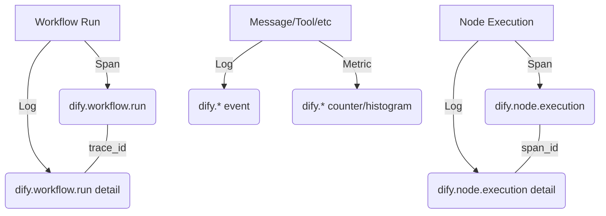

# Dify Enterprise Telemetry

This document provides an overview of the Dify Enterprise OpenTelemetry (OTEL) exporter and how to configure it for integration with observability stacks like Prometheus, Grafana, Jaeger, or Honeycomb.

## Overview

Dify Enterprise uses a "slim span + rich companion log" architecture to provide high-fidelity observability without overwhelming trace storage.

- **Traces (Spans)**: Capture the structure, identity, and timing of high-level operations (Workflows and Nodes).
- **Structured Logs**: Provide deep context (inputs, outputs, metadata) for every event, correlated to spans via `trace_id` and `span_id`.
- **Metrics**: Provide 100% accurate counters and histograms for usage, performance, and error tracking.

### Signal Architecture



## Configuration

The Enterprise OTEL exporter is configured via environment variables.

| Variable | Description | Default |
|----------|-------------|---------|
| `ENTERPRISE_ENABLED` | Master switch for all enterprise features. | `false` |
| `ENTERPRISE_TELEMETRY_ENABLED` | Master switch for enterprise telemetry. | `false` |
| `ENTERPRISE_OTLP_ENDPOINT` | OTLP collector endpoint (e.g., `http://otel-collector:4318`). | - |
| `ENTERPRISE_OTLP_HEADERS` | Custom headers for OTLP requests (e.g., `x-scope-orgid=tenant1`). | - |
| `ENTERPRISE_OTLP_PROTOCOL` | OTLP transport protocol (`http` or `grpc`). | `http` |
| `ENTERPRISE_OTLP_API_KEY` | Bearer token for authentication. | - |
| `ENTERPRISE_INCLUDE_CONTENT` | Whether to include sensitive content (inputs/outputs) in logs. | `false` |
| `ENTERPRISE_SERVICE_NAME` | Service name reported to OTEL. | `dify` |
| `ENTERPRISE_OTEL_SAMPLING_RATE` | Sampling rate for traces (0.0 to 1.0). Metrics are always 100%. | `1.0` |

## Correlation Model

Dify uses deterministic ID generation to ensure signals are correlated across different services and asynchronous tasks.

### ID Generation Rules

- `trace_id`: Derived from the correlation ID (workflow_run_id or node_execution_id for drafts) using `int(UUID(correlation_id))`
- `span_id`: Derived from the source ID using the lower 64 bits of `UUID(source_id)`

### Scenario A: Simple Workflow

A single workflow run with multiple nodes. All spans and logs share the same `trace_id` (derived from `workflow_run_id`).

```
trace_id = UUID(workflow_run_id)
├── [root span] dify.workflow.run (span_id = hash(workflow_run_id))
│   ├── [child] dify.node.execution - "Start" (span_id = hash(node_exec_id_1))
│   ├── [child] dify.node.execution - "LLM" (span_id = hash(node_exec_id_2))
│   └── [child] dify.node.execution - "End" (span_id = hash(node_exec_id_3))
```

### Scenario B: Nested Sub-Workflow

A workflow calling another workflow via a Tool or Sub-workflow node. The child workflow's spans are linked to the parent via `parent_span_id`. Both workflows share the same trace_id.

```
trace_id = UUID(outer_workflow_run_id)     ← shared across both workflows
├── [root] dify.workflow.run (outer) (span_id = hash(outer_workflow_run_id))
│   ├── dify.node.execution - "Start Node"
│   ├── dify.node.execution - "Tool Node" (triggers sub-workflow)
│   │   └── [child] dify.workflow.run (inner) (span_id = hash(inner_workflow_run_id))
│   │       ├── dify.node.execution - "Inner Start"
│   │       └── dify.node.execution - "Inner End"
│   └── dify.node.execution - "End Node"
```

**Key attributes for nested workflows:**

- Inner workflow's `dify.parent.trace_id` = outer `workflow_run_id`
- Inner workflow's `dify.parent.node.execution_id` = tool node's `execution_id`
- Inner workflow's `dify.parent.workflow.run_id` = outer `workflow_run_id`
- Inner workflow's `dify.parent.app.id` = outer `app_id`

### Scenario C: Draft Node Execution

A single node run in isolation (debugger/preview mode). It creates its own trace where the node span is the root.

```
trace_id = UUID(node_execution_id)   ← own trace, NOT part of any workflow
└── dify.node.execution.draft (span_id = hash(node_execution_id))
```

**Key difference:** Draft executions use `node_execution_id` as the correlation_id, so they are NOT children of any workflow trace.

## Content Gating

When `ENTERPRISE_INCLUDE_CONTENT` is set to `false`, sensitive content attributes (inputs, outputs, queries) are replaced with reference strings (e.g., `ref:workflow_run_id=...`) to prevent data leakage to the OTEL collector.

**Reference String Format:**

```
ref:{id_type}={uuid}
```

**Examples:**

```
ref:workflow_run_id=550e8400-e29b-41d4-a716-446655440000
ref:node_execution_id=660e8400-e29b-41d4-a716-446655440001
ref:message_id=770e8400-e29b-41d4-a716-446655440002
```

To retrieve actual content when gating is enabled, query the Dify database using the provided UUID.

## Reference

For a complete list of telemetry signals, attributes, and data structures, see [DATA_DICTIONARY.md](./DATA_DICTIONARY.md).
