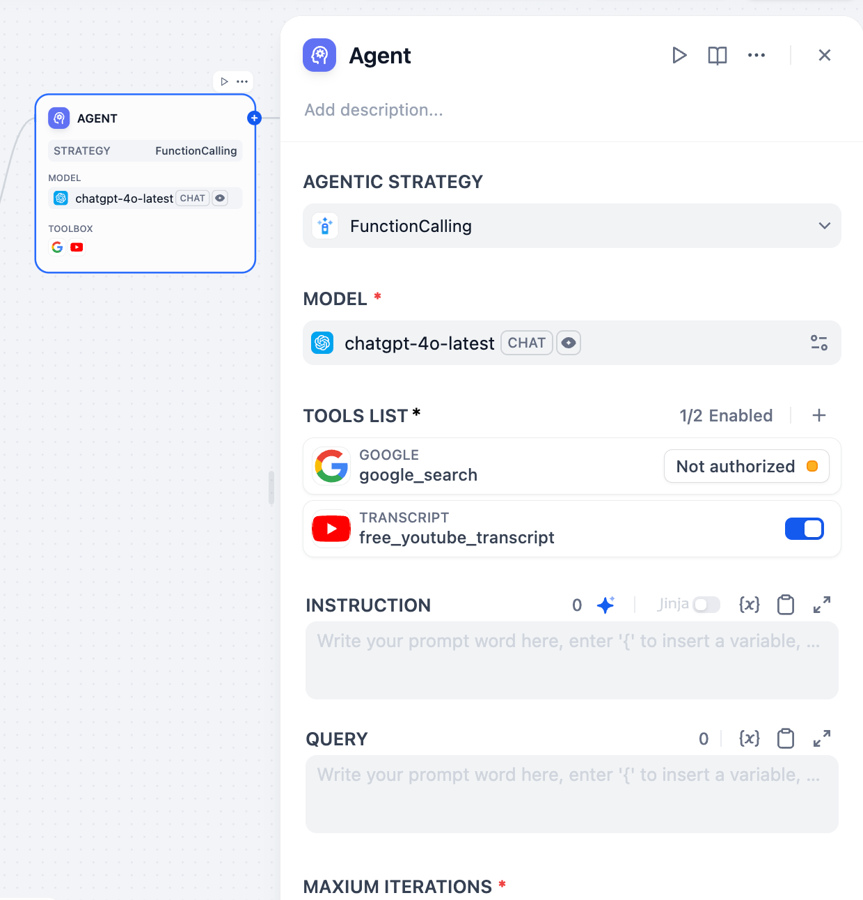
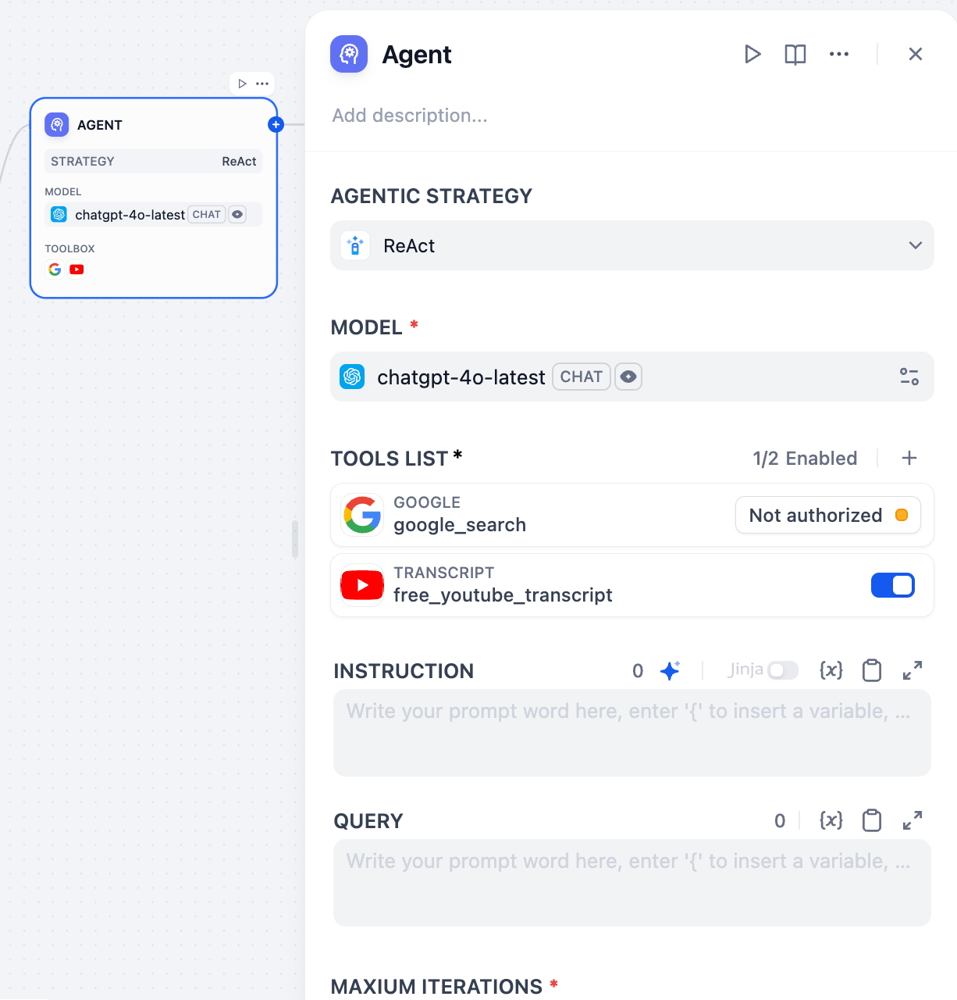

# Overview
The Agent node in Dify Chatflow/Workflow lets LLMs autonomously use tools. This plugin features two official Dify Agent reasoning strategies, enabling LLMs to dynamically select and run tools during runtime for multi-step problem-solving.

## Strategies

### 1. Function Calling
Function Calling maps user commands to specific functions or tools. The LLM identifies the user's intent, decides which function to call, and extracts the required parameters. It is a straightforward mechanism for invoking external capabilities.

#### Pros:
- **Precise:** Directly calls the right tool for defined tasks, avoiding complex reasoning.
- **Easy External Integration:** Integrates external APIs and tools as callable functions.
- **Structured Output:** Provides structured function call information for easy processing.

### 2. ReAct (Reason + Act)
ReAct alternates between the LLM reasoning about the situation and taking actions. The LLM analyzes the current state and goal, selects and uses a tool, and then uses the tool's output for the next thought and action. This cycle repeats until the problem is resolved.

#### Pros:
- **Leverages External Information:** Effectively uses external tools to gather information for tasks the model cannot handle alone.
- **Explainable Reasoning:** Interwoven reasoning and action steps allow some tracking of the Agent's process.
- **Wide Applicability:** Suitable for tasks requiring external knowledge or specific actions, such as Q&A, information retrieval, and task execution.