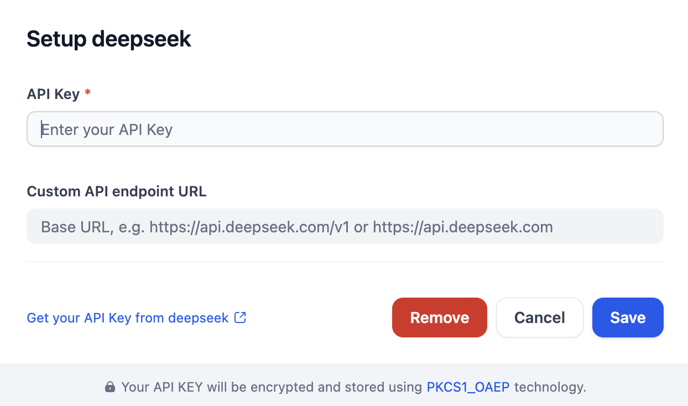

# Overview
DeepSeek provides advanced AI capabilities for chats and completions. This plugin enables developers to integrate DeepSeek's models, including text generation (deepseek-chat and deepseek-code) via the API.

# Configure
After installation, you need to get API keys from [Deepseek](https://platform.deepseek.com/api_keys) and setup in Settings -> Model Provider.

