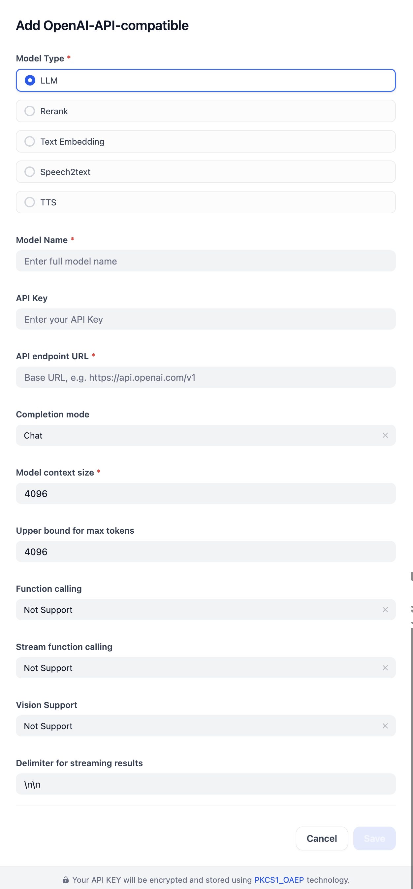

## Overview

This plugin provides access to models that are OpenAI-compatible, including LLMs, reranking, text embedding, speech-to-text (STT), and text-to-speech(TTS) models. Developers can easily add models by providing configuration parameters such as the model name and API key.

## Configure

Configure the OpenAI-API-compatible model by providing its core details (Type, Name, API Key, URL) and adjusting further options like completion, context, and token limits, as well as streaming and vision settings. Save when done.

