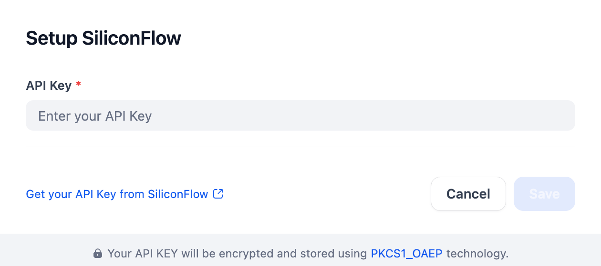

## Overview

SiliconCloud (MaaS) simplifies AI model deployment with robust performance. This plugin provides access to various models (LLMs, text embedding, reranking, STT, TTS), configurable via model name, API key, and other parameters.

## Configure

Install the SiliconFlow plugin, then configure it by entering your API Key. Get your API Key from [SiliconFlow](https://cloud.siliconflow.cn/account/ak) and save.

## About SiliconFlow  

SiliconFlow is committed to building a scalable, standardized, and high-performance AI Infra platform. It offers SiliconCloud (the model cloud service platform), SiliconLLM (the LLM inference engine), and OneDiff (the high-performance text-to-image/video acceleration library). These solutions help enterprises and individual users deploy AI models efficiently and cost-effectively.

[Website](https://siliconflow.cn/) | [SiliconCloud Quick Start](https://docs.siliconflow.cn/quickstart) 