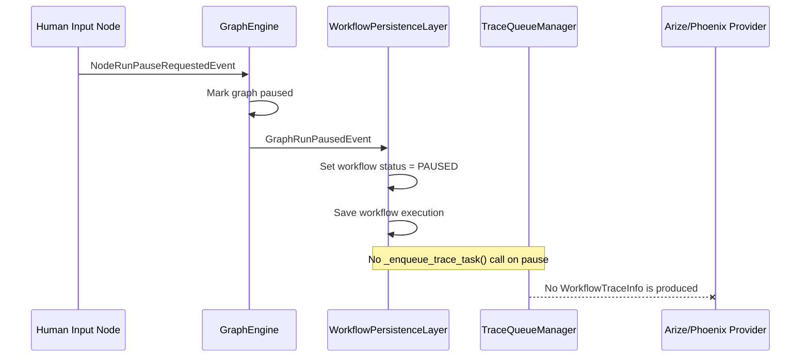
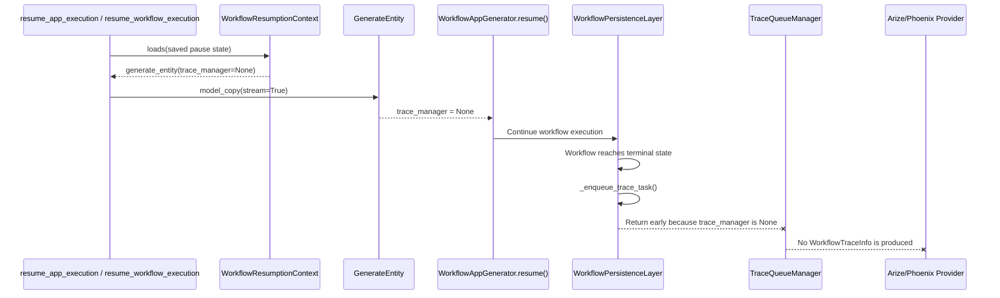
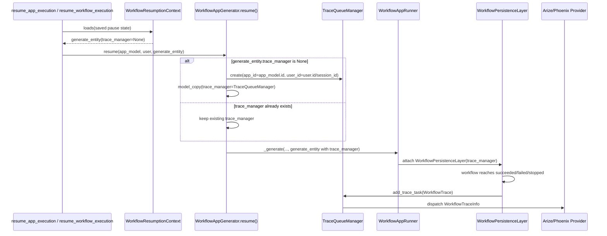

# HITL Workflow Tracing Resume Spec

## Background

When a workflow using the Arize/Phoenix tracing provider contains a human-in-the-loop (HITL) node, the observed behavior is:

- the workflow pauses at the HITL node;
- the workflow resumes after the form is submitted;
- Phoenix receives no workflow tracing data;
- the logs include `Unhandled event type: NodeRunHumanInputFormFilledEvent`.

This spec summarizes the root cause found so far and records the preferred first fix: restore `TraceQueueManager` after resume so that a resumed HITL workflow can still emit its final workflow trace. Emitting a `PAUSED` checkpoint trace is intentionally out of scope for this fix.

## Relevant Logs

```text
Human Input node suspended workflow for form
Created workflow pause ...
Task workflow_based_app_execution_task ... succeeded
Task resume_app_execution ... received
Resumed workflow pause ...
Unhandled event type: NodeRunHumanInputFormFilledEvent
Deleted workflow pause ...
Task resume_app_execution ... succeeded
```

## Confirmed Facts

The main enqueue path for `TraceTaskName.WORKFLOW_TRACE` is `WorkflowPersistenceLayer`.

Workflow trace is currently enqueued for these events:

- `GraphRunSucceededEvent`
- `GraphRunPartialSucceededEvent`
- `GraphRunFailedEvent`
- `GraphRunAbortedEvent`

Workflow trace is not currently enqueued for:

- `GraphRunPausedEvent`

`TraceTask.workflow_trace()` re-reads the workflow run from the database when it executes. It does not carry a complete in-memory snapshot from the enqueue moment. Therefore, simply enqueueing during pause would not reliably preserve the paused state if the trace queue runs after the workflow has already resumed.

## Problem 1: Why Pause Does Not Send Tracing

After the HITL node pauses the workflow, GraphEngine emits `GraphRunPausedEvent`. `WorkflowPersistenceLayer._handle_graph_run_paused()` only:

- sets the workflow execution status to `PAUSED`;
- saves pause outputs and runtime statistics;
- persists the workflow execution.

It does not call `_enqueue_trace_task()`, so no `TraceTaskName.WORKFLOW_TRACE` is created and the Phoenix provider never receives `WorkflowTraceInfo`.



## Problem 2: Why Resume Does Not Send Tracing

The resume path loads the paused generate entity from `WorkflowResumptionContext`.

However, the generate entity field `trace_manager` is explicitly excluded from serialization:

```python
trace_manager: "TraceQueueManager | None" = Field(default=None, exclude=True, repr=False)
```

That means the deserialized generate entity has `trace_manager=None`.

The resume task currently only does the equivalent of:

```python
resumed_generate_entity = generate_entity.model_copy(update={"stream": True})
```

It does not rebuild `TraceQueueManager`. As a result, even if the resumed workflow later succeeds, fails, or stops, `WorkflowPersistenceLayer._enqueue_trace_task()` returns early because `self._trace_manager is None`. No workflow trace is enqueued.



## Relationship To `NodeRunHumanInputFormFilledEvent`

The warning is not directly related to Phoenix receiving no tracing.

`NodeRunHumanInputFormFilledEvent` is emitted after the HITL form is submitted and before the node completes successfully. GraphEngine currently has no specific handler for this event type, so it falls through to the default handler and logs:

```text
Unhandled event type: NodeRunHumanInputFormFilledEvent
```

The default handler still collects the event, and `WorkflowAppRunner` maps it into `QueueHumanInputFormFilledEvent` for response streaming. The warning indicates incomplete event-handler coverage, but it is not the root cause of the missing workflow trace.

## Fix Goal

This fix should:

- restore `TraceQueueManager` after resume;
- ensure resumed HITL workflow/chatflow executions can use the existing terminal-state tracing path to emit one complete workflow trace;
- keep the current behavior of not sending workflow trace during pause;
- avoid introducing a pause checkpoint trace;
- avoid changing the Phoenix provider implementation.

## Recommended Fix Location

Restore `TraceQueueManager` in these resume entry points:

- `WorkflowAppGenerator.resume()`
- `AdvancedChatAppGenerator.resume()`

Rationale:

- initial generate paths already create `TraceQueueManager` inside app generators;
- resume has access to both `app_model` and `user`, so it can restore `app_id` and `user_id` correctly;
- this covers both `resume_app_execution` and `resume_workflow_execution`;
- this covers both workflow and advanced chat;
- this keeps trace manager creation out of the persistence layer.

## Recommended Implementation

Prefer a minimal fix and do not introduce a shared helper yet.

In both `WorkflowAppGenerator.resume()` and `AdvancedChatAppGenerator.resume()`, before calling `_generate()`:

```python
if application_generate_entity.trace_manager is None:
    application_generate_entity = application_generate_entity.model_copy(
        update={
            "trace_manager": TraceQueueManager(
                app_id=app_model.id,
                user_id=user.id if isinstance(user, Account) else user.session_id,
            )
        }
    )
```

If a caller already provided `trace_manager`, keep it unchanged.



## Rejected Alternatives

### Do not fix only in `resume_app_execution`

There is another resume entry point, `resume_workflow_execution`, which also restores generate entities from `WorkflowResumptionContext` and also loses `trace_manager`. Fixing only one task would leave another gap.

### Do not create `TraceQueueManager` inside `WorkflowPersistenceLayer._enqueue_trace_task()`

Reasons:

- the persistence layer currently consumes an injected trace manager; it does not create one;
- the persistence layer cannot reliably restore the EndUser `session_id` semantics;
- it would spread tracing initialization responsibilities across layers.

### Do not simply enqueue trace on pause in this fix

Reasons:

- `TraceTask.workflow_trace()` re-reads the workflow run from the database;
- the trace queue has delay, so a quick pause/resume can overwrite the `PAUSED` state before trace execution;
- Phoenix currently creates spans rather than updating an existing workflow span, so pause and final traces may create duplicate workflow traces.

## Test Plan

Add unit coverage for:

1. `WorkflowAppGenerator.resume()` restores `TraceQueueManager` when `application_generate_entity.trace_manager is None`.
2. `AdvancedChatAppGenerator.resume()` restores `TraceQueueManager` when `application_generate_entity.trace_manager is None`.
3. An existing `trace_manager` is preserved and not replaced.
4. Optionally, a persistence-layer behavior test can assert that a resumed terminal workflow gets a non-empty trace manager and enqueues `TraceTaskName.WORKFLOW_TRACE`.

## Acceptance Criteria

- A resumed HITL workflow enqueues `TraceTaskName.WORKFLOW_TRACE` when it eventually succeeds, fails, or stops.
- A resumed HITL advanced chat flow enqueues `TraceTaskName.WORKFLOW_TRACE` when it eventually succeeds, fails, or stops.
- An existing `trace_manager` is not overwritten.
- Pause still does not emit workflow trace.
- Phoenix provider code does not need to change.
