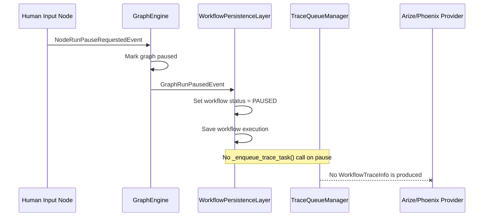
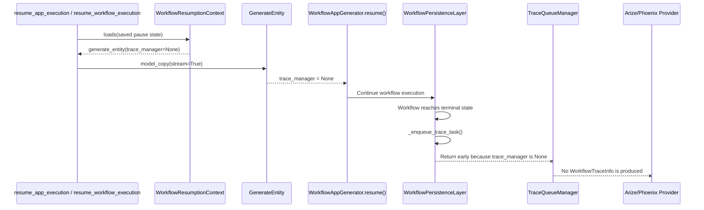
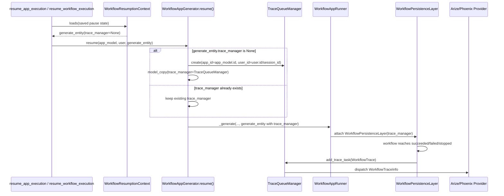

# HITL Workflow Tracing Resume Spec

## 背景

在接入 Arize/Phoenix tracing provider 的 workflow 中，如果包含 human-in-the-loop (HITL) 节点，实际运行表现是：

- workflow 执行到 HITL 节点后暂停；
- 用户填写表单后，workflow 通过 resume task 继续执行；
- Phoenix 没有收到 workflow tracing；
- 日志中出现 `Unhandled event type: NodeRunHumanInputFormFilledEvent`。

本 spec 汇总目前定位到的根因，并记录本轮建议优先修复的方向：先修 resume 后 `TraceQueueManager` 丢失的问题，保证 HITL workflow 最终完成时可以发送 tracing。暂停阶段是否发送 `PAUSED` checkpoint trace 暂不纳入本轮修复。

## 相关日志

```text
Human Input node suspended workflow for form
Created workflow pause ...
Task workflow_based_app_execution_task ... succeeded
Task resume_app_execution ... received
Resumed workflow pause ...
Unhandled event type: NodeRunHumanInputFormFilledEvent
Deleted workflow pause ...
Task resume_app_execution ... succeeded
```

## 已确认事实

`TraceTaskName.WORKFLOW_TRACE` 的主要 enqueue 入口在 `WorkflowPersistenceLayer`。

当前会 enqueue workflow trace 的事件：

- `GraphRunSucceededEvent`
- `GraphRunPartialSucceededEvent`
- `GraphRunFailedEvent`
- `GraphRunAbortedEvent`

当前不会 enqueue workflow trace 的事件：

- `GraphRunPausedEvent`

`TraceTask.workflow_trace()` 执行时会重新从 DB 读取 workflow run，而不是使用 enqueue 当下的完整内存快照。因此，即使简单地在暂停时 enqueue，如果 trace queue 延迟执行，读到的也可能已经不是暂停时刻的 `PAUSED` 状态。

## 问题 1: HITL 暂停时为什么不发送 tracing

HITL 节点暂停 workflow 后，GraphEngine 发出 `GraphRunPausedEvent`。`WorkflowPersistenceLayer._handle_graph_run_paused()` 只做以下事情：

- 设置 workflow execution 状态为 `PAUSED`；
- 保存 pause outputs 和运行统计；
- 保存 workflow execution。

它没有调用 `_enqueue_trace_task()`，因此不会创建 `TraceTaskName.WORKFLOW_TRACE`，Phoenix provider 也不会收到 `WorkflowTraceInfo`。



## 问题 2: HITL resume 后为什么不发送 tracing

resume 路径从 `WorkflowResumptionContext` 读取暂停时保存的 generate entity。

但是 generate entity 上的 `trace_manager` 字段是：

```python
trace_manager: "TraceQueueManager | None" = Field(default=None, exclude=True, repr=False)
```

也就是说，pause state 序列化时会排除 `trace_manager`。resume 反序列化后的 generate entity 中，`trace_manager` 是 `None`。

resume task 当前只会执行类似逻辑：

```python
resumed_generate_entity = generate_entity.model_copy(update={"stream": True})
```

它不会重建 `TraceQueueManager`。因此 workflow resume 后即使最终成功、失败或停止，`WorkflowPersistenceLayer._enqueue_trace_task()` 也会因为 `self._trace_manager is None` 直接 return，最终不会 enqueue workflow trace。



## `Unhandled event type: NodeRunHumanInputFormFilledEvent` 的关系

该 warning 与 Phoenix 没收到 tracing 没有直接关系。

`NodeRunHumanInputFormFilledEvent` 是 HITL 表单提交后、节点成功完成前发出的事件。GraphEngine 当前没有为这个事件注册专门 handler，因此走默认 handler 并记录：

```text
Unhandled event type: NodeRunHumanInputFormFilledEvent
```

默认 handler 仍会 collect 事件，上层 `WorkflowAppRunner` 也会把它转换为 `QueueHumanInputFormFilledEvent` 用于响应流。因此该 warning 代表 event handling 覆盖不完整，但不是 workflow trace 缺失的根因。

## 修复目标

本轮优先修复：

- resume 后恢复 `TraceQueueManager`；
- 确保 HITL workflow / chatflow resume 后，在最终终态仍能沿用现有终态 tracing 机制发送一次完整 workflow trace；
- 不改变暂停阶段当前不发送 trace 的行为；
- 不新增 pause checkpoint trace；
- 不修改 Phoenix provider 内部行为。

## 建议修复位置

建议在以下两个 resume 入口补齐 `TraceQueueManager`：

- `WorkflowAppGenerator.resume()`
- `AdvancedChatAppGenerator.resume()`

理由：

- 初始 generate 路径本来就在 app generator 中创建 `TraceQueueManager`；
- resume 入口拥有 `app_model` 和 `user`，可以正确恢复 `app_id` 和 `user_id`；
- 可以同时覆盖 `resume_app_execution` 和 `resume_workflow_execution` 两类 task；
- 可以同时覆盖 workflow 和 advanced chat；
- 避免把创建 trace manager 的职责下沉到 persistence layer。

## 建议实现

小修优先，不新增公共 helper。

在 `WorkflowAppGenerator.resume()` 和 `AdvancedChatAppGenerator.resume()` 中，在调用 `_generate()` 前补齐：

```python
if application_generate_entity.trace_manager is None:
    application_generate_entity = application_generate_entity.model_copy(
        update={
            "trace_manager": TraceQueueManager(
                app_id=app_model.id,
                user_id=user.id if isinstance(user, Account) else user.session_id,
            )
        }
    )
```

如果调用方已经注入了 `trace_manager`，保留现有对象，不替换。



## 不建议的方案

### 不建议只在 `resume_app_execution` task 中补齐

原因是还有另一个 resume 入口 `resume_workflow_execution`，它同样从 `WorkflowResumptionContext` 恢复 generate entity，也会丢失 `trace_manager`。只修一个 task 会留下缺口。

### 不建议在 `WorkflowPersistenceLayer._enqueue_trace_task()` 中创建 `TraceQueueManager`

原因：

- persistence layer 当前职责是使用传入的 trace manager，而不是创建 trace manager；
- persistence layer 不一定能正确恢复 EndUser 的 `session_id` 语义；
- 会让 tracing 初始化职责分散。

### 不建议本轮在 pause 时直接 enqueue trace

原因：

- `TraceTask.workflow_trace()` 执行时会重新读 DB，不保证读到 pause 时刻状态；
- 默认 trace queue 有延迟，短暂停顿后 resume 可能覆盖 `PAUSED` 状态；
- Phoenix provider 当前创建 span，不是更新已有 span；pause 发一次、final 再发一次可能产生重复 workflow trace。

## 测试建议

建议补充单元测试：

1. `WorkflowAppGenerator.resume()` 在 `application_generate_entity.trace_manager is None` 时会补齐 `TraceQueueManager`。
2. `AdvancedChatAppGenerator.resume()` 在 `application_generate_entity.trace_manager is None` 时会补齐 `TraceQueueManager`。
3. 当 `trace_manager` 已存在时，不替换原对象。
4. 可在 persistence layer 层补充一个 resume 后终态 enqueue 的行为测试，确认 `WorkflowPersistenceLayer` 能收到非空 trace manager。

## 验收标准

- HITL workflow resume 后最终成功、失败或停止时，会 enqueue `TraceTaskName.WORKFLOW_TRACE`。
- HITL advanced chat resume 后最终成功、失败或停止时，会 enqueue `TraceTaskName.WORKFLOW_TRACE`。
- 已存在的 `trace_manager` 不会被覆盖。
- 暂停阶段仍不发送 workflow trace。
- Phoenix provider 不需要改动。
