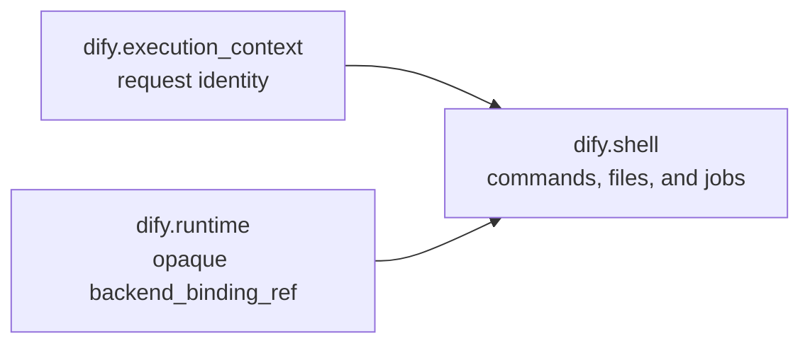

# Runtime resources

Dify separates persistent product resources from request-time execution:

- a **Home Snapshot** is immutable Agent-owned Home content;
- a **Workspace** is mutable working data owned by a product scope such as a
  conversation, Build Draft, or Workflow run;
- an **Execution Binding** is one materialized Agent participant, including its
  private Home and resumable session, attached to a Workspace;
- a **RuntimeLease** is operation-scoped access to the physical Binding.

`AgentWorkspaceBinding.id` is the participant, materialized Home, and persisted
Agenton session identity. `agent_id` identifies the source Agent. The same
Agent can therefore have multiple active Bindings in one Workspace:
each has an independent Home and session, while all may share Workspace files.

Home and Workspace are logically independent. A backend may still couple their
physical representation. For example, current E2B maps one Binding and its
Workspace to one E2B resource, while Local can attach multiple materialized
Homes to one shared Workspace.

## Runtime layer graph

Agent requests do not expose separate Home, Workspace, or Sandbox layers. The
product caller stores its exact Binding id. Dify API resolves that pointer and
sends the Binding's opaque backend ref to the `dify.runtime` layer:



`DifyRuntimeLayer` calls the selected `ExecutionBindingBackend.acquire()` when
its resource context opens and `release()` when the operation ends. It exposes
the resulting `RuntimeLease` only while that context is active. The layer does
not create, retire, or destroy persistent resources, and it stores no backend
SDK object in an Agenton session snapshot.

The Shell layer consumes `RuntimeLease.commands`, `RuntimeLease.files`, and
`RuntimeLease.layout`. It tracks only request-local shell job ids and offsets.
Closing a run clears that job state; it does not retire the Binding.

## State ownership

Dify API is the lifecycle ledger. It stores three resource records:

| Record | Meaning | Backend field |
| --- | --- | --- |
| `agent_home_snapshots` | One immutable Home version owned by an Agent. | `snapshot_ref` |
| `agent_workspaces` | One mutable Workspace owned by a product scope. | `backend_workspace_ref` |
| `agent_workspace_bindings` | One materialized participant, private Home, and resumable session attached to a Workspace. | `backend_binding_ref` |

Product records refer to logical ids such as `home_snapshot_id`, `workspace_id`,
and Binding id. A Conversation, debug Build Draft, or Workflow Node Execution
stores its exact participant in `agent_workspace_binding_id`. These pointers
are logical references without foreign keys: the business history may outlive a
collected Binding ledger row.

Backend refs are opaque strings interpreted only by the selected backend
adapter. Dify API stores the latest Agenton session snapshot on the Binding, but
it does not serialize `RuntimeLease`, SDK clients, credentials, or temporary
access tokens.

Dify Agent does not connect to the Dify product database and has no persistent
resource registry. Its private control-plane endpoints create or destroy
backend resources from requests made by Dify API. Redis run records and event
streams are observability state, not the Home/Workspace/Binding ledger.

## Creation and execution flow

Home Snapshot initialization uses `POST /home-snapshots/initialize`. Build Draft
Apply uses `POST /home-snapshots/from-binding`: Dify Agent acquires the exact
source Binding, snapshots its materialized Home through the backend-native
operation, releases the lease, and returns a new opaque snapshot ref. Dify API
then stores a new immutable `agent_home_snapshots` row and records its logical id
on the resulting config version. There is no replay or initialization fallback
when the source Binding is unavailable.

Before an Agent request, Dify API loads the exact product caller. A null pointer
causes one new Binding to be materialized and saved to the caller in the same
database transaction. A non-null pointer resolves only that Binding and
validates its owner and config/Home generation. Missing, retired, or mismatched
pointers fail fast; Dify API does not search by Agent, Workspace, candidate
count, or recency, and it does not create a replacement implicitly.

`POST /execution-bindings` materializes the selected Home Snapshot and returns
opaque Binding and Workspace refs. Every create request represents a new
participant, even when the Agent, Snapshot, config generation, and Workspace
match another Binding. The request composition contains:

```json
{
  "name": "runtime",
  "type": "dify.runtime",
  "config": {"backend_binding_ref": "opaque-backend-binding-ref"}
}
```

Each Agent request acquires that ref for the duration of the run and releases it
afterward. Local release closes the operation's shellctl connection. E2B release
also pauses the underlying E2B resource with memory preserved. A later request
or Workspace file operation acquires a new lease for the same Binding ref. If a
backend confirms the resource is gone, acquisition fails; it does not create an
empty replacement Workspace.

## Retirement and collection

Retirement is a database transition from `ACTIVE` to `RETIRED`. It prevents new
product use without performing network I/O inside the caller's transaction.
Product lifecycle paths commit this transition synchronously. After the
transaction commits, one Celery task asks Dify Agent to destroy the physical
resources. A successful collector deletes the corresponding ledger row; a
failed collector logs the failure and leaves the RETIRED row available for a
future retry or reconciler.

The unified `collect_agent_resources` task is registered on normal Celery
workers and explicitly uses the existing `retention` queue. Standard workers
already consume that queue, so no dedicated Agent resource worker or new queue
is required. At a Workflow terminal event, the graph layer synchronously retires
and commits the run's Workspaces before enqueueing collection. When a Workflow
change may orphan Workflow-only Agents, the main product transaction commits
first; a fresh session then rechecks effective ownership and retires only Agents
that remain unowned.

Retiring a final Binding also retires its Workspace. Workspace collection
destroys the physical Workspace through one Binding and then collects remaining
materialized Homes. Home Snapshots are retired when their owning Agent is
retired and are collected only after no draft or config snapshot references
them. Celery performs physical collection only; it does not decide or perform
the initial retirement. Dify Agent itself remains stateless.

There is currently no age-based TTL, periodic GC, or global orphan reconciler.
Backend destroy operations are idempotent where supported. Dify API does not
perform cross-system compensation after a backend create returns success. Any
later API failure, including Python, flush, or commit failure, may leave a
physical orphan for a future global reconciler.

Backends still clean up partial resources when a create operation fails before
returning success. For example, E2B kills a Sandbox when its initialization
fails, and Local removes paths created by an incomplete operation. This
backend-local cleanup does not cross the database commit boundary.

## Workspace file boundary

Dify API's public file APIs accept the exact product caller, not a Binding id or
backend ref: a Conversation, a debug Build Draft, or a Workflow Node Execution.
Dify API authorizes that row, follows its `agent_workspace_binding_id`, and
exactly resolves the active Binding. It does not select the latest Binding or
fall back to another caller.

The resolved request reaches Dify Agent through its private
`POST /workspace/files/list`, `POST /workspace/files/read`, and
`POST /workspace/files/upload` endpoints. Each operation receives a
`backend_binding_ref`, acquires a fresh RuntimeLease, performs the file action,
and releases the lease.

`WorkspaceFileService` forwards the request path unchanged to the current
RuntimeLease's file capability. The backend interprets that path in its own
filesystem namespace; the service does not require a Workspace-relative path
or enforce `workspace_dir` containment. `~` and `~/...` can therefore address
the lease's Home. Whether an absolute path or a path containing `..` is
accessible is determined by the backend and its path-isolation policy, such as
Local shellctl and Landlock isolation. Whole-file capture for Agent Stub upload
is bounded by
`DIFY_AGENT_SANDBOX_FILE_UPLOAD_MAX_BYTES`; the environment variable keeps its
existing name even though the route now operates through a Binding.

`RuntimeLayout.home_dir` and `RuntimeLayout.workspace_dir` are canonical paths
inside the backend execution namespace. They are not host paths, product ids,
or request configuration. Shell commands start in `workspace_dir`, and `HOME`
is forced to `home_dir`. On Local, sibling materialized Homes may exist in the
same shellctl namespace, while path isolation restricts the active lease to its
own Home plus the shared Workspace.

## Backend support

| Backend | Home Snapshot operations | Binding operations | Physical relationship |
| --- | --- | --- | --- |
| Local | Supported | Supported, including attaching multiple Bindings to one Workspace | Snapshot directory, per-Binding materialized Home, and Workspace directory are separate. |
| E2B | Supported | Supported without shared-Workspace attachment | Binding and Workspace refs map to the same E2B resource; Home initialization/checkpoint uses E2B snapshots. |
| Enterprise | Not implemented | Not implemented | Configuration is accepted, but every resource operation fails fast with `NotImplementedError`. |

Local creates a new Home for every Binding id. Destroying one Binding without
the Workspace leaves sibling Homes and the shared Workspace intact. Current E2B
rejects `existing_workspace_ref` with `shared_workspace_unsupported`, because
its Binding and Workspace are one Sandbox. It also rejects binding-only destroy.
Neither path creates a fallback Workspace or switches backends.

`DIFY_AGENT_E2B_ACTIVE_TIMEOUT_SECONDS` limits continuous active time for an E2B
resource. Runtime resources pause on timeout; temporary Home initialization
resources are killed. It is not a retention TTL and does not delete paused
resources or immutable snapshots.

See the [Shell layer](../../user-manual/shell-layer/index.md) for request
composition and the [Operations Guide](../../guide/index.md) for Local and E2B
validation.
