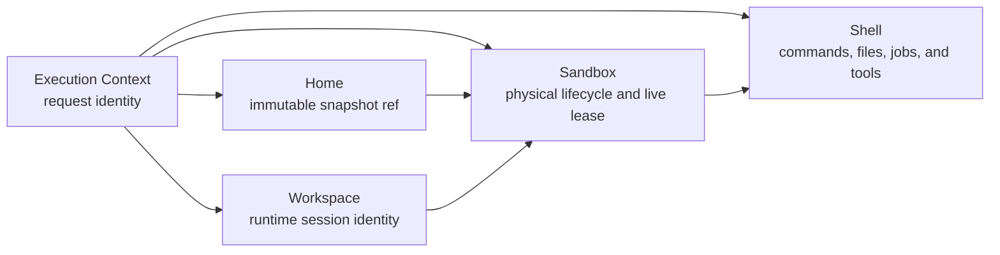

# Runtime resources

Dify Agent separates execution identity, immutable Home content, mutable
Workspace files, physical Sandbox lifecycle, and Shell tools. A deployment
selects one coherent runtime backend for Home Snapshot and Sandbox operations;
the public layer graph does not expose whether that backend is Local,
Enterprise, or E2B.

## Layer graph

The layers have deliberately narrow responsibilities:

| Layer | Persistent data | Request-local data | Responsibility |
| --- | --- | --- | --- |
| Execution Context | Product and invocation identity in its config | Plugin-daemon context | Supplies trusted request identity. |
| Home | Dify API `home_snapshot_id` plus an `agent_home_snapshots` ledger row | A binding containing the owner-scoped resolved `snapshot_ref` | Binds an Agent-owned immutable Home Snapshot; never creates or deletes it. |
| Workspace | `workspace_id` in its config | A binding object | Names the current mutable Workspace. `workspace_id == runtime_session_id`; `workspace_dir` is also the temporary directory. |
| Sandbox | Stable, non-sensitive `handle` in runtime state | `SandboxLease` | Creates or resumes the physical resource and suspends or deletes it on exit. |
| Shell | None | Tracked job ids/offsets plus lease commands, files, and layout | Exposes shell prompt/tools. Suspend/delete performs best-effort job cleanup; Shell does not manage the Sandbox. |

Shell's execution-context dependency is used for request-scoped Agent Stub
environment values. Its only runtime-resource dependency is Sandbox, from which
it consumes `commands`, `files`, `home_dir`, and `workspace_dir`.
Tracked Shell job ids and offsets are active-request state only. Suspend and
delete clear them before the returned snapshot is persisted.
Command timeouts belong to Shell operations, request timeouts belong to the run
scheduler, and network/isolation policy belongs to the deployment backend; none
is part of `DifySandboxLayerConfig`.

## State ownership

Dify API is the cross-request state owner. It stores:

- immutable `agent_home_snapshots` rows containing the Home identity, Agent owner,
  opaque backend `snapshot_ref`, and creation time;
- `home_snapshot_id` on mutable Agent drafts, immutable config snapshots, and
  runtime session scope; Draft and Config Snapshot records do not store the
  backend ref;
- `AgentRuntimeSession.id`, which is both `runtime_session_id` and
  `workspace_id`;
- the composition layer specs (including the already owner-validated,
  non-sensitive Home ref needed to resume execution) and latest Agenton session
  snapshot;
- the Sandbox handle inside the Sandbox layer runtime state.

Dify Agent does not connect to the Dify product database and does not keep a
Workspace or Sandbox registry. It accepts composition plus a previous snapshot,
executes one request, and returns the next snapshot. Live leases, SDK objects,
HTTP clients, API keys, and temporary access tokens remain in request memory and
must never enter a session snapshot.

Physical content belongs to the selected backend. Local stores filesystem
scopes behind local shellctl, Enterprise delegates to its Gateway and pods, and
E2B uses immutable snapshots plus retained paused sandboxes. Backend resources
may be physically coupled even though their public layer responsibilities stay
separate.

## Resource lifecycle

Home Snapshot creation has two explicit control-plane entry points. Agent
provisioning uses backend-native initialization. Build Draft Apply locates that
draft's exact retained Sandbox and asks Dify Agent to snapshot its live lease.
Dify API records each result as a new immutable `agent_home_snapshots` row and
stores only its `home_snapshot_id` on product records. Build Draft save does not
create Home, and Build Apply fails if the retained owner-scoped Sandbox is not
available; it does not fall back to initialization, file replay, or another
Sandbox.

Publish does not create a Home Snapshot. It copies the Normal Draft's existing
`home_snapshot_id` into the new immutable config snapshot. Config version
deletion, Build Draft discard, and runtime-session cleanup do not delete Home.
When an Agent is retired, Dify API reads all of that Agent's opaque refs from
the ledger and submits one-shot Celery cleanup work. Physical deletion is
idempotent and the immutable ledger rows remain unchanged.

On the first runtime request, Sandbox creates a physical resource from the Home
ref and `runtime_session_id`. It stores the returned stable handle in the
session snapshot. Later requests and file browsing resume that exact handle.
If the backend confirms that the Sandbox or its Workspace is gone, the request
fails with a lost-resource error; Dify Agent must not silently create an empty
Workspace from Home.

The normal request exit suspends the Sandbox lease. For Local and Enterprise,
that releases the current data-plane connection while retaining backend state.
For E2B, it also pauses the Sandbox with memory preserved. A `delete` exit
releases the lease, deletes the physical Sandbox, and clears the handle only
after deletion succeeds. The latest Workspace lives in the retained Sandbox and
remains browseable between Agent requests.

Runtime Sandbox cleanup and Agent Home retirement use explicit one-shot Celery
tasks from Dify API. There is currently no Dify Agent database, resource-age
TTL, reconciler, complex retry/state machine, or eventual deletion guarantee.
Backend-native operational cleanup may exist, but it is not part of this public
contract.

## E2B timeout semantics

`DIFY_AGENT_E2B_ACTIVE_TIMEOUT_SECONDS` is the maximum continuous active time
passed to E2B on create or connect. Its timeout action depends on the resource:

- a runtime Sandbox is paused;
- a temporary builder used internally by Home initialization, if any, is
  killed.

The setting does not age or delete paused sandboxes and does not expire
immutable snapshots. Explicit runtime-session cleanup kills a retained E2B
Sandbox; Agent retirement deletes the Agent's E2B Home Snapshots. Build Apply
does not start a builder: it snapshots the exact retained E2B Build Sandbox and
then suspends that source Sandbox again.

## Workspace file boundary

`/sandbox/files/list`, `/sandbox/files/read`, and `/sandbox/files/upload` resume
the saved Sandbox handle and operate only under its canonical `workspace_dir`.
Paths must be concrete relative paths: absolute paths, `..`, `~`, control
characters, and symlink traversal are rejected. Descriptor-relative,
no-follow opens bind the file before it is read.

Upload does not enter the Shell layer. The backend-neutral file capability reads
the complete file into Dify Agent memory, bounded by
`DIFY_AGENT_SANDBOX_FILE_UPLOAD_MAX_BYTES`. The server-side Agent Stub control
plane then uploads only the captured bytes, basename, and MIME type; no sandbox
path or Shell command crosses that boundary.

For a standalone Dify Agent process, set that byte variable directly. In the
Docker deployment, configure `PLUGIN_MAX_FILE_SIZE` in `docker/.env`; Compose
maps the same byte value to
`DIFY_AGENT_SANDBOX_FILE_UPLOAD_MAX_BYTES` for `agent_backend`.

See the [Shell layer](../../user-manual/shell-layer/index.md) for the complete
request graph and the [Agent Run Lifecycle](../run-lifecycle/index.md) for
general suspend/delete signaling.
