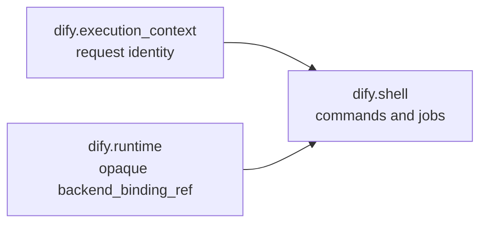

# Runtime resources

Dify separates persistent product resources from request-time execution:

- a **Home Snapshot** is immutable Agent-owned Home content;
- a **Workspace** is mutable working data owned by a product scope such as a
  conversation, Build Draft, or Workflow run;
- an **Execution Binding** is one materialized Agent participant, including its
  private Home and resumable session, attached to a Workspace;
- a **RuntimeLease** is operation-scoped access to the physical Binding.

`AgentWorkspaceBinding.id` is the participant, materialized Home, and persisted
Agenton session identity. `agent_id` identifies the source Agent. The same
Agent can therefore have multiple active Bindings in one Workspace:
each has an independent Home and session, while all may share Workspace files.

Home and Workspace are logically independent. A backend may still couple their
physical representation. For example, current E2B maps one Binding and its
Workspace to one E2B resource, while Local can attach multiple materialized
Homes to one shared Workspace.

## Runtime layer graph

Agent requests do not expose separate Home, Workspace, or Sandbox layers. Dify
API resolves the Binding selected by the product flow and sends its opaque
backend ref to the `dify.runtime` layer:


```mermaid
flowchart LR
    EC["dify.execution_context<br/>request identity"]
    RT["dify.runtime<br/>opaque backend_binding_ref"]
    SH["dify.shell<br/>commands and jobs"]

    EC --> SH
    RT --> SH
```

`DifyRuntimeLayer` calls the selected `ExecutionBindingBackend.acquire()` when
its resource context opens and `release()` when the operation ends. It exposes
the resulting `RuntimeLease` only while that context is active. The layer does
not create, retire, or destroy persistent resources, and it stores no backend
SDK object in an Agenton session snapshot.

The Shell layer consumes `RuntimeLease.commands` and `RuntimeLease.layout`. It
tracks only request-local shell job ids and offsets.
Closing a run clears that job state; it does not retire the Binding.

## State ownership

Dify API is the lifecycle ledger. It stores three resource records:

| Record | Meaning | Backend field |
| --- | --- | --- |
| `agent_home_snapshots` | One immutable Home version owned by an Agent. | `snapshot_ref` |
| `agent_workspaces` | One mutable Workspace owned by a product scope. | `backend_workspace_ref` |
| `agent_workspace_bindings` | One materialized participant, private Home, and resumable session attached to a Workspace. | `backend_binding_ref` |

Backend refs are opaque strings interpreted only by the selected backend
adapter. Dify API stores the latest Agenton session snapshot on the Binding, but
it does not serialize `RuntimeLease`, SDK clients, credentials, or temporary
access tokens.

Dify Agent does not connect to the Dify product database and has no persistent
resource registry. Its private control-plane endpoints create or destroy
backend resources from requests made by Dify API. Redis run records and event
streams are observability state, not the Home/Workspace/Binding ledger.

When `DIFY_AGENT_API_TOKEN` is configured, every private control-plane request must carry the matching Dify API `AGENT_BACKEND_API_TOKEN` as a Bearer token.

## Creation and execution flow

Agent creation does not create a Home Snapshot. A config with no logical Home
Snapshot asks the selected backend to materialize its deployment-default Home
when the Binding is created. This default Home is mutable and private to the
Binding; it does not produce an `agent_home_snapshots` row or an implicit
snapshot ref.

Build Draft Apply uses `POST /home-snapshots/from-binding`: Dify Agent acquires
the exact source Binding, snapshots its materialized Home through the
backend-native operation, releases the lease, and returns a new opaque snapshot
ref. Dify API then stores a new immutable `agent_home_snapshots` row and records
its logical id on the resulting config version. There is no replay or fallback
when the source Binding is unavailable.

Before an Agent request, Dify API loads the specific product context. If it has
no associated Binding, Dify API materializes one and saves the Binding id in the
same database transaction. Otherwise it resolves only that Binding and validates
its owner and config/Home generation. Missing, retired, or mismatched Bindings
fail fast; Dify API does not search by Agent, Workspace, candidate count, or
recency, and it does not create a replacement implicitly.

`POST /execution-bindings` accepts either an exact `home_snapshot_ref` or
`null`. An exact ref must be materialized without fallback; `null` selects the
backend's deployment-default Home. It returns opaque Binding and Workspace
refs. Every create request represents a new participant, even when the Agent,
Snapshot, config generation, and Workspace match another Binding. The request
composition contains:

```json
{
  "name": "runtime",
  "type": "dify.runtime",
  "config": {"backend_binding_ref": "opaque-backend-binding-ref"}
}
```

Each Agent request acquires that ref for the duration of the run and releases it
afterward. Local release closes the operation's shellctl connection. E2B release
also pauses the underlying E2B resource with memory preserved. A later request
or Binding file operation acquires a new lease for the same Binding ref. If a
backend confirms the resource is gone, acquisition fails; it does not create an
empty replacement Workspace.

## Retirement and collection

Retirement is a database transition from `ACTIVE` to `RETIRED`. It prevents new
product use without performing network I/O inside the caller's transaction.
Product lifecycle paths commit this transition synchronously. After the
transaction commits, one Celery task asks Dify Agent to destroy the physical
resources. A successful collector deletes the corresponding ledger row. If a
collector raises, the task logs the tenant, resource type, and resource ID and
continues with the other independent resources in the batch. After all resources
have been attempted, any failure makes the Celery task fail and prevents Agent
aggregate deletion. Failed RETIRED rows remain available for a later retry. A
failure to publish the Celery task is also propagated to the product caller. No
automatic retry or reconciliation is performed.

The unified `collect_agent_resources` task is registered on normal Celery
workers and explicitly uses the existing `retention` queue. Standard workers
already consume that queue, so no dedicated Agent resource worker or new queue
is required. At a Workflow terminal event, the graph layer synchronously retires
and commits the run's Workspaces before enqueueing collection. When a Workflow
change may orphan Workflow-only Agents, the main product transaction commits
first; a fresh session then rechecks effective ownership and retires only Agents
that remain unowned. An effective reference is a binding in a normal App's
current draft or current published Workflow. This ownership check applies only
to implicit retirement of Workflow-only Agents. Explicit deletion of a roster
Agent or Agent App proceeds even while Workflows reference it.

Retiring a final Binding also retires its Workspace. Workspace collection
destroys the physical Workspace through one Binding and then collects remaining
materialized Homes. Home Snapshots are retired when their owning Agent is
retired. `RETIRED` is the sole physical-deletion condition for a Home Snapshot;
Draft and Config Snapshot references are historical pointers and do not keep it
alive. After every external resource in a deletion batch succeeds, Dify API
hard-deletes the archived Agent together with its Drafts, Config Snapshots,
Config Revisions, debug-conversation mappings, and resource ledgers in one
database transaction. Workflow Agent bindings belong to
their Workflows and remain unchanged, so they may hold a dangling Agent ID after
explicit deletion. Dify Agent itself remains stateless.

A `RETIRED` Workspace without a `RETIRED` Binding cannot identify a backend
participant through which to destroy the Workspace. That state is a lifecycle
invariant violation and fails collection instead of being logged as success.

There is currently no age-based TTL, periodic GC, or global orphan reconciler.
Backend destroy operations are idempotent where supported. Dify API does not
perform cross-system compensation after a backend create returns success. Any
later API failure, including Python, flush, or commit failure, may leave a
physical orphan for a future global reconciler.

Backends still clean up partial resources when a create operation fails before
returning success. For example, E2B kills a Sandbox when its initialization
fails, and Local removes paths created by an incomplete operation. This
backend-local cleanup does not cross the database commit boundary.

## Binding file boundary

Dify API's public file APIs accept a product locator, not a Binding id or
backend ref: a Conversation, a debug Build Draft, or a Workflow Node Execution.
Dify API authorizes that object and resolves its associated active Binding. It
does not select the latest Binding or fall back to another product context.

The resolved request reaches Dify Agent through its private
`POST /execution-bindings/files/list`, `POST /execution-bindings/files/read`,
and `POST /execution-bindings/files/download` endpoints. Each operation receives a
`backend_binding_ref`, acquires a fresh RuntimeLease, performs the file action,
and releases the lease.

`BindingFileService` resolves relative paths from `workspace_dir`, `~` and
`~/...` from `home_dir`, and leaves absolute paths in the Binding filesystem
namespace. It does not enforce Workspace containment or reject `..`; the
selected backend's isolation policy remains authoritative. List and preview
run bounded inspection scripts through `RuntimeLease.commands`. Download runs
`dify-agent file upload --no-download-link` inside the Binding so bytes stream
directly from the runtime to Dify's existing ToolFile endpoint. Dify Agent
returns only the canonical ToolFile reference and releases the lease before
Dify API signs a browser URL.

The default Binding-download deadline chain leaves each caller time to receive
and normalize the lower layer's result: the sandbox CLI upload is 180 seconds,
`DIFY_AGENT_BINDING_FILE_DOWNLOAD_COMMAND_TIMEOUT_SECONDS` is 210 seconds,
Dify API's `AGENT_BACKEND_BINDING_FILE_DOWNLOAD_TIMEOUT_SECONDS` is 240 seconds,
and `DIFY_AGENT_E2B_ACTIVE_TIMEOUT_SECONDS` is 3600 seconds.

`RuntimeLayout.home_dir` and `RuntimeLayout.workspace_dir` are canonical paths
inside the backend execution namespace. They are not host paths, product ids,
or request configuration. Shell commands start in `workspace_dir`, and `HOME`
is forced to `home_dir`. The standard temp variables `TMPDIR`, `TMP`, and `TEMP`
also point directly to `workspace_dir`, so the Workspace is both the command
`cwd` and temp space. On Local, sibling materialized Homes may exist in the same
shellctl namespace, while path isolation restricts the active lease to its own
Home plus the shared Workspace.

## Backend support

| Backend | Home Snapshot operations | Binding operations | Physical relationship |
| --- | --- | --- | --- |
| Local | Supported | Supported, including default empty Homes and attaching multiple Bindings to one Workspace | Snapshot directory, per-Binding materialized Home, and Workspace directory are separate. |
| E2B | Supported | Supported with template-backed default Homes, without shared-Workspace attachment | Binding and Workspace refs map to the same E2B resource; checkpoints use E2B snapshots. |
| Enterprise | Not implemented | Default-Home Binding creation, acquire, and coupled destroy are supported | Binding and Workspace refs map to one Gateway sandbox. Explicit Home Snapshot materialization fails fast. |

Local creates a new Home for every Binding id. Destroying one Binding without
the Workspace leaves sibling Homes and the shared Workspace intact. Current E2B
rejects `existing_workspace_ref` with `shared_workspace_unsupported`, because
its Binding and Workspace are one Sandbox. It also rejects binding-only destroy.
Neither path creates a fallback Workspace or switches backends.

`DIFY_AGENT_E2B_ACTIVE_TIMEOUT_SECONDS` limits continuous active time for an E2B
resource to one hour. The limit covers the complete Agent run held by one
RuntimeLease rather than an individual tool call. Its 3600-second default is
intentionally the same as `DIFY_AGENT_RUN_TIMEOUT_SECONDS`, but the two settings
remain independently configurable. Runtime resources pause on timeout, but this
resource setting does not own the Agent run terminal state. It is not a retention
TTL and does not delete paused resources or immutable snapshots.

See the [Shell layer](../../user-manual/shell-layer/index.md) for request
composition and the [Operations Guide](../../guide/index.md) for Local and E2B
validation.
