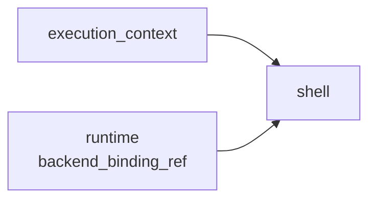

# Shell layer

The `dify.shell` layer exposes shellctl-backed commands and files to an Agent.
It does not select a backend or own persistent Home, Workspace, or Binding
resources. It consumes the operation-scoped `RuntimeLease` opened by a sibling
`dify.runtime` layer.

## Public configuration

```python
from dify_agent.layers.shell import (
    DIFY_SHELL_LAYER_TYPE_ID,
    DifyShellEnvVarConfig,
    DifyShellLayerConfig,
)
from dify_agent.protocol import RunLayerSpec

RunLayerSpec(
    name="shell",
    type=DIFY_SHELL_LAYER_TYPE_ID,
    deps={"execution_context": "execution_context", "runtime": "runtime"},
    config=DifyShellLayerConfig(
        env=[DifyShellEnvVarConfig(name="REPORT_FORMAT", value="markdown")],
        redact_patterns=["private-[A-Za-z0-9]+"],
    ),
)
```

| Config field | Meaning |
| --- | --- |
| `agent_stub_drive_ref` | Optional Drive ref used by shell-visible Agent Stub commands. |
| `cli_tools` | CLI bootstrap declarations with install commands and scoped environment metadata. |
| `env` | Normal environment variables exported to Shell commands. |
| `secret_refs` | Names of secret environment variables supplied by the backend environment. |
| `redact_patterns` | Request-level regex patterns removed from Shell output shown to the model. |

Endpoints, credentials, Home/Workspace paths, resource refs, timeouts, and
network policy are not Shell config. Backend selection is server-private, and
the opaque Binding ref belongs to `DifyRuntimeLayerConfig`.

## Runtime requirements

The server constructs one coherent runtime backend profile. Local and E2B
implement Home Snapshot and Execution Binding operations. Enterprise settings
can be selected, but resource operations currently fail fast with
`NotImplementedError`; there is no compatibility fallback to the retired
Sandbox protocol.

```python
from dify_agent.runtime.compositor_factory import create_default_layer_providers
from dify_agent.runtime_backend.profile import RuntimeBackendSettings, create_runtime_backend_profile

runtime_backend_profile = create_runtime_backend_profile(
    RuntimeBackendSettings(
        runtime_backend="local",
        local_sandbox_endpoint="http://127.0.0.1:5004",
        local_sandbox_auth_token="replace-with-shellctl-token",
    )
)

layer_providers = create_default_layer_providers(
    plugin_daemon_url="http://localhost:5002",
    plugin_daemon_api_key="replace-with-plugin-daemon-key",
    runtime_backend_profile=runtime_backend_profile,
)
```

Equivalent standalone environment settings are:

```env
DIFY_AGENT_RUNTIME_BACKEND=local
DIFY_AGENT_LOCAL_SANDBOX_ENDPOINT=http://127.0.0.1:5004
DIFY_AGENT_LOCAL_SANDBOX_AUTH_TOKEN=replace-with-shellctl-token
```

The auth token may be empty when shellctl authentication is disabled. E2B uses
`DIFY_AGENT_E2B_API_KEY`, the prepared template, and its shellctl settings.

To let shell jobs call the Agent Stub with `dify-agent ...`, configure a public
Agent Stub URL and a unique production secret:

```env
DIFY_AGENT_STUB_API_BASE_URL=https://agent.example.com/agent-stub
DIFY_AGENT_SERVER_SECRET_KEY=replace-with-unpadded-base64url-for-32-random-bytes
```

HTTP URLs may be either the service root or the explicit `/agent-stub` root.
The server normalizes a service root and rejects unrelated paths.

## Request graph

A shell-enabled run contains Execution Context, Runtime, and Shell layers:



`DifyRuntimeLayer` acquires the Binding when the run's resource context opens
and releases it when that operation exits. `DifyShellLayer` uses the active
lease's commands, files, Home path, and Workspace path. It performs only
best-effort cleanup of shell jobs; the persistent Binding lifecycle remains in
Dify API.

## Example request

The Binding must already have been resolved or created by Dify API. Its backend
ref is opaque to the request builder:

```python {test="skip" lint="skip"}
from agenton_collections.layers.plain import PromptLayerConfig
from dify_agent.layers.dify_plugin.configs import DifyPluginLLMLayerConfig
from dify_agent.layers.execution_context import (
    DIFY_EXECUTION_CONTEXT_LAYER_TYPE_ID,
    DifyExecutionContextLayerConfig,
)
from dify_agent.layers.runtime import DIFY_RUNTIME_LAYER_TYPE_ID, DifyRuntimeLayerConfig
from dify_agent.layers.shell import DIFY_SHELL_LAYER_TYPE_ID, DifyShellLayerConfig
from dify_agent.protocol import DIFY_AGENT_MODEL_LAYER_ID
from dify_agent.protocol.schemas import CreateRunRequest, RunComposition, RunLayerSpec


request = CreateRunRequest(
    composition=RunComposition(
        layers=[
            RunLayerSpec(
                name="prompt",
                type="plain.prompt",
                config=PromptLayerConfig(
                    prefix="Use the workspace when local computation helps.",
                    user="Create report.txt containing the current UTC timestamp, then summarize it.",
                ),
            ),
            RunLayerSpec(
                name="execution_context",
                type=DIFY_EXECUTION_CONTEXT_LAYER_TYPE_ID,
                config=DifyExecutionContextLayerConfig(
                    tenant_id="92cca973-2d6f-45e0-906e-0b7eda5f2ccf",
                    agent_id="8d542564-159d-4168-985c-dde8d8ff6092",
                    agent_config_version_id="931a4cee-4434-4c1c-8fbd-0a3c7591095d",
                    agent_config_version_kind="snapshot",
                    agent_mode="workflow_run",
                    invoke_from="debugger",
                ),
            ),
            RunLayerSpec(
                name="runtime",
                type=DIFY_RUNTIME_LAYER_TYPE_ID,
                config=DifyRuntimeLayerConfig(backend_binding_ref="opaque-backend-binding-ref"),
            ),
            RunLayerSpec(
                name="shell",
                type=DIFY_SHELL_LAYER_TYPE_ID,
                deps={"execution_context": "execution_context", "runtime": "runtime"},
                config=DifyShellLayerConfig(),
            ),
            RunLayerSpec(
                name=DIFY_AGENT_MODEL_LAYER_ID,
                type="dify.plugin.llm",
                deps={"execution_context": "execution_context"},
                config=DifyPluginLLMLayerConfig(
                    plugin_id="langgenius/gemini",
                    model_provider="google",
                    model="gemini-2.5-flash",
                    credentials={"google_api_key": "<redacted>"},
                ),
            ),
        ]
    )
)
```

The resource part serializes as:

```json
{
  "layers": [
    {
      "name": "runtime",
      "type": "dify.runtime",
      "config": {"backend_binding_ref": "opaque-backend-binding-ref"}
    },
    {
      "name": "shell",
      "type": "dify.shell",
      "deps": {"execution_context": "execution_context", "runtime": "runtime"},
      "config": {}
    }
  ]
}
```

## Paths and persistence

`RuntimeLease.layout.home_dir` and `workspace_dir` are absolute paths inside the
backend execution namespace. They are not host filesystem paths and are not
sent in the run request. Shell commands start in `workspace_dir`, while `HOME`
is forced to `home_dir`; `~` therefore resolves to the current Binding's
materialized Home.

Workspace files persist with the Workspace until Dify API retires and collects
it. Releasing a RuntimeLease ends only the current operation. Dify API can later
browse the current Workspace through Dify Agent's private
`/workspace/files/list`, `/workspace/files/read`, and
`/workspace/files/upload` routes, each of which acquires a fresh lease.

On Local, multiple Bindings may share a Workspace while each receives a
separate materialized Home. Those directories may be siblings in one shellctl
namespace; path isolation restricts a lease to its Home and Workspace. On E2B,
one physical E2B resource currently represents both Binding and Workspace, so
shared Workspace attachment is unsupported.

See [Runtime resources](../../concepts/runtime-resources/index.md) for the
ledger and lifecycle contract. The [Operations Guide](../../guide/index.md)
covers Local and E2B validation.
