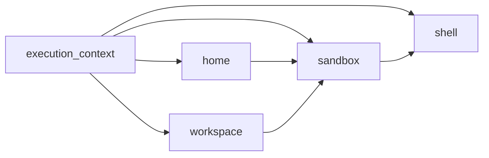

# Shell layer

The shell layer lets a Dify Agent run expose a `shellctl`-backed workspace to the
model. This page is for Dify Agent clients that build `CreateRunRequest`
payloads. It explains how to add the layer to a run composition and how the
server-side runtime must be wired.

The layer type id is `dify.shell`. Its public config contains only product-level
Shell behavior:

```python
from dify_agent.layers.shell import (
    DIFY_SHELL_LAYER_TYPE_ID,
    DifyShellEnvVarConfig,
    DifyShellLayerConfig,
)
from dify_agent.protocol import RunLayerSpec

RunLayerSpec(
    name="shell",
    type=DIFY_SHELL_LAYER_TYPE_ID,
    deps={"execution_context": "execution_context", "sandbox": "sandbox"},
    config=DifyShellLayerConfig(
        env=[DifyShellEnvVarConfig(name="REPORT_FORMAT", value="markdown")],
        redact_patterns=["private-[A-Za-z0-9]+"],
    ),
)
```

| Config field | Meaning |
| --- | --- |
| `agent_stub_drive_ref` | Optional Drive ref used by shell-visible Agent Stub commands. |
| `cli_tools` | CLI bootstrap declarations with install commands and scoped env metadata. |
| `env` | Normal environment variables exported to Shell commands. |
| `secret_refs` | Names of secret environment variables supplied by the Sandbox host. |
| `redact_patterns` | Request-level regex patterns removed from Shell output shown to the model. |

Server-only settings select a coherent runtime backend. They are not part of
`DifyShellLayerConfig` and should not be submitted by clients in the public run
request.

## Runtime requirements

When a run includes `dify.shell`, the Dify Agent server must construct its layer
providers with a runtime backend profile. The profile owns Home Snapshot and
Sandbox control-plane operations; the shell layer only consumes the Sandbox
layer's shellctl data plane:

```python
from dify_agent.runtime.compositor_factory import create_default_layer_providers
from dify_agent.runtime_backend.profile import RuntimeBackendSettings, create_runtime_backend_profile

runtime_backend_profile = create_runtime_backend_profile(
    RuntimeBackendSettings(
        runtime_backend="local",
        local_sandbox_endpoint="http://127.0.0.1:5004",
        local_sandbox_auth_token="replace-with-shellctl-token",
    )
)

layer_providers = create_default_layer_providers(
    plugin_daemon_url="http://localhost:5002",
    plugin_daemon_api_key="replace-with-plugin-daemon-key",
    runtime_backend_profile=runtime_backend_profile,
)
```

In the FastAPI server, these values are read from environment-backed
`ServerSettings` fields:

```env
DIFY_AGENT_RUNTIME_BACKEND=local
DIFY_AGENT_LOCAL_SANDBOX_ENDPOINT=http://127.0.0.1:5004
DIFY_AGENT_LOCAL_SANDBOX_AUTH_TOKEN=replace-with-shellctl-token
```

`DIFY_AGENT_LOCAL_SANDBOX_AUTH_TOKEN` defaults to empty, which keeps the shell
client on the no-token path. Set it only when the shellctl server uses bearer
authentication. Enterprise and E2B deployments instead set
`DIFY_AGENT_RUNTIME_BACKEND=enterprise` or `e2b` and the corresponding private
endpoint or API-key settings.

To let commands inside user-visible shell jobs call back to the Dify Agent server
with `dify-agent ...`, also enable the Agent Stub:

```env
DIFY_AGENT_STUB_API_BASE_URL=https://agent.example.com/agent-stub
# This is security-sensitive: it derives the JWE encryption key for Agent Stub bearer tokens.
# Replace this development default in production.
# Generate one with: python -c 'import secrets; print(secrets.token_urlsafe(32))'
DIFY_AGENT_SERVER_SECRET_KEY=MDEyMzQ1Njc4OWFiY2RlZjAxMjM0NTY3ODlhYmNkZWY
```

HTTP `DIFY_AGENT_STUB_API_BASE_URL` may be either the service root or the
explicit `/agent-stub` API root; the server normalizes the service root to
`/agent-stub`. Other HTTP paths are rejected at startup.

The supplied Docker and `.example.env` configs use a development
`DIFY_AGENT_SERVER_SECRET_KEY`. Override it in production with unpadded base64url
text for exactly 32 decoded bytes. One way to generate it is:

```bash
python -c 'import secrets; print(secrets.token_urlsafe(32))'
```

## Client request shape

A shell-enabled request must include the complete resource graph:



The configs carry stable logical state. `home.snapshot_ref` is the immutable
backend-native ref saved by Dify API, and `workspace.workspace_id` is the
runtime session id. Sandbox config is empty because deployment settings select
the backend. Shell config contains only public tool behavior; it does not carry
an endpoint, credentials, Home path, Workspace path, or Sandbox id.

Shell consumes `SandboxLease.commands`, `SandboxLease.files`, and
`SandboxLease.layout`. Its execution-context dependency provides identity for
request-scoped Agent Stub environment values, not resource ownership.

## Example request

```python {test="skip" lint="skip"}
from agenton_collections.layers.plain import PromptLayerConfig
from dify_agent.layers.dify_plugin.configs import DifyPluginLLMLayerConfig
from dify_agent.layers.execution_context import (
    DIFY_EXECUTION_CONTEXT_LAYER_TYPE_ID,
    DifyExecutionContextLayerConfig,
)
from dify_agent.layers.home import DIFY_HOME_LAYER_TYPE_ID, DifyHomeLayerConfig
from dify_agent.layers.sandbox import DIFY_SANDBOX_LAYER_TYPE_ID, DifySandboxLayerConfig
from dify_agent.layers.shell import DIFY_SHELL_LAYER_TYPE_ID, DifyShellLayerConfig
from dify_agent.layers.workspace import DIFY_WORKSPACE_LAYER_TYPE_ID, DifyWorkspaceLayerConfig
from dify_agent.protocol import DIFY_AGENT_MODEL_LAYER_ID
from dify_agent.protocol.schemas import CreateRunRequest, RunComposition, RunLayerSpec


runtime_session_id = "5e64c6b6-4cc2-4db7-886e-3f30e24c8141"
request = CreateRunRequest(
    composition=RunComposition(
        layers=[
            RunLayerSpec(
                name="prompt",
                type="plain.prompt",
                config=PromptLayerConfig(
                    prefix="Use the isolated workspace when local computation helps.",
                    user="Create report.txt containing the current UTC timestamp, then summarize it.",
                ),
            ),
            RunLayerSpec(
                name="execution_context",
                type=DIFY_EXECUTION_CONTEXT_LAYER_TYPE_ID,
                config=DifyExecutionContextLayerConfig(
                    tenant_id="92cca973-2d6f-45e0-906e-0b7eda5f2ccf",
                    agent_id="8d542564-159d-4168-985c-dde8d8ff6092",
                    agent_config_version_id="931a4cee-4434-4c1c-8fbd-0a3c7591095d",
                    agent_config_version_kind="snapshot",
                    agent_mode="workflow_run",
                    invoke_from="debugger",
                ),
            ),
            RunLayerSpec(
                name="home",
                type=DIFY_HOME_LAYER_TYPE_ID,
                deps={"execution_context": "execution_context"},
                config=DifyHomeLayerConfig(snapshot_ref="backend-native-home-snapshot-ref"),
            ),
            RunLayerSpec(
                name="workspace",
                type=DIFY_WORKSPACE_LAYER_TYPE_ID,
                deps={"execution_context": "execution_context"},
                config=DifyWorkspaceLayerConfig(workspace_id=runtime_session_id),
            ),
            RunLayerSpec(
                name="sandbox",
                type=DIFY_SANDBOX_LAYER_TYPE_ID,
                deps={
                    "execution_context": "execution_context",
                    "home": "home",
                    "workspace": "workspace",
                },
                config=DifySandboxLayerConfig(),
            ),
            RunLayerSpec(
                name="shell",
                type=DIFY_SHELL_LAYER_TYPE_ID,
                deps={"execution_context": "execution_context", "sandbox": "sandbox"},
                config=DifyShellLayerConfig(),
            ),
            RunLayerSpec(
                name=DIFY_AGENT_MODEL_LAYER_ID,
                type="dify.plugin.llm",
                deps={"execution_context": "execution_context"},
                config=DifyPluginLLMLayerConfig(
                    plugin_id="langgenius/gemini",
                    model_provider="google",
                    model="gemini-2.5-flash",
                    credentials={"google_api_key": "<redacted>"},
                ),
            ),
        ]
    )
)
```

The resource portion serializes to this shape:

```json
{
  "composition": {
    "schema_version": 1,
    "layers": [
      {
        "name": "execution_context",
        "type": "dify.execution_context",
        "config": {
          "tenant_id": "92cca973-2d6f-45e0-906e-0b7eda5f2ccf",
          "agent_id": "8d542564-159d-4168-985c-dde8d8ff6092",
          "agent_config_version_id": "931a4cee-4434-4c1c-8fbd-0a3c7591095d",
          "agent_config_version_kind": "snapshot",
          "agent_mode": "workflow_run",
          "invoke_from": "debugger"
        }
      },
      {
        "name": "home",
        "type": "dify.home",
        "deps": {"execution_context": "execution_context"},
        "config": {"snapshot_ref": "backend-native-home-snapshot-ref"}
      },
      {
        "name": "workspace",
        "type": "dify.workspace",
        "deps": {"execution_context": "execution_context"},
        "config": {"workspace_id": "5e64c6b6-4cc2-4db7-886e-3f30e24c8141"}
      },
      {
        "name": "sandbox",
        "type": "dify.sandbox",
        "deps": {
          "execution_context": "execution_context",
          "home": "home",
          "workspace": "workspace"
        },
        "config": {}
      },
      {
        "name": "shell",
        "type": "dify.shell",
        "deps": {"execution_context": "execution_context", "sandbox": "sandbox"},
        "config": {}
      }
    ]
  }
}
```

The default exit intent is `suspend`, so the returned Sandbox handle and latest
Workspace can be resumed or browsed. When the owning runtime session is being
retired, send a cleanup run with `on_exit.default="delete"`; that deletes the
Sandbox and its Workspace but does not delete the config-version-owned Home
Snapshot.

See [Runtime resources](../../concepts/runtime-resources/index.md) for state
ownership, file access, failure semantics, and backend lifecycle details. The
[Operations Guide](../../guide/index.md) covers Local and E2B validation.
