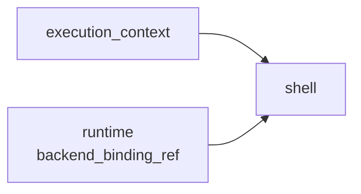

# Shell layer

The `dify.shell` layer exposes shellctl-backed commands to an Agent.
It does not select a backend or own persistent Home, Workspace, or Binding
resources. It consumes the operation-scoped `RuntimeLease` opened by a sibling
`dify.runtime` layer.

## Public configuration

```python
from dify_agent.layers.shell import (
    DIFY_SHELL_LAYER_TYPE_ID,
    DifyShellEnvVarConfig,
    DifyShellLayerConfig,
)
from dify_agent.protocol import RunLayerSpec

RunLayerSpec(
    name="shell",
    type=DIFY_SHELL_LAYER_TYPE_ID,
    deps={"execution_context": "execution_context", "runtime": "runtime"},
    config=DifyShellLayerConfig(
        env=[DifyShellEnvVarConfig(name="REPORT_FORMAT", value="markdown")],
        redact_patterns=["private-[A-Za-z0-9]+"],
    ),
)
```

| Config field | Meaning |
| --- | --- |
| `cli_tools` | CLI bootstrap declarations with install commands and scoped environment metadata. |
| `env` | Normal environment variables exported to Shell commands. |
| `secret_refs` | Names of secret environment variables supplied by the backend environment. |
| `redact_patterns` | Request-level regex patterns removed from Shell output shown to the model. |

Endpoints, credentials, Home/Workspace paths, resource refs, timeouts, and
network policy are not Shell config. Backend selection is server-private, and
the opaque Binding ref belongs to `DifyRuntimeLayerConfig`.

## Runtime requirements

The server constructs one coherent runtime backend profile. Local and E2B
implement Home Snapshot and Execution Binding operations. Enterprise implements
default-Home Binding creation, acquisition, and coupled destruction, while
immutable Home Snapshot operations fail fast; there is no compatibility
fallback to the retired Sandbox protocol.

```python
from dify_agent.runtime.compositor_factory import create_default_layer_providers
from dify_agent.runtime_backend.profile import RuntimeBackendSettings, create_runtime_backend_profile

runtime_backend_profile = create_runtime_backend_profile(
    RuntimeBackendSettings(
        runtime_backend="local",
        local_sandbox_endpoint="http://127.0.0.1:5004",
        local_sandbox_auth_token="replace-with-shellctl-token",
    )
)

layer_providers = create_default_layer_providers(
    plugin_daemon_url="http://localhost:5002",
    plugin_daemon_api_key="replace-with-plugin-daemon-key",
    runtime_backend_profile=runtime_backend_profile,
)
```

Equivalent standalone environment settings are:

```env
DIFY_AGENT_RUNTIME_BACKEND=local
DIFY_AGENT_LOCAL_SANDBOX_ENDPOINT=http://127.0.0.1:5004
DIFY_AGENT_LOCAL_SANDBOX_AUTH_TOKEN=replace-with-shellctl-token
# Optional when shellctl runs directly on a host without /home/dify:
# DIFY_AGENT_LOCAL_SANDBOX_MATERIALIZED_HOME_ROOT=/tmp/dify-agent/materialized-homes
# DIFY_AGENT_LOCAL_SANDBOX_WORKSPACE_ROOT=/tmp/dify-agent/workspaces
# DIFY_AGENT_LOCAL_SANDBOX_HOME_SNAPSHOT_ROOT=/tmp/dify-agent/home-snapshots
```

The auth token may be empty when shellctl authentication is disabled. Dify-created
E2B Sandboxes disable public traffic at creation and access shellctl through the
E2B port proxy with its `traffic_access_token`. Acquiring a RuntimeLease fails if
E2B does not provide a non-empty token. This policy applies only to newly created
Sandboxes and does not retrofit existing ones.

To let shell jobs call the Agent Stub with `dify-agent ...`, configure a
Sandbox-reachable Agent Stub URL and a unique production secret. Remote
deployments normally use a public Agent ingress. Local Compose uses
`http://agent_backend:5050/agent-stub`, reached through the existing
`agent_ssrf_proxy`; this configuration does not change the Compose network
topology.

```env
DIFY_AGENT_STUB_API_BASE_URL=https://agent.example.com/agent-stub
DIFY_AGENT_SANDBOX_FILES_BASE_URL=https://dify.example.com
DIFY_AGENT_STUB_UPLOAD_FILE_SIZE_LIMIT=50
DIFY_AGENT_SERVER_SECRET_KEY=replace-with-unpadded-base64url-for-32-random-bytes
```

HTTP URLs may be either the service root or the explicit `/agent-stub` root.
The server normalizes a service root and rejects unrelated paths. The separate
Sandbox file base must point to the Dify API ingress serving `/files/*`; it is
used for CLI upload/download bytes, including Config file and skill pulls.
`DIFY_AGENT_STUB_UPLOAD_FILE_SIZE_LIMIT` belongs to the Agent service, is in
MiB, and defaults to `50`. The Agent service converts it to the signed upload
URL's byte limit. Any ingress or proxy in front of `/files/*` must allow that
file limit plus multipart framing and header overhead; its request-body limit
does not need to be numerically identical.

After `dify-agent file upload <path>` succeeds, the CLI prints JSON such as:

```json
{
  "transfer_method": "tool_file",
  "reference": "dify-file-ref:...",
  "public_download_url": "https://dify.example.com/files/tools/..."
}
```

`reference` is the persistent canonical file identity and should be stored in
structured output. `public_download_url` is a short-lived frontend presentation
address: it is an absolute URL when Dify API `FILES_URL` has a public origin,
or a same-origin `/files/...` relative URI when `FILES_URL` is empty. The CLI
does not access this field. The former ambiguous `download_url` upload-output
key is now named `public_download_url`.

Server-side Binding downloads use
`dify-agent file upload --no-download-link <path>`. This additive mode performs
the same streaming ToolFile upload but skips the download-request step and
prints only `transfer_method` plus the canonical `reference`. The regular
`file upload` command keeps the link-producing behavior shown above.

If the upload succeeds but creating the public URL fails, the command still
prints the canonical mapping and exits with an error containing an exact
`dify-agent file public-url <reference>` retry command. Run that command from a
new shell tool call to create the public URL without uploading the file again.
On success, `file public-url` prints the complete JSON mapping containing
`transfer_method`, `reference`, and `public_download_url`.

The Agent Stub authorization injected into a shell job is valid for five
minutes. It does not refresh inside an already-running process. If a command
reports that the authorization expired, start a new shell tool call and retry
the command (or its reported `file public-url` recovery command).

The injected JWE is masked as `***` in model-facing `shell_run`, `shell_wait`,
and `shell_input` observations. Raw shellctl output and files referenced by
`output_path` remain unchanged.

## Request graph

A shell-enabled run contains Execution Context, Runtime, and Shell layers:


```mermaid
flowchart LR
    EC["execution_context"] --> SH["shell"]
    RT["runtime<br/>backend_binding_ref"] --> SH
```

`DifyRuntimeLayer` acquires the Binding when the run's resource context opens
and releases it when that operation exits. `DifyShellLayer` uses the active
lease's commands, Home path, and Workspace path. It performs only
best-effort cleanup of shell jobs; the persistent Binding lifecycle remains in
Dify API.

## Example request

The Binding must already have been resolved or created by Dify API. Its backend
ref is opaque to the request builder:

```python {test="skip" lint="skip"}
from agenton_collections.layers.plain import PromptLayerConfig
from dify_agent.layers.dify_plugin.configs import DifyPluginLLMLayerConfig
from dify_agent.layers.execution_context import (
    DIFY_EXECUTION_CONTEXT_LAYER_TYPE_ID,
    DifyExecutionContextLayerConfig,
)
from dify_agent.layers.runtime import DIFY_RUNTIME_LAYER_TYPE_ID, DifyRuntimeLayerConfig
from dify_agent.layers.shell import DIFY_SHELL_LAYER_TYPE_ID, DifyShellLayerConfig
from dify_agent.protocol import DIFY_AGENT_MODEL_LAYER_ID
from dify_agent.protocol.schemas import CreateRunRequest, RunComposition, RunLayerSpec


request = CreateRunRequest(
    composition=RunComposition(
        layers=[
            RunLayerSpec(
                name="prompt",
                type="plain.prompt",
                config=PromptLayerConfig(
                    prefix="Use the workspace when local computation helps.",
                    user="Create report.txt containing the current UTC timestamp, then summarize it.",
                ),
            ),
            RunLayerSpec(
                name="execution_context",
                type=DIFY_EXECUTION_CONTEXT_LAYER_TYPE_ID,
                config=DifyExecutionContextLayerConfig(
                    tenant_id="92cca973-2d6f-45e0-906e-0b7eda5f2ccf",
                    user_id="replace-with-user-id",
                    user_from="account",
                    app_id="replace-with-app-id",
                    agent_id="8d542564-159d-4168-985c-dde8d8ff6092",
                    agent_config_version_id="931a4cee-4434-4c1c-8fbd-0a3c7591095d",
                    agent_config_version_kind="snapshot",
                    agent_mode="workflow_run",
                    invoke_from="debugger",
                ),
            ),
            RunLayerSpec(
                name="runtime",
                type=DIFY_RUNTIME_LAYER_TYPE_ID,
                config=DifyRuntimeLayerConfig(backend_binding_ref="opaque-backend-binding-ref"),
            ),
            RunLayerSpec(
                name="shell",
                type=DIFY_SHELL_LAYER_TYPE_ID,
                deps={"execution_context": "execution_context", "runtime": "runtime"},
                config=DifyShellLayerConfig(),
            ),
            RunLayerSpec(
                name=DIFY_AGENT_MODEL_LAYER_ID,
                type="dify.plugin.llm",
                deps={"execution_context": "execution_context"},
                config=DifyPluginLLMLayerConfig(
                    plugin_id="langgenius/gemini",
                    model_provider="google",
                    model="gemini-2.5-flash",
                ),
            ),
        ]
    )
)
```

The resource part serializes as:

```json
{
  "layers": [
    {
      "name": "runtime",
      "type": "dify.runtime",
      "config": {"backend_binding_ref": "opaque-backend-binding-ref"}
    },
    {
      "name": "shell",
      "type": "dify.shell",
      "deps": {"execution_context": "execution_context", "runtime": "runtime"},
      "config": {}
    }
  ]
}
```

## Paths and persistence

`RuntimeLease.layout.home_dir` and `workspace_dir` are absolute paths inside the
backend execution namespace. They are not host filesystem paths and are not
sent in the run request. Shell commands start in `workspace_dir`, while `HOME`
is forced to `home_dir`; `~` therefore resolves to the current Binding's
materialized Home. The runner also sets `TMPDIR`, `TMP`, and `TEMP` directly to
`workspace_dir`, making the active Workspace both the default `cwd` and the
temporary working space.

Workspace content persists with the Workspace until Dify API retires and
collects it. Releasing a RuntimeLease ends only the current operation. Dify API can later
browse the Binding filesystem through Dify Agent's private
`/execution-bindings/files/list`, `/execution-bindings/files/read`, and
`/execution-bindings/files/download` routes, each of which acquires a fresh
lease. Relative paths start in the Workspace, while `~` starts in the Binding's
Home. Download uses the installed CLI to stream a ToolFile upload and returns
only its canonical reference to Dify API.

On Local, multiple Bindings may share a Workspace while each receives a
separate materialized Home. Those directories may be siblings in one shellctl
namespace; path isolation restricts a lease to its Home and Workspace. On E2B,
one physical E2B resource currently represents both Binding and Workspace, so
shared Workspace attachment is unsupported.

See [Runtime resources](../../concepts/runtime-resources/index.md) for the
ledger and lifecycle contract. The [Operations Guide](../../guide/index.md)
covers Local and E2B validation.
