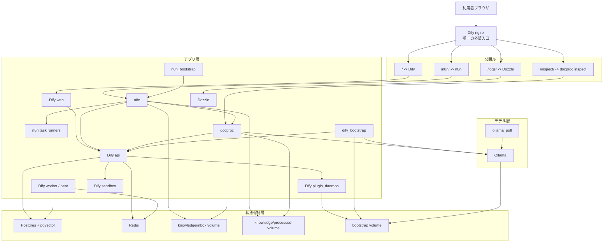

# ローカルセルフホスト RAG 構成

現在のローカル RAG リリース: `1.13.0-codex-rag.1`

作業場所は `/home/koishi/projects/codex_RAG/dify/docker` または対応する Windows 側ワークスペースです。  
起動は次の 1 回です。

```bash
docker compose up -d
```

公開 URL:

- `http://localhost/` -> Dify
- `http://localhost/n8n/` -> n8n
- `http://localhost/logs/` -> Dozzle
- `http://localhost/inspect/` -> docproc のレイアウト解析確認画面

## この構成で追加したこと

- Dify 付属の `nginx` を外部公開の唯一の入口に固定
- ベクトル DB を `pgvector` 対応 Postgres に統一
- `weaviate` を使わず、Postgres 系プロファイルで動作
- 同一 `docker-compose.yaml` に `n8n`、`n8n task runners`、`docproc`、`Ollama`、`ollama_pull`、`dify_bootstrap`、`n8n_bootstrap`、`Dozzle` を統合
- 初回起動時に `dify_plugin` と `n8n` 用 DB を自動作成
- Dify 管理者、Ollama provider、モデル設定、デフォルト dataset、dataset API key、n8n owner、n8n workflow を自動作成

## コンテナ一覧と目的

- `nginx`
  外部公開の唯一の入口です。`/` を Dify、`/n8n/` を n8n、`/logs/` を Dozzle、`/inspect/` を docproc の確認画面に振り分けます。
- `web`
  Dify のフロントエンドです。
- `api`
  Dify の API 本体です。dataset、会話、モデル呼び出し設定などを扱います。
- `worker`
  Dify の非同期ジョブ実行用です。文書処理やバックグラウンドタスクを担当します。
- `worker_beat`
  Dify の定期ジョブスケジューラです。
- `plugin_daemon`
  Dify plugin の実行管理です。Ollama provider plugin もここで扱います。
- `sandbox`
  Dify のコード実行隔離環境です。
- `ssrf_proxy`
  Dify 付属の外向き通信制御用プロキシです。
- `db_postgres`
  `pgvector` 対応 Postgres です。Dify、n8n、全文検索ベクトル保存をまとめて持ちます。
- `redis`
  Dify のキュー、キャッシュ、ジョブ制御用です。
- `ollama`
  会話モデルと embedding モデルをローカル実行します。
- `ollama_pull`
  初回起動時に必要な Ollama モデルを自動取得するワンショットジョブです。
- `docproc`
  文書前処理サービスです。PDF/画像/Excel を解析し、タグ付き markdown/json を生成して Dify 同期も行います。
- `n8n`
  バックエンドフロー制御です。定期取り込みや連携処理を担当します。
- `n8n_runners`
  n8n の external task runners です。Code/Python 実行を本体から分離します。
- `n8n_bootstrap`
  n8n の初回 owner 作成と workflow import / activate を自動化するワンショットジョブです。
- `dify_bootstrap`
  Dify の初回管理者作成、Ollama provider 登録、dataset 作成、API key 作成を自動化するワンショットジョブです。
- `dozzle`
  各コンテナログの閲覧 UI です。`/logs/` 配下だけで見えるようにしています。

## 全体構成



## 自動生成される認証情報

- Dify 管理者メール: `.env` の `DIFY_ADMIN_EMAIL`
- Dify 管理者パスワード: `.env` の `DIFY_ADMIN_PASSWORD`
- n8n owner メール: `.env` の `N8N_OWNER_EMAIL`
- n8n owner パスワード: `.env` の `N8N_OWNER_PASSWORD`
- 共通 Postgres ユーザー: `postgres`
- 共通 Postgres パスワード: `.env` に保存

## 起動後の確認

- `docker compose ps`
- `docker compose logs nginx --tail=50`
- `docker compose logs dify_bootstrap --tail=80`
- `docker compose logs n8n_bootstrap --tail=80`
- `docker compose logs ollama_pull --tail=50`
- `docker compose logs docproc --tail=50`

## レイアウト解析の確認方法

- 管理者は `http://localhost/inspect/` を開くと、処理済み文書の一覧を確認できます
- 各文書の詳細画面では `document.json`、`document.md`、ページ全体の bbox overlay を確認できます
- 新しいファイルは `knowledge/inbox` に入り、n8n の自動取り込み後にこの画面へ出ます
- overlay は確認用です。回答時のリンクは元ファイルとページ番号を返す前提です

## 文書前処理 API

- `POST http://docproc:8081/scan`
  `/data/inbox` を走査して `/data/processed` へ出力
- `POST http://docproc:8081/process`
  `{"path":"inbox からの相対パス"}` で単体処理
- `GET http://docproc:8081/health`
  サービス状態確認
- ホスト側からは `http://localhost/docproc/health` のように `/docproc/` 経由で同じ API を確認可能

## Dify 同期 API

- `GET http://docproc:8081/dify/health`
  dataset 同期設定の確認
- `POST http://docproc:8081/dify/sync`
  `{"output_dir":"sample-book"}` で 1 件同期
- `POST http://docproc:8081/dify/sync-all`
  複数件同期。状態は `/data/processed/.dify-sync-state.json`
- 同期時には `document.md` 本文に `Retrieval Anchors` を埋め込み、さらに `doc_metadata` として `assets` / `references` / `page_count` などを Dify document に保存

## 評価ロック API

- `POST http://docproc:8081/eval-lock`
  評価中に n8n の定期 `/scan` と `/dify/sync-all` が dataset を変更しないようロック
- `GET http://docproc:8081/eval-lock`
  ロック状態確認
- `DELETE http://docproc:8081/eval-lock`
  ロック解除
- ロック中の `/scan` と `/dify/sync-all` は HTTP 200 のまま `{"status":"skipped","reason":"eval_lock_active"}` を返す
- ホスト側からは `http://localhost/docproc/eval-lock` で同じ API を利用可能

## 現在の前処理仕様

- PDF を `text-heavy` と `image-heavy` に分岐
- `pdfplumber` でテキスト PDF の文字、表、画像 bbox を取得
- ラスタ画像と画像中心 PDF は Tesseract TSV OCR を使用
- Excel は `openpyxl` で全シートを処理
- タグ付き `markdown/json` を出力
- PDF はページ全体の bbox オーバーレイ画像も出力
- `caption_text` と `context_text` を分離保存
- 図表分類は `graph / image / photo / table`
- ヘッダーとフッター本文は本文チャンクから除去し、`page_artifacts` に保存
- Dify dataset へ text API で upsert 可能
- `references` と `referenced_by` を本文チャンク側と asset 側の両方に保持
- 回答安定化のため、Dify 側には本文アンカーと document metadata の両方を送る

## 現在の検索仕様

- Dify dataset の `retrieval_model` は bootstrap で `hybrid_search` に自動設定
- ベクトル検索は `pgvector`
- 全文検索は Postgres 側で `codex_normalize_search_text()` を通した正規化検索
- `pg_bigm` と `pg_trgm` の両方を利用し、日本語の全角半角や表記揺れに強めています
- weighted score rerank を有効化し、`vector_weight=0.65`、`keyword_weight=0.35` を既定値にしています
- 引用ページは chunk 内の `page=` アンカーを最優先し、なければ `doc_metadata.references / assets` から候補ページを推定します
- `jieba` キーワード抽出には NFKC 正規化と日本語/CJK n-gram 補助を追加しています

## 現在の制約

- `n8n` を `/n8n/` 配下で公開しているため、公式推奨のサブドメイン構成よりは不安定要素がある
- 初回だけ `https://marketplace.dify.ai` への外向き通信が必要
- 画像中心文書は軽量ヒューリスティック実装であり、大規模な専用レイアウトモデルは未使用
- `n8n` は MIT ではなく source-available ライセンス

## Dify 自動 bootstrap

- `dify_bootstrap` が初回管理者作成、Ollama plugin 取得、モデル登録、dataset 作成、dataset API key 作成、`.env` と `./volumes/bootstrap/dify.generated.json` への保存を担当
- `docproc` は `DIFY_RUNTIME_CONFIG_PATH` をリクエスト時に読むため、起動後の 2 回目 restart は不要
- `./volumes/bootstrap/cache` の `.difypkg` は再起動時に再利用

## n8n 自動 bootstrap

- `n8n_bootstrap` が初回 owner 作成と `Knowledge Inbox Auto Sync` workflow の import / activate を担当
- workflow は 1 分ごとに `http://docproc:8081/scan` と `http://docproc:8081/dify/sync-all` を実行
- 評価ロック中は同じ workflow が走っても docproc 側が `skipped` を返すため、n8n を止めずに評価できます
- 結果は `./n8n/bootstrap/n8n-bootstrap-summary.json` に保存

## 検索追跡の確認方法

- 詳細説明と図は `RETRIEVAL_STAGE_GUIDE.md` を参照
- 管理者は `http://localhost/inspect/retrieval/` を開くと、問い合わせごとの検索追跡を確認できます
- Stage 1 では `semantic_query / lexical_query / pages / reference_labels / exact_terms` などの query decomposition を表示します
- Stage 2 では文書事前フィルタの候補、採用可否、採用理由を表示します
- Stage 3A では採用文書内の inspect block 候補を表示し、tag / type / page / caption / context / excerpt を追えます
- Stage 3A は `caption / context / text / structured_text / ocr / x_axis / y_axis / legend` の field ごとの重み付き内訳も表示します
- Stage 3B では Dify の `document_segments` に実際に入った runtime chunk 候補と field breakdown を確認できます
- Stage 4A では runtime chunk から Dify フロントへ渡る `retriever_resources` を投影した候補を確認できます
- Stage 4B では同じ query を実際に Dify で実行済みなら、保存済み回答と保存済み参考元を確認できます
- `raw JSON` リンクから、同じ内容を JSON でも確認できます
- 文書事前フィルタは API 側の query decomposition / prefilter ロジックと揃えてあり、block 候補表示は inspect 用のローカル可視化です

## 定量評価

- 評価ケース定義: `C:\Users\haya-\Lab\PrivateProject\xx_Codex_RAG\dify\docker\eval\eval_cases.json`
- 評価スクリプト: `C:\Users\haya-\Lab\PrivateProject\xx_Codex_RAG\dify\docker\tools\evaluate_rag.py`
- 最新結果 JSON: `C:\Users\haya-\Lab\PrivateProject\xx_Codex_RAG\dify\docker\eval\results\eval-results.json`
- 最新結果 Markdown: `C:\Users\haya-\Lab\PrivateProject\xx_Codex_RAG\dify\docker\eval\results\EVAL_REPORT.md`
- retrieval 側は `document top1 / page top1 / hit_any / citation page present` を計測
- chat 側は `timeout` を持たせて `answer keyword hit / reference doc hit / reference page hit` を別集計
- 現状は retrieval 側の数字が安定しており、chat 側はローカル LLM 応答時間の影響を強く受ける
- `evaluate_rag.py` は既定で `http://localhost/docproc/eval-lock` に評価ロックを張り、終了時に解除します。無効化が必要な場合のみ `--no-eval-lock` を使います

## 業務用フロント `/chat/`

- URL: `http://localhost/chat/`
- `chat_ui` コンテナを追加し、Dify 管理画面とは別の軽量 UI として公開
- ブラウザからは `/chat/api/chat-messages` を叩くが、実際の app token は `chat_ui` コンテナ内で付与される
- 回答には参考元の文書名とページ番号を表示
- `/chat/` 配下で static asset が完結するようにしてあり、`/` の Dify UI へ影響を与えない


## 評価ノイズ分離
- `DIFY_SYNC_EXCLUDE_GLOBS` を追加し、既定で `testcases/font-ocr/**` を Dify dataset 同期対象から除外
- `POST http://docproc:8081/dify/purge-excluded` で、既に同期済みの除外対象文書を dataset から削除可能
- `evaluate_rag.py` に `--chat-only-when-retrieval-passes` と `--max-chat-cases` を追加し、retrieval 評価と chat 評価を分離可能
- `evaluate_rag.py` は評価ロックを利用し、n8n の自動同期による評価中の dataset 変動を抑止可能
