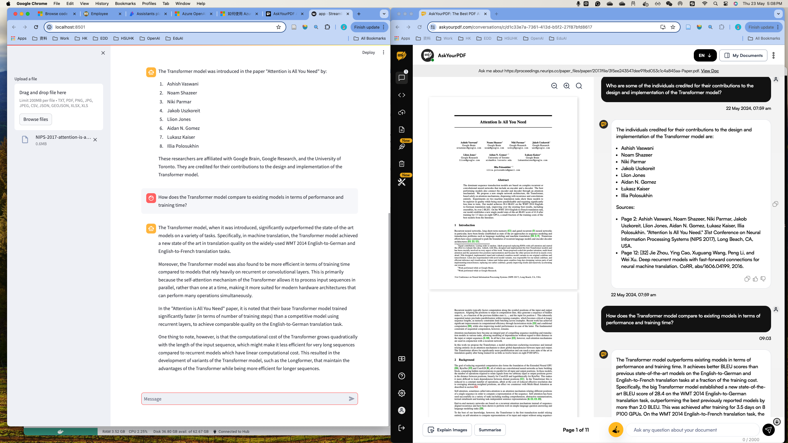
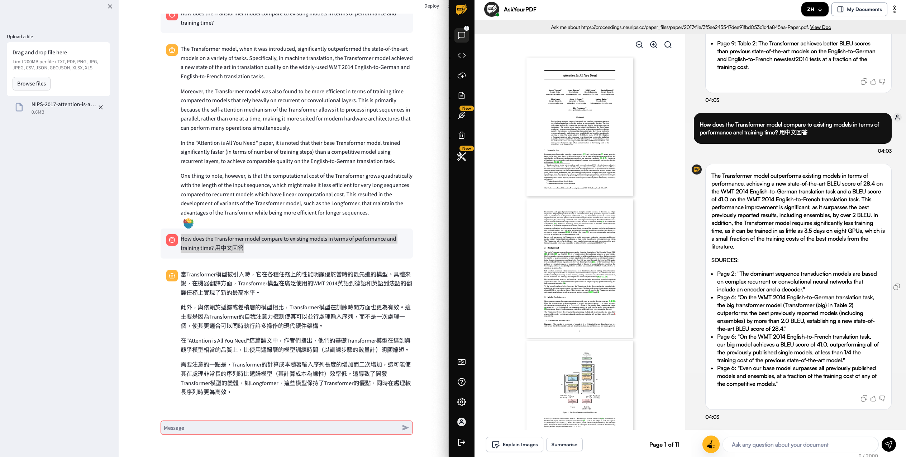
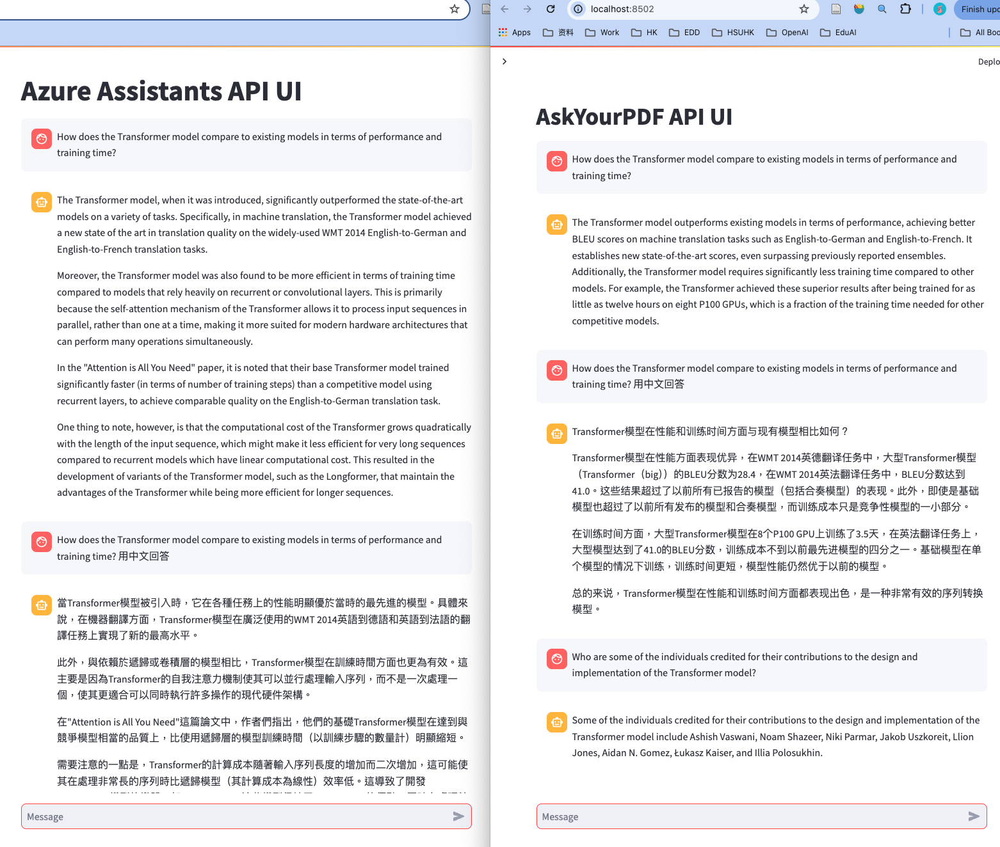
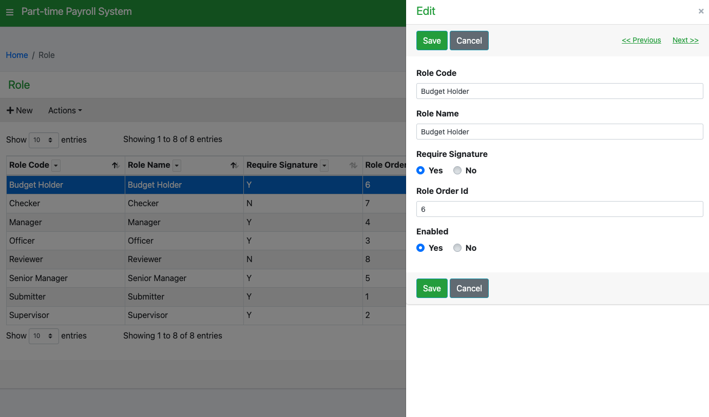
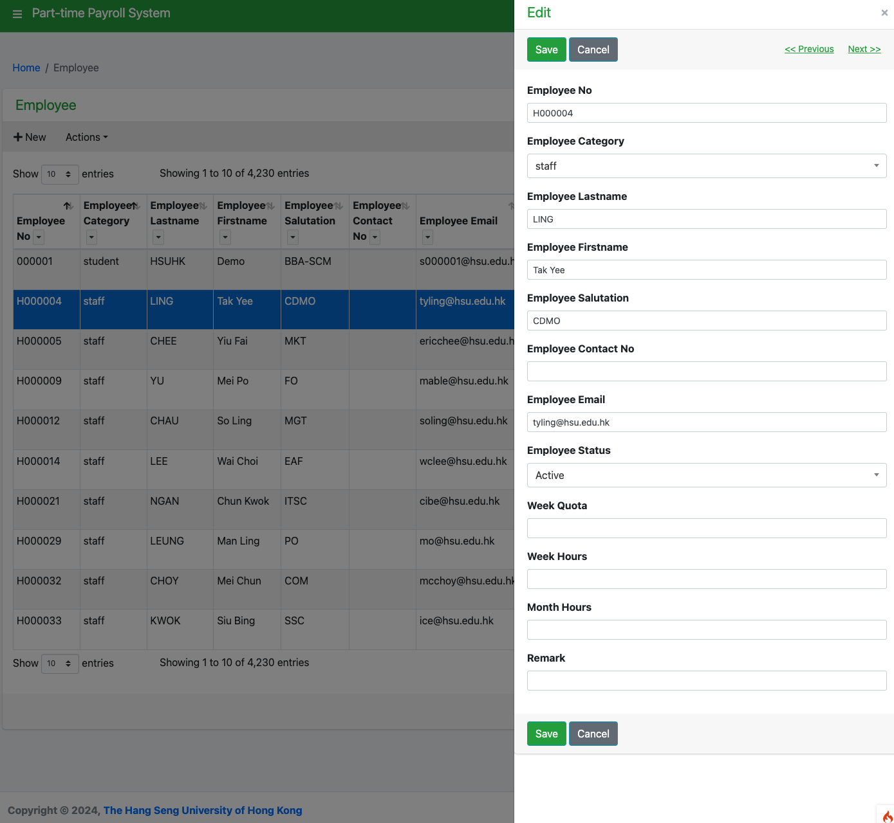
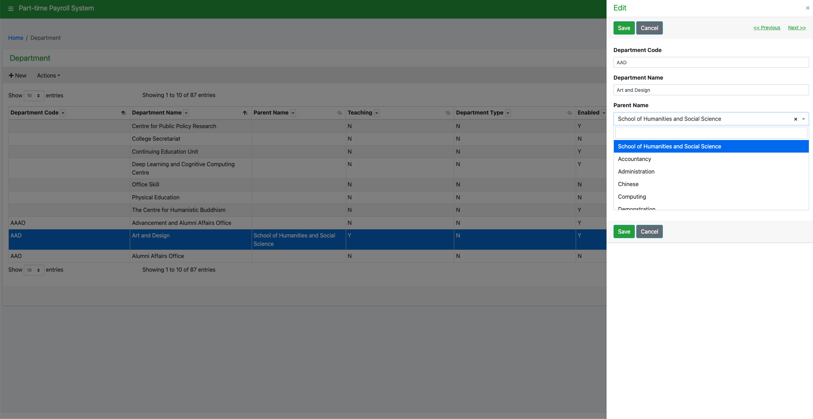
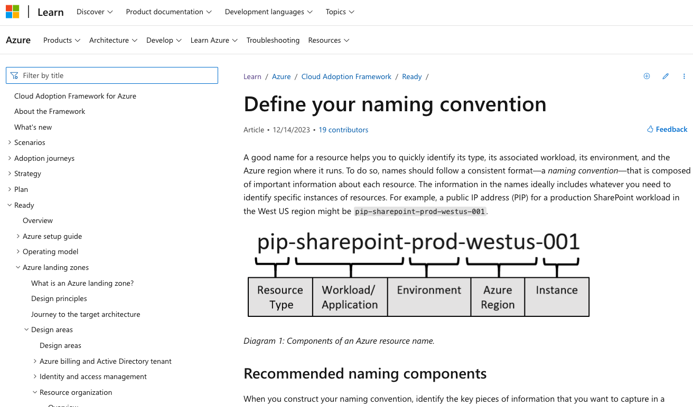

# Weekly Report

====================

_Jack Jianfeng Xia_
_04 Jun 2024_
HSUHK ITSC ADT

---

## Weekly Report

- Developing PT Payroll System by codeigniter: Role, employee, department page.
- Compared Azure AI & AskYourPDF, developed 2 demos for each APIs.
- Meeting with Microsoft, Maintaining ChatGPT server, reports and upgrade.
- Meeting with Arthur about Azure service and naming concention standard.
- Start on create Azure related service using Azure Developer Cli and DevOps tools.

Todo:

- The function for users to have a quota of 60 ChatGPT 4.0 messages in each month.
- The function for users to upload a PDF, and then ask questions related to the PDF.
- The function for teachers to create a topic and upload a number of documents.  Then create an agent to answer questions related to the course.

---

## Compare Azure AI & AskYourPDF

|      | Azure AI                                                                                                                                                                  | AskYourPDF                                                                                                                                                       |
| ---- | ------------------------------------------------------------------------------------------------------------------------------------------------------------------------- | ---------------------------------------------------------------------------------------------------------------------------------------------------------------- |
| Pros | 1. Offers many AI services such as ML, Cognitive Services, etc.  2. Highly scalable and robust AI services.   3. Integrated with Azure's security.   | 1. Specialized in converting PDF documents to readable and editable formats.  2. Easy to use and does not require technical knowledge.                    |
| Cons | 1. Complex to use.  2. Need budget management.   3. Requires knowledge of Azure's cloud ecosystem.                                                          | 1. Limited functionality.  2. US$19.99/m plan allows 2k messages & 30k doc pages & 100 docs monthly.   3. Default is GPT3, extra charges for GPT4. |

---

---

---

---

---

---

---

