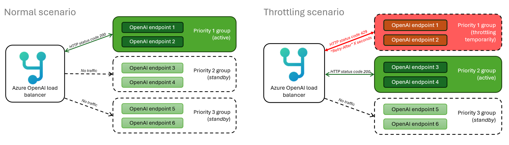
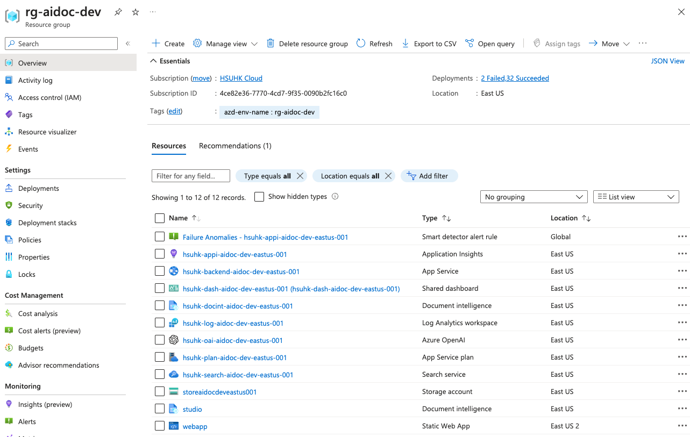

# Weekly Report

====================

_Jack Jianfeng Xia_
_02 Jul 2024_
HSUHK ITSC ADT

---

## Weekly Report

- Created Azure related service using Azure Developer Cli and DevOps tools.
- Study Azure search and its api integration with GPT for demos
- Meeting with Arthur about new Azure subscription.
- Developing PT Payroll System by codeigniter: No updates.

---

## Azure AI Search OpenAI Service Cost

- Azure App Service [Pricing](https://azure.microsoft.com/pricing/details/app-service/linux/)
- Azure OpenAI [Pricing](https://azure.microsoft.com/pricing/details/cognitive-services/openai-service/)
- Azure AI Document Intelligence [Pricing](https://azure.microsoft.com/pricing/details/form-recognizer/)
- Azure AI Search [Pricing](https://azure.microsoft.com/pricing/details/search/)
- Azure Blob Storage [Pricing](https://azure.microsoft.com/pricing/details/storage/blobs/)
- Azure Monitor [Pricing](https://azure.microsoft.com/pricing/details/monitor/)

Try the [Azure pricing calculator](https://azure.com/e/d18187516e9e421e925b3b311eec8aae) for the resources

---

## Azure GPT-4o load balancer Deployment

https://learn.microsoft.com/en-gb/azure/developer/python/get-started-app-chat-scaling-with-azure-container-apps?tabs=github-codespaces%2Cinitial-deployment

---

## Azure Search OpenAI Demo

Todo:

- Knowledge Prepare: Upload the PDFs
  - Upload the PDFs to Azure Blob Storage
  - Turn PDF into text using Azure Document Intelligence
  - Split the PDF's txt into chunks of text and stores in AI Search index
    - about 200 words each
    - strategy - duplicate 5% chunks, Q&A format
  - Create new index and Fields
  - Vectorize data using OpenAI Embedding and stores in index
- AI Search: knowledge retrieval for GPT
  - vector algorithm "hnsw_config"
    - Bi-directional link count (m): 4
    - efConstruction: 400
    - efSearch: 500
    - Similarity metric: cosine
  - Semantic ranker uses deep neural networks to provide relevant results
  - Answers based on semantics, not just lexical analysis
- Retrieval Augmented Generation (RAG): Prompt + knowledge retrieval (AI Search)
  - Inverted Index, Top K: 5~10
  - Score Threshold
  - Hybrid Search
  - Rerank Model for Vector Search and Keyword Search
  - N-to-1 Retrieval or Multi-path Retrieval
- Others:
  - Adding an OpenAI load balancer
  - Setting up Microsoft Entra applications
  - Setting up document level access control

---

---

