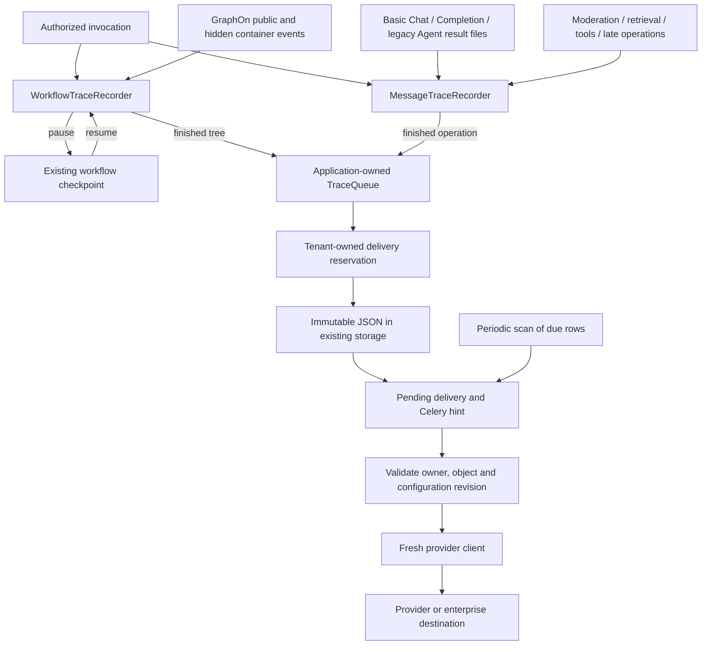

# OPS tracing rewrite

Status: implementation architecture. This document describes the replacement in this branch; the release checks below distinguish local verification from database, live-provider and load verification.

This rewrite addresses [issue #41409](https://github.com/langgenius/dify/issues/41409). A logical operation owns its recorder, a worker's Flask application owns its queue, and a tenant-owned database row owns each delivery attempt. Source identity and destination are explicit at every boundary.

The branch was created from Dify commit `94309f00c9f179214ea42da3c3043904db71fb46`. GraphOn remains pinned to `0.7.0`, commit `3b01649d0251e1e2dc3743da71fd3c8438a71f25`; this implementation does not patch or vendor the engine. There is one OPS implementation, with no old/new routing switch or compatibility wrapper.

## 1. Ownership and files



| File | Responsibility |
| --- | --- |
| [trace_data.py](../../api/core/ops/trace_data.py) | Typed source, spans, completed tree, destination identity, queued bytes, parent reference and bounded copying |
| [workflow_trace.py](../../api/core/ops/workflow_trace.py) | Engine execution IDs, exact execution parents, retry attempts, child workflow views and pause state |
| [message_trace.py](../../api/core/ops/message_trace.py) | Common message/operation collection and late-operation references |
| [basic_chat_trace.py](../../api/core/ops/basic_chat_trace.py) | Basic Chat result callback |
| [completion_trace.py](../../api/core/ops/completion_trace.py) | Completion/Text Generator result callback; this is the existing mode corresponding to “Computation” |
| [legacy_agent_trace.py](../../api/core/ops/legacy_agent_trace.py) | Legacy agent-chat result and thought interpretation |
| [trace_queue.py](../../api/core/ops/trace_queue.py) | Queue admission, byte budgets, one writer and durable acceptance |
| [provider_config.py](../../api/core/ops/provider_config.py) | Configuration schemas, encryption and secret field selection |
| [provider_export.py](../../api/core/ops/provider_export.py) | Fresh client construction, synchronous HTTP/OTLP support and receipt ownership |
| [trace_source.py](../../api/core/ops/trace_source.py) | Authorized source/destination lookup, recorder creation, message enrichment and enterprise source handling |
| [ops_trace_service.py](../../api/services/ops_trace_service.py) | Controller-facing reads and updates of the app's selected tracing settings |
| [ops_trace_delivery_repository.py](../../api/repositories/ops_trace_delivery_repository.py) | Reservations, conditional claims, owner checks, parent lookup and retention |
| [ops_trace.py](../../api/models/ops_trace.py) | Delivery table and derived storage keys |
| [ops_trace_task.py](../../api/tasks/ops_trace_task.py) | One delivery attempt |
| [ops_trace_maintenance_task.py](../../api/tasks/ops_trace_maintenance_task.py) | Wake due work and remove expired objects/rows |
| [ext_ops_trace.py](../../api/extensions/ext_ops_trace.py) | Application/worker startup, injected resources and shutdown |

Names describe the held value or action: `provider_settings`, `workflow_run_id`, `record_workflow_event`, `save_pause_state`, `submit_trace`, `write_pending_traces`, `export_trace`. Established engine/repository APIs keep their existing names. New OPS code has no module-level queue, logger, client, configuration cache, mutable registry, timer, `ContextVar` or other global variable. Classes and functions define behavior; state belongs to instances or calls.

Application startup stores the queue, repository and storage reference in that particular `app.extensions`. Invocation/task entry points resolve those resources once through the trace source functions and pass them to recorders or workers. Shared capture and queue code does not discover another request's Flask context. The writer receives the bound `app.app_context` method and opens a fresh context per item. App-owned queues have independent locks, counters and threads. Lifecycle hooks create them after worker fork and close them on shutdown; there is no first-request startup race.

The three retiring app files do not import one another. Their generators supply an invocation-local `record_message_result` function to the existing shared message pipeline. Workflow, common OPS and provider code do not branch on those three app modes or import their files. Removing a retiring application removes its result file and generator wiring. Newer Agent and advanced-chat use common message collection while Workflow owns their graph-node traces.

## 2. Concrete data

Models use Pydantic v2 with explicit fields. Frozen models prevent field replacement, but nested dictionaries are still mutable; the asynchronous boundary therefore contains serialized immutable `bytes`, never models retaining producer dictionaries, ORM records, engine nodes, callbacks or clients.

### Source and span

`TraceSource` carries:

| Field | Meaning |
| --- | --- |
| `tenant_id` | Required UUID from the authorized invocation |
| `app_id`, `pipeline_id` | Optional UUIDs; mutually exclusive; both absent only for a workspace operation |
| `operation_id` | UUID stable for one logical operation; workflow runs use the run ID and messages use the message ID |
| `workflow_run_id` | Existing persisted run UUID when applicable |
| `actor_id` | Account/end-user identity for metadata, never authorization |
| `message_id`, `conversation_id` | Optional UUID correlations validated against the app |
| `external_trace_id`, `session_id` | Bounded external correlation strings, never tenant proof or storage keys |

`source_type` is inferred from `app_id`/`pipeline_id`; the delivery table stores that inferred value as `app`, `pipeline` or `workspace`. `TraceSource` does not duplicate it.

`TraceSpan` holds `span_id`, `parent_span_id`, `span_name`, `span_type`, source app/pipeline/workflow/version, `node_execution_id`, graph-local `node_id`, `attempt`, UTC `started_at`/`ended_at`, `status`, `error`, copied `inputs`/`outputs`, `attributes`, `usage`, and bounded `events`. Terminal status is `ok`, `error`, `handled_error`, `cancelled` or `incomplete`. Open execution IDs are private recorder state. Unknown source timestamps remain absent.

Internal trace and span IDs are UUID5 values derived from tenant, operation and execution identity. GraphOn's execution UUID identifies an actual node execution; a graph-local node ID never determines its parent. Repeated loop bodies and parallel executions remain distinct.

`CompletedTrace` has schema version `2`, `source`, `trace_id`, `root_span_id`, parent-first `spans`, optional `parent`, correlation `links`, `complete` and `truncation`. Validation rejects duplicate IDs, absent roots and children preceding their parents. `complete=false` requires a reason.

### Destination and asynchronous work

`TraceProviderSettings` contains tenant/app, `destination_type` (`app_provider` or `enterprise`), provider name, configuration ID/revision and a settings fingerprint. The fingerprint is HMAC-SHA256 over the tenant ID and canonical settings, keyed by the deployment's `SECRET_KEY`; it does not expose a plain hash that could be used to guess credentials. It contains no decrypted credentials. An app-provider destination requires the same app as its trace source.

`QueuedTrace` contains `trace_json: bytes`, `provider_settings` and a deterministic `export_id` derived from source operation, root span and destination identity/revision. One trace with app and enterprise destinations becomes two independent work items, each with its own payload and delivery status.

`ParentSpanReference` carries only the original `export_id` and `span_id` for late operations. `ExportedParentSpans` contains provider-issued or deterministic parent IDs. Only the exported root receipt is persisted, bounded to 64 KiB; full workflow trees need no per-node cross-task coordination.

## 3. Workflow capture

The pinned engine exposes normalized public events to `Layer.on_event` and execution-parent identity to `node_run_context`. `WorkflowTraceRecorder` is the first layer registered by [WorkflowEntry](../../api/core/workflow/workflow_entry.py). Existing Dify [workflow-tool container callbacks](../../api/core/workflow/workflow_tool_container_handler.py) forward hidden descendant events to the same `record_workflow_event` method before persistence. The loop/iteration wrapper also forwards suppressed synthetic start-node events. No engine monkeypatch or new upstream hook is required.

GraphOn publishes public events before notifying layers. Dify therefore deep-copies each outgoing public event before exposing it to response consumers; those consumers cannot mutate the original while the recorder reads it. Response filtering remains unchanged. The recorder immediately makes its own bounded copies before later persistence layers can alter event contents.

`node_run_context(node, parent_execution_id=...)` registers exact execution relationships and validates the trusted `DifyRunContext` tenant. Child app/workflow/version identity comes from the existing authorized workflow-tool source resolution. A node object is not retained. A foreign tenant disables the affected recorder's export; its values are never copied. Missing/invalid parents produce explicit incomplete output rather than guessed parentage.

| Event or boundary | Action |
| --- | --- |
| Invocation / graph start | Create the root once; a resume continues restored identity and earlier spans |
| Node start | Populate the registered execution span; repeated starts do not duplicate it |
| Retry | Keep the logical node open and record the failed attempt with its actual result; final result gets its own attempt span |
| Success / exception / failure | Store the normalized outcome, timing, copied values and usage; handled failure remains distinct from fatal failure |
| Container result | Keep aggregate usage in attributes; leaf usage remains attributable to actual model calls |
| Graph pause | Record an observed pause event; preserve open nodes and attempt state |
| Graph terminal result | Record authoritative root outcome; finish only when engine closure completes |
| Engine closure | Seal once, finalize unfinished nodes as incomplete/cancelled, release recording budget, then submit outside the lock |
| Host stop/failure | Supply the terminal outcome even when the failure bypasses GraphOn's event hooks |

GraphOn retries reuse execution UUIDs and suppress repeated starts. `retry_index` names the upcoming attempt; a retry event describes the failed attempt and does not include a precise finish timestamp. Logical retry nodes retain the original start time; model usage lives on attempts to avoid counting it twice. Source `LLMUsage` supplies timing and usage, including TTFT where available. Stream chunks are not retained as spans and dispatcher arrival time is not presented as model-measured timing. GraphOn's naive timestamps are interpreted as UTC.

The root retains engine aggregate usage. Synthetic retry-attempt and agent-log spans carry `metrics_from_parent=true`; enterprise metric generation counts their original logical node instead. Container totals are not another model call. Workflow-agent output logs are converted once into their explicit round/model/tool children; monotonic log timings are preserved as metadata when wall-clock times are unavailable. [Workflow persistence](../../api/core/app/workflow/layers/persistence.py) now only persists execution records; it no longer reconstructs or enqueues an OPS workflow tree.

One recorder lock protects registration, bounded copying, event reduction, checkpointing and sealing. It is never held across node execution, database lookups, storage or provider requests. Child settings are resolved outside it; queue submission occurs after releasing it. A sealed attempt rejects late callbacks, including workers that outlive engine shutdown.

### Nested app destinations

The outer trace includes authorized same-tenant descendants regardless of the child's selected tracing setting. A child cannot redirect the outer destination. At child invocation, capture the child's own current destination settings separately.

When that container finishes, freeze its descendant-only view, re-root it at the tool span with child app/workflow/version, use a distinct child operation/trace identity and submit its own destinations. Restore container aggregate usage on that child root. Exclude outer ancestors and siblings; retain the outer trace ID only as a link. A child without a separately persisted run has no invented `workflow_run_id`.

Child membership is recorded using `workflow_tool_invocation_id`, so tool retries that reuse the outer execution ID cannot combine different child attempts. A failed child view is completed at the normalized retry event before another invocation starts; each view uses that attempt's own result. A finished child can export before its parent pauses. Its submitted flag is checkpointed so resume does not submit it again. If the parent terminates before completion, the child view is explicitly incomplete. Root-off/child-on works because the root recorder remains available to collect authorized children even when the root destination list is empty. Provider-native IDs include tenant, export operation and internal span identity, so overlapping outer/child views cannot overwrite each other when destinations happen to share a project.

## 4. Pause, resume and timeout

[WorkflowResumptionContext](../../api/core/app/layers/pause_state_persist_layer.py) includes optional versioned `ops_trace_state`: original source and destinations, workflow identity/version, copied spans, execution mappings, attempts, open spans, child destinations/submission state, byte counts and incomplete reasons. It contains no secrets, locks, engine nodes or clients.

After engine closure, `persist_pending_pause` freezes this exact recorder beside runtime and response-filter state, before publishing the paused response. Storage failure remains at the existing explicit pause-persistence boundary. Pause does not export a completed root trace.

Both [async workflow resumption](../../api/tasks/async_workflow_tasks.py) and [workflow execution tasks](../../api/tasks/app_generate/workflow_execute_task.py) validate tenant/app/workflow/run ownership before restoring the checkpoint. The new recorder validates it again, preserves its original source and destinations, records an observed resume event and continues its stable IDs. Resume reconstruction also supplies the existing message/conversation and external/session IDs to the message recorder. An old checkpoint with no OPS state begins a new partial recording marked `pre_upgrade_checkpoint`.

A human-input node timeout resumes the timeout edge normally. A global timeout terminates outside GraphOn: [human_input_timeout_tasks](../../api/tasks/human_input_timeout_tasks.py) claims the owning paused run and unresumed pause, marks it stopped, finalizes the validated saved trace and removes the checkpoint. Resume and global timeout lock the same owning workflow-run row, so both cannot claim it. Checkpoint/export I/O runs outside that short transaction.

A pause never resumed or terminated produces no completed trace and follows workflow checkpoint retention. Process death before checkpoint persistence can lose collection. Pause/resume observations are bounded; they are not a durable event journal or exact engine-provided pause timestamps.

## 5. Messages and other operations

Basic Chat and Completion supply their small result callbacks; legacy Agent reads thought records through message → app → tenant ownership and contributes its rounds. Message loading validates message, conversation, app and tenant before copying prompt/output, attachments, model/provider, token/cost and timing metadata. The message ID is bound before moderation/retrieval/tool callbacks start.

Moderation, retrieval and tool callbacks record their operation while the message recorder is open. Common message completion runs after the message transaction commits, seals once and releases its budget even if capture fails. Advanced-chat messages contribute message metadata and operations outside the graph; they do not synthesize an additional LLM call from workflow aggregate tokens.

Suggested questions, conversation naming and callbacks arriving after sealing become separate operations. They retain the original parent reference and destination snapshot if they began with that recorder. New user-requested followups resolve the current authorized destination, attaching only when its exact owner/configuration revision matches the original delivery.

Late operations wait for a parent receipt by rescheduling the SQL row, without sleeping in a worker or consuming a send attempt. Parent tenant/source/destination mismatch cancels the child. Failed parents, unavailable receipts or a one-hour wait expiry export a standalone linked operation with an explicit parent-unavailable reason. Providers that cannot safely append to a completed trace use their linked form; Databricks does this to avoid overwriting a completed artifact. No external trace ID or matching endpoint is authority to restore a parent.

Standalone node and RAG pipeline draft producers continue through the explicit enterprise operation boundary. A pipeline source uses `pipeline_id`, validated against `Pipeline.tenant_id`, never an app-shaped impersonation. Full pipeline runs use the workflow recorder. Because task serialization excludes recorder instances, `PipelineRunner` recreates it after validating the pipeline, dataset and workflow in the execution worker. Prompt/code/structured-output/instruction generation also enter through their existing enterprise producers.

[The telemetry gateway](../../api/core/telemetry/gateway.py) sends trace events to OPS while metric/log events retain their existing enterprise delivery path. Enterprise trace export consumes supplied spans rather than loading workflow nodes again. Infrastructure [ObservabilityLayer](../../api/core/app/workflow/layers/observability.py) stays separate for live HTTP/database instrumentation.

## 6. Bounded queue and acceptance

`TraceQueue` owns `queue.Queue`, queue/recording locks, counters and one daemon writer. `submit_trace` uses `put_nowait`; caller execution never waits for storage or providers. Counters include an item while the writer owns it, and release in `finally`. A bad item does not discard subsequent items.

| Limit | Current behavior |
| --- | --- |
| One captured value: 64 KiB | Bound traversal, string bytes, nesting (12) and collection entries (256); scrub credential keys and signed URL query data; mark truncation |
| Recorder: 10,000 spans | Retain existing structure, count omitted spans and mark incomplete |
| Recorder content/structure reservation: 7 MiB | Leave room for root and serialization overhead under the queue limit |
| One queued trace: 8 MiB | Reject oversize admission |
| Active recording budget: 128 MiB per app-owned queue | Refuse further reservation; one tenant may use at most half |
| Queued work: 64 items / 128 MiB | Immediate rejection at total or per-tenant half-budget limits |

These are conservative byte-accounting bounds, not exact Python heap measurements. Root and span overhead are reserved; a representative load measurement is still required to tune deployment capacity. Independent app instances have independent, additive allocations. Per-tenant limits prevent consuming the entire queue but do not promise strict latency fairness.

The writer reserves a SQL staging row, writes immutable JSON to existing object storage, conditionally commits `staging → pending`, then publishes a Celery hint. Reservation/storage errors have three bounded local attempts. Publication uses the existing retry policy (three retries, intervals starting at zero and capped at two seconds); publication failure leaves a recoverable pending row.

**Admission** means only in-memory queue acceptance. **Durable acceptance** means the object exists and the reservation's conditional pending transition committed. A staging reservation is unaccepted. Crashing before durable acceptance may lose work; successful application execution is never retried to recreate a trace. After acceptance, delivery is recoverable and at least once. A short shutdown drain is helpful but is not the durability mechanism.

## 7. Delivery table and race prevention

`ops_trace_deliveries` stores:

| Field group | Contents |
| --- | --- |
| Identity / owner | `id`, `tenant_id`, inferred `source_type`, `app_id`, `pipeline_id` |
| Trace / correlations | `export_id`, `trace_id`, `operation_id`, `root_span_id`, message/conversation/run IDs |
| Destination | destination type, provider name, config ID/revision and settings hash |
| Object validation | SHA-256, byte size and schema version |
| Attempt | status, attempt count, next attempt time, random attempt token and lease expiry |
| Parent | original export/span ID, resolved delivery ID and bounded root receipt |
| Retention / diagnosis | safe error code, created/updated/finished times and object deletion time |

Uniqueness is `(tenant_id, export_id)` plus `(tenant_id, id)`. A composite tenant/parent-delivery foreign key prevents foreign parent assignment. Database constraints enforce source shape, app-provider requirements and the 8 MiB limit. Owner references otherwise use explicit lookup validation so deleting an application/configuration is not blocked by retained tracing rows.

Storage keys derive only from persisted UUIDs:

```text
ops_trace/v2/{tenant_id}/{app_id-or-pipeline_id-or-workspace}/{delivery_id}.json
```

The reservation writes expected hash/route, a unique delivery ID, writer token and five-minute lease before uploading. Duplicate export IDs must match immutable content and route; no duplicate overwrites another object's key or revives terminal work. An identical pending/sending/succeeded delivery is already accepted; staging is not.

`accept_upload` requires the same token, `staging` status and unexpired database-time lease. Maintenance conditionally cancels expired staging before cleanup. A suspended writer cannot accept after cancellation, and its unique object cannot overwrite another delivery. Because such a writer may finish uploading late, cancelled-upload tombstones are retained and their object keys revisited. There is no storage-wide orphan listing; tombstones currently remain until a future bounded orphan-listing facility can safely replace them.

Celery receives only `(tenant_id, delivery_id)`. The worker:

1. Loads that exact tenant-owned row and checks parent readiness.
2. Conditionally claims a due pending delivery or expired sending lease, increments attempts and writes a new token. Database time decides eligibility; reading a row is not ownership.
3. Streams the object with a size bound, validates schema/hash/tree/source, then rechecks tenant, app/pipeline/workflow/version, run, message and conversation ownership.
4. Loads and copies the exact authorized configuration revision, closes database work, renews its lease, and exports using a fresh client outside a transaction.
5. Finishes/retries only with matching tenant, delivery, sending status and attempt token. A stale worker cannot acknowledge or cancel another attempt.

Send leases are five minutes. Celery enforces a 110-second soft / 120-second hard task limit; provider requests share a bounded overall export deadline. Retryable network/408/429/5xx errors use exponential backoff capped at five minutes (bounded `Retry-After` can extend it to one hour). Defaults are 20 attempts and five-second initial delay, configurable as `OPS_TRACE_MAX_ATTEMPTS` and `OPS_TRACE_RETRY_DELAY_SECONDS`. Work older than one day expires. Periodic due-row scans recover failed publications and expired worker claims.

Objects survive until terminal retention: succeeded for one day, failed/cancelled for seven days. Receipts and rows remain while their original message/run or dependent delivery exists, with a minimum 30-day metadata age before ordinary row cleanup. Workspace-only rows use that finite age. Cancelled-upload tombstones are the explicit exception above. Cleanup is idempotent and never deletes pending/sending objects.

Tokens prevent stale local writes; they cannot retract an HTTP request already accepted remotely. Deterministic IDs reduce duplicate output, but timeout/crash after remote acceptance can still duplicate append-only provider output. Exactly-once remote delivery is not promised.

## 8. Tenant and configuration checks

| Boundary | Required ownership |
| --- | --- |
| Invocation | Authenticated tenant owns the available app or pipeline; workspace operations are explicit |
| Node / nested source | Runtime tenant equals recorder tenant; source workflow belongs to recorded app/pipeline/version |
| Enrichment | Message/conversation, dataset, files and relevant workflow records belong to the supplied tenant and operation |
| Queue | Copied source and destination have matching tenant/app; inputs cannot select routing |
| Repository / worker | Tenant-scoped delivery ID, source chain and immutable object agree |
| Configuration | Same app/tenant, config ID, selected provider, enabled state, revision and settings hash |
| Parent | Same tenant, source owner and exact destination revision; receipt repeats destination ownership |
| Provider | Supplied trace/config only; no Dify record lookup or implicit current account |

OPS no longer switches a creator account's active workspace, creates a service account to discover tenant, or reconstructs workflows with unscoped run lookups. Actor identity is metadata. Configuration secrets are decrypted only after owner and revision checks, and never stored in trace/checkpoint/queue data.

`App.tracing_revision` increases with app tracing selection and configuration mutations. `TraceAppConfig(app_id, tracing_provider)` has a real unique constraint. [The configuration service](../../api/services/app_tracing_config_service.py), [gateway](../../api/services/app_tracing_config_gateway.py) and [repository](../../api/repositories/app_tracing_config_repository.py) keep the existing API, masking, encryption, verification and project URLs. Remote verification occurs outside the transaction; the subsequent write checks the captured revision so a stale masked-secret update cannot overwrite newer settings.

The settings fingerprint changes with the tenant, credential contents or deployment key. Fingerprinting requires a nonempty `SECRET_KEY`; rotating that key invalidates pending destination snapshots instead of reusing their old authorization. Pending exports require the exact captured revision and enabled selection. Changes cancel old work with `configuration_changed`, rather than sending old input/output to a new project. App and enterprise work are independent. Disable/delete takes effect before an attempt's authorization check; an already authorized request may finish. Re-enabling increments the revision and does not revive old work.

Outbound provider requests use the existing SSRF-aware HTTP client with explicit request headers, disabled redirects and bounded time. gRPC uses explicit channels and the configured proxy, rejecting a proxy-bypass configuration. Logs contain safe IDs and error codes, not bodies or credential-bearing exception text. Bounded copying removes recognized secret fields; application input/output remains intentionally traceable and is not a general-purpose content classifier.

## 9. Provider implementation

The ten selectable choices remain Langfuse, LangSmith, Opik, Weave, Arize, Phoenix, Aliyun, MLflow, Databricks and Tencent in the existing eight optional trace packages. See [provider development guidance](../../api/providers/trace/README.md).

A fresh client implements `verify_credentials()`, `get_project_url()` and `export_trace(completed_trace, parent_span=None) -> ExportedParentSpans`. The shared constructor uses explicit imports/selection, not a mutable registry or client cache. Clients receive supplied configuration, translate the already assembled parent-first tree and synchronously check remote responses. Exceptions carry safe retry classification; the delivery worker owns retries.

Langfuse/LangSmith/Opik/Weave use their explicit ingestion/call APIs. Phoenix/Arize and cloud OTLP destinations use deterministic OTLP trace/span IDs. MLflow/Databricks use explicit HTTP endpoints and authentication. No export or verification calls global login/init, changes tracking environment variables, or initializes an implicit global OTel provider. Provider SDK dependencies no longer needed by those replacements are removed.

Provider-native IDs include tenant and export operation as well as the internal span ID. Late parent receipts are destination-bound. OTLP exporters preserve supported status, model, usage/cost, timing and correlation fields from the common tree; enterprise receives the same supplied spans and keeps existing metric/log producers separate.

A successful local call means the protocol-specific response/flush step completed. It does not establish universal provider deduplication or prove all hosted service versions behave identically. Real request serialization has focused fake-transport tests; live-provider acceptance, UI rendering, metrics and late-parent behavior remain release checks.

## 10. Direct migration and rollback

This is a replacement deployment, with no shadow exporter, compatibility manager or per-tenant `ops_version` flag.

1. Inventory old `ops_trace` jobs and paused workflows. Stop new old-version producers, then drain old trace jobs with the existing deployment or explicitly retire that backlog. New workers do not understand old OPS task payloads; do not mix the two task protocols on the queue.
2. Apply [migration `74f13a2c08b9`](../../api/migrations/versions/2026_09_09_1200-74f13a2c08b9_add_ops_trace_deliveries.py): delivery table/indexes, tracing revision and app/provider uniqueness. It deterministically removes byte-equivalent duplicate configurations. Conflicting rows stop migration with app/provider IDs for resolution; it never guesses which secret/project to retain. Existing encrypted configurations remain in place.
3. Deploy API, execution workers, OPS workers and the periodic due-row/cleanup tasks together. Start queue resources through the application/worker lifecycle. Existing selected providers remain selected; there is no re-enable requirement.
4. Resume old workflow checkpoints with the new workers. Execution remains supported; missing OPS state yields an explicitly partial trace beginning at resume. New checkpoints retain the full new recorder state and must stay on workers that understand it.
5. Verify the checks below before production rollout. Old implementation files, caches, preprocessing, provider selection switches and nested Redis parent coordination are removed in this branch. Old objects outside `ops_trace/v2` require the deployment's existing retention procedure; the new cleanup task does not reinterpret or delete unrelated prefixes.

Rollback is an operational deployment decision, not a runtime fallback after export. Stop new producers and preserve new workers/maintenance long enough to finish or explicitly cancel accepted v2 deliveries. Do not replay them through old OPS, and do not resume new checkpoints on workers that discard their trace state. Additive schema can remain during a code rollback. The migration downgrade removes tracing delivery data and is appropriate only after retention/drain decisions, never as automatic error recovery.

## 11. Verification and limits

Focused tests exercise real pinned GraphOn public/hidden event capture, nested workflow and loop executions with reused node IDs, retry identity/results, immutable copies, concurrent finish, foreign state rejection, destination restoration, pause/resume and related application integration. Queue/repository/provider tests cover bounded admission, payload ownership, deterministic requests, parent receipts and stale local claims. Test output for the current change is recorded in the implementation handoff; this document does not claim live-service verification.

Before release, require:

| Check | Expected result |
| --- | --- |
| Deep nested workflows, repeated containers, retries and parallel siblings | Exact execution parents, no duplicate model usage, original UI filtering |
| Repeated pause/process replacement; abort with late workers; global timeout racing resume | Stable state and correlation, one terminal owner, immutable sealed output |
| Root-off/child-on and independently configured nested destinations | Correct child-only content, separate native IDs, no route inheritance |
| Two tenants and two app instances sharing a process/provider endpoint | Independent resources, owner checks and authentication; no cross-tenant payload/receipt |
| Concurrent config create/update/disable, including masked secret edits | Unique rows, revision conflict, no old backlog rerouting |
| PostgreSQL claim/reclaim, stale finish and staging upload cleanup races | One current local attempt token; expired writer cannot accept |
| Storage/broker crash points, bad item before valid item, remote ambiguous acceptance | Pending recovery and safe failure without losing unrelated admitted work |
| Large/deep values and sustained nested-workflow load | Measured memory within configured capacity, visible incomplete/rejected work |
| Each enabled live provider and enterprise metrics | Existing supported field meanings, accepted protocol, rendered tree and late-operation behavior |
| Pipeline drafts/full runs, standalone nodes and all message modes | Explicit source owner and complete intended producer coverage |
| Removing any retiring app's result module and wiring | Remaining app families and common OPS still import and run |

Backend database integration tests run in CI, as required by this repository. Local unit and fake-transport checks do not substitute for those concurrency tests, live provider credentials or representative memory measurements. Queue counters and sanitized delivery diagnostics are available; a new dashboard and a complete production metrics/alert suite are outside this change.

The engine contract can be inspected in its pinned [event processing](https://github.com/langgenius/graphon/blob/3b01649d0251e1e2dc3743da71fd3c8438a71f25/src/graphon/engine/event/processor.py), [event stream](https://github.com/langgenius/graphon/blob/3b01649d0251e1e2dc3743da71fd3c8438a71f25/src/graphon/engine/event/stream.py) and [layer API](https://github.com/langgenius/graphon/blob/3b01649d0251e1e2dc3743da71fd3c8438a71f25/src/graphon/engine/layer/base.py). Public publication still precedes layer notification; the Dify response-copy and hidden-callback integration is intentional.

The design adds no broker, tracing database, per-token journal, recursive manager, global cache or subprocess escape hatch. It guarantees explicit local ownership and bounded collection/delivery behavior. It does not promise unlimited capture, crash-proof collection before durable acceptance/checkpoint, strict tenant scheduling fairness or exactly-once remote export.
