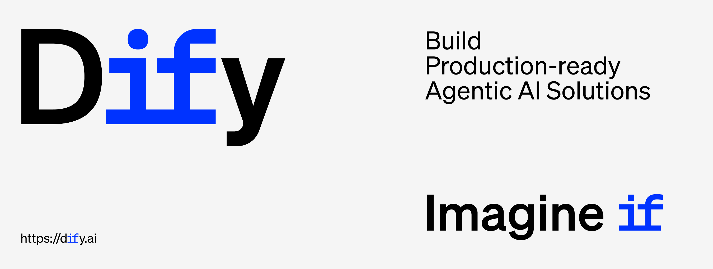

<p align="center">
  📌 <a href="https://dify.ai/blog/introducing-dify-workflow-file-upload-a-demo-on-ai-podcast">ডিফাই ওয়ার্কফ্লো ফাইল আপলোড পরিচিতি: গুগল নোটবুক-এলএম পডকাস্ট পুনর্নির্মাণ</a>
</p>

<p align="center">
  <a href="https://cloud.dify.ai">ডিফাই ক্লাউড</a> ·
  <a href="https://docs.dify.ai/getting-started/install-self-hosted">সেল্ফ-হোস্টিং</a> ·
  <a href="https://docs.dify.ai">ডকুমেন্টেশন</a> ·
  <a href="https://dify.ai/pricing">Dify পণ্যের রূপভেদ</a>
</p>

<p align="center">
    <a href="https://dify.ai" target="_blank">
        </a>
    <a href="https://dify.ai/pricing" target="_blank">
        </a>
    <a href="https://discord.gg/FngNHpbcY7" target="_blank">
        </a>
    <a href="https://reddit.com/r/difyai" target="_blank">  
        </a>
    <a href="https://twitter.com/intent/follow?screen_name=dify_ai" target="_blank">
        </a>
    <a href="https://www.linkedin.com/company/langgenius/" target="_blank">
        </a>
    <a href="https://hub.docker.com/u/langgenius" target="_blank">
        </a>
    <a href="https://github.com/langgenius/dify/graphs/commit-activity" target="_blank">
        </a>
    <a href="https://github.com/langgenius/dify/" target="_blank">
        </a>
    <a href="https://github.com/langgenius/dify/discussions/" target="_blank">
        </a>
    <a href="https://insights.linuxfoundation.org/project/langgenius-dify" target="_blank">
        </a>
    <a href="https://insights.linuxfoundation.org/project/langgenius-dify" target="_blank">
        </a>
    <a href="https://insights.linuxfoundation.org/project/langgenius-dify" target="_blank">
        </a>
</p>

<p align="center">
  <a href="../../README.md"></a>
  <a href="../zh-TW/README.md"></a>
  <a href="../zh-CN/README.md"></a>
  <a href="../ja-JP/README.md"></a>
  <a href="../es-ES/README.md"></a>
  <a href="../fr-FR/README.md"></a>
  <a href="../tlh/README.md"></a>
  <a href="../ko-KR/README.md"></a>
  <a href="../ar-SA/README.md"></a>
  <a href="../tr-TR/README.md"></a>
  <a href="../vi-VN/README.md"></a>
  <a href="../de-DE/README.md"></a>
  <a href="../it-IT/README.md"></a>
  <a href="../pt-BR/README.md"></a>
  <a href="../sl-SI/README.md"></a>
  <a href="../bn-BD/README.md"></a>
  <a href="../hi-IN/README.md"></a>
</p>

ডিফাই একটি ওপেন-সোর্স LLM অ্যাপ ডেভেলপমেন্ট প্ল্যাটফর্ম। এটি ইন্টুইটিভ ইন্টারফেস, এজেন্টিক AI ওয়ার্কফ্লো, RAG পাইপলাইন, এজেন্ট ক্যাপাবিলিটি, মডেল ম্যানেজমেন্ট, মনিটরিং সুবিধা এবং আরও অনেক কিছু একত্রিত করে, যা দ্রুত প্রোটোটাইপ থেকে প্রোডাকশন পর্যন্ত নিয়ে যেতে সহায়তা করে।

## কুইক স্টার্ট

> ডিফাই ইনস্টল করার আগে, নিশ্চিত করুন যে আপনার মেশিন নিম্নলিখিত ন্যূনতম কনফিগারেশনের প্রয়োজনীয়তা পূরন করে :
>
> - সিপিউ >= 2 কোর
> - র‍্যাম >= 4 জিবি

</br>

ডিফাই সার্ভার চালু করার সবচেয়ে সহজ উপায় [docker compose](../../docker/docker-compose.yaml) মাধ্যমে। নিম্নলিখিত কমান্ডগুলো ব্যবহার করে ডিফাই চালানোর আগে, নিশ্চিত করুন যে আপনার মেশিনে [Docker](https://docs.docker.com/get-docker/) এবং [Docker Compose](https://docs.docker.com/compose/install/) ইনস্টল করা আছে :

```bash
cd dify
cd docker
cp .env.example .env
docker compose up -d
```

চালানোর পর, আপনি আপনার ব্রাউজারে [http://localhost/install](http://localhost/install)-এ ডিফাই ড্যাশবোর্ডে অ্যাক্সেস করতে পারেন এবং ইনিশিয়ালাইজেশন প্রক্রিয়া শুরু করতে পারেন।

#### সাহায্যের খোঁজে

ডিফাই সেট আপ করতে সমস্যা হলে দয়া করে আমাদের [FAQ](https://docs.dify.ai/getting-started/install-self-hosted/faqs) দেখুন। যদি তবুও সমস্যা থেকে থাকে, তাহলে [কমিউনিটি এবং আমাদের](#কমিউনিটি-এবং-যোগাযোগ) সাথে যোগাযোগ করুন।

> যদি আপনি ডিফাইতে অবদান রাখতে বা অতিরিক্ত উন্নয়ন করতে চান, আমাদের [সোর্স কোড থেকে ডিপ্লয়মেন্টের গাইড](https://docs.dify.ai/getting-started/install-self-hosted/local-source-code) দেখুন।

## প্রধান ফিচারসমূহ

**১. ওয়ার্কফ্লো**:
ভিজ্যুয়াল ক্যানভাসে AI ওয়ার্কফ্লো তৈরি এবং পরীক্ষা করুন, নিম্নলিখিত সব ফিচার এবং তার বাইরেও আরও অনেক কিছু ব্যবহার করে।

**২. মডেল সাপোর্ট**:
GPT, Mistral, Llama3, এবং যেকোনো OpenAI API-সামঞ্জস্যপূর্ণ মডেলসহ, কয়েক ডজন ইনফারেন্স প্রদানকারী এবং সেল্ফ-হোস্টেড সমাধান থেকে শুরু করে প্রোপ্রাইটরি/ওপেন-সোর্স LLM-এর সাথে সহজে ইন্টিগ্রেশন। সমর্থিত মডেল প্রদানকারীদের একটি সম্পূর্ণ তালিকা পাওয়া যাবে [এখানে](https://docs.dify.ai/getting-started/readme/model-providers)।


**3. প্রম্পট IDE**:
প্রম্পট তৈরি, মডেলের পারফরম্যান্স তুলনা এবং চ্যাট-বেজড অ্যাপে টেক্সট-টু-স্পিচের মতো বৈশিষ্ট্য যুক্ত করার জন্য ইন্টুইটিভ ইন্টারফেস।

**4. RAG পাইপলাইন**:
ডকুমেন্ট ইনজেশন থেকে শুরু করে রিট্রিভ পর্যন্ত সবকিছুই বিস্তৃত RAG ক্যাপাবিলিটির আওতাভুক্ত। PDF, PPT এবং অন্যান্য সাধারণ ডকুমেন্ট ফর্ম্যাট থেকে টেক্সট এক্সট্রাকশনের জন্য আউট-অফ-বক্স সাপোর্ট।

**5. এজেন্ট ক্যাপাবিলিটি**:
LLM ফাংশন কলিং বা ReAct উপর ভিত্তি করে এজেন্ট ডিফাইন করতে পারেন এবং এজেন্টের জন্য পূর্ব-নির্মিত বা কাস্টম টুলস যুক্ত করতে পারেন। Dify AI এজেন্টদের জন্য 50+ বিল্ট-ইন টুলস সরবরাহ করে, যেমন Google Search, DALL·E, Stable Diffusion এবং WolframAlpha।

**6. এলএলএম-অপ্স**:
সময়ের সাথে সাথে অ্যাপ্লিকেশন লগ এবং পারফরম্যান্স মনিটর এবং বিশ্লেষণ করুন। প্রডাকশন ডেটা এবং annotation এর উপর ভিত্তি করে প্রম্পট, ডেটাসেট এবং মডেলগুলিকে ক্রমাগত উন্নত করতে পারেন।

**7. ব্যাকএন্ড-অ্যাজ-এ-সার্ভিস**:
ডিফাই-এর সমস্ত অফার সংশ্লিষ্ট API-সহ আছে, যাতে আপনি অনায়াসে ডিফাইকে আপনার নিজস্ব বিজনেস লজিকে ইন্টেগ্রেট করতে পারেন।

## ডিফাই-এর ব্যবহার

- **ক্লাউড </br>**
  জিরো সেটাপে ব্যবহার করতে আমাদের [Dify Cloud](https://dify.ai) সার্ভিসটি ব্যবহার করতে পারেন। এখানে সেল্ফহোস্টিং-এর সকল ফিচার ও ক্যাপাবিলিটিসহ স্যান্ডবক্সে ২০০ জিপিটি-৪ কল ফ্রি পাবেন।

- **সেল্ফহোস্টিং ডিফাই কমিউনিটি সংস্করণ</br>**
  সেল্ফহোস্ট করতে এই [স্টার্টার গাইড](#কুইক-স্টার্ট) ব্যবহার করে দ্রুত আপনার এনভায়রনমেন্টে ডিফাই চালান।
  আরো ইন-ডেপথ রেফারেন্সের জন্য [ডকুমেন্টেশন](https://docs.dify.ai) দেখেন।

- **এন্টারপ্রাইজ / প্রতিষ্ঠানের জন্য Dify</br>**
  আমরা এন্টারপ্রাইজ/প্রতিষ্ঠান-কেন্দ্রিক সেবা প্রদান করে থাকি । [এই চ্যাটবটের মাধ্যমে আপনার প্রশ্নগুলি আমাদের জন্য লগ করুন।](https://udify.app/chat/22L1zSxg6yW1cWQg) অথবা [আমাদের ইমেল পাঠান](mailto:business@dify.ai?subject=%5BGitHub%5DBusiness%20License%20Inquiry) আপনার চাহিদা সম্পর্কে আলোচনা করার জন্য। </br>

## এগিয়ে থাকুন

GitHub-এ ডিফাইকে স্টার দিয়ে রাখুন এবং নতুন রিলিজের খবর তাৎক্ষণিকভাবে পান।


## Advanced Setup

কাস্টম কনফিগারেশন, পর্যবেক্ষণ এবং ডেপ্লয়মেন্ট বিকল্পের জন্য, [উন্নত সেটআপ](ADVANCED_SETUP.md) দেখুন।

## অবদান

Dify সব ধরনের অবদানকে স্বাগত জানায়:

- **কোড**: [অবদান নির্দেশিকা](https://github.com/langgenius/dify/blob/main/CONTRIBUTING.md) পড়ুন, তারপর [নতুন অবদানকারীদের উপযোগী সমস্যাগুলো](https://github.com/langgenius/dify/issues?q=is%3Aissue%20state%3Aopen%20label%3A%22good%20first%20issue%22) দেখুন।
- **ধারণা ও প্রতিক্রিয়া**: একটি [GitHub আলোচনা](https://github.com/langgenius/dify/discussions) শুরু করুন বা বিদ্যমান আলোচনায় যোগ দিন।
- **অনুবাদ**: কোনো লোকেল যোগ বা হালনাগাদ করতে [আন্তর্জাতিকীকরণ নির্দেশিকা](https://github.com/langgenius/dify/blob/main/web/i18n-config/README.md) অনুসরণ করুন।
- **কমিউনিটি**: আপনার তৈরি অ্যাপ শেয়ার করুন, অন্য ব্যবহারকারীদের সাহায্য করুন এবং Dify সম্পর্কে সবাইকে জানান।

### অবদানকারীরা

<a href="https://github.com/langgenius/dify/graphs/contributors">
  
</a>

## কমিউনিটি এবং যোগাযোগ

আপনার প্রশ্নের জন্য সবচেয়ে উপযুক্ত মাধ্যমটি বেছে নিন:

- [GitHub Discussions](https://github.com/langgenius/dify/discussions): সাহায্য নিন, প্রতিক্রিয়া জানান এবং ধারণা প্রস্তাব করুন।
- [GitHub Issues](https://github.com/langgenius/dify/issues): পুনরুৎপাদনযোগ্য বাগ রিপোর্ট করুন এবং ইঞ্জিনিয়ারিং কাজ অনুসরণ করুন। নতুন ইস্যু খোলার আগে [অবদান নির্দেশিকা](https://github.com/langgenius/dify/blob/main/CONTRIBUTING.md) পড়ুন।
- [Discord](https://discord.gg/FngNHpbcY7): সরাসরি আলোচনা করুন, আপনার অ্যাপ শেয়ার করুন এবং অন্যান্য Dify ব্যবহারকারীর সঙ্গে যুক্ত হন।
- [X](https://x.com/dify_ai): রিলিজের খবর এবং প্রকল্পের হালনাগাদ পেতে Dify অনুসরণ করুন।
## স্টার হিস্ট্রি

[](https://star-history.com/#langgenius/dify&Date)

## নিরাপত্তা বিষয়ক

আপনার গোপনীয়তা রক্ষা করতে, অনুগ্রহ করে GitHub-এ নিরাপত্তা সংক্রান্ত সমস্যা পোস্ট করা এড়িয়ে চলুন। পরিবর্তে, আপনার প্রশ্নগুলি <security@dify.ai> ঠিকানায় পাঠান এবং আমরা আপনাকে আরও বিস্তারিত উত্তর প্রদান করব।

## লাইসেন্স

এই রিপোজিটরিটি [ডিফাই ওপেন সোর্স লাইসেন্স](../../LICENSE) এর অধিনে , যা মূলত অ্যাপাচি ২.০, তবে কিছু অতিরিক্ত বিধিনিষেধ রয়েছে।
