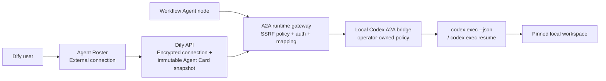

# Bring Your Own Agent: Codex MVP

## Outcome

Dify users can connect a customer-hosted agent to Agent Roster, select it in an
existing Workflow Agent node, and execute it without copying the agent into the
Dify Agent runtime. The first supported interoperability contract is A2A 1.0
HTTP+JSON. A local bridge exposes an authenticated Codex CLI as that agent.

This is deliberately an external-agent connection, not another model provider,
tool, or workflow node type. The Agent node remains the composition surface and
the Roster remains the ownership, discovery, and version-pinning surface.

## Product Flow

### Connect

1. In **Studio > Agents**, choose **Create agent > Connect external agent**.
2. Enter an A2A endpoint and choose **No authentication** or **Bearer token**.
3. Choose **Check connection**. Dify retrieves and validates the Agent Card.
4. Review the discovered name, description, protocol, streaming capability, and
   skills. The user may change the Dify-facing name, description, role, and icon.
5. Choose **Connect agent**. The Agent appears in Roster as **External** and is
   immediately available to workflows.

Discovery is a separate review step so an endpoint cannot silently choose the
name and capabilities displayed in the user's workspace.

### Manage

Opening an external Agent shows a connection page instead of the native Agent
composer. It exposes the endpoint, authentication mode, last verification time,
the pinned Agent Card, **Test connection**, and **Edit connection**. The stored
Bearer token is never returned; leaving the token field blank preserves it.

Changing the endpoint, credentials, or discovered card creates a new immutable
Agent configuration snapshot with a versioned encrypted connection. Workflows
pinned to an older snapshot therefore never combine its Agent Card with a token
for another endpoint. Revoking an old remote token invalidates that old version.
Updates carry the active snapshot ID that the editor originally loaded. If
another operator publishes a newer connection first, Dify returns `409` instead
of overwriting it with stale form state.

### Use in a Workflow

The existing Agent node selector includes Roster Agents with an **External**
badge. Selecting one keeps the normal instruction and input-variable controls.
At run time Dify renders those inputs into one text prompt, invokes the pinned
A2A interface, and maps artifacts into the node's declared outputs:

- text parts -> `text`
- data parts -> declared structured outputs or `json`
- URL parts -> `files`

The node records protocol, remote agent ID, task ID, context ID, terminal state,
event count, and elapsed time in execution metadata. It does not initialize a
Dify Agent workspace, model, tools, memory, or Human Input session.

Automatic output-validation retries are suppressed for external Agents because
replaying a remote coding task can repeat filesystem or other side effects. A
user may explicitly retry the Workflow node after inspecting the failed output.

## Architecture



The bridge, rather than Dify, owns the executable, workspace root, model,
sandbox mode, concurrency, and Codex authentication. An A2A request cannot
override any of those values or select an arbitrary Codex thread.

## Why A2A

- A2A models an agent as a remote task with identity, discovery, streaming,
  artifacts, cancellation, and conversation context. Those are the semantics
  Dify needs for an Agent node.
- MCP is retained for tools and context providers. It does not define the
  lifecycle of delegating a user turn to an autonomous external agent.
- Vendor-specific APIs would couple the Roster and Workflow runtime to every
  agent implementation. Codex is therefore adapted behind the same A2A
  contract other frameworks can implement.
- AG-UI can be added later for rich client-side events; it is not required for
  the first server-to-server execution path.

## Persistence And API

An external Agent reuses the existing app-backed Roster identity and native
`AgentConfigSnapshot` pointer so workflow version pinning continues to work.
Two sidecar records carry external-only state:

- `ExternalAgentConnection`: versioned tenant-encrypted endpoint and Bearer
  token, authentication mode, endpoint hash, and last verification time.
- `ExternalAgentConfigSnapshot`: tenant-encrypted Agent Card, card hash, protocol
  version, remote ID, connection ID, and the native snapshot it extends.

Console endpoints:

| Method | Path | Purpose |
| --- | --- | --- |
| `POST` | `/console/api/agent/external/discover` | Validate an endpoint and preview its Agent Card |
| `POST` | `/console/api/agent/external` | Create an app-backed external Roster Agent |
| `GET` | `/console/api/agent/{agent_id}/external` | Read non-secret connection details |
| `PUT` | `/console/api/agent/{agent_id}/external` | Compare-and-swap update and publish a new snapshot |
| `POST` | `/console/api/agent/{agent_id}/external/test` | Verify the current connection |

All lookups include tenant, Agent, snapshot, and connection ownership. Remote I/O
occurs outside database transactions.

## A2A Runtime Contract

The Dify gateway implements the A2A 1.0 HTTP+JSON core used by this feature:

- Agent Card discovery at `/.well-known/agent-card.json`
- `message:send`
- `message:stream` over Server-Sent Events
- task lookup
- task subscription over Server-Sent Events
- task cancellation

Dify sends `A2A-Version: 1.0`, does not follow redirects, limits Agent Card,
JSON, error, and SSE event sizes, and requires the selected HTTP+JSON interface
to have the same origin as the configured endpoint. A deterministic opaque
`contextId` is derived from the tenant and workflow node execution, so a safe
retry resumes the same external conversation without exposing those identifiers
as an external thread selector.

The local bridge starts one Codex turn per A2A task. Reusing a context resumes
only a Codex thread previously observed by that bridge process. Prompts enter the
CLI over stdin without a shell. Command payloads, stderr, local file contents,
and credentials are not reflected into A2A responses.

## Local Codex Setup

Authenticate the installed Codex CLI, then from `dify-agent/` run:

```bash
export DIFY_BYOA_CODEX_WORKSPACE_ROOT=/absolute/path/to/allowed/repository
export DIFY_BYOA_CODEX_PUBLIC_URL=http://127.0.0.1:8765

PYTHONPATH=examples/dify_agent \
  uv run --extra server python -m dify_agent_examples.codex_a2a_bridge \
  --host 127.0.0.1 \
  --port 8765
```

Connect `http://127.0.0.1:8765` from a locally running Dify API.

The Dify web process must expose Agent Roster with
`NEXT_PUBLIC_ENABLE_AGENT_V2=true`. Workflow execution is asynchronous, so a
local API-only setup must also run a Celery worker that consumes
`workflow_based_app_execution`; connection discovery and testing do not require
that worker.

For Dify in Docker Desktop, bind the bridge to `0.0.0.0`, advertise
`http://host.docker.internal:8765`, configure a Bearer token, and add only that
hostname to Dify's SSRF proxy allowlist:

```bash
# docker/.env
SSRF_PROXY_ALLOW_PRIVATE_DOMAINS=host.docker.internal

# bridge process environment
export DIFY_BYOA_CODEX_PUBLIC_URL=http://host.docker.internal:8765
export DIFY_BYOA_CODEX_API_TOKEN=replace-with-a-local-development-token
```

Then restart the Dify API and SSRF proxy and connect the advertised URL using
Bearer authentication. On Linux, use an explicit host-gateway address and an
equally narrow private IP allowlist.

### Public-network separation test

The development topology can simulate remote Dify without moving either
process to another physical machine:

```text
Dify API / Celery Worker
  -> public HTTPS origin
  -> outbound Cloudflare Quick Tunnel
  -> 127.0.0.1:8765 Codex A2A bridge
  -> local codex CLI and repository
```

Run the bridge and ephemeral HTTPS tunnel together from `dify-agent/`:

```bash
export DIFY_BYOA_CODEX_WORKSPACE_ROOT=/absolute/path/to/allowed/repository
./examples/dify_agent/dify_agent_examples/codex_a2a_bridge/run_public_tunnel.sh
```

The launcher keeps the bridge bound to loopback, requires Bearer authentication,
defaults Codex to `read-only`, and advertises the generated HTTPS origin in its
Agent Card. It rotates the Bearer token on each ephemeral tunnel launch and
stores only the current value in macOS Keychain, so both Endpoint and Token must
be refreshed in Dify before running a Workflow. Cloudflare Quick Tunnel is the
default provider. Because it buffers SSE, the Agent Card advertises
`streaming=false` and Dify executes with `message:send` plus `tasks/get`
polling. A successful run proves that discovery, execution, task polling, and
task identity cross the public network boundary. Cancellation needs its own
explicit mid-run test. The free tunnel hostname is intentionally ephemeral; a
stable named tunnel or outbound Connector/Relay is required beyond development.

This free relay is a deliberate development trust boundary: the Tunnel Provider
terminates HTTPS and can observe the Bearer header, prompt, and result. Do not
use sensitive repositories or prompts. A production deployment needs an
operator-controlled relay or private network plus end-to-end service
authentication, ideally with an outbound Connector that never exposes local
execution credentials to Dify or the relay. The launcher retains
`DIFY_BYOA_TUNNEL_PROVIDER=localhost-run` only as an optional legacy provider.

## Security Boundary

- Endpoint and Agent Card requests always use Dify's SSRF-controlled HTTP
  client. Private destinations remain denied unless an operator explicitly
  allowlists one for local or private deployment.
- HTTP redirects are disabled, endpoint credentials/query/fragment are rejected,
  and a Bearer credential cannot be redirected through the Agent Card to a
  different origin.
- Endpoints, Agent Cards, and Bearer tokens are encrypted with the tenant key.
  Tokens are write-only in the Console API and never logged by the bridge.
- Plain HTTP with Bearer authentication is a local-development exception for a
  loopback or explicitly allowlisted Docker host bridge. Any remotely reachable
  deployment must terminate TLS before transmitting credentials.
- The local bridge permits only `read-only` and `workspace-write`, runs Codex
  with approval policy `never`, and pins its workspace after resolving it.
- Cancellation terminates the active process group, but cannot undo filesystem
  changes already completed by Codex. Operators should choose `read-only` when
  mutation is not required.

## MVP Non-goals

- Executing uploaded arbitrary agent code inside Dify
- Hosted bridge lifecycle, tenant scheduling, or billing
- OAuth, mTLS, private networking setup, or rotating secret integrations
- A2A push notifications, durable task subscriptions, file/data input parts, or
  rich token-level progress
- External-agent Human Input handoff and cross-agent shared filesystems
- Using an external Agent as a standalone Dify Web App/API endpoint

The sample Codex bridge keeps task and context mappings in memory. A production
connector should add durable task storage, distributed ownership, TLS, per-tenant
isolation, rate limits, auditable secret rotation, and restart-safe cancellation.
