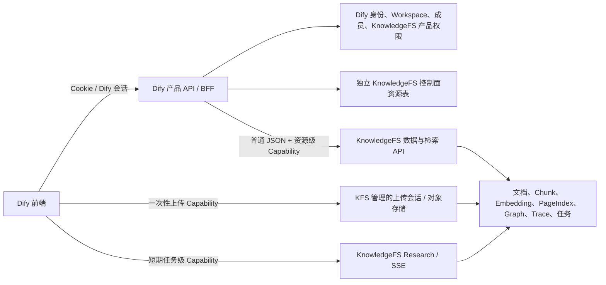
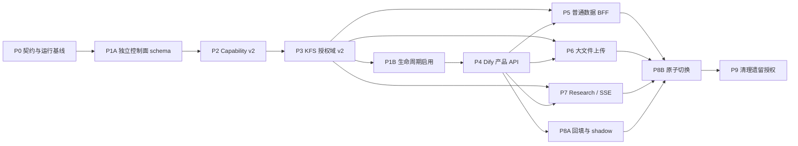

# Dify × KnowledgeFS 集成执行计划

> 状态：待实施
>
> 计划基线：Dify `codex/migrate-knowledge-fs` 分支，`4ee43b8afc3b57ee5e5636db1e441b99fe03ecaa`
>
> 编制日期：2026-07-20
>
> 适用范围：Dify 产品 API、授权控制面、KnowledgeFS 数据与检索面，以及二者之间的契约、迁移、灰度和回滚

## 1. 目标与最终边界

本计划的目标是把 Dify 和 KnowledgeFS 调整为清晰的“控制面 + 数据面”架构：

- Dify 是用户身份、Workspace、成员、角色、KnowledgeFS Space 可见范围、产品权限和 API Access 的唯一事实来源。
- Dify 向前端提供独立 KnowledgeFS 产品 API，并在每次操作前完成资源级授权。
- KnowledgeFS 不管理 Tenant 生命周期、成员、角色、可见范围，也不保存一套与 Dify 平行的产品权限事实。
- KnowledgeFS 保留知识空间技术配置、模型配置、文档与索引、检索、异步任务和内部运行状态。
- 普通 CRUD、设置和列表通过 Dify BFF；大文件上传和长连接 SSE 使用 Dify 签发的短期资源 Capability 直连数据面。
- 即使前端直连 KnowledgeFS，KnowledgeFS 也只验证 Dify 签发的资源权限，不把浏览器会话或 Dify 登录 JWT 当作自身登录体系。

目标架构如下：



### 1.1 明确不做的事情

- 不在 KnowledgeFS 中迁移或复制 Dify 的账号、Workspace 成员和角色管理逻辑。
- 不复用或关联 Dify 现有 `datasets`、`documents`、`dataset_permissions`、Dataset API、Dataset Token、索引或检索管线。Dify 现有知识库与 KnowledgeFS 是两个独立产品。
- 不让 Dify 前端直接调用任意 KnowledgeFS OpenAPI；直连只允许显式登记的上传和流式接口。
- 不让 KnowledgeFS 读取 Dify 数据库来完成成员授权。
- 不把 Dify 登录 JWT、Cookie 或浏览器提供的 `Authorization` 原样转发给 KnowledgeFS。
- 不在本轮重做知识库前端视觉页面；本计划只定义产品 API、后端能力和调用边界。
- 不在创建空知识库时同步调用 plugin-daemon 做模型预检。模型能力和向量维度在第一次文档异步处理时校验。
- 不强制 Embedding 维度为 1536。维度必须来自该知识空间选定模型的真实 capability，并和 vector-space 标识一起持久化。

## 2. 不可破坏的架构约束

后续 PR 必须同时满足以下约束：

1. **单一授权源**：成员、角色、可见范围和产品 API Access 只由 Dify 决定。
2. **独立产品资源注册**：Dify 为 KnowledgeFS 新建独立控制面资源表。除创建操作外，必须先由 Dify control-space ID 解析出唯一的 `knowledge_space_id`，再签发 Capability；该表不得外键关联 Dataset 或 Document。
3. **列表先授权再聚合**：Dify 必须先从独立 KnowledgeFS 控制面权限表计算用户可见 Space，再只向 KnowledgeFS 批量查询这些 Space 的产品与技术摘要。
4. **不信任客户端资源 ID**：路径、查询参数和请求体中的 control-space、Knowledge Space、KFS Document、Task ID 必须由服务端注册关系交叉验证。
5. **数据隔离仍保留**：KnowledgeFS 业务表仍需要一个不透明的 `namespace_id` 隔离分区。规范值固定为 Dify Workspace 原始 UUID；第一阶段可以继续使用物理列名 `tenant_id`。前缀只用于 `sub` 等 principal，不写入 namespace 列，也不代表 KnowledgeFS 拥有 Tenant 管理域。
6. **候选过滤在 LIMIT 前完成**：所有 Chunk、PageIndex、Graph、Evidence 和 AnswerTrace 查询必须先按 `namespace_id + knowledge_space_id` 过滤，再排序和截断。
7. **技术状态不复制为双写事实**：模型/vector-space、文档数、索引状态、任务状态由 KnowledgeFS 持有；Dify 只缓存用于列表展示的非权威摘要。
8. **短期、窄权限 Capability**：每个 Token 只允许明确的 action 和 resource；不能用一个 `knowledge-spaces:write` 通配权限覆盖所有写操作。
9. **异步任务不保存 Bearer**：worker payload、数据库和日志中不得保存原始 Capability、预签名 URL 或 Dify 会话信息。
10. **失败关闭**：控制面资源注册缺失、授权服务异常、签名密钥未知、模型 capability 不一致、空间归属不一致时均拒绝操作，不猜测、不自动放宽。
11. **删除必须持久化**：产品删除由 Dify 发起，但 KnowledgeFS 继续负责 tombstone、outbox、重试、对象清理、索引清理和终态审计；数据库级 cascade 或 Workspace 删除不得绕开此流程。
12. **契约先于流量**：任何新 KnowledgeFS operation 在 Dify 可用前，必须先进入 operation manifest、鉴权契约和跨服务测试。
13. **内容范围显式传递**：若 Source/KFS Document 存在比 Space 更细的产品权限，策略仍由 Dify 计算。Capability 只携带不可伪造的 opaque scope IDs 和 policy revision，KFS 仅据此在 LIMIT 前过滤；若产品没有该层权限，`permission_scope` 只能表示技术归属，不得称为成员 ACL。
14. **两个产品完全隔离**：KnowledgeFS controller/service/task 不得读写 Dify Dataset/Document 表或调用其 indexing/retrieval/delete pipeline；Dify 现有知识库代码也不得路由到 KFS。
15. **只复用身份/RBAC 框架**：可以复用 Dify Account、Tenant、TenantAccountJoin、登录上下文和 RBAC transport，但 `DATASET_OPERATOR`、`is_dataset_editor`、Dataset permission scene/resource type 都不能代表 KnowledgeFS 权限。

## 3. 产品与检索语义基线

本计划同时固定以下已确认的产品语义，避免权限改造时误改检索行为：

- `Fast`：普通混合召回、候选合并、统一 Rerank。
- `Research`：使用 Summary、Outline、PageIndex；不得错误依赖 Graph。
- `Deep`：普通混合召回加 Graph 扩展，合并候选后统一 Rerank；不能只查 Graph。
- `Auto`：不是第四种检索执行模式。它通过 LLM 分类为 Fast、Research、Deep 之一，再走对应管线。
- Top K、Score Threshold、模型配置和权限过滤必须分别作用于三种最终执行模式。
- 每个知识空间独立选择推理模型、Embedding 模型、Rerank 模型和检索配置。
- KnowledgeFS 持久化模型标识、provider/plugin 标识、vector-space 标识、真实 Embedding 维度和配置 revision。
- 空知识库创建不触发模型预检。首次文档异步任务负责调用 plugin-daemon 校验 capability、确定维度并创建或绑定向量空间。

## 4. 当前实现基线与主要缺口

| 领域 | 当前实现 | 缺口或风险 | 目标阶段 |
| --- | --- | --- | --- |
| Dify 代理 | `api/services/knowledge_fs_proxy.py` 仅登记列空间和建空间两个 operation | 设置、文档、Source、检索、SSE、Trace 均不可达 | P0、P4、P5 |
| Dify 代理授权 | 当前使用 `account.is_dataset_editor`、`DATASET_*` permission 和 Dataset RBAC scope | KnowledgeFS 是独立产品，必须改为独立 KnowledgeFS RBAC；不能冒充 Dataset | P1、P4 |
| Dify 控制面资源 | 当前没有独立的 KnowledgeFS product-space/permission 表；KFS Space 与 Dify Dataset 本就无关 | 缺少 Dify-owned 的资源目录、可见性、权限和生命周期状态 | P1 |
| 产品列表 | KFS 按自身 member/policy/API Access 过滤空间；Dify 只有现有 Dataset 产品列表 | 两套产品不能混用；需要独立 KnowledgeFS 列表 API 和权限表 | P4 |
| JWT | Dify 当前签发 60 秒 HS256 Console assertion | 不是 action/resource 级 Capability；共享密钥缺少 `kid` 和标准轮换 | P2 |
| KFS 生产鉴权 | 当前运行时没有完整装配 Dify JWT verifier | 生产流量会被默认拒绝，且身份契约没有被 OpenAPI drift 检查覆盖 | P0、P2 |
| KFS 本地 ACL | 有成员、owner/editor/viewer、visibility、API Access、API Key、permission snapshot | 与 Dify 形成双授权源，不符合目标边界 | P3、P8、P9 |
| API Access | KFS 默认关闭，覆盖 service API/API key/MCP/agent；Dify 没有 KnowledgeFS 专属产品开关 | 不能复用 `Dataset.enable_api`；需要独立 policy 且默认关闭 | P1、P4、P8 |
| API Key | KFS 有 per-space Key；Dify 现有 `ApiToken` 属于其他产品/服务域 | 不能复用或修改 Dataset Token；需要 KnowledgeFS 专属 credential | P1、P4 |
| 大文件 | Dify BFF 最大 64 MiB；KFS 上传会完整 `arrayBuffer()` | 带宽和内存都不适合大文件 | P6 |
| SSE | Dify 代理已有流式传输基础，但没有登记真实 SSE operation | Research 长连接仍未接入产品链路 | P7 |
| 异步授权 | 多类 KFS 任务依赖本地 permission snapshot 和 ACL revision | 不能先删旧 ACL 表；需要新的 Dify Capability provenance | P3、P8、P9 |
| Contract pin | 生成器仍按相邻独立 KFS 仓库和独立 Git HEAD 设计；只校验部分 transport metadata | 迁入 monorepo 后路径和版本算法失效，身份及 schema drift 也检测不到 | P0 |
| 部署 | Dify Docker 未完整声明 KFS 服务、健康检查和生产密钥配置 | 无法形成可重复部署的集成环境 | P0、P2 |

## 5. 接口和数据归属矩阵

“前端入口”表示浏览器看到的产品 API；“事实数据”表示最终权威存储。模型等技术设置虽然由 Dify 页面提交，仍由 KnowledgeFS 保存。

| 功能 | 前端入口 | 授权决策 | 事实数据 | KnowledgeFS 暴露方式 |
| --- | --- | --- | --- | --- |
| 知识库列表 | Dify KnowledgeFS 产品列表 API | Dify | Dify control-space + KFS 批量产品/技术摘要 | 仅 Dify 可调的批量内部接口 |
| 知识库详情 | Dify KnowledgeFS 产品详情 API | Dify | 控制面字段在 Dify；技术字段在 KFS | Dify BFF 聚合 |
| 创建知识库 | Dify KnowledgeFS 创建 API | Dify | Dify 独立 control-space；KFS Space | Dify saga 调用 |
| 删除知识库 | Dify KnowledgeFS 删除 API | Dify | Dify control-space 状态；KFS durable deletion | Dify saga 调用 |
| 名称、图标、描述 | Dify KnowledgeFS API | Dify | KFS Space | Dify 授权后读写 KFS |
| 成员、权限、可见范围 | Dify KnowledgeFS API | Dify | Dify 独立 KnowledgeFS permission 表 + Dify identity | KFS 不提供产品管理接口 |
| API Access 产品设置 | Dify | Dify | Dify external-access policy | KFS 只服从 Capability 的 caller/action |
| API Credential | Dify | Dify | Dify resource-bound credential | 请求时兑换成短期 KFS Capability |
| 模型和 vector-space 配置 | Dify BFF | Dify | KFS | 普通 BFF |
| Rerank、Top K、Threshold、检索模式配置 | Dify BFF | Dify | KFS profile revision | 普通 BFF |
| KFS Document 列表、详情、Outline、Chunk | Dify BFF | Dify | KFS | 普通 BFF |
| 小文件上传 | Dify BFF | Dify | KFS/object storage | 普通 BFF，保留小体积上限 |
| 大文件上传 | Dify 先授权 | Dify | KFS upload session/object storage | 一次性 Capability 直连 |
| Source 配置和同步 | Dify BFF | Dify | KFS | 普通 BFF；凭据用 Dify/KMS 引用 |
| Fast/Deep 普通查询 | Dify BFF | Dify | KFS Trace、Evidence | 普通 BFF；需要流式时另行登记 |
| Research 计划和创建 | Dify BFF | Dify | KFS task | 普通 BFF |
| Research SSE | Dify 签发连接能力 | Dify | KFS event log | 任务级短期 Capability 直连 |
| 任务状态、结果、取消 | Dify BFF；必要时重新签发直连能力 | Dify | KFS | 默认普通 BFF |
| AnswerTrace、Evidence、冲突和缺失项 | Dify BFF | Dify | KFS | 普通 BFF |
| FSCK、GC、lease、staged commit、内部索引状态 | Dify 运维入口或服务间调用 | Dify 运维权限 | KFS | 不对普通前端暴露 |
| 健康检查、OpenAPI、指标 | 基础设施 | 服务身份 | KFS | 内部网络 |

## 6. Dify 独立 KnowledgeFS 控制面数据模型与生命周期

### 6.1 独立 control-space 资源表

新增 Dify-owned `knowledge_fs_control_spaces`。它是 Dify 对 KnowledgeFS 产品进行授权和生命周期编排的资源目录，不是 Dataset，也不保存任何 KFS Document：

| 字段 | 说明 |
| --- | --- |
| `id` | Dify KnowledgeFS 产品资源 ID，前端和 Dify API 使用 |
| `tenant_id` | Dify Workspace ID |
| `knowledge_space_id` | KFS Space ID；`provisioning` 时允许为空，成功后不可变 |
| `owner_account_id` | Dify 产品 owner，外键到 Dify Account |
| `visibility` | `only_me`、`all_team_members`、`partial_members` |
| `provisioning_key` | 创建 KFS Space 的稳定幂等键，唯一且不可复用 |
| `lifecycle_operation_id` | 当前 create/delete/repair operation 或 outbox event ID |
| `state` | `provisioning`、`active`、`deleting`、`deleted`、`error` |
| `resource_version` | 控制资源和状态转换的 CAS revision |
| `attempt_count` / `last_attempt_at` | worker 重试和 stuck 检测 |
| `last_error_code` / `last_error_message` | 脱敏的稳定诊断信息 |
| `last_synced_at` | KFS 产品/技术摘要最近同步时间 |
| `created_at` / `updated_at` | 审计时间 |

同时新增以下独立表，全部以 `control_space_id` 为资源外键，不得出现 `dataset_id` 或 Dify `document_id`：

- `knowledge_fs_control_space_permissions`：Dify account、角色/访问级别、状态和 permission revision。
- `knowledge_fs_external_access_policies`：`service_api_enabled`、`agent_enabled`、`workflow_enabled`、`mcp_enabled=false` 和 revision；单一 UI 开关可在 service 层原子更新前三项。
- `knowledge_fs_api_credentials`：KnowledgeFS 专属长期 credential hash、prefix/last4、principal、allowed actions、状态、expiry、revision 和 revoke audit；secret 只展示一次。
- `app_knowledge_fs_space_joins`：App/Agent/Workflow 与 control-space 的显式授权关系，不复用 `AppDatasetJoin`。
- `knowledge_fs_capability_issuance_audits`：脱敏 issuance audit。
- `knowledge_fs_lifecycle_outbox`：provision、metadata update、delete、revoke 和 repair 的持久命令。provision payload 必须含 name/icon/description/slug、模型/profile intent、schema version、idempotency key 和 expected revision；它只是待投递命令/审计，不是产品读取事实源。

约束：

- `knowledge_fs_control_spaces`、权限表和 credential 表与 Dify `datasets`、`documents`、`dataset_permissions`、`api_tokens` 零外键、零 ORM relationship。
- `only_me/all_team_members/partial_members` 只能复用枚举值，不能复用 `Dataset.permission`、`DatasetPermission` 或其 service。
- 可以外键关联 Dify `tenants`、`accounts`、`tenant_account_joins`，因为身份和 Workspace 仍由 Dify 管理。
- `knowledge_space_id` 非空时唯一索引 `(tenant_id, knowledge_space_id)`。PostgreSQL 使用 partial unique index；MySQL 使用允许多个 `NULL` 的 unique key，并用状态机保证 active 时非空。
- 所有查找必须带 `tenant_id`；不允许仅凭浏览器传入的 KFS Space ID 反向获取产品资源。
- Dify 现有 Dataset/Document schema、runtime mode、索引任务和删除逻辑不做任何 KnowledgeFS 特判。
- Workspace 删除必须枚举独立 control-space，逐个进入 deleting 状态并等待或记录可恢复 cleanup ledger，之后才能完成 Workspace 数据清理。

### 6.2 创建采用 saga/outbox

Dify 数据库与 KnowledgeFS 数据库之间没有分布式事务，创建流程必须幂等：

1. Dify 在本地事务中创建 `provisioning` control-space、初始产品权限和 provision command snapshot；不创建 Dataset 或 Dify Document。
2. command snapshot 持久化 name/icon/description/slug、用户所选模型/profile intent、schema version、idempotency key 和 expected revision，保留到 KFS ACK 及审计保留期结束；列表/详情不得从该 payload 读取产品数据。
3. provision worker 只能在 Capability v2 verifier、integrated provision route 和 KFS legacy ACL mutation freeze 就绪后启用；此前只部署 schema，不能发远端流量。
4. worker 使用稳定 `provisioning_key` 和 namespace-level `knowledge_spaces.provision` service Capability 调用 KFS integrated provision operation。
5. integrated provision 只创建技术 Space，绝不 bootstrap owner/member/policy/API Access/API Key。
6. KFS 创建空空间并权威保存元数据和用户所选模型/profile 标识，但不调用 plugin-daemon。
7. name/slug/description/icon 由 KFS Space 权威保存；Dify control-space 不复制这些字段，列表和详情通过授权后的 KFS 批量/详情接口获取。
8. Dify 将 `knowledge_space_id` 写回 control-space 并切换为 `active`。
9. KFS 超时或失败时 control-space 进入可重试状态，不能创建第二个 KFS Space。
10. 若 KFS 已成功但 Dify 回写失败，重试必须通过 `provisioning_key` 找回同一 Space。

### 6.3 删除采用双阶段状态

1. Dify 完成 KnowledgeFS 产品权限判断并把 control-space 标为 `deleting`，立即从普通列表隐藏。
2. Dify outbox 调用 KFS durable deletion，携带 control-space/Space 精确资源 Capability 和 idempotency key。
3. KFS 执行 tombstone、任务取消策略、Source sync/OAuth 引用清理、索引/对象清理、重试和 terminal audit。
4. Dify 轮询或消费回调，把 control-space 标为 `deleted`，再清理 Dify 侧产品权限和 credential。
5. 回滚只允许恢复尚未进入 KFS 不可逆清理点的请求；越过该点后只能重新导入，不能伪恢复。
6. Dify 的单个、批量和 Workspace 删除入口都必须调用同一个 KnowledgeFS lifecycle service，禁止直接硬删 control-space。
7. outbox/cleanup ledger 的保留期必须覆盖最大删除重试窗口；orphan reconciler 定期对比 deleting control-space、KFS tombstone 和残留对象。

### 6.4 API Access 和 API Credential

- 明确 caller channel：`interactive`、`service_api`、`agent`、`workflow`、`mcp`、`internal_worker`。
- 为 KnowledgeFS 新增独立 external-access policy service，不能读取或修改 `Dataset.enable_api`。
- 设计稿的单一开关固定为以下语义：Console `interactive` 不受影响；`service_api`、`agent` 和使用 KnowledgeFS 的 `workflow` 受控；`internal_worker` 继承已准入 job grant；MCP 在没有独立产品策略前默认 fail-closed。
- 新建 control-space 的 external access 默认 `false`。旧 KFS API Access 显式值可在迁移时作为初始值；未知值一律迁为 `false`。
- 新增 KnowledgeFS 专属 service/agent adapter 和 API wrappers；不得改变 Dify 现有 Dataset `knowledge_retrieval_inner_service.py`、Dataset Service API 或 Agent knowledge retrieval 的语义。
- 新增 `knowledge_fs_api_credentials`，不要扩展或复用 Dify 现有 `ApiToken`/Dataset Token。
- 长期凭据只存在 Dify；Dify 验证后为单次 KFS operation 兑换短期 Capability。
- 集成模式下不再向产品暴露 KFS `kfs_*` per-space Key。

### 6.5 授权 revision 和 outbox

Dify 需要提供可审计的单调 revision，不能仅把当前布尔决策塞入 Token：

- Workspace membership/role 变化递增 `membership_epoch`。
- control-space visibility、owner、partial members 和产品角色变化递增 `space_acl_epoch`。
- KnowledgeFS external-access caller policy 变化递增 `external_access_epoch`。
- KnowledgeFS credential 更新、过期或撤销递增 credential revision。
- 子资源 scope policy 变化递增 `content_policy_revision`。

这些 revision 由 Dify 事务内更新并写 KnowledgeFS 专属 outbox。它们用于审计、shadow diff、显式 revoke 的有序 CAS 和故障对账，不要求 KnowledgeFS 保存成员或反查 Dify 权限表。

## 7. Capability Token 契约

### 7.1 建议 claims

```json
{
  "iss": "dify-control-plane",
  "aud": "knowledge-fs",
  "sub": "dify-account:<account-id>",
  "actor": "dify-account:<account-id>",
  "namespace_id": "<raw-workspace-uuid>",
  "azp": "dify-console",
  "caller_kind": "interactive",
  "cap_ver": 2,
  "jti": "<cryptographically-random-id>",
  "iat": 0,
  "nbf": 0,
  "exp": 0,
  "action": "documents.list",
  "grant_id": "<dify-authorization-grant-id>",
  "authz_revision": {
    "membership_epoch": 0,
    "space_acl_epoch": 0,
    "external_access_epoch": 0,
    "credential_revision": null
  },
  "content_scope_ids": [],
  "content_policy_revision": 0,
  "resource": {
    "type": "knowledge_space",
    "id": "<knowledge-space-id>",
    "parent_id": null
  },
  "control_space_id": "<dify-knowledge-fs-control-space-id>",
  "trace_id": "<cross-service-trace-id>"
}
```

约束：

- `sub` 必须是真实 Dify principal，不能使用 Workspace ID 或伪装的 tenant owner。interactive 使用 `dify-account:<id>`；service API 使用 `dify-api-credential:<id>`；Agent/Workflow 使用 `dify-app:<id>`；内部任务使用明确的 service principal。
- `actor`/`issued_by` 单独记录触发者；service/app principal 不得伪装成人类账号。
- `namespace_id` 使用现有 KFS `tenant_id` 已保存的 Dify Workspace 原始 UUID，语义上不透明但不增加 `dify-workspace:` 前缀。
- `control_space_id` 只用于 Dify 审计和跨系统追踪；KFS 的实际授权资源仍是 signed `knowledge_space_id`/子资源，不能用该 ID 查询 Dify Dataset 或 Document。
- 默认一个 Token 只包含一个 action 和一个资源；批量状态接口使用显式 `knowledge_spaces.status.batch` action 和受限资源集合。
- Task、KFS Document、UploadSession 等子资源必须同时绑定其父 `knowledge_space_id`。
- `/queries` 这类 Space ID 在 body 中的请求，KFS 必须比较 body 和 Capability resource。
- 如果产品定义了子资源权限，Dify 写入已解析的 opaque `content_scope_ids` 和单调 policy revision；KFS 不从 subject 反推 scope。
- 不允许把自由 path glob 当作权限，也不允许客户端自报 `caller_kind`。

### 7.2 签名和轮换

- 生产使用 EdDSA、ES256 或 RS256，必须带 `kid`。
- Dify 持有私钥；KnowledgeFS 只持有或通过受控 JWKS 获取公钥。
- JWKS 缓存必须支持 current/previous key 重叠，未知 `kid` 刷新一次后仍失败则拒绝。
- 生产强制验证 `iss`、`aud`、`nbf`、`exp`、`cap_ver`、action、resource 和 namespace。
- 禁止在生产继续使用 KnowledgeFS 可反向伪造 Dify Token 的共享 HS256 密钥。
- auth profile manifest 必须纳入 CI，覆盖算法、issuer、audience、claims、TTL 和 caller kind；OpenAPI 本身不能替代身份契约。

### 7.3 Token 类型和建议 TTL

| 类型 | 用途 | 建议 TTL | 重放策略 |
| --- | --- | --- | --- |
| BFF operation capability | 单次普通 JSON 调用 | 30–60 秒 | 幂等写携带 idempotency key |
| Service operation capability | Dify worker/agent 单次调用 | 30–60 秒 | 绑定 service principal 和 action |
| Upload-session capability | 创建或完成某个上传会话 | 5–15 分钟 | `jti`/session 单次消费 |
| Stream capability | 连接某个 query/task 事件流 | 2–5 分钟 | 连接前验证；重连重新向 Dify 获取 |
| Batch-status capability | 查询显式 Space ID 集合 | 30–60 秒 | 限制最大集合大小 |

最终 TTL 应通过安全测试和真实延迟数据确定，不应写死在业务 controller 中。

### 7.4 Dify 签发前检查

所有通道都必须先验证 control-space 属于当前 Workspace、状态为 `active`、已注册唯一 KFS Space、operation action/resource 正确，并持久化脱敏 issuance audit；principal-specific 准入规则如下：

| Principal | Dify 准入规则 | `sub` |
| --- | --- | --- |
| Interactive account | 验证登录、Workspace membership、control-space visibility/role、KnowledgeFS operation RBAC | `dify-account:<account-id>` |
| KnowledgeFS-bound service credential | 验证专属 credential 状态、expiry、control-space registration、operation allowlist、external access | `dify-kfs-credential:<credential-id>` |
| Agent/Workflow app | 验证 app 所属 Workspace、app↔control-space 授权、运行权限、external access；不伪装 owner | `dify-app:<app-id>` |
| Internal worker | 验证已持久化 job/grant、限定内部 operation，不重新使用用户 Cookie | `dify-worker:<service-id>` |
| MCP | 独立策略未实现前不签发 | 不适用 |

Dify 必须从独立 control-space 注册和已验证 principal 构造 namespace、Space、Task、content scopes 和 revision；不得采用客户端传入的最终值，也不得查询 Dataset/Document 作为授权依据。

### 7.5 KnowledgeFS 验证职责

KnowledgeFS 只做以下验证：

- 签名、issuer、audience、时间、版本和 `kid`。
- action 与当前 route/operationId 完全匹配。
- namespace、父 Space 和子资源归属完全匹配。
- 一次性上传 Capability 未被消费、会话未过期。
- 资源数据查询始终带 namespace + Space 过滤。
- 有 `content_scope_ids` 时，在候选 LIMIT 前按 opaque scope 过滤；没有该产品能力时只执行 namespace/Space 技术归属过滤。
- Dify 明确发送的 task/grant revoke 或 cancel 状态。

KnowledgeFS 不做以下验证：

- 不查 Dify 成员表。
- 不维护 owner/editor/viewer。
- 不计算 only-me/partial-members。
- 不决定 Dify 用户是否有 KnowledgeFS 产品页面权限。
- 不保存一份 Dify Workspace 或成员目录。

### 7.6 异步任务授权语义

为了避免重新引入成员同步，默认采用“准入时授权、后续读取重新授权”：

- Dify 在创建任务时生成稳定 `grant_id`，写入 membership、control-space ACL、external-access、credential 和 content-policy revision；KFS 保存不可伪造的 grant provenance，但不保存原始 Token。
- 已被 KFS 接受的文档编译、索引或 Research 任务默认允许执行并发布到终态。之后发生普通 membership、visibility、API Access 或 credential 变化，只停止新 Capability 和后续 read/cancel，不自动取消已准入计算。
- 用户之后是否还能查看、取消或读取结果，必须重新从 Dify 获取 Capability；失权后即使任务已经完成也不能读取。
- 删除 Space、显式取消、事故处置等必须停止发布的事件，由 Dify outbox 发送带单调 `revoke_sequence` 和相关 revision 的 task/grant revoke。KFS 以 CAS 保存最高水位，重复或乱序事件不得恢复旧 grant。
- Dify 提供 revoke replay/reconciliation，根据 outbox 水位对账 KFS consumption watermark，修复漏投；KFS 只保存 grant/revoke 技术事实，不同步成员关系。
- 如果未来产品要求“任何成员撤权都立即停止运行中任务”，必须另行把相应 epoch 变化转为有序 revoke，并给出延迟 SLO；不能暗中改变默认准入语义。
- 对删除知识库等高风险操作，Dify 必须主动取消相关任务，KFS 在最终 publication CAS 前检查 Space tombstone/revoke fence。
- 旧任务中 `subject_id=dify-workspace:*` 无法可靠恢复真实用户，必须隔离、自然到期或取消，不能猜测回填。

## 8. API 路由方案

### 8.1 Dify 对前端提供的产品 API

必须建立独立的 typed KnowledgeFS 产品 API，禁止复用 Dataset controller/service/DTO：

- `GET/POST /console/api/knowledge-fs/spaces`：列表和创建。
- `GET/PATCH/DELETE /console/api/knowledge-fs/spaces/{controlSpaceId}`：详情、产品字段和删除。
- `/spaces/{controlSpaceId}/permissions`、`/members`、`/external-access`、`/credentials`：Dify 控制面。
- `/spaces/{controlSpaceId}/settings`：模型、Embedding/vector-space、Rerank、retrieval profile BFF。
- `/spaces/{controlSpaceId}/documents|sources|queries|research-tasks|traces`：KFS 数据 BFF；其中 document ID 是不透明的 KFS Document ID。
- `/spaces/{controlSpaceId}/upload-capabilities`、`/tasks/{taskId}/stream-capability`：直连能力签发。
- `/v1/knowledge-fs/...`：KnowledgeFS 专属 Service API 和 credential validator，不复用 Dataset Service API。
- Agent/Workflow 使用独立 `app_knowledge_fs_space_joins` 或类型化 `KnowledgeResourceRef{kind: "knowledge_fs"}`，不得把 control-space ID 塞入 `dataset_ids` 或 `AppDatasetJoin`。

现有 catch-all proxy 只作为迁移期传输层；产品 controller 必须使用 typed request/response DTO，不能让前端依赖 KFS 原始 OpenAPI。

### 8.2 KnowledgeFS 服务间接口

需要新增或正式登记以下内部能力，实际路径由 OpenAPI PR 固定：

- 按显式 Space ID 集合批量查询 KFS 权威产品元数据和技术摘要：至少包含 `name`、`icon`、`description`、产品使用时的 `slug`，以及 `document_count`、`index_state`、`model_profile`、`last_job_state`。
- 幂等的 integrated provision：只创建技术 Space，不 bootstrap owner/member/policy/API Access/API Key。
- 更新模型和 retrieval profile。
- KFS Document/Source/Query/Trace/Research 的业务 API。
- durable deletion 请求和状态。
- upload session create/complete/abort。
- task/grant revoke/cancel。

批量状态接口必须：

- 限制最大 ID 数量、请求体和响应体大小。
- 验证每个 ID 都属于 Capability namespace。
- 只返回请求的 ID，不因为某个 ID 不存在而补充其他空间。
- 支持部分缺失的稳定结果，不泄露资源是否存在给未授权主体。
- product metadata/technical summary response schema 必须纳入 Dify contract lock 和跨服务 schema test；KFS 不可用时 Dify 不从 outbox 或旧缓存伪造权威名称，只返回 control-space 最小状态和 unavailable 占位语义。

### 8.3 允许直连的最小集合

首轮只开放：

- KFS 管理的 upload session 数据面或其对象存储预签名 URL。
- `GET /research-tasks/{id}/events`。
- 只有实际需要逐 token 流式输出时才开放 Query SSE。

其余 JSON 接口继续通过 Dify BFF。直连接口必须要求 Capability v2，不能接受 legacy broad Token。

### 8.4 不对普通前端开放

- `access-bootstrap`、`access-policy`、`members`、`api-access`、`api-keys`。
- FSCK、GC、lease、staged commits 和低层文件系统写接口。
- 无产品权限封装的 Graph traverse、semantic materialize 和内部 backfill。
- 未进入 Dify operation manifest 的任何新增 KFS route。

## 9. 关键业务流程

### 9.1 知识库列表

1. Dify 查询独立 `knowledge_fs_control_spaces` 和 permission 表，先应用 Workspace membership、KnowledgeFS RBAC、visibility 和 partial members。
2. 只收集当前页可见、状态为 `active` 的 control-space 及其 KFS Space ID。
3. Dify 用 batch product/technical summary Capability 向 KFS 请求权威名称、图标、描述和技术摘要。
4. Dify 按 `control_space_id` 聚合 KFS 返回的名称、描述、文档数、模型和索引状态，以及 Dify 控制面的权限状态后返回前端。
5. KFS 超时不应扩大可见范围；Dify 只返回 control-space 最小状态和 `technical_status=unavailable`，并记录降级指标。

验收重点：分页和可见性必须在 KFS 调用之前完成，禁止“先取全部空间再在内存过滤”。

### 9.2 创建空知识库

1. Dify 验证 KnowledgeFS create 权限和用户选择的模型标识格式。
2. 创建独立 provisioning control-space、初始权限和 outbox；不创建 Dataset 或 Dify Document。
3. KFS 创建空 Space，并持久化模型/provider/vector-space 意图配置。
4. 不调用 plugin-daemon，不阻塞空知识库创建。
5. control-space 注册 KFS Space 并变为 active 后返回产品可用状态。

首次文档进入异步任务后才：

1. 通过 plugin-daemon 调用用户选择的模型做真实 capability preflight。
2. 获取 Embedding 真实维度，不假设 1536。
3. 创建或校验 vector-space，并保存模型/vector-space 标识和 dimension。
4. 如果现有索引与新模型维度不兼容，任务以稳定错误码失败并要求显式迁移，不能静默覆盖。

### 9.3 更新设置

- 名称、图标、描述由 Dify 授权后直接写 KFS；若为可靠投递使用 outbox，payload 必须带 KFS expected revision 且仅作 transient command，ACK 后列表仍从 KFS 读取。可见范围、成员和 API Access 只更新 Dify 独立控制面表。
- 模型和 retrieval profile 由 Dify 授权后写 KFS。
- 模型变更必须创建 profile revision 和迁移任务，不能原地让新旧向量混用。
- Dify 页面读取设置时聚合两侧数据，并对 KFS 暂时不可用显示技术状态错误，不能回退到过期权限值。

### 9.4 文档上传与导入

小文件：

- 经过 Dify typed BFF。
- 保留严格 body 上限和 content-type allowlist。
- Dify 不解析文件内容，只传给 KFS。

大文件：

1. 前端以 `control_space_id` 向 Dify 请求 KnowledgeFS upload capability。
2. Dify 授权并由 KFS 创建固定 object key、配额预留和 upload session。
3. 前端直传 KFS 管理的数据面；优先直接上传对象存储，避免 KFS Node 进程完整缓冲。
4. complete 时校验 size、checksum、content type、session 状态、object ownership 和幂等键。
5. KFS 创建 KnowledgeFS logical document、asset 和 compilation job；Dify 不创建 `Document`、`DocumentSegment` 或 `ChildChunk` 行。
6. 过期/abort session 由 cleanup worker 与 bucket lifecycle 清理。

### 9.5 文档编译和分段

本节所有 Document/Chunk 都是 KnowledgeFS 子资源，与 Dify Dataset 产品的 Document/Segment/ChildChunk 无关。

- 先按文档标题层级生成 Outline/PageIndex 结构。
- 每一章节内部由一次 LLM 交互完成语义分段，以及该 Chunk 的实体/关系提取所需结构化输出。
- Chunk 有最大 1200 字素限制，但不能为了接近 1200 而持续机械合并。
- 语义完整优先；一个章节只有一个符合上限的 Chunk 是合法结果。
- C-1、C-2 等是前端展示序号，不要求作为业务字段持久化。
- PageIndex 树、普通检索 Chunk、Graph 实体关系是相关但独立的投影，不能把所有 Chunk 只保存成 PageIndex 树而丢失普通混合检索结构。

### 9.6 查询与检索

Dify 在 query admission 时检查 control-space visibility/role、KnowledgeFS RBAC 和 API Access channel，签发具体 KFS Space 的 `queries.create` Capability。KFS 再按最终模式执行：

- Fast：dense + sparse/full-text 混合召回 → 候选去重合并 → threshold/top-k 策略 → Rerank → Trace。
- Research：Summary/Outline/PageIndex 规划和检索，不依赖 Graph；产出 Research task/events/partials。
- Deep：普通混合召回 + Graph 扩展 → 候选去重合并 → 统一 threshold/top-k → 统一 Rerank → Trace。
- Auto：先调用配置的 LLM 分类，仅输出 Fast/Research/Deep，然后执行对应管线。

每种模式的 Trace 至少记录最终模式、配置 revision、模型标识、各索引候选数、候选合并、过滤、Rerank、最终证据和权限 namespace/space，不记录 Capability 原文。

### 9.7 Research 和 SSE

1. Research plan/create 通过 Dify BFF。
2. Dify 返回产品 task ID 映射和一个可单独申请的 stream capability endpoint。
3. 前端用 `fetch + ReadableStream` 携带 `Authorization: Bearer` 直连 KFS；不使用 URL query Token。
4. Token 绑定 task ID、父 Space、events action 和过期时间。
5. KFS CORS 只允许配置的 Dify origin，不使用 Cookie。
6. 断线通过 cursor 重连；每次重连重新向 Dify 获取 Capability。
7. terminal event 保证至多一个逻辑终态，代理或服务异常需转成稳定 terminal/error 语义。

### 9.8 任务状态、结果和取消

- 默认通过 Dify BFF 查询，Dify 每次重新做资源授权。
- 如果前端需要高频直查，必须每次先从 Dify 获取短期 task capability。
- cancel 必须是单独 action，read capability 不能取消任务。
- 用户失去权限后不能再读取结果；若业务要求同时停止执行，由 Dify outbox 发出 revoke/cancel。

## 10. KnowledgeFS 权限域迁移

### 10.1 最终删除的产品权限对象

完成切换和回滚窗口后，集成模式删除或禁用：

- `/knowledge-spaces/{id}/access-bootstrap`
- `/knowledge-spaces/{id}/access-policy`
- `/knowledge-spaces/{id}/members`
- `/knowledge-spaces/{id}/members/{subjectId}`
- `/knowledge-spaces/{id}/api-access`
- `/knowledge-spaces/{id}/api-keys`
- `knowledge_space_members`
- `knowledge_space_access_policies`
- `knowledge_space_access_policy_members`
- `knowledge_space_api_access`
- `knowledge_space_api_keys`
- 依赖上述事实的旧 permission snapshot 结构

如果 KnowledgeFS 仍需支持完全独立部署，必须通过明确的 deployment mode 隔离 standalone ACL；不能让 Dify integrated mode 同时执行两套授权。

### 10.2 必须保留的技术隔离与审计

- 所有业务数据上的 namespace/`tenant_id`。
- namespace + Space 的复合过滤、索引和外键。
- Source、KFS Document、Node、Graph 的技术归属过滤；若启用子资源产品权限，只使用 Capability 中 Dify 已解析的 opaque scope IDs 和 policy revision，不依赖 KFS 本地成员表。
- Capability consumption provenance：issuer、subject、namespace、resource、action、caller kind、`azp`、`jti` hash、accepted time、status。
- durable deletion 的 ledger、tombstone、outbox、lease、retry 和 terminal audit。
- AnswerTrace、Evidence 和运行状态的资源归属。
- PageIndex、Graph、向量/全文索引的 generation、projection publication 和原子发布快照；它们是技术一致性机制，不是成员权限快照。
- Source credential reference、sync ledger 和清理任务；权限由 Dify 决定，凭据正文不得进入 Capability 或审计日志。

### 10.3 旧表不能直接删除

以下功能已经通过外键或运行逻辑依赖旧 permission snapshot/API Key：

- Research job
- KFS Document compilation requester binding
- Durable deletion
- Profile migration
- Source product workflow/OAuth/sync
- Quality replay/failed query
- AnswerTrace 和 agent workspace snapshot 的部分授权路径

迁移顺序必须是：

1. 新增 capability grant/provenance v2 表和字段。
2. 所有新请求写 v2 provenance；兼容期可同时写旧 snapshot，但新逻辑不得新增成员事实。
3. 所有 worker、read path 和 final publication fence 切换到 v2 grant + Space tombstone/revoke 语义。
4. 盘点旧任务。无法映射真实账号的 workspace-subject 任务隔离、到期或取消。
5. 解除下游表到旧 member/policy/api-key snapshot 的外键。
6. 运行一个完整回滚窗口，只读监测旧路径是否仍被访问。
7. 最后删除旧路由、代码和表。

## 11. 分阶段实施计划

P0–P7 先在 feature flag 后构建能力，P8 才执行数据迁移和生产切换。阶段编号表达主要依赖，不表示某个阶段的代码合并后必须立即启用新授权源。



### P0：Monorepo、契约与运行基线

目标：让迁入 Dify 仓库的 KnowledgeFS 可以被稳定构建、检查和部署，但不扩大产品流量。

任务：

- [ ] `P0-01` 修改 `api/dev/generate_knowledge_fs_contract.py`，默认读取仓库内 `knowledge-fs/`。
- [ ] `P0-02` 版本 pin 只记录 `knowledge-fs/` subtree tree ID、OpenAPI SHA 和 auth manifest SHA，不把包含 lock 自身的 Dify commit 写入 lock，避免自引用。更新工具从 staged index 计算 subtree tree；发现 `knowledge-fs/` 有未暂存改动时拒绝生成。Dify commit 只作为 CI artifact 元数据。
- [ ] `P0-03` 增加 KnowledgeFS upstream provenance manifest，记录迁入源码对应的 upstream commit/release，并让 `api/knowledge-fs-contract.lock.json` 与当前 subtree 实现对齐。
- [ ] `P0-04` 更新 contract lock 并记录 auth profile manifest。
- [ ] `P0-05` 在仓库根 `.github/workflows/` 增加 KnowledgeFS install、lint、typecheck、test、coverage、build 和 OpenAPI drift job，显式设置 `working-directory: knowledge-fs`，cache key 使用 `knowledge-fs/pnpm-lock.yaml`，保留其独立 `pnpm-workspace.yaml`；不能假定根 `pnpm install` 会构建子项目。
- [ ] `P0-06` Contract checker 扩展到 method/path/operationId、path/query/body schema、response schema/status、stream kind、byte limit、security profile 和 deprecation。
- [ ] `P0-07` 增加“产品所需 operation manifest completeness”检查，不能继续忽略所有未声明 operation。
- [ ] `P0-08` 增加 Dify→KFS auth test vector，覆盖 issuer/audience/subject/namespace/action/resource/caller kind/TTL，并同时断言未装配 verifier 时的 401 与正式装配后的成功向量。
- [ ] `P0-09` 补充 Docker/Kubernetes 服务、网络、健康检查、readiness、plugin-daemon 依赖和配置说明。
- [ ] `P0-10` 明确记录当前迁入 runtime 只装配 dev static auth、旧 lock 仍指向独立 upstream 的差异；在 Capability v2 完成前保持 fail-closed，不临时放开匿名访问。

产出：可重复的 monorepo CI、部署基线和跨服务契约报告。

验收：

- 从全新 checkout 可独立构建 Dify 和 `knowledge-fs/`。
- 修改 KFS request schema、auth manifest 或已登记 operation 会使 CI 明确失败。
- 未配置生产 verifier 时 readiness 失败，而不是运行后所有请求才返回 401。

回滚：只回滚 CI/部署 wiring，不改变现有数据或流量。

### P1：Dify 独立 KnowledgeFS 产品资源与生命周期

目标：建立不依赖 Dataset/Document 的 control-space、权限、外部访问和 KFS Space 注册关系。

P1 分为 schema 和启用两段，避免 provisioning worker 在正式认证和 integrated provision 就绪前调用 KFS。

P1A 任务（只部署 additive schema，worker 保持关闭）：

- [ ] `P1A-01` 新增 `knowledge_fs_control_spaces` 和权限表；只关联 Dify Workspace/Account，不关联 Dataset/Document。
- [ ] `P1A-02` 新增 KnowledgeFS external-access policy、专属 credential、app-space join 和授权 revision schema。
- [ ] `P1A-03` 新增 provisioning/metadata-update/deletion/revoke outbox、稳定 operation/idempotency key、attempt 和保留策略；provision command snapshot 覆盖 KFS 元数据、模型/profile intent、schema version 和 expected revision，worker 默认 disabled。
- [ ] `P1A-04` 新增 control-space repository、CAS lifecycle service 和 Workspace deletion fence。
- [ ] `P1A-05` 新增独立 KnowledgeFS RBAC resource type/permissions，不能把 Space 冒充 Dataset。
- [ ] `P1A-06` 增加 control-space 管理命令：dry-run、register、backfill、repair、orphan report。

P1B 任务（P2 和 P3 完成后才允许发流量）：

- [ ] `P1B-01` 启用 integrated provision saga，定义 control-space 创建、KFS 创建、失败重试和孤儿 Space reconciliation。
- [ ] `P1B-02` 启用 deletion saga，要求 KFS durable grant/revoke/publication fence 已切到 P3。
- [ ] `P1B-03` 统一 control-space、批量清理和 Workspace 删除入口，禁止绕过 lifecycle service。
- [ ] `P1B-04` 为已创建的 control-space 保留永久可用的 reconciler/delete path；关闭产品 feature flag 不得让 KFS 资源失去清理入口。

产出：独立 control-space ↔ KFS Space registration、权限控制面和可恢复生命周期。

依赖：P1A 依赖 P0；P1B provision 依赖 P2 + P3 integrated provision，P1B deletion 还依赖 P3 durable provenance/fence。

验收：

- 同一 control-space/KFS Space 无法重复注册。
- 任一侧超时后重试不会创建重复资源。
- 全部 KnowledgeFS 创建、文档、检索和删除流程对 Dify Dataset/Document 表保持零读写、零外键、零任务复用。
- registration error 可由后台安全重试或人工修复。
- control-space/Workspace 旁路硬删除会被 lifecycle fence 阻止。

回滚：P1A 是 additive migration。关闭 KnowledgeFS 产品入口后，已创建的 control-space、outbox、reconciler 和删除入口必须继续运行，直到所有 KFS 资源进入安全终态；Dify Dataset 产品不受影响。

### P2：资源级 Capability v2

目标：Dify 成为唯一签发方，KFS 成为严格的数据面验证方。

任务：

- [ ] `P2-01` 在 Dify 拆出 Capability issuer、claims DTO、operation-to-action registry 和 issuance audit。
- [ ] `P2-02` 部署非对称签名、`kid`、JWKS 发布与重叠轮换。
- [ ] `P2-03` 在 KFS 生产入口正式装配 Capability verifier 和 readiness 自检。
- [ ] `P2-04` KFS 新增 action/resource/namespace guard，处理 path/query/body 资源一致性。
- [ ] `P2-05` 区分 interactive、service、agent、workflow、MCP 发行 profile，不复用 Console broad assertion。
- [ ] `P2-06` Dify 禁止转发浏览器 Authorization、Cookie、Set-Cookie 和未登记 header。
- [ ] `P2-07` 两侧记录 `trace_id + jti_hash`，禁止记录原始 Token。
- [ ] `P2-08` 增加 current/previous key、unknown kid、clock skew 和 fail-closed 测试。

产出：可轮换、可审计、单操作单资源的跨服务授权契约。

依赖：P0、P1A。

验收：

- Space A Token 调 Space B 必须拒绝。
- read Token 调 write/cancel 必须拒绝。
- body/path resource 不一致必须拒绝。
- 同一 Workspace 的两个账号在审计中保持不同 subject。
- KFS 只持有公钥，不能签发 Dify Capability。

回滚：如果生产环境已经存在可用的 v1 流量，KFS 先做 v1/v2 双验签，Dify 再灰度 v2；如果 v1 从未完成生产装配，则不得为了回滚重新启用它。关闭 v2 流量后等待最大 TTL，再移除对应验证公钥。

### P3：KnowledgeFS 授权域 v2 和异步 provenance

目标：移除新业务对 KFS 本地成员事实的依赖，同时保证任务和删除流程可审计。

任务：

- [ ] `P3-01` 新增 integrated provision operation，只创建技术 Space，永不写 owner/member/policy/API Access/API Key；旧 create/bootstrap 不得被 integrated mode 调用。
- [ ] `P3-02` 新增 capability grant/provenance v2 schema，保存 `grant_id`、claims 摘要、revision 和 `jti` hash。
- [ ] `P3-03` 新任务准入改写 v2 provenance，worker payload 只保存 grant ID。
- [ ] `P3-04` Research、Query、compilation、profile migration、source workflow、quality、durable deletion 逐一切换。
- [ ] `P3-05` final publication fence 改为 Space tombstone、单调 revoke sequence 和 job-state fence，不再查询 member/visibility/API-access 表。
- [ ] `P3-06` 增加 Dify 主动 task/grant revoke/cancel 内部接口、幂等 outbox consumer、最高水位 CAS 和 replay/reconciliation。
- [ ] `P3-07` 冻结 KFS integrated mode 下的 access/member/api-key mutation route；该开关必须在 P1B worker 启用前生效。
- [ ] `P3-08` 保留并审计 namespace + Space 隔离；内容 scope 按 Capability opaque scope IDs 在 LIMIT 前过滤，不依赖本地成员。
- [ ] `P3-09` 生成旧 snapshot/FK 依赖清单和迁移状态 dashboard。

产出：不依赖 KFS 成员目录的 durable task authorization provenance。

依赖：P2。

验收：

- worker/数据库/日志不存在 Bearer Token。
- 新任务不创建 KFS member 或 access-policy 数据。
- integrated provision 不创建 owner/member/policy/API Access/API Key。
- 用户失权后无法通过 Dify 获得新的 read/cancel capability。
- Dify 主动 revoke 后任务不能越过最终 publication fence。
- 重复、乱序或漏投后重放的 revoke 不会降低 KFS 已观察到的 revision/sequence。
- namespace/Space 越权测试仍全部失败关闭。

回滚：保留旧 snapshot 双写和旧 verifier 一个发布窗口；不删除旧表。

### P4：Dify 独立 KnowledgeFS 产品 API 与权限控制面

目标：前端只消费 Dify-owned 产品 API，KnowledgeFS 不再决定谁能看到知识库。

任务：

- [ ] `P4-01` 实现 KFS batch product/technical status 及 Dify aggregator；control-space 列表先执行 KnowledgeFS visibility/RBAC，再发送显式 Space ID 集合。
- [ ] `P4-02` 独立 KnowledgeFS 详情 API 聚合 Dify 权限状态和 KFS 名称、描述、模型、索引、文档摘要。
- [ ] `P4-03` control-space lifecycle、permission、partial members、owner 和 API Access 写入 Dify 独立表；名称/图标/描述由授权后的 KFS BFF 更新。
- [ ] `P4-04` 在 Dify 与 Enterprise RBAC 中新增 `KNOWLEDGE_FS`/`knowledge_space` resource type，以及 READ/CREATE/EDIT/DELETE/ACCESS_CONFIG/API_KEY_MANAGE/DOCUMENT_WRITE/QUERY 权限。
- [ ] `P4-05` 实现 KnowledgeFS external-access policy、专属 Service API wrapper 和 Agent/Workflow app-space admission；不修改现有 Dataset retrieval/service API。
- [ ] `P4-06` 实现 KnowledgeFS credential 创建、一次性 secret 展示、查询、撤销和缓存失效。
- [ ] `P4-07` 将 raw KFS list/create proxy 标为 deprecated，前端迁到独立 KnowledgeFS 产品 API。
- [ ] `P4-08` 定义安全错误映射，保留稳定错误码但不泄露未授权资源存在性。

产出：Dify 成为列表、详情、生命周期和权限的唯一产品入口。

依赖：P1B、P2；代码可提前合并但产品路由保持关闭，直到 P8A backfill/shadow 完成。

验收：

- partial member 只能在 Dify KnowledgeFS 列表看到被授权的 control-space。
- KFS 不可用时不会扩大列表可见范围。
- 任意具体资源操作都有 control-space registration + KnowledgeFS resource RBAC。
- API Access 关闭后，受控 caller channel 无法获得 Capability。
- API Access 关闭后 Service API、Agent 和 Workflow 均无法获得 Capability；interactive Console 不受影响，internal worker 只可继续已准入 grant，MCP 默认拒绝。

回滚：保留旧列表入口只供内部对比，不允许前端双写；通过 Workspace allowlist 回切。

### P5：普通 CRUD、设置和检索 BFF

目标：通过 typed Dify BFF 接入 KnowledgeFS 的常规能力。

任务：

- [ ] `P5-01` 为模型/profile、状态、KFS Document、Outline、Chunk、Source、Query、Trace、Research JSON 接口建立独立 typed DTO，禁止导入 Dataset Document DTO。
- [ ] `P5-02` 扩展 operation registry：method、path、action、resource resolver、RBAC、billing、request/response limit、stream kind。
- [ ] `P5-03` 每个 route 由 `control_space_id` 解析 namespace + KFS Space，不接受前端直接选择 namespace 或把 KFS Space ID 当产品 ID。
- [ ] `P5-04` 接入模型/profile update，并保持首次文档异步 preflight 和动态维度规则。
- [ ] `P5-05` 接入 KFS Document CRUD、bulk/reindex、job status/cancel；不得调用 Dify `DocumentService`、Dataset document controller/task/indexer。
- [ ] `P5-06` 接入 Source CRUD、test、crawl、import 和 files。
- [ ] `P5-07` 接入 Fast/Research/Deep/Auto query admission、Trace、Evidence、conflicts、missing。
- [ ] `P5-08` 增加 Dify billing/rate-limit 映射，不再把所有非 GET 视作同一成本。

产出：不依赖 raw proxy 的完整普通数据面 BFF。

依赖：P2、P4；异步类接口同时依赖 P3。

验收：

- 未登记 KFS operation 在外部 I/O 前拒绝。
- 每个 operation 的 Dify RBAC、Capability action 和 KFS route 三者一致。
- 三种检索模式的集成测试验证正确索引、候选合并、Rerank、Top K、Threshold 和权限过滤。

回滚：按 operation feature flag 回退；不回退 schema migration。

### P6：大文件直传

目标：上传正文不经过 Dify API，也不在 KFS Node 进程完整缓冲。

任务：

- [ ] `P6-01` 扩展 KFS object storage adapter 支持 presigned PUT/multipart、HEAD、abort。
- [ ] `P6-02` 只在 KFS 新增 upload session repository，以及 Postgres/TiDB 对称 migration；Dify 只保存 Capability issuance audit 和 control-space registration，不复制 session 状态。
- [ ] `P6-03` Dify 新增 KnowledgeFS control-space-scoped upload capability endpoint。
- [ ] `P6-04` KFS 实现 create/complete/abort、配额预留、固定 object key、checksum 和幂等。
- [ ] `P6-05` 前端上传 client 支持 multipart、重试、进度、abort；Token 不进入 URL。
- [ ] `P6-06` 增加过期 session cleanup 和 bucket lifecycle。
- [ ] `P6-07` 为不支持 presign 的本地存储保留明确的小文件 fallback，不允许大文件静默退回 BFF。

产出：可恢复、可校验、低内存的大文件上传链路。

依赖：P2、P3、P4。

验收：

- 文件大小增长不会线性增加 Dify/KFS API 进程内存。
- 错误 checksum、超额、过期和重复 complete 不会创建重复 compilation job。
- 跨 namespace/Space 使用 session 或 object key 必须失败。

回滚：停止创建新 session；已签发 session 在 TTL 内只允许 complete/abort。小文件继续 BFF，大文件显示功能暂不可用。

### P7：Research 与 SSE 直连

目标：避免 Dify 长连接压力，同时保持 Dify 权限控制面。

任务：

- [ ] `P7-01` Dify 新增 task/query stream capability endpoint。
- [ ] `P7-02` KFS direct stream 只接受 Capability v2，绑定 task/query 和父 Space。
- [ ] `P7-03` 配置精确 Dify origin CORS、允许 header/method、禁止 credential cookie。
- [ ] `P7-04` 前端使用 `fetch + ReadableStream`，禁止 EventSource/query-string Token。
- [ ] `P7-05` 实现 cursor/reconnect、最大连接寿命和重新签发流程。
- [ ] `P7-06` 统一 `completed`、`failed`、`cancelled`、`permission_revoked`、`timeout` terminal event。
- [ ] `P7-07` 补齐代理/服务断流指标、终态 exactly-once 语义和资源释放。

产出：任务级授权的直连 Research/SSE。

依赖：P2、P3、P4；Research JSON admission 来自 P5。

验收：

- 任意 origin、错误 task、错误 Space、错误 action、过期/未知 key 连接前即拒绝。
- URL、access log 和 telemetry 中不存在 Token。
- 重连不丢 cursor，不产生重复逻辑终态。
- 权限撤销后的新连接无法获取 Token；主动 revoke 可按约定终止现有任务。

回滚：关闭 direct stream，新连接回 Dify BFF 或暂时禁用流式功能；已有连接自然结束或收到统一重连信号。

### P8：数据迁移、影子校验和原子切换

目标：在任何产品流量改用 Dify 授权前完成已有数据回填和差异解释，再按 Workspace 原子切换，不扩大访问范围。

P8A 回填与 shadow 任务：

- [ ] `P8A-01` 生成只读 dry-run 报告：KFS Space、owner、visibility、API Access、API Key、授权 revision、任务和孤儿资源；不扫描或匹配 Dataset/Document。
- [ ] `P8A-02` 为每个现有 KFS Space 建立独立 control-space registration；冲突进入人工队列，不自动覆盖或创建 Dataset。
- [ ] `P8A-03` visibility 映射：`only_me → only_me`、`all_members → all_team_members`、`partial_members → partial_members`。
- [ ] `P8A-04` 将可解析账号映射到 `knowledge_fs_control_space_permissions`；无法映射的主体不授予访问并进入 quarantine report。
- [ ] `P8A-05` KnowledgeFS external access 以旧 KFS 显式值为准；未知值迁为 `false`。
- [ ] `P8A-06` KFS per-space Key 盘点后由用户轮换成 Dify KnowledgeFS 专属 credential，不迁移明文 secret。
- [ ] `P8A-07` 旧异步任务按可迁移、等待完成、取消、隔离四类处理。
- [ ] `P8A-08` 在旧 ACL 仍为权威且尚未冻结的窗口运行 shadow authorization，只记录 Dify 新决策与旧决策差异，不签发新产品流量。
- [ ] `P8A-09` 为回填期间的权限变化选择短时 maintenance freeze 或可证明无丢失的 change capture；切换前应用 final delta，并校验 revision 水位。
- [ ] `P8A-10` 所有差异归零或形成经批准的 fail-closed 解释，才允许 Workspace 进入 P8B。

P8B 原子切换任务：

- [ ] `P8B-01` 对单个 Workspace 暂停知识库权限写和新任务准入，等待在途授权事务完成。
- [ ] `P8B-02` 应用 final delta，验证 control-space registration、permission、external access、credential 和任务水位。
- [ ] `P8B-03` 同一变更窗口内切换 Dify product routes/Capability v2，并启用 KFS integrated mode、legacy ACL read-only 和 integrated provision。
- [ ] `P8B-04` 完成越权、列表、创建、查询、上传、SSE、删除 smoke test 后恢复流量。
- [ ] `P8B-05` 按内部 Workspace、allowlist、百分比扩大；每个 Workspace 独立记录 cutover timestamp 和 rollback cutoff。
- [ ] `P8B-06` 完成至少一个完整观察窗口和最大任务 TTL 后再进入 P9。

产出：可审计的数据映射、shadow 差异报告、revision 水位和分 Workspace cutover ledger。

依赖：P8A 依赖 P1A、P2、P3、P4 代码已部署但未启用；P8B 依赖 P5–P7 中该 Workspace 要启用的能力以及 P8A 通过。

验收：

- 迁移前后不存在新增可见用户。
- 未解析主体和未知 API Access 均 fail-closed。
- 每条 control-space registration、权限映射、revision 和任务处理都有审计记录。
- final delta 后 Dify 与旧 ACL 的授权差异为零或是明确的收紧差异。
- 切换后 KFS legacy ACL 无活动写路径，新 Space 不产生 member/policy/API Key。

回滚边界：

- P8B 原子翻转之前，可以丢弃回填结果并继续使用旧授权路径。
- P8B 翻转之后，Dify 成为唯一授权源，旧 KFS ACL 立即陈旧，不得回退读取它。传输/业务代码可以回滚，但必须继续使用 Dify authorization + Capability v2。
- 如果 Capability v2 或 Dify 授权面无法安全工作，受影响 Workspace 必须 fail-closed/停流并修复，不能为了可用性重新启用旧成员 ACL。
- 一旦发生首个 Dify-only 权限写，rollback cutoff 生效；此后只允许 roll-forward 数据修复。

### P9：移除旧授权域和遗留代理

目标：在无回退流量后删除双授权源。

任务：

- [ ] `P9-01` 证明旧 access/member/api-key route 调用量连续一个回滚窗口为零。
- [ ] `P9-02` 解除 Research、compilation、deletion、profile、source、quality 等表对旧 snapshot/API key 的外键。
- [ ] `P9-03` 删除 integrated mode 下旧 KFS ACL route、handler、guard 分支和 schema。
- [ ] `P9-04` 删除共享 HMAC、dev auth 的生产路径和 legacy v1 verifier。
- [ ] `P9-05` 删除 Dify raw list/create proxy 或降为仅内部诊断工具。
- [ ] `P9-06` 更新 OpenAPI、接口文档、部署文档、数据保留和事故手册。
- [ ] `P9-07` 执行旧表归档/删除 migration；先备份和验证恢复演练。

产出：只有 Dify 权限控制面和 KFS 技术数据面的最终架构。

依赖：P8B 完成且观察窗口结束。

验收：

- KFS 数据库不存在产品成员、角色、可见范围和本地 API Access 的活动写路径。
- Dify 前端和内部调用均不依赖 raw KFS list/create proxy。
- 全量越权、任务、删除、上传和 SSE 回归通过。

回滚：P9 是最后一个不可轻易回滚阶段；执行前必须完成数据库备份、恢复演练和变更窗口审批。

## 12. 推荐代码落点

以下路径是实施起点，不要求机械照搬命名；每个 PR 应遵守 Dify controller → service → domain/repository 分层。

### 12.1 Dify

- 新增 `api/models/knowledge_fs.py` 或独立 model package：control-space、permission、external access、credential、app-space join、outbox、issuance audit。
- `api/migrations/versions/`：上述独立表的 additive migration，禁止 `dataset_id`/`document_id` FK。
- 新增 `api/controllers/console/knowledge_fs/`：独立列表、详情、生命周期、权限、设置和数据 BFF。
- 新增 `api/controllers/service_api/knowledge_fs/`：KnowledgeFS 专属 credential 和 Service API。
- 新增 `api/services/knowledge_fs/`：client、registration、capability issuer、aggregator、authorization、lifecycle saga、agent/workflow adapter。
- Dify/Enterprise RBAC catalog：新增 `knowledge_space` resource type 和 permission scenes。
- `api/services/knowledge_fs_proxy.py`：仅保留迁移期 transport、operation registry 和安全 header，移除现有 Dataset editor/RBAC scene 耦合。
- `api/controllers/console/knowledge_fs_proxy.py`：迁移期 catch-all；逐步由独立 typed controller 替代。
- `api/models/dataset.py`、Dataset/Document controllers/services/tasks/indexers：不得因本计划增加 KnowledgeFS 分支、字段、FK 或调用。
- `api/dev/generate_knowledge_fs_contract.py`：monorepo contract、schema 和 auth manifest 校验。
- `api/knowledge-fs-contract.lock.json`：tree/OpenAPI/auth pin。
- `api/configs/extra/knowledge_fs_config.py`：JWKS、issuer、audience、timeout、direct origin、feature flags。
- `docker/` 和仓库根 `.github/workflows/`：KFS 服务、worker、健康检查和 contract gates。

### 12.2 KnowledgeFS

- `knowledge-fs/apps/api/src/auth-options.ts`：生产 Capability verifier 装配和 readiness。
- `knowledge-fs/packages/api/src/auth.ts`：Capability claims/verifier。
- `knowledge-fs/packages/api/src/knowledge-space-authorization-middleware.ts`：action/resource/namespace guard。
- `knowledge-fs/packages/api/src/knowledge-space-access-*`：逐步冻结并删除 integrated ACL。
- Query、Research、KFS Document、Source、Quality、Deletion route/runtime：grant provenance v2。
- `knowledge-fs/packages/database/migrations/`：Postgres/TiDB 对称 additive migrations。
- object storage adapter：presign/multipart/HEAD/abort。
- gateway OpenAPI：批量状态、upload session、revoke 和 direct-stream security。

## 13. 测试与质量门禁

### 13.1 单元测试

- Dify control-space visibility/permission 到 KFS Space ID 集合的映射。
- registration unique/CAS/state transition/idempotency。
- provision command snapshot schema、expected revision、重试和 ACK 后保留/清理策略；产品读取路径不得查询 outbox payload。
- operation → RBAC → action → resource resolver 映射。
- external-access policy 的 caller channel 矩阵。
- interactive、resource credential、app principal、internal worker 的独立准入规则和 `sub/actor` 构造。
- Capability claims、TTL、`kid`、审计脱敏。
- authz revision/revoke sequence 的重复、乱序、漏投重放和最高水位 CAS。
- KFS path/query/body resource 一致性。
- upload session state machine 和 terminal event reducer。

### 13.2 跨服务契约测试

- Dify 生成固定 Capability test vector，KFS 验证成功。
- wrong issuer/audience/kid/signature/time/version 全部失败。
- OpenAPI request/response/security schema drift 阻断 CI。
- batch product/technical summary 的 name/icon/description/slug 与技术字段 schema drift 阻断 CI。
- 已登记 operation 必须存在，产品 manifest 要求的 operation 不得遗漏。
- Dify 错误映射不把 KFS 401 当作浏览器登录过期，也不泄露未授权资源存在性。

### 13.3 越权矩阵

必须自动覆盖：

- Workspace A → Workspace B。
- Space A → Space B。
- User A → User B。
- KFS Document/Task/UploadSession ID 猜测。
- read action → write/delete/cancel。
- path resource 与 body resource 不一致。
- `only_me`、`partial_members`、control-space owner/role、KnowledgeFS Enterprise RBAC。
- API Access 关闭后的 service/agent/workflow/MCP。
- service/app principal 不能伪装 Workspace owner；internal worker 不能扩大原 job grant。
- opaque content scope 只能访问授权 Source/KFS Document，且过滤发生在 LIMIT 前。
- expired、future `nbf`、wrong `aud/iss/kid`、重放的一次性 Token。

### 13.4 业务集成测试

- 列表必须先授权后批量聚合，并保持分页正确。
- 创建/删除 saga 在任一网络断点可恢复且不重复。
- control-space、批量和 Workspace 删除无法绕过 durable deletion；orphan reconciler 可收敛残留。
- 所有 KnowledgeFS 流程均断言 Dify Dataset、Document、DocumentSegment、ChildChunk 表零读写，原生 indexing/retrieval task 零调用。
- 首次文档才做模型预检，动态维度/vector-space 正确持久化。
- 语义分段最大 1200 字素且不机械凑长度。
- Fast、Research、Deep、Auto 分别走已确认的索引和 Rerank 管线。
- Top K、Threshold、模型配置和权限过滤在三种模式正确生效。
- AnswerTrace/Evidence 只可由当前有权限的 control-space 调用方读取。
- durable deletion 最终清理对象、向量、Graph、PageIndex、Trace 和任务引用。

### 13.5 大文件和 SSE 测试

- multipart 中断、重试、abort、过期、错误 checksum、超额和重复 complete。
- API 进程内存不随文件大小线性增长。
- SSE 断线、cursor 重连、心跳、超时、主动取消和 terminal exactly-once。
- CORS 拒绝未知 origin，URL/log/telemetry 不出现 Token。

### 13.6 CI 门禁

每个阶段至少要求：

- Dify Python lint/type/unit tests。
- KnowledgeFS lint/type/unit/integration tests。
- 双端 coverage 阈值通过，不以排除关键授权文件的方式达标。
- Postgres/TiDB migration symmetry tests。
- OpenAPI + auth manifest + product operation completeness。
- secret scanning、dependency audit 和生成文件无 drift。

## 14. 可观测性与运行手册

### 14.1 跨服务字段

两侧统一记录以下脱敏字段：

- `trace_id`
- `jti_hash`
- `control_space_id`
- `knowledge_space_id`
- `namespace_id`
- `operation_id` / `action`
- `caller_kind`
- `space_registration_revision`
- `profile_revision`
- 状态码、稳定错误码、延迟、请求/响应字节数

禁止记录原始 JWT、Cookie、API Token、presigned URL、模型密钥和文档正文。

### 14.2 指标

- Capability issuance/deny/verify failure，按原因分类。
- control-space provisioning/deleting/error 数量与停留时间。
- KFS batch status 延迟、降级率和缺失率。
- upload session created/completed/aborted/expired、吞吐和 checksum failure。
- SSE active connections、reconnect、terminal type、无终态断流。
- 各检索模式候选数、过滤数、Rerank 延迟和零结果率。
- durable task queued/running/retry/terminal 和 revoke latency。

### 14.3 告警与 SLO 初稿

- Capability 验签失败率异常上升。
- control-space `provisioning` 或 `deleting` 超过约定时间。
- 列表技术摘要降级率持续超阈值。
- upload orphan object/session 增长。
- SSE 无 terminal 断流或连接泄漏。
- 删除任务停在不可逆阶段。
- 新旧授权 shadow diff 非零。

每个告警必须有 runbook：影响、查询、止血开关、回滚路径和数据修复命令。

## 15. 灰度、开关和回滚

建议最少提供以下开关，并支持 Workspace allowlist：

### Dify

- `KNOWLEDGE_FS_CONTROL_PLANE_ENABLED`
- `KNOWLEDGE_FS_CAPABILITY_V2_ENABLED`
- `KNOWLEDGE_FS_PRODUCT_API_ENABLED`
- `KNOWLEDGE_FS_DIRECT_UPLOAD_ENABLED`
- `KNOWLEDGE_FS_DIRECT_STREAMING_ENABLED`
- `KNOWLEDGE_FS_AUTHZ_SHADOW_MODE`

### KnowledgeFS

- `KNOWLEDGE_AUTH_ACCEPT_LEGACY_V1`
- `KNOWLEDGE_AUTH_REQUIRE_CAP_V2_FOR_DIRECT`
- `KNOWLEDGE_INTEGRATED_AUTHZ_MODE`
- `KNOWLEDGE_DIRECT_UPLOAD_ENABLED`
- `KNOWLEDGE_DIRECT_STREAMING_ENABLED`
- `KNOWLEDGE_LEGACY_ACL_READ_ONLY`

发布顺序：

1. 先发布 additive schema、CI 和 KFS v2 verifier，所有新流量关闭；只有确有生产 v1 流量时才启用双验签。
2. 发布 P1A control-space/permission/outbox schema、P2 issuer、P3 integrated provision/provenance 和 P4–P7 代码，但 worker 和产品 route 全部保持关闭。
3. 执行 P8A dry-run、control-space registration/权限/API Access 回填、final-delta 方案和 shadow authorization。
4. 对第一个内部 Workspace 执行 P8B 原子切换，同时启用 Capability v2、integrated provision、Dify 产品聚合和 KFS legacy ACL read-only。
5. 在该 Workspace 逐 operation 开启普通文档和检索 BFF。
6. 灰度大文件直传。
7. 灰度 Research/SSE 直连。
8. 重复 P8A/P8B 门禁，按 Workspace allowlist 和比例扩大。
9. 停止 legacy 签发，等待最大 Token TTL、最大任务 TTL 和观察窗口。
10. 最后清理旧 ACL 和 raw proxy。

## 16. 风险登记

| 风险 | 影响 | 预防/缓解 |
| --- | --- | --- |
| 没有 control-space registration 就先删 KFS ACL | 所有资源失去权威授权来源 | P1A schema 先落地，P8A 完成注册后才能 P8B/P9 |
| P1 worker 早于 v2 auth/integrated provision 启用 | 继续创建本地 member/policy，或全部 401 | P1A 只部署 schema；P1B 等待 P2/P3 |
| Dify 和 KFS subject 语义不一致 | 同 Workspace 用户审计混淆或越权 | Capability v2 固定真实 account/service principal |
| 误复用 `Dataset.enable_api` | 两个产品相互影响或意外开放 API/Agent | KnowledgeFS 独立 policy，默认 false，Dataset 代码零修改 |
| 误复用 Dify Dataset/ApiToken | 凭据跨产品越权且缺少 Space revision | KnowledgeFS 专属 credential 表和 validator |
| 直接删除旧 permission snapshot | Research、编译、删除、Source、Quality 失败 | v2 provenance、任务迁移、解除 FK 后再删 |
| Capability 太宽或 TTL 太长 | 被窃取后横向移动 | 单 action/资源、短 TTL、`kid`、一次性 `jti` |
| 大文件仍经过应用进程 | OOM、带宽和超时 | presign/multipart，明确禁止大文件 fallback |
| SSE Token 放 URL | 日志和 Referer 泄漏 | fetch Authorization，禁止 query token |
| KFS 不可用导致列表绕权 | 用户看到无权限资源 | Dify 先授权，技术字段仅降级 |
| 运行中任务撤权语义不清 | 用户预期和实际处理不一致 | 固定“准入后继续”默认；需要即时停止时由 Dify revoke |
| 切换后回读旧 ACL | 使用陈旧权限扩大或错误拒绝 | P8B 后授权源不可回退；失败时 fail-closed/roll-forward |
| Workspace/control-space 旁路删除 | 绕过 KFS durable deletion，产生孤儿数据 | lifecycle fence、统一删除入口、orphan reconciler |
| KnowledgeFS 接入 Dify Dataset/Document | 两个独立产品的数据、任务和权限被错误混合 | Dataset/Document 零 FK、零读写、零 controller/task 复用测试 |
| monorepo contract pin 仍按独立 Git | CI 漂移或无法更新 | 使用 subtree tree ID + OpenAPI/auth SHA |
| 前端依赖 raw KFS schema | KFS 演进破坏产品 | typed Dify DTO 和 operation manifest |

## 17. 需求追踪矩阵

| 需求 | 设计落点 | 执行任务 | 验收证据 |
| --- | --- | --- | --- |
| Dify 提供知识库列表和详情 | 5、8、9.1 | P4-01、P4-02 | partial-members 列表集成测试 |
| Dify 提供创建、删除入口 | 6.2、6.3 | P1A-01～P1A-04、P1B、P4-03 | saga 故障注入测试 |
| Dify 管理成员、权限、可见范围 | 1、5、7.4 | P4-03、P4-04 | control-space/RBAC 越权矩阵 |
| Dify 管理 API Access | 6.4 | P1A-02、P4-05、P4-06 | caller channel 测试 |
| Dify 完成用户操作权限判断 | 7.4 | P2-01、P4-04 | action/resource 授权测试 |
| 普通调用走 Dify BFF | 8.1、8.2 | P5 | operation manifest/contract tests |
| KFS 保留技术与模型配置 | 5、9.2、9.3 | P5-04 | profile revision/动态维度测试 |
| KFS 保留独立 Document、Embedding、PageIndex、Graph | 3、9.4、9.5 | P5、P6 | KFS 文档编译与索引集成测试；Dify Document 零读写 |
| KFS 保留 Fast/Research/Deep | 3、9.6 | P5-07 | 三模式检索断言 |
| KFS 保留任务、删除、Trace、SSE | 5、9.7、9.8、10 | P3、P5、P7 | durable/SSE/Trace 测试 |
| 列表由 Dify 先过滤再批量查询 | 2、9.1 | P4-01 | 调用顺序和数据泄漏测试 |
| KnowledgeFS 不保存成员关系 | 7.5、10 | P3、P9 | 数据库写路径与路由为零 |
| 大文件 Capability 直传 | 8.3、9.4 | P6 | 内存、越权、checksum 测试 |
| SSE/Research 任务级 Capability | 9.7 | P7 | CORS、重连、终态测试 |
| 查询状态重新向 Dify 授权 | 9.8 | P4、P7 | 失权后不能重签 Token |

## 18. 推荐 PR 序列

为降低跨域评审难度，建议按以下顺序拆分：

1. `PR-01` Monorepo contract path、tree pin、CI baseline。
2. `PR-02` 独立 control-space/permission/external-access/credential/app-join/outbox additive schema（P1A，worker disabled）。
3. `PR-03` Capability v2 claims、issuer、JWKS、KFS verifier。
4. `PR-04` KFS resource guard + integrated provision + auth contract tests。
5. `PR-05` Grant provenance/revoke watermarks + Research/Query migration。
6. `PR-06` Compilation/Source/Quality/Deletion provenance migration + legacy mutation freeze flag。
7. `PR-07` Control-space lifecycle saga/outbox/reconciliation（P1B，仍由产品 flag 关闭）。
8. `PR-08` 独立 KnowledgeFS list/detail aggregator + KFS batch status API。
9. `PR-09` KnowledgeFS RBAC/permissions/external access/专属 credential。
10. `PR-10` Typed settings/KFS Document/source BFF。
11. `PR-11` Typed query/Trace/Research BFF 与三模式集成测试。
12. `PR-12` KFS upload session/object storage multipart + Dify issuance endpoint。
13. `PR-13` Direct SSE capability、CORS、前端 stream client。
14. `PR-14` P8A dry-run/backfill/change-capture/shadow tooling。
15. `PR-15` P8B per-Workspace atomic cutover、ledger 和 rollback cutoff。
16. `PR-16` Legacy ACL FK detach 和只读观察。
17. `PR-17` Legacy routes/tables/HMAC/raw proxy 最终删除。

每个 PR 必须包含：迁移兼容性、测试、指标、feature flag、回滚说明和文档更新。不得把 control-space registration、授权源切换、旧表删除放进同一个 PR。

## 19. 全部完成的 Definition of Done

只有同时满足以下条件，才能宣布本计划完成：

- [ ] 前端知识库列表/详情/创建/删除/权限/API Access 只调用 Dify 产品 API。
- [ ] Dify 在调用 KFS 前按 principal 类型完成账号可见性、resource credential、app binding 或 internal grant 的相应判断，并统一应用 caller channel policy。
- [ ] Dify control-space 与 KFS Space 有唯一、可修复、可审计的 registration，且与 Dataset/Document 无任何关系。
- [ ] 普通 CRUD/设置/列表走 Dify BFF；大文件和 SSE 只通过窄权限 Capability 直连。
- [ ] KFS 生产 verifier、JWKS 轮换、resource/action/namespace guard 全部启用。
- [ ] KFS 不再维护 Dify 产品成员、角色、visibility 和 API Access 写路径。
- [ ] KFS 仍严格执行 namespace + Space 数据隔离；子资源权限只消费 Dify 已解析的 opaque scopes，不查询本地成员。
- [ ] 模型/vector-space 标识、动态维度和首次文档异步 preflight 正确工作。
- [ ] Fast、Research、Deep、Auto 的执行管线与已确认语义一致。
- [ ] KFS Document、PageIndex、Graph、AnswerTrace、SSE、durable deletion 和任务链路全部通过集成测试。
- [ ] 大文件不会经过 Dify/KFS API 完整缓冲，SSE Token 不进入 URL。
- [ ] 已有数据迁移不扩大访问范围；未知权限默认关闭。
- [ ] 每个 Workspace 的 P8B cutover ledger、revision 水位和 rollback cutoff 可审计；切换后不再回读旧 ACL。
- [ ] control-space/Workspace 删除不能绕过 KFS durable deletion。
- [ ] Dify Dataset、Document、DocumentSegment、ChildChunk 表对全部 KnowledgeFS 流程保持零引用、零 FK、零读写，现有 Dataset 产品行为没有变化。
- [ ] 旧任务已完成、迁移、取消或隔离，旧 ACL FK 已解除。
- [ ] 旧 member/policy/api-access/api-key 路由和表在回滚窗口后删除。
- [ ] CI 同时覆盖 Dify、KnowledgeFS、OpenAPI、auth manifest、migration symmetry 和安全越权矩阵。
- [ ] 生产指标、告警、runbook、灰度和恢复演练均已通过。
