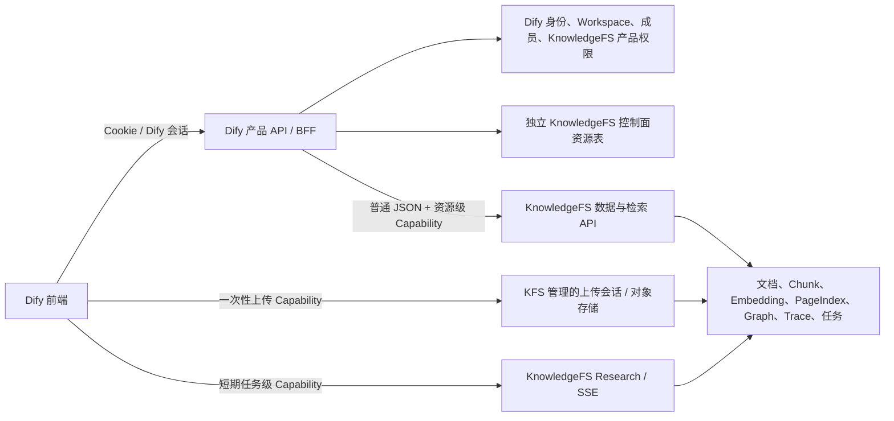
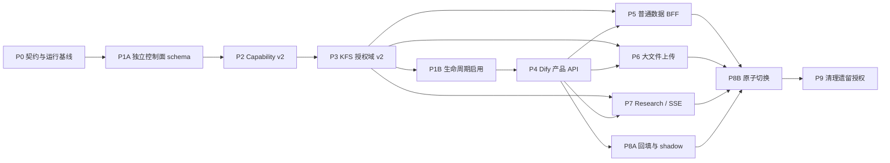

# Dify × KnowledgeFS 集成执行计划

> 状态：P0–P7 后端并存能力已完成；当前只继续推进 P8A-06～10、P8B-01～06 与 P9-01～07；Dify 现有知识库继续与 KnowledgeFS 独立并存，Dify Web、现有知识库下架及其他生产运营工作不属于本轮范围
>
> 计划基线：Dify `codex/migrate-knowledge-fs` 分支，`4ee43b8afc3b57ee5e5636db1e441b99fe03ecaa`
>
> 编制日期：2026-07-20
>
> 适用范围：本轮只覆盖 KnowledgeFS 存量凭据/任务处置、shadow/final delta、按 Workspace 切换与观察，以及旧 KFS 授权域清理；不迁移或下架 Dify 现有 Dataset 知识库

## 1. 目标与最终边界

本计划的目标是把 Dify 和 KnowledgeFS 调整为清晰的“控制面 + 数据面”架构：

当前交付目标是把 KnowledgeFS 作为独立产品接入 Dify，而不是替换 Dify 现有 Dataset 知识库。两个产品使用独立的路由、表、权限、凭据和任务链路并存；旧知识库的迁移、切流和下架必须在未来获得明确批准后另行执行。

- Dify 是用户身份、Workspace、成员、角色、KnowledgeFS Space 可见范围、产品权限和 API Access 的唯一事实来源。
- Dify 向前端提供独立 KnowledgeFS 产品 API，并在每次操作前完成资源级授权。
- KnowledgeFS 不管理 Tenant 生命周期、成员、角色、可见范围，也不保存一套与 Dify 平行的产品权限事实。
- KnowledgeFS 保留知识空间技术配置、模型配置、文档与索引、检索、异步任务和内部运行状态。
- 普通 CRUD、设置和列表通过 Dify BFF；大文件上传和长连接 SSE 使用 Dify 签发的短期资源 Capability 直连数据面。
- 即使前端直连 KnowledgeFS，KnowledgeFS 也只验证 Dify 签发的资源权限，不把浏览器会话或 Dify 登录 JWT 当作自身登录体系。

目标架构如下：



### 1.1 明确不做的事情

- 不在 KnowledgeFS 中迁移或复制 Dify 的账号、Workspace 成员和角色管理逻辑。
- 不复用或关联 Dify 现有 `datasets`、`documents`、`dataset_permissions`、Dataset API、Dataset Token、索引或检索管线。Dify 现有知识库与 KnowledgeFS 是两个独立产品。
- 不在当前迭代迁移现有 Dataset 知识库的数据、用户、权限、凭据或在途任务，不把任何现有知识库路由切换到 KnowledgeFS，也不下架现有知识库功能。
- 不让 Dify 前端直接调用任意 KnowledgeFS OpenAPI；直连只允许显式登记的上传和流式接口。
- 不让 KnowledgeFS 读取 Dify 数据库来完成成员授权。
- 不把 Dify 登录 JWT、Cookie 或浏览器提供的 `Authorization` 原样转发给 KnowledgeFS。
- 不在本轮实现或修改 Dify Web 前端；页面、导航、i18n、前端环境开关以及浏览器 upload/stream client 均由独立前端迭代负责。本计划只实现产品 API、后端能力和调用边界。
- `packages/contracts/generated/api/{console,service}` 是由后端 OpenAPI 自动生成的 API 契约产物，不视为 Dify Web 实现；为避免后端 schema 与生成契约漂移，本迭代保留该原子生成结果。
- 不在创建空知识库时同步调用模型做预检。模型能力和向量维度在第一次文档异步处理时，经 Dify `ModelManager → ModelInstance` 校验。
- 不强制 Embedding 维度为 1536。维度必须来自该知识空间选定模型的真实 capability，并和 vector-space 标识一起持久化。

## 2. 不可破坏的架构约束

后续 PR 必须同时满足以下约束：

1. **单一授权源**：成员、角色、可见范围和产品 API Access 只由 Dify 决定。
2. **独立产品资源注册**：Dify 为 KnowledgeFS 新建独立控制面资源表。除创建操作外，必须先由 Dify control-space ID 解析出唯一的 `knowledge_space_id`，再签发 Capability；该表不得外键关联 Dataset 或 Document。
3. **列表先授权再聚合**：Dify 必须先从独立 KnowledgeFS 控制面权限表计算用户可见 Space，再只向 KnowledgeFS 批量查询这些 Space 的产品与技术摘要。
4. **不信任客户端资源 ID**：路径、查询参数和请求体中的 control-space、Knowledge Space、KFS Document、Task ID 必须由服务端注册关系交叉验证。
5. **数据隔离仍保留**：KnowledgeFS 业务表仍需要一个不透明的 `namespace_id` 隔离分区。规范值固定为 Dify Workspace 原始 UUID；第一阶段可以继续使用物理列名 `tenant_id`。前缀只用于 `sub` 等 principal，不写入 namespace 列，也不代表 KnowledgeFS 拥有 Tenant 管理域。
6. **候选过滤在 LIMIT 前完成**：所有 Chunk、PageIndex、Graph、Evidence 和 AnswerTrace 查询必须先按 `namespace_id + knowledge_space_id` 过滤，再排序和截断。
7. **技术状态不复制为双写事实**：模型/vector-space、文档数、索引状态、任务状态由 KnowledgeFS 持有；Dify 只缓存用于列表展示的非权威摘要。
8. **短期、窄权限 Capability**：每个 Token 只允许明确的 action 和 resource；不能用一个 `knowledge-spaces:write` 通配权限覆盖所有写操作。
9. **异步任务不保存 Bearer**：worker payload、数据库和日志中不得保存原始 Capability、预签名 URL 或 Dify 会话信息。
10. **失败关闭**：控制面资源注册缺失、授权服务异常、签名密钥未知、模型 capability 不一致、空间归属不一致时均拒绝操作，不猜测、不自动放宽。
11. **删除必须持久化**：产品删除由 Dify 发起，但 KnowledgeFS 继续负责 tombstone、outbox、重试、对象清理、索引清理和终态审计；数据库级 cascade 或 Workspace 删除不得绕开此流程。
12. **契约先于流量**：任何新 KnowledgeFS operation 在 Dify 可用前，必须先进入 operation manifest、鉴权契约和跨服务测试。
13. **内容范围显式传递**：若 Source/KFS Document 存在比 Space 更细的产品权限，策略仍由 Dify 计算。Capability 只携带不可伪造的 opaque scope IDs 和 policy revision，KFS 仅据此在 LIMIT 前过滤；若产品没有该层权限，`permission_scope` 只能表示技术归属，不得称为成员 ACL。
14. **两个产品完全隔离**：KnowledgeFS controller/service/task 不得读写 Dify Dataset/Document 表或调用其 indexing/retrieval/delete pipeline；Dify 现有知识库代码也不得路由到 KFS。
15. **只复用身份/RBAC 框架**：可以复用 Dify Account、Tenant、TenantAccountJoin、登录上下文和 RBAC transport，但 `DATASET_OPERATOR`、`is_dataset_editor`、Dataset permission scene/resource type 都不能代表 KnowledgeFS 权限。

## 3. 产品与检索语义基线

本计划同时固定以下已确认的产品语义，避免权限改造时误改检索行为：

- `Fast`：普通混合召回、候选合并、统一 Rerank。
- `Research`：使用 Summary、Outline、PageIndex；不得错误依赖 Graph。
- `Deep`：普通混合召回加 Graph 扩展，合并候选后统一 Rerank；不能只查 Graph。
- `Auto`：不是第四种检索执行模式。它通过 LLM 分类为 Fast、Research、Deep 之一，再走对应管线。
- Top K、Score Threshold、模型配置和权限过滤必须分别作用于三种最终执行模式。
- 每个知识空间独立选择推理模型、Embedding 模型、Rerank 模型和检索配置。
- KnowledgeFS 持久化模型标识、provider/plugin 标识、vector-space 标识、真实 Embedding 维度和配置 revision。
- 空知识库创建不触发模型预检。首次文档异步任务只把 tenant/plugin/provider/model 路由提交给 Dify inner API；Dify 通过 `ModelManager → ModelInstance` 解析 Workspace 凭据并完成 capability 校验、维度探测及实际模型调用，KnowledgeFS 不接收模型 credentials。

## 4. 迭代启动时的实现基线与主要缺口（历史）

下表用于保留本迭代开始时的差距快照，不代表当前工作树状态；实际完成状态以第 11 节的任务勾选、
本地证据和外部 blocker 为准。

| 领域 | 当前实现 | 缺口或风险 | 目标阶段 |
| --- | --- | --- | --- |
| Dify 代理 | `api/services/knowledge_fs_proxy.py` 仅登记列空间和建空间两个 operation | 设置、文档、Source、检索、SSE、Trace 均不可达 | P0、P4、P5 |
| Dify 代理授权 | 当前使用 `account.is_dataset_editor`、`DATASET_*` permission 和 Dataset RBAC scope | KnowledgeFS 是独立产品，必须改为独立 KnowledgeFS RBAC；不能冒充 Dataset | P1、P4 |
| Dify 控制面资源 | 当前没有独立的 KnowledgeFS product-space/permission 表；KFS Space 与 Dify Dataset 本就无关 | 缺少 Dify-owned 的资源目录、可见性、权限和生命周期状态 | P1 |
| 产品列表 | KFS 按自身 member/policy/API Access 过滤空间；Dify 只有现有 Dataset 产品列表 | 两套产品不能混用；需要独立 KnowledgeFS 列表 API 和权限表 | P4 |
| JWT | Dify 当前签发 60 秒 HS256 Console assertion | 不是 action/resource 级 Capability；共享密钥缺少 `kid` 和标准轮换 | P2 |
| KFS 生产鉴权 | 当前运行时没有完整装配 Dify JWT verifier | 生产流量会被默认拒绝，且身份契约没有被 OpenAPI drift 检查覆盖 | P0、P2 |
| KFS 本地 ACL | 有成员、owner/editor/viewer、visibility、API Access、API Key、permission snapshot | 与 Dify 形成双授权源，不符合目标边界 | P3、P8、P9 |
| API Access | KFS 默认关闭，覆盖 service API/API key/MCP/agent；Dify 没有 KnowledgeFS 专属产品开关 | 不能复用 `Dataset.enable_api`；需要独立 policy 且默认关闭 | P1、P4、P8 |
| API Key | KFS 有 per-space Key；Dify 现有 `ApiToken` 属于其他产品/服务域 | 不能复用或修改 Dataset Token；需要 KnowledgeFS 专属 credential | P1、P4 |
| 大文件 | Dify BFF 最大 64 MiB；KFS 上传会完整 `arrayBuffer()` | 带宽和内存都不适合大文件 | P6 |
| SSE | Dify 代理已有流式传输基础，但没有登记真实 SSE operation | Research 长连接仍未接入产品链路 | P7 |
| 异步授权 | 多类 KFS 任务依赖本地 permission snapshot 和 ACL revision | 不能先删旧 ACL 表；需要新的 Dify Capability provenance | P3、P8、P9 |
| Contract pin | 生成器仍按相邻独立 KFS 仓库和独立 Git HEAD 设计；只校验部分 transport metadata | 迁入 monorepo 后路径和版本算法失效，身份及 schema drift 也检测不到 | P0 |
| 部署 | Dify Docker 未完整声明 KFS 服务、健康检查和生产密钥配置 | 无法形成可重复部署的集成环境 | P0、P2 |

## 5. 接口和数据归属矩阵

“前端入口”表示浏览器看到的产品 API；“事实数据”表示最终权威存储。模型等技术设置虽然由 Dify 页面提交，仍由 KnowledgeFS 保存。

| 功能 | 前端入口 | 授权决策 | 事实数据 | KnowledgeFS 暴露方式 |
| --- | --- | --- | --- | --- |
| 知识库列表 | Dify KnowledgeFS 产品列表 API | Dify | Dify control-space + KFS 批量产品/技术摘要 | 仅 Dify 可调的批量内部接口 |
| 知识库详情 | Dify KnowledgeFS 产品详情 API | Dify | 控制面字段在 Dify；技术字段在 KFS | Dify BFF 聚合 |
| 创建知识库 | Dify KnowledgeFS 创建 API | Dify | Dify 独立 control-space；KFS Space | Dify saga 调用 |
| 删除知识库 | Dify KnowledgeFS 删除 API | Dify | Dify control-space 状态；KFS durable deletion | Dify saga 调用 |
| 名称、图标、描述 | Dify KnowledgeFS API | Dify | KFS Space | Dify 授权后读写 KFS |
| 成员、权限、可见范围 | Dify KnowledgeFS API | Dify | Dify 独立 KnowledgeFS permission 表 + Dify identity | KFS 不提供产品管理接口 |
| API Access 产品设置 | Dify | Dify | Dify external-access policy | KFS 只服从 Capability 的 caller/action |
| API Credential | Dify | Dify | Dify resource-bound credential | 请求时兑换成短期 KFS Capability |
| 模型和 vector-space 配置 | Dify BFF | Dify | KFS | 普通 BFF |
| Rerank、Top K、Threshold、检索模式配置 | Dify BFF | Dify | KFS profile revision | 普通 BFF |
| KFS Document 列表、详情、Outline、Chunk | Dify BFF | Dify | KFS | 普通 BFF |
| 小文件上传 | Dify BFF | Dify | KFS/object storage | 普通 BFF，保留小体积上限 |
| 大文件上传 | Dify 先授权 | Dify | KFS upload session/object storage | 一次性 Capability 直连 |
| Source 配置和同步 | Dify BFF | Dify | KFS | 普通 BFF；凭据用 Dify/KMS 引用 |
| Fast/Deep 普通查询 | Dify BFF | Dify | KFS Trace、Evidence | 普通 BFF；需要流式时另行登记 |
| Research 计划和创建 | Dify BFF | Dify | KFS task | 普通 BFF |
| Research SSE | Dify 签发连接能力 | Dify | KFS event log | 任务级短期 Capability 直连 |
| 任务状态、结果、取消 | Dify BFF；必要时重新签发直连能力 | Dify | KFS | 默认普通 BFF |
| AnswerTrace、Evidence、冲突和缺失项 | Dify BFF | Dify | KFS | 普通 BFF |
| FSCK、GC、lease、staged commit、内部索引状态 | Dify 运维入口或服务间调用 | Dify 运维权限 | KFS | 不对普通前端暴露 |
| 健康检查、OpenAPI、指标 | 基础设施 | 服务身份 | KFS | 内部网络 |

## 6. Dify 独立 KnowledgeFS 控制面数据模型与生命周期

### 6.1 独立 control-space 资源表

新增 Dify-owned `knowledge_fs_control_spaces`。它是 Dify 对 KnowledgeFS 产品进行授权和生命周期编排的资源目录，不是 Dataset，也不保存任何 KFS Document：

| 字段 | 说明 |
| --- | --- |
| `id` | Dify KnowledgeFS 产品资源 ID，前端和 Dify API 使用 |
| `tenant_id` | Dify Workspace ID |
| `knowledge_space_id` | KFS Space ID；`provisioning` 时允许为空，成功后不可变 |
| `owner_account_id` | Dify 产品 owner，外键到 Dify Account |
| `visibility` | `only_me`、`all_team_members`、`partial_members` |
| `provisioning_key` | 创建 KFS Space 的稳定幂等键，唯一且不可复用 |
| `lifecycle_operation_id` | 当前 create/delete/repair operation 或 outbox event ID |
| `state` | `provisioning`、`active`、`deleting`、`deleted`、`error` |
| `resource_version` | 控制资源和状态转换的 CAS revision |
| `attempt_count` / `last_attempt_at` | worker 重试和 stuck 检测 |
| `last_error_code` / `last_error_message` | 脱敏的稳定诊断信息 |
| `last_synced_at` | KFS 产品/技术摘要最近同步时间 |
| `created_at` / `updated_at` | 审计时间 |

同时新增以下独立表，全部以 `control_space_id` 为资源外键，不得出现 `dataset_id` 或 Dify `document_id`：

- `knowledge_fs_control_space_permissions`：Dify account、角色/访问级别、状态和 permission revision。
- `knowledge_fs_external_access_policies`：`service_api_enabled`、`agent_enabled`、`workflow_enabled`、`mcp_enabled=false` 和 revision；单一 UI 开关可在 service 层原子更新前三项。
- `knowledge_fs_api_credentials`：KnowledgeFS 专属长期 credential hash、prefix/last4、principal、allowed actions、状态、expiry、revision 和 revoke audit；secret 只展示一次。
- `app_knowledge_fs_space_joins`：App/Agent/Workflow 与 control-space 的显式授权关系，不复用 `AppDatasetJoin`。
- `knowledge_fs_capability_issuance_audits`：脱敏 issuance audit。
- `knowledge_fs_lifecycle_outbox`：provision、metadata update、delete、revoke 和 repair 的持久命令。provision payload 必须含 name/icon/description/slug、模型/profile intent、schema version、idempotency key 和 expected revision；它只是待投递命令/审计，不是产品读取事实源。

约束：

- `knowledge_fs_control_spaces`、权限表和 credential 表与 Dify `datasets`、`documents`、`dataset_permissions`、`api_tokens` 零外键、零 ORM relationship。
- `only_me/all_team_members/partial_members` 只能复用枚举值，不能复用 `Dataset.permission`、`DatasetPermission` 或其 service。
- 可以外键关联 Dify `tenants`、`accounts`、`tenant_account_joins`，因为身份和 Workspace 仍由 Dify 管理。
- `knowledge_space_id` 非空时唯一索引 `(tenant_id, knowledge_space_id)`。PostgreSQL 使用 partial unique index；MySQL 使用允许多个 `NULL` 的 unique key，并用状态机保证 active 时非空。
- 所有查找必须带 `tenant_id`；不允许仅凭浏览器传入的 KFS Space ID 反向获取产品资源。
- Dify 现有 Dataset/Document schema、runtime mode、索引任务和删除逻辑不做任何 KnowledgeFS 特判。
- Workspace 删除必须枚举独立 control-space，逐个进入 deleting 状态并等待或记录可恢复 cleanup ledger，之后才能完成 Workspace 数据清理。

### 6.2 创建采用 saga/outbox

Dify 数据库与 KnowledgeFS 数据库之间没有分布式事务，创建流程必须幂等：

1. Dify 在本地事务中创建 `provisioning` control-space、初始产品权限和 provision command snapshot；不创建 Dataset 或 Dify Document。
2. command snapshot 持久化 name/icon/description/slug、用户所选模型/profile intent、schema version、idempotency key 和 expected revision，保留到 KFS ACK 及审计保留期结束；列表/详情不得从该 payload 读取产品数据。
3. provision worker 只能在 Capability v2 verifier、integrated provision route 和 KFS legacy ACL mutation freeze 就绪后启用；此前只部署 schema，不能发远端流量。
4. worker 使用稳定 `provisioning_key` 和 namespace-level `knowledge_spaces.provision` service Capability 调用 KFS integrated provision operation。
5. integrated provision 只创建技术 Space，绝不 bootstrap owner/member/policy/API Access/API Key。
6. KFS 创建空空间并权威保存元数据和用户所选模型/profile 标识，但不调用模型运行时。
7. name/slug/description/icon 由 KFS Space 权威保存；Dify control-space 不复制这些字段，列表和详情通过授权后的 KFS 批量/详情接口获取。
8. Dify 将 `knowledge_space_id` 写回 control-space 并切换为 `active`。
9. KFS 超时或失败时 control-space 进入可重试状态，不能创建第二个 KFS Space。
10. 若 KFS 已成功但 Dify 回写失败，重试必须通过 `provisioning_key` 找回同一 Space。

### 6.3 删除采用双阶段状态

1. Dify 完成 KnowledgeFS 产品权限判断并把 control-space 标为 `deleting`，立即从普通列表隐藏。
2. Dify outbox 调用 KFS durable deletion，携带 control-space/Space 精确资源 Capability 和 idempotency key。
3. KFS 执行 tombstone、任务取消策略、Source sync/OAuth 引用清理、索引/对象清理、重试和 terminal audit。
4. Dify 轮询或消费回调，把 control-space 标为 `deleted`，再清理 Dify 侧产品权限和 credential。
5. 回滚只允许恢复尚未进入 KFS 不可逆清理点的请求；越过该点后只能重新导入，不能伪恢复。
6. Dify 的单个、批量和 Workspace 删除入口都必须调用同一个 KnowledgeFS lifecycle service，禁止直接硬删 control-space。
7. outbox/cleanup ledger 的保留期必须覆盖最大删除重试窗口；orphan reconciler 定期对比 deleting control-space、KFS tombstone 和残留对象。

### 6.4 API Access 和 API Credential

- 明确 caller channel：`interactive`、`service_api`、`agent`、`workflow`、`mcp`、`internal_worker`。
- 为 KnowledgeFS 新增独立 external-access policy service，不能读取或修改 `Dataset.enable_api`。
- 设计稿的单一开关固定为以下语义：Console `interactive` 不受影响；`service_api`、`agent` 和使用 KnowledgeFS 的 `workflow` 受控；`internal_worker` 继承已准入 job grant；MCP 在没有独立产品策略前默认 fail-closed。
- 新建 control-space 的 external access 默认 `false`。旧 KFS API Access 显式值可在迁移时作为初始值；未知值一律迁为 `false`。
- 新增 KnowledgeFS 专属 service/agent adapter 和 API wrappers；不得改变 Dify 现有 Dataset `knowledge_retrieval_inner_service.py`、Dataset Service API 或 Agent knowledge retrieval 的语义。
- 新增 `knowledge_fs_api_credentials`，不要扩展或复用 Dify 现有 `ApiToken`/Dataset Token。
- 长期凭据只存在 Dify；Dify 验证后为单次 KFS operation 兑换短期 Capability。
- 集成模式下不再向产品暴露 KFS `kfs_*` per-space Key。

### 6.5 授权 revision 和 outbox

Dify 需要提供可审计的单调 revision，不能仅把当前布尔决策塞入 Token：

- Workspace membership/role 变化递增 `membership_epoch`。
- control-space visibility、owner、partial members 和产品角色变化递增 `space_acl_epoch`。
- KnowledgeFS external-access caller policy 变化递增 `external_access_epoch`。
- KnowledgeFS credential 更新、过期或撤销递增 credential revision。
- 子资源 scope policy 变化递增 `content_policy_revision`。

这些 revision 由 Dify 事务内更新并写 KnowledgeFS 专属 outbox。它们用于审计、shadow diff、显式 revoke 的有序 CAS 和故障对账，不要求 KnowledgeFS 保存成员或反查 Dify 权限表。

## 7. Capability Token 契约

### 7.1 建议 claims

```json
{
  "iss": "dify-control-plane",
  "aud": "knowledge-fs",
  "sub": "dify-account:<account-id>",
  "actor": "dify-account:<account-id>",
  "namespace_id": "<raw-workspace-uuid>",
  "azp": "dify-console",
  "caller_kind": "interactive",
  "cap_ver": 2,
  "jti": "<cryptographically-random-id>",
  "iat": 0,
  "nbf": 0,
  "exp": 0,
  "action": "documents.list",
  "grant_id": "<dify-authorization-grant-id>",
  "authz_revision": {
    "membership_epoch": 0,
    "space_acl_epoch": 0,
    "external_access_epoch": 0,
    "credential_revision": null
  },
  "content_scope_ids": [],
  "content_policy_revision": 0,
  "resource": {
    "type": "knowledge_space",
    "id": "<knowledge-space-id>",
    "parent_id": null
  },
  "control_space_id": "<dify-knowledge-fs-control-space-id>",
  "trace_id": "<cross-service-trace-id>"
}
```

约束：

- `sub` 必须是真实 Dify principal，不能使用 Workspace ID 或伪装的 tenant owner。interactive 使用 `dify-account:<id>`；service API 使用 `dify-api-credential:<id>`；Agent/Workflow 使用 `dify-app:<id>`；内部任务使用明确的 service principal。
- `actor`/`issued_by` 单独记录触发者；service/app principal 不得伪装成人类账号。
- `namespace_id` 使用现有 KFS `tenant_id` 已保存的 Dify Workspace 原始 UUID，语义上不透明但不增加 `dify-workspace:` 前缀。
- `control_space_id` 只用于 Dify 审计和跨系统追踪；KFS 的实际授权资源仍是 signed `knowledge_space_id`/子资源，不能用该 ID 查询 Dify Dataset 或 Document。
- 默认一个 Token 只包含一个 action 和一个资源；批量状态接口使用显式 `knowledge_spaces.status.batch` action 和受限资源集合。
- Task、KFS Document、UploadSession 等子资源必须同时绑定其父 `knowledge_space_id`。
- `/queries` 这类 Space ID 在 body 中的请求，KFS 必须比较 body 和 Capability resource。
- 如果产品定义了子资源权限，Dify 写入已解析的 opaque `content_scope_ids` 和单调 policy revision；KFS 不从 subject 反推 scope。
- 不允许把自由 path glob 当作权限，也不允许客户端自报 `caller_kind`。

### 7.2 签名和轮换

- 生产使用 EdDSA、ES256 或 RS256，必须带 `kid`。
- Dify 持有私钥；KnowledgeFS 只持有或通过受控 JWKS 获取公钥。
- JWKS 缓存必须支持 current/previous key 重叠，未知 `kid` 刷新一次后仍失败则拒绝。
- 生产强制验证 `iss`、`aud`、`nbf`、`exp`、`cap_ver`、action、resource 和 namespace。
- 禁止在生产继续使用 KnowledgeFS 可反向伪造 Dify Token 的共享 HS256 密钥。
- auth profile manifest 必须纳入 CI，覆盖算法、issuer、audience、claims、TTL 和 caller kind；OpenAPI 本身不能替代身份契约。

### 7.3 Token 类型和建议 TTL

| 类型 | 用途 | 建议 TTL | 重放策略 |
| --- | --- | --- | --- |
| BFF operation capability | 单次普通 JSON 调用 | 30–60 秒 | 幂等写携带 idempotency key |
| Service operation capability | Dify worker/agent 单次调用 | 30–60 秒 | 绑定 service principal 和 action |
| Upload-session capability | 创建或完成某个上传会话 | 5–15 分钟 | `jti`/session 单次消费 |
| Stream capability | 连接某个 query/task 事件流 | 2–5 分钟 | 连接前验证；重连重新向 Dify 获取 |
| Batch-status capability | 查询显式 Space ID 集合 | 30–60 秒 | 限制最大集合大小 |

最终 TTL 应通过安全测试和真实延迟数据确定，不应写死在业务 controller 中。

### 7.4 Dify 签发前检查

所有通道都必须先验证 control-space 属于当前 Workspace、状态为 `active`、已注册唯一 KFS Space、operation action/resource 正确，并持久化脱敏 issuance audit；principal-specific 准入规则如下：

| Principal | Dify 准入规则 | `sub` |
| --- | --- | --- |
| Interactive account | 验证登录、Workspace membership、control-space visibility/role、KnowledgeFS operation RBAC | `dify-account:<account-id>` |
| KnowledgeFS-bound service credential | 验证专属 credential 状态、expiry、control-space registration、operation allowlist、external access | `dify-kfs-credential:<credential-id>` |
| Agent/Workflow app | 验证 app 所属 Workspace、app↔control-space 授权、运行权限、external access；不伪装 owner | `dify-app:<app-id>` |
| Internal worker | 验证已持久化 job/grant、限定内部 operation，不重新使用用户 Cookie | `dify-worker:<service-id>` |
| MCP | 独立策略未实现前不签发 | 不适用 |

Dify 必须从独立 control-space 注册和已验证 principal 构造 namespace、Space、Task、content scopes 和 revision；不得采用客户端传入的最终值，也不得查询 Dataset/Document 作为授权依据。

### 7.5 KnowledgeFS 验证职责

KnowledgeFS 只做以下验证：

- 签名、issuer、audience、时间、版本和 `kid`。
- action 与当前 route/operationId 完全匹配。
- namespace、父 Space 和子资源归属完全匹配。
- 一次性上传 Capability 未被消费、会话未过期。
- 资源数据查询始终带 namespace + Space 过滤。
- 有 `content_scope_ids` 时，在候选 LIMIT 前按 opaque scope 过滤；没有该产品能力时只执行 namespace/Space 技术归属过滤。
- Dify 明确发送的 task/grant revoke 或 cancel 状态。

KnowledgeFS 不做以下验证：

- 不查 Dify 成员表。
- 不维护 owner/editor/viewer。
- 不计算 only-me/partial-members。
- 不决定 Dify 用户是否有 KnowledgeFS 产品页面权限。
- 不保存一份 Dify Workspace 或成员目录。

### 7.6 异步任务授权语义

为了避免重新引入成员同步，默认采用“准入时授权、后续读取重新授权”：

- Dify 在创建任务时生成稳定 `grant_id`，写入 membership、control-space ACL、external-access、credential 和 content-policy revision；KFS 保存不可伪造的 grant provenance，但不保存原始 Token。
- 已被 KFS 接受的文档编译、索引或 Research 任务默认允许执行并发布到终态。之后发生普通 membership、visibility、API Access 或 credential 变化，只停止新 Capability 和后续 read/cancel，不自动取消已准入计算。
- 用户之后是否还能查看、取消或读取结果，必须重新从 Dify 获取 Capability；失权后即使任务已经完成也不能读取。
- 删除 Space、显式取消、事故处置等必须停止发布的事件，由 Dify outbox 发送带单调 `revoke_sequence` 和相关 revision 的 task/grant revoke。KFS 以 CAS 保存最高水位，重复或乱序事件不得恢复旧 grant。
- Dify 提供 revoke replay/reconciliation，根据 outbox 水位对账 KFS consumption watermark，修复漏投；KFS 只保存 grant/revoke 技术事实，不同步成员关系。
- 如果未来产品要求“任何成员撤权都立即停止运行中任务”，必须另行把相应 epoch 变化转为有序 revoke，并给出延迟 SLO；不能暗中改变默认准入语义。
- 对删除知识库等高风险操作，Dify 必须主动取消相关任务，KFS 在最终 publication CAS 前检查 Space tombstone/revoke fence。
- 旧任务中 `subject_id=dify-workspace:*` 无法可靠恢复真实用户，必须隔离、自然到期或取消，不能猜测回填。

## 8. API 路由方案

### 8.1 Dify 对前端提供的产品 API

必须建立独立的 typed KnowledgeFS 产品 API，禁止复用 Dataset controller/service/DTO：

- `GET/POST /console/api/knowledge-fs/spaces`：列表和创建。
- `GET/PATCH/DELETE /console/api/knowledge-fs/spaces/{controlSpaceId}`：详情、产品字段和删除。
- `/spaces/{controlSpaceId}/permissions`、`/members`、`/external-access`、`/credentials`：Dify 控制面。
- `/spaces/{controlSpaceId}/settings`：模型、Embedding/vector-space、Rerank、retrieval profile BFF。
- `/spaces/{controlSpaceId}/documents|sources|queries|research-tasks|traces`：KFS 数据 BFF；其中 document ID 是不透明的 KFS Document ID。
- `/spaces/{controlSpaceId}/upload-capabilities`、`/tasks/{taskId}/stream-capability`：直连能力签发。
- `/v1/knowledge-fs/...`：KnowledgeFS 专属 Service API 和 credential validator，不复用 Dataset Service API。
- Agent/Workflow 使用独立 `app_knowledge_fs_space_joins` 或类型化 `KnowledgeResourceRef{kind: "knowledge_fs"}`，不得把 control-space ID 塞入 `dataset_ids` 或 `AppDatasetJoin`。

现有 catch-all proxy 只作为迁移期传输层；产品 controller 必须使用 typed request/response DTO，不能让前端依赖 KFS 原始 OpenAPI。

### 8.2 KnowledgeFS 服务间接口

需要新增或正式登记以下内部能力，实际路径由 OpenAPI PR 固定：

- 按显式 Space ID 集合批量查询 KFS 权威产品元数据和技术摘要：至少包含 `name`、`icon`、`description`、产品使用时的 `slug`，以及 `document_count`、`index_state`、`model_profile`、`last_job_state`。
- 幂等的 integrated provision：只创建技术 Space，不 bootstrap owner/member/policy/API Access/API Key。
- 更新模型和 retrieval profile。
- KFS Document/Source/Query/Trace/Research 的业务 API。
- durable deletion 请求和状态。
- upload session create/complete/abort。
- task/grant revoke/cancel。

批量状态接口必须：

- 限制最大 ID 数量、请求体和响应体大小。
- 验证每个 ID 都属于 Capability namespace。
- 只返回请求的 ID，不因为某个 ID 不存在而补充其他空间。
- 支持部分缺失的稳定结果，不泄露资源是否存在给未授权主体。
- product metadata/technical summary response schema 必须纳入 Dify contract lock 和跨服务 schema test；KFS 不可用时 Dify 不从 outbox 或旧缓存伪造权威名称，只返回 control-space 最小状态和 unavailable 占位语义。

### 8.3 允许直连的最小集合

首轮只开放：

- KFS 管理的 upload session 数据面或其对象存储预签名 URL。
- `GET /research-tasks/{id}/events`。
- 只有实际需要逐 token 流式输出时才开放 Query SSE。

其余 JSON 接口继续通过 Dify BFF。直连接口必须要求 Capability v2，不能接受 legacy broad Token。

### 8.4 不对普通前端开放

- `access-bootstrap`、`access-policy`、`members`、`api-access`、`api-keys`。
- FSCK、GC、lease、staged commits 和低层文件系统写接口。
- 无产品权限封装的 Graph traverse、semantic materialize 和内部 backfill。
- 未进入 Dify operation manifest 的任何新增 KFS route。

## 9. 关键业务流程

### 9.1 知识库列表

1. Dify 查询独立 `knowledge_fs_control_spaces` 和 permission 表，先应用 Workspace membership、KnowledgeFS RBAC、visibility 和 partial members。
2. 只收集当前页可见、状态为 `active` 的 control-space 及其 KFS Space ID。
3. Dify 用 batch product/technical summary Capability 向 KFS 请求权威名称、图标、描述和技术摘要。
4. Dify 按 `control_space_id` 聚合 KFS 返回的名称、描述、文档数、模型和索引状态，以及 Dify 控制面的权限状态后返回前端。
5. KFS 超时不应扩大可见范围；Dify 只返回 control-space 最小状态和 `technical_status=unavailable`，并记录降级指标。

验收重点：分页和可见性必须在 KFS 调用之前完成，禁止“先取全部空间再在内存过滤”。

### 9.2 创建空知识库

1. Dify 验证 KnowledgeFS create 权限和用户选择的模型标识格式。
2. 创建独立 provisioning control-space、初始权限和 outbox；不创建 Dataset 或 Dify Document。
3. KFS 创建空 Space，并持久化模型/provider/vector-space 意图配置。
4. 不调用 Dify 模型运行时，不阻塞空知识库创建。
5. control-space 注册 KFS Space 并变为 active 后返回产品可用状态。

首次文档进入异步任务后才：

1. 通过 Dify inner API 调用用户选择的模型做真实 capability preflight；Dify 内部必须使用 tenant-scoped `ModelManager.get_model_instance(...)` 后再调用 embedding、rerank 或 LLM，KnowledgeFS 禁止直连 plugin-daemon 模型 dispatch，也禁止传模型 credentials。
2. 获取 Embedding 真实维度，不假设 1536。
3. 创建或校验 vector-space，并保存模型/vector-space 标识和 dimension。
4. 如果现有索引与新模型维度不兼容，任务以稳定错误码失败并要求显式迁移，不能静默覆盖。

### 9.3 更新设置

- 名称、图标、描述由 Dify 授权后直接写 KFS；若为可靠投递使用 outbox，payload 必须带 KFS expected revision 且仅作 transient command，ACK 后列表仍从 KFS 读取。可见范围、成员和 API Access 只更新 Dify 独立控制面表。
- 模型和 retrieval profile 由 Dify 授权后写 KFS。
- 模型变更必须创建 profile revision 和迁移任务，不能原地让新旧向量混用。
- Dify 页面读取设置时聚合两侧数据，并对 KFS 暂时不可用显示技术状态错误，不能回退到过期权限值。

### 9.4 文档上传与导入

小文件：

- 经过 Dify typed BFF。
- 保留严格 body 上限和 content-type allowlist。
- Dify 不解析文件内容，只传给 KFS。

大文件：

1. 前端以 `control_space_id` 向 Dify 请求 KnowledgeFS upload capability。
2. Dify 授权并由 KFS 创建固定 object key、配额预留和 upload session。
3. 前端直传 KFS 管理的数据面；优先直接上传对象存储，避免 KFS Node 进程完整缓冲。
4. complete 时校验 size、checksum、content type、session 状态、object ownership 和幂等键。
5. KFS 创建 KnowledgeFS logical document、asset 和 compilation job；Dify 不创建 `Document`、`DocumentSegment` 或 `ChildChunk` 行。
6. 过期/abort session 由 cleanup worker 与 bucket lifecycle 清理。

### 9.5 文档编译和分段

本节所有 Document/Chunk 都是 KnowledgeFS 子资源，与 Dify Dataset 产品的 Document/Segment/ChildChunk 无关。

- 先按文档标题层级生成 Outline/PageIndex 结构。
- 每一章节内部由一次 LLM 交互完成语义分段，以及该 Chunk 的实体/关系提取所需结构化输出。
- Chunk 有最大 1200 字素限制，但不能为了接近 1200 而持续机械合并。
- 语义完整优先；一个章节只有一个符合上限的 Chunk 是合法结果。
- C-1、C-2 等是前端展示序号，不要求作为业务字段持久化。
- PageIndex 树、普通检索 Chunk、Graph 实体关系是相关但独立的投影，不能把所有 Chunk 只保存成 PageIndex 树而丢失普通混合检索结构。

### 9.6 查询与检索

Dify 在 query admission 时检查 control-space visibility/role、KnowledgeFS RBAC 和 API Access channel，签发具体 KFS Space 的 `queries.create` Capability。KFS 再按最终模式执行：

- Fast：dense + sparse/full-text 混合召回 → 候选去重合并 → threshold/top-k 策略 → Rerank → Trace。
- Research：Summary/Outline/PageIndex 规划和检索，不依赖 Graph；产出 Research task/events/partials。
- Deep：普通混合召回 + Graph 扩展 → 候选去重合并 → 统一 threshold/top-k → 统一 Rerank → Trace。
- Auto：先调用配置的 LLM 分类，仅输出 Fast/Research/Deep，然后执行对应管线。

每种模式的 Trace 至少记录最终模式、配置 revision、模型标识、各索引候选数、候选合并、过滤、Rerank、最终证据和权限 namespace/space，不记录 Capability 原文。

### 9.7 Research 和 SSE

1. Research plan/create 通过 Dify BFF。
2. Dify 返回产品 task ID 映射和一个可单独申请的 stream capability endpoint。
3. 前端用 `fetch + ReadableStream` 携带 `Authorization: Bearer` 直连 KFS；不使用 URL query Token。
4. Token 绑定 task ID、父 Space、events action 和过期时间。
5. KFS CORS 只允许配置的 Dify origin，不使用 Cookie。
6. 断线通过 cursor 重连；每次重连重新向 Dify 获取 Capability。
7. terminal event 保证至多一个逻辑终态，代理或服务异常需转成稳定 terminal/error 语义。

### 9.8 任务状态、结果和取消

- 默认通过 Dify BFF 查询，Dify 每次重新做资源授权。
- 如果前端需要高频直查，必须每次先从 Dify 获取短期 task capability。
- cancel 必须是单独 action，read capability 不能取消任务。
- 用户失去权限后不能再读取结果；若业务要求同时停止执行，由 Dify outbox 发出 revoke/cancel。

## 10. KnowledgeFS 权限域迁移

### 10.1 最终删除的产品权限对象

完成切换和回滚窗口后，集成模式删除或禁用：

- `/knowledge-spaces/{id}/access-bootstrap`
- `/knowledge-spaces/{id}/access-policy`
- `/knowledge-spaces/{id}/members`
- `/knowledge-spaces/{id}/members/{subjectId}`
- `/knowledge-spaces/{id}/api-access`
- `/knowledge-spaces/{id}/api-keys`
- `knowledge_space_members`
- `knowledge_space_access_policies`
- `knowledge_space_access_policy_members`
- `knowledge_space_api_access`
- `knowledge_space_api_keys`
- 依赖上述事实的旧 permission snapshot 结构

如果 KnowledgeFS 仍需支持完全独立部署，必须通过明确的 deployment mode 隔离 standalone ACL；不能让 Dify integrated mode 同时执行两套授权。

### 10.2 必须保留的技术隔离与审计

- 所有业务数据上的 namespace/`tenant_id`。
- namespace + Space 的复合过滤、索引和外键。
- Source、KFS Document、Node、Graph 的技术归属过滤；若启用子资源产品权限，只使用 Capability 中 Dify 已解析的 opaque scope IDs 和 policy revision，不依赖 KFS 本地成员表。
- Capability consumption provenance：issuer、subject、namespace、resource、action、caller kind、`azp`、`jti` hash、accepted time、status。
- durable deletion 的 ledger、tombstone、outbox、lease、retry 和 terminal audit。
- AnswerTrace、Evidence 和运行状态的资源归属。
- PageIndex、Graph、向量/全文索引的 generation、projection publication 和原子发布快照；它们是技术一致性机制，不是成员权限快照。
- Source credential reference、sync ledger 和清理任务；权限由 Dify 决定，凭据正文不得进入 Capability 或审计日志。

### 10.3 旧表不能直接删除

以下功能已经通过外键或运行逻辑依赖旧 permission snapshot/API Key：

- Research job
- KFS Document compilation requester binding
- Durable deletion
- Profile migration
- Source product workflow/OAuth/sync
- Quality replay/failed query
- AnswerTrace 和 agent workspace snapshot 的部分授权路径

迁移顺序必须是：

1. 新增 capability grant/provenance v2 表和字段。
2. 所有新请求写 v2 provenance；兼容期可同时写旧 snapshot，但新逻辑不得新增成员事实。
3. 所有 worker、read path 和 final publication fence 切换到 v2 grant + Space tombstone/revoke 语义。
4. 盘点旧任务。无法映射真实账号的 workspace-subject 任务隔离、到期或取消。
5. 解除下游表到旧 member/policy/api-key snapshot 的外键。
6. 运行一个完整回滚窗口，只读监测旧路径是否仍被访问。
7. 最后删除旧路由、代码和表。

## 11. 分阶段实施计划

P0–P7 已完成 KnowledgeFS 独立产品能力。当前经用户明确授权，继续执行 P8A-06～10、P8B-01～06 与 P9-01～07；这些步骤只切换和清理 KnowledgeFS 自身的存量授权域，不迁移或下架现有 Dataset 知识库。阶段编号表达主要依赖，不表示某个阶段的代码合并后必须立即启用新授权源。



### P0：Monorepo、契约与运行基线

目标：让迁入 Dify 仓库的 KnowledgeFS 可以被稳定构建、检查和部署，但不扩大产品流量。

任务：

- [x] `P0-01` 修改 `api/dev/generate_knowledge_fs_contract.py`，默认读取仓库内 `knowledge-fs/`。
- [x] `P0-02` 版本 pin 只记录 `knowledge-fs/` subtree tree ID、OpenAPI SHA 和 auth manifest SHA，不把包含 lock 自身的 Dify commit 写入 lock，避免自引用。更新工具从 staged index 计算 subtree tree；发现 `knowledge-fs/` 有未暂存改动时拒绝生成。Dify commit 只作为 CI artifact 元数据。
- [x] `P0-03` 增加 KnowledgeFS upstream provenance manifest，记录迁入源码对应的 upstream commit/release，并让 `api/knowledge-fs-contract.lock.json` 与当前 subtree 实现对齐。
- [x] `P0-04` 更新 contract lock 并记录 auth profile manifest。
- [x] `P0-05` 在仓库根 `.github/workflows/` 增加 KnowledgeFS install、lint、typecheck、test、coverage、build 和 OpenAPI drift job，显式设置 `working-directory: knowledge-fs`，cache key 使用 `knowledge-fs/pnpm-lock.yaml`，保留其独立 `pnpm-workspace.yaml`；不能假定根 `pnpm install` 会构建子项目。最终 `pnpm check`、33/33 build/type/test tasks 和 999-file Biome gate 均通过；`@knowledge/api` 达到 93.87% lines/statements、96.26% functions、90.08% branches，`@knowledge/adapters` 达到 98.21% lines/statements、98.59% functions、97.19% branches。
- [x] `P0-06` Contract checker 扩展到 method/path/operationId、path/query/body schema、response schema/status、stream kind、byte limit、security profile 和 deprecation。
- [x] `P0-07` 增加“产品所需 operation manifest completeness”检查，不能继续忽略所有未声明 operation。
- [x] `P0-08` 增加 Dify→KFS auth test vector，覆盖 issuer/audience/subject/namespace/action/resource/caller kind/TTL，并同时断言未装配 verifier 时的 401 与正式装配后的成功向量。
- [x] `P0-09` 补充 Docker/Kubernetes 服务、网络、健康检查、readiness、Dify inner model-runtime 与 datasource plugin-daemon 依赖和配置说明。
- [x] `P0-10` 记录迭代启动时迁入 runtime 只装配 dev static auth、旧 lock 指向独立 upstream 的历史差异；在 Capability v2 完成前保持 fail-closed，不临时放开匿名访问。当前实现已由 P2-03 和更新后的 contract lock 取代该过渡状态。

产出：可重复的 monorepo CI、部署基线和跨服务契约报告。

验收：

- 从全新 checkout 可独立构建 Dify 和 `knowledge-fs/`。
- 修改 KFS request schema、auth manifest 或已登记 operation 会使 CI 明确失败。
- 未配置生产 verifier 时 readiness 失败，而不是运行后所有请求才返回 401。

回滚：只回滚 CI/部署 wiring，不改变现有数据或流量。

### P1：Dify 独立 KnowledgeFS 产品资源与生命周期

目标：建立不依赖 Dataset/Document 的 control-space、权限、外部访问和 KFS Space 注册关系。

P1 分为 schema 和启用两段，避免 provisioning worker 在正式认证和 integrated provision 就绪前调用 KFS。

P1A 任务（只部署 additive schema，worker 保持关闭）：

- [x] `P1A-01` 新增 `knowledge_fs_control_spaces` 和权限表；只关联 Dify Workspace/Account，不关联 Dataset/Document。
- [x] `P1A-02` 新增 KnowledgeFS external-access policy、专属 credential、app-space join 和授权 revision schema。
- [x] `P1A-03` 新增 provisioning/metadata-update/deletion/revoke outbox、稳定 operation/idempotency key、attempt 和保留策略；provision command snapshot 覆盖 KFS 元数据、模型/profile intent、schema version 和 expected revision，worker 默认 disabled。
- [x] `P1A-04` 新增 control-space repository、CAS lifecycle service 和 Workspace deletion fence。
- [x] `P1A-05` 新增独立 KnowledgeFS RBAC resource type/permissions，不能把 Space 冒充 Dataset。
- [x] `P1A-06` 增加 control-space 管理命令：dry-run、register、backfill、repair、orphan report。

P1A 本地证据：`api/models/knowledge_fs.py` 与
`api/migrations/versions/2026_07_21_1200-a4e7c2f91b30_add_knowledge_fs_control_plane.py`
定义独立 control-plane schema 和 outbox，未引用 Dataset/Document；
`api/repositories/sqlalchemy_knowledge_fs_control_space_repository.py`、
`api/services/knowledge_fs/control_space_lifecycle.py` 实现 tenant scope、CAS、不可逆删除点和 Workspace fence；
`api/core/rbac/entities.py`、`api/services/enterprise/rbac_service.py` 定义独立 `knowledge_space` 权限；
`api/commands/knowledge_fs.py` 与 `api/services/knowledge_fs/control_space_management.py` 覆盖五类管理命令。
对应模型、migration、repository、command 和 management 单元测试均有租户隔离、唯一性、CAS、secret 不落明文及命令注册断言。

P1B 任务（P2 和 P3 完成后才允许发流量）：

- [x] `P1B-01` 启用 integrated provision saga，定义 control-space 创建、KFS 创建、失败重试和孤儿 Space reconciliation。
  - 本地证据：`remote_registry.py` 在 API/worker/operator 进程惰性装配 production Capability-v2 HTTP adapter 和 SQL audit；`lifecycle_remote_http.py` 调用 integrated provision 并使用稳定 provisioning key。reconciler 的 list Capability 绑定真实 control-space 审计锚点，避免伪 ID 触发 UUID/FK 失败；lost ACK 通过 provisioning key 找回同一 Space/revision。候选查询优先 PROVISIONING/DELETING/ERROR，且 remote orphan 比对使用相关 tenant 的全部 non-DELETED key，不受 repair limit 截断。
- [x] `P1B-02` 启用 deletion saga，要求 KFS durable grant/revoke/publication fence 已切到 P3。
  - 本地证据：KFS `integrated-knowledge-space-deletion-routes.ts`/handler 将 exact tenant/control-space/operation/resource/revision 绑定到 durable tombstone/outbox/job，并对 replay/retry 保持幂等；Dify adapter 只调用该 integrated route，lost-ACK 删除先 CAS 登记远端实际 revision，再进入不可逆点和终态。KFS grant/revoke/job publication fence 已由 P3 覆盖。
- [x] `P1B-03` 统一 control-space、批量清理和 Workspace 删除入口，禁止绕过 lifecycle service。
  - 本地证据：单 Space、批量和 `request_workspace_cleanup()` 全部汇入 `KnowledgeFSControlSpaceCommandService.request_deletion()`。生产注册的 `knowledge-fs-control-space workspace-delete-request` 命令默认 dry-run，显式 `--apply` 才为 Workspace 全部 Space 写 durable deletion intent；`workspace-delete-finalize` 先检查全部 Space 已为 DELETED，并要求显式 purge 确认。control-space 的 `tenant_id → tenants.id` RESTRICT FK 阻止任何旁路硬删 Workspace；终态 finalizer 按依赖顺序释放本地控制面行。
- [x] `P1B-04` 为已创建的 control-space 保留永久可用的 reconciler/delete path；关闭产品 feature flag 不得让 KFS 资源失去清理入口。
  - 本地证据：feature flag 关闭时 worker 仍分发 DELETE/REVOKE；从未投递的 provision 在同一事务内被 supersede 并终结本地删除。对曾尝试的 provision，只有权威 remote list 证实不存在且原命令已可安全 supersede（非未过期 PROCESSING lease）时才终结，避免 in-flight 创建竞态；发现 lost-ACK remote 则登记真实 ID/revision 后继续 durable deletion。dead-letter/retry/reconciler 与 operator 命令均不依赖产品页面开关。

P1B 回归证据：Dify KnowledgeFS 全域单元回归 246 项通过；lifecycle/remote/reconcile/revoke 邻接测试 35 项通过；KFS integrated provision/delete/capability/fence 定向测试通过。Ruff、Pyrefly 与目标 Mypy 均无本轮错误。

产出：独立 control-space ↔ KFS Space registration、权限控制面和可恢复生命周期。

依赖：P1A 依赖 P0；P1B provision 依赖 P2 + P3 integrated provision，P1B deletion 还依赖 P3 durable provenance/fence。

验收：

- 同一 control-space/KFS Space 无法重复注册。
- 任一侧超时后重试不会创建重复资源。
- 全部 KnowledgeFS 创建、文档、检索和删除流程对 Dify Dataset/Document 表保持零读写、零外键、零任务复用。
- registration error 可由后台安全重试或人工修复。
- control-space/Workspace 旁路硬删除会被 lifecycle fence 阻止。

回滚：P1A 是 additive migration。关闭 KnowledgeFS 产品入口后，已创建的 control-space、outbox、reconciler 和删除入口必须继续运行，直到所有 KFS 资源进入安全终态；Dify Dataset 产品不受影响。

### P2：资源级 Capability v2

目标：Dify 成为唯一签发方，KFS 成为严格的数据面验证方。

任务：

- [x] `P2-01` 在 Dify 拆出 Capability issuer、claims DTO、operation-to-action registry 和 issuance audit。
- [x] `P2-02` 部署非对称签名、`kid`、JWKS 发布与重叠轮换。
- [x] `P2-03` 在 KFS 生产入口正式装配 Capability verifier 和 readiness 自检。
- [x] `P2-04` KFS 新增 action/resource/namespace guard，处理 path/query/body 资源一致性。
- [x] `P2-05` 区分 interactive、service、agent、workflow、MCP 发行 profile，不复用 Console broad assertion。
- [x] `P2-06` Dify 禁止转发浏览器 Authorization、Cookie、Set-Cookie 和未登记 header。
- [x] `P2-07` 两侧记录 `trace_id + jti_hash`，禁止记录原始 Token。
- [x] `P2-08` 增加 current/previous key、unknown kid、clock skew 和 fail-closed 测试。

P2 本地证据：Dify 的 `api/services/knowledge_fs_capability.py`、
`api/services/knowledge_fs/capability_broker.py` 与
`api/repositories/sqlalchemy_knowledge_fs_capability_issuance_auditor.py` 实现 RS256 issuer、严格 claims、profile/operation registry、current/previous JWKS 和无原始 Token 的审计；
`api/services/knowledge_fs_proxy.py` 与 `product_remote_http.py` 只构造受信 Capability header，并拒绝浏览器 Authorization/Cookie/转发 header。
KFS 的 `knowledge-fs/packages/api/src/dify-capability-v2.ts`、
`capability-grant-admission-middleware.ts`、`knowledge-space-authorization-middleware.ts` 以及
`knowledge-fs/apps/api/src/capability-v2-options.ts`/`readiness-options.ts` 完成生产装配和 fail-closed 自检。
两侧测试覆盖五类 caller、账号 subject 区分、action/resource/parent/path/query/body 一致性、current/previous/unknown `kid`、clock skew、签名失败和 `trace_id + jti_hash` 审计。

产出：可轮换、可审计、单操作单资源的跨服务授权契约。

依赖：P0、P1A。

验收：

- Space A Token 调 Space B 必须拒绝。
- read Token 调 write/cancel 必须拒绝。
- body/path resource 不一致必须拒绝。
- 同一 Workspace 的两个账号在审计中保持不同 subject。
- KFS 只持有公钥，不能签发 Dify Capability。

回滚：如果生产环境已经存在可用的 v1 流量，KFS 先做 v1/v2 双验签，Dify 再灰度 v2；如果 v1 从未完成生产装配，则不得为了回滚重新启用它。关闭 v2 流量后等待最大 TTL，再移除对应验证公钥。

### P3：KnowledgeFS 授权域 v2 和异步 provenance

目标：移除新业务对 KFS 本地成员事实的依赖，同时保证任务和删除流程可审计。

任务：

- [x] `P3-01` 新增 integrated provision operation，只创建技术 Space，永不写 owner/member/policy/API Access/API Key；旧 create/bootstrap 不得被 integrated mode 调用。
- [x] `P3-02` 新增 capability grant/provenance v2 schema，保存 `grant_id`、claims 摘要、revision 和 `jti` hash。
- [x] `P3-03` 新任务准入改写 v2 provenance，worker payload 只保存 grant ID。
- [x] `P3-04` Research、Query、compilation、profile migration、source workflow、quality、durable deletion 逐一切换。
- [x] `P3-05` final publication fence 改为 Space tombstone、单调 revoke sequence 和 job-state fence，不再查询 member/visibility/API-access 表。
- [x] `P3-06` 增加 Dify 主动 task/grant revoke/cancel 内部接口、幂等 outbox consumer、最高水位 CAS 和 replay/reconciliation。
  - 本地证据：Dify `revocation_commands.py` 在 visibility、成员和 external-access 收窄事务内生成确定性 revoke event、递增 `revoke_sequence` 并写 lifecycle outbox；`lifecycle_saga.py`/`lifecycle_remote_http.py` 投递 exact grant/Space/event/sequence，只有 KFS 返回 `revoked` 且最高水位不低于命令水位才 ACK。`revocation_reconciler.py` 对账远端水位并支持 dead-letter replay。KFS `capability-revocation-routes.ts`/`capability-revocation-handlers.ts` 和 provenance repository 以 CAS 保存最高水位，final publication/job fence 在 revoke 后失败关闭。Dify revoke 定向测试 20 项、final control-plane 测试 7 项及 KFS revoke/fence 测试均通过。
- [x] `P3-07` 冻结 KFS integrated mode 下的 access/member/api-key mutation route；该开关必须在 P1B worker 启用前生效。
- [x] `P3-08` 保留并审计 namespace + Space 隔离；内容 scope 按 Capability opaque scope IDs 在 LIMIT 前过滤，不依赖本地成员。

P3-01～P3-05、P3-07～P3-08 本地证据：
`integrated-knowledge-space-provisioning-handlers.ts` 使用独立 branded port，测试断言不会落入 legacy repository；
`capability-grant-provenance*.ts`、Postgres/TiDB `0025`/`0026` migration 持久化 claims 摘要、`jti_hash`、grant/revoke/tombstone。
Research、Query、compilation、profile migration、source workflow、quality 与 durable deletion 的新 Capability 准入均只落 `capabilityGrantId`；例如
`research-task-durable-repository.test.ts`、`document-compilation-attempt-job.test.ts`、
`source-product-workflow-database-repository.test.ts`、`quality-control.test.ts` 明确断言不重建 legacy snapshot。
`capability-job-fence.ts` 及各 database repository 在 claim、retry、final completion/publication 事务内校验 grant 与 Space tombstone；保留的 legacy snapshot 分支仅用于本节回滚窗口，不进入 Capability v2 新任务 payload。
`knowledge-space-access-handlers.ts` 冻结全部 legacy access/member/API-key mutation，且 gateway 要求 freeze 后才装配 integrated provision；
authorization 与候选内容 repository 测试断言 exact namespace/Space、无需 legacy member ACL，并在 SQL `LIMIT` 前应用 opaque scope predicate。
- [x] `P3-09` 生成旧 snapshot/FK 依赖清单和迁移状态 dashboard。
  - 代码/测试证据：`api/services/knowledge_fs/cutover.py` 的 `legacy_dependency_dashboard`、
    `api/models/knowledge_fs_cutover.py` 的依赖报告/issue 状态、`api/commands/knowledge_fs.py` 的
    `legacy-dashboard`/`legacy-check`，以及
    `api/tests/unit_tests/services/test_knowledge_fs_cutover.py::test_legacy_dependency_dashboard_is_a_freeze_gate_and_reconciles_resolved_evidence`。
  - 状态边界：dashboard 能持久化 snapshot/FK 依赖并阻止 freeze；生产 KFS catalog 的真实扫描结果仍是
    P8/P9 运行时证据，不由本地单元测试代替。

产出：不依赖 KFS 成员目录的 durable task authorization provenance。

依赖：P2。

验收：

- worker/数据库/日志不存在 Bearer Token。
- 新任务不创建 KFS member 或 access-policy 数据。
- integrated provision 不创建 owner/member/policy/API Access/API Key。
- 用户失权后无法通过 Dify 获得新的 read/cancel capability。
- Dify 主动 revoke 后任务不能越过最终 publication fence。
- 重复、乱序或漏投后重放的 revoke 不会降低 KFS 已观察到的 revision/sequence。
- namespace/Space 越权测试仍全部失败关闭。

回滚：保留旧 snapshot 双写和旧 verifier 一个发布窗口；不删除旧表。

### P4：Dify 独立 KnowledgeFS 产品 API 与权限控制面

目标：后端提供 Dify-owned 产品 API，KnowledgeFS 不再决定谁能看到知识库；Dify Web 消费方不在本迭代实现。

任务：

- [x] `P4-01` 实现 KFS batch product/technical status 及 Dify aggregator；control-space 列表先执行 KnowledgeFS visibility/RBAC，再发送显式 Space ID 集合。
- [x] `P4-02` 独立 KnowledgeFS 详情 API 聚合 Dify 权限状态和 KFS 名称、描述、模型、索引、文档摘要。
- [x] `P4-03` control-space lifecycle、permission、partial members、owner 和 API Access 写入 Dify 独立表；名称/图标/描述由授权后的 KFS BFF 更新。
- [x] `P4-04` 在 Dify 与 Enterprise RBAC 中新增 `KNOWLEDGE_FS`/`knowledge_space` resource type，以及 READ/CREATE/EDIT/DELETE/ACCESS_CONFIG/API_KEY_MANAGE/DOCUMENT_WRITE/QUERY 权限。
- [x] `P4-05` 实现 KnowledgeFS external-access policy、专属 Service API wrapper 和 Agent/Workflow app-space admission；不修改现有 Dataset retrieval/service API。
  - 本地证据：内置 `knowledge_fs/create_research_task` 通过 Agent、Workflow Tool node 和 Agent backend core-tool 回调的真实运行链执行；只接受 app author 配置的 `KnowledgeResourceRef{kind: "knowledge_fs", control_space_id}`，tenant/app/trace 只取自不可序列化的可信 `DifyRunContext`。执行顺序固定为共享 operation admission reserve → app binding/channel admission → Capability 签发 → bounded KFS JSON I/O，失败 refund、成功 commit；生产实现和测试均不引用 `dataset_ids`、`AppDatasetJoin` 或 Dataset service。
- [x] `P4-06` 实现 KnowledgeFS credential 创建、一次性 secret 展示、查询、撤销和缓存失效。
- [x] `P4-07` 将 raw KFS list/create proxy 标为 deprecated，并发布独立 KnowledgeFS 产品 API successor；Dify Web 迁移不在本后端迭代范围。
  - 本地证据：raw proxy 响应保留 `Deprecation: true` 与 typed successor `Link`；生成契约覆盖列表、创建、详情、metadata/visibility、成员、external access、credential 与删除，并修正 create 必填 `plugin_id`/retrieval 和 Space DELETE 204 响应。后端测试断言 list/detail 返回计算后的 per-space `permission_keys`，且 successor 不依赖 raw KFS 或 Dataset API。
- [x] `P4-08` 定义安全错误映射，保留稳定错误码但不泄露未授权资源存在性。

P4-01～P4-06、P4-08 本地证据：
`knowledge-space-product-summary-handlers.ts` 与 `api/services/knowledge_fs/product_service.py` 实现显式 ID batch summary、先 visibility/RBAC 后分页/remote I/O，并在上游失败时不扩大可见范围；
`product_dto.py`/`product_service.py` 的详情返回 Dify control state 与 KFS name/description/model/index/document summary。
`control_plane_service.py`、`product_application_service.py`、`credential_service.py`、
`app_admission_service.py` 和 Service API resources 覆盖成员、external policy、metadata BFF、专属 credential 与 caller-channel admission；对应测试断言 authorization epoch、一次性明文、hash-only 持久化、撤销 cache invalidation 和 app-space join。
`api/core/rbac/entities.py`/Enterprise catalog 定义完整独立权限；
`product_authorization.py` 对不存在与无权访问的具体 control-space 返回同一 not-found 语义，Console
`knowledge_fs/error.py` 再将其以及配置、上游和输入失败映射为固定且不含资源细节的安全错误码。

产出：Dify 成为列表、详情、生命周期和权限的唯一产品入口。

依赖：P1B、P2；代码可提前合并但产品路由保持关闭，直到 P8A backfill/shadow 完成。

验收：

- partial member 只能在 Dify KnowledgeFS 列表看到被授权的 control-space。
- KFS 不可用时不会扩大列表可见范围。
- 任意具体资源操作都有 control-space registration + KnowledgeFS resource RBAC。
- API Access 关闭后，受控 caller channel 无法获得 Capability。
- API Access 关闭后 Service API、Agent 和 Workflow 均无法获得 Capability；interactive Console 不受影响，internal worker 只可继续已准入 grant，MCP 默认拒绝。

回滚：保留旧列表入口只供内部对比，不允许产品 API 双写；通过 Workspace allowlist 回切。

### P5：普通 CRUD、设置和检索 BFF

目标：通过 typed Dify BFF 接入 KnowledgeFS 的常规能力。

任务：

- [x] `P5-01` 为模型/profile、状态、KFS Document、Outline、Chunk、Source、Query、Trace、Research JSON 接口建立独立 typed DTO，禁止导入 Dataset Document DTO。
- [x] `P5-02` 扩展 operation registry：method、path、action、resource resolver、RBAC、billing、request/response limit、stream kind。
- [x] `P5-03` 每个 route 由 `control_space_id` 解析 namespace + KFS Space，不接受前端直接选择 namespace 或把 KFS Space ID 当产品 ID。
- [x] `P5-04` 接入模型/profile update，并保持首次文档异步 preflight 和动态维度规则。
- [x] `P5-05` 接入 KFS Document CRUD、bulk/reindex、job status/cancel；不得调用 Dify `DocumentService`、Dataset document controller/task/indexer。
- [x] `P5-06` 接入 Source CRUD、test、crawl、import 和 files。
- [x] `P5-07` 接入 Fast/Research/Deep/Auto query admission、Trace、Evidence、conflicts、missing。
- [x] `P5-08` 增加 Dify billing/rate-limit 映射，不再把所有非 GET 视作同一成本。

P5 本地证据：`api/services/knowledge_fs/product_dto.py` 为模型/profile、Document/Outline/Chunk、Source、Query、Research 和 Trace 建立独立严格 DTO；`product_operations.py`/operation manifest 为每个 operation 固定 method、path、Capability action、产品 RBAC、计费类别、request/response 上限与 stream kind。Console/Service API typed resources 只接收 `control_space_id`，由 `product_service.py`/facade 解析注册的 namespace + KFS Space 后才允许 remote I/O。settings、Document CRUD/bulk/reindex/job、Source 全流程、Fast/Research/Deep/Auto admission 与 Trace/Evidence/conflicts/missing 均已登记并有跨契约测试；模块依赖扫描确认未导入 Dify Dataset/Document service/controller/task。后端只保留 canonical `/queries/admission`，并把已解析的 KFS Space 写入 admitted request；buffered `/queries` 与旧 `query-stream-capability` 均在 OpenAPI/ORPC 标记 deprecated，避免未来消费方串联两个准入端点重复计费。Console query/upload/query-stream/task-stream 与 Service query issuance 统一经过 manifest-weighted operation admission，Capability 签发失败 refund、成功 commit。KFS 集成模式的 namespace Space 列表和 Research plan 不再回退 legacy ACL；Research Task 与 AnswerTrace 历史列表在数据库 `LIMIT` 前按 tenant、Space 以及原始 grant provenance 的 subject/caller 绑定当前请求，允许同一主体使用新签发 grant 查看历史，同时继续隔离其他主体、调用方、租户和 Space，legacy permission snapshot 分支保持兼容。最终 Dify KnowledgeFS/Agent/Workflow/RBAC 组合回归、跨服务 contract 测试及 KFS 对应 JSON route 测试均通过。

产出：不依赖 raw proxy 的完整普通数据面 BFF。

依赖：P2、P4；异步类接口同时依赖 P3。

验收：

- 未登记 KFS operation 在外部 I/O 前拒绝。
- 每个 operation 的 Dify RBAC、Capability action 和 KFS route 三者一致。
- 三种检索模式的集成测试验证正确索引、候选合并、Rerank、Top K、Threshold 和权限过滤。

回滚：按 operation feature flag 回退；不回退 schema migration。

### P6：大文件直传

目标：上传正文不经过 Dify API，也不在 KFS Node 进程完整缓冲。

任务：

- [x] `P6-01` 扩展 KFS object storage adapter 支持 presigned PUT/multipart、HEAD、abort。
- [x] `P6-02` 只在 KFS 新增 upload session repository，以及 Postgres/TiDB 对称 migration；Dify 只保存 Capability issuance audit 和 control-space registration，不复制 session 状态。
- [x] `P6-03` Dify 新增 KnowledgeFS control-space-scoped upload capability endpoint。
- [x] `P6-04` KFS 实现 create/complete/abort、配额预留、固定 object key、checksum 和幂等。
- [x] `P6-05` 后端定义可供独立前端迭代消费的 multipart/retry/progress/abort 协议，所有授权只允许 header 携带且 Token 不进入 URL；本轮不实现浏览器 client。
- [x] `P6-06` 增加过期 session cleanup 和 bucket lifecycle。
- [x] `P6-07` 为不支持 presign 的本地存储保留明确的小文件 fallback，不允许大文件静默退回 BFF。

P6 本地证据：`knowledge-fs/packages/adapters/src/object-storage.ts` 实现 bounded presign、multipart create/part/complete/abort、HEAD 与 S3 incomplete-multipart lifecycle；
KFS `upload-session.ts`、database repository、handlers、completion publisher 和 Postgres/TiDB `0027_upload_sessions` migration 完成 session、quota、固定 namespace/Space object key、checksum、幂等 publication 与过期清理。
`knowledge-fs/apps/api/src/upload-session-options.ts` 只在 durable dependencies 和 bucket lifecycle 就绪后开放 route，并运行 bounded cleanup。
Dify `capability_broker.py` 与 Console `/upload-capabilities` endpoint 绑定 control-space/Space/session；Dify schema 中不存在 upload-session 状态表。
OpenAPI、Capability 与 KFS handler 测试覆盖 multipart 重新签发/重试、abort、模糊 complete 重放、URL Token 拒绝和显式小文件 fallback；大文件在无 presign 时 fail closed。
生产环境下 direct upload origin 和 presigned object URL 必须使用 HTTPS（loopback 例外），development/test 仍可使用 HTTP；拒绝发生在 API fetch/object PUT 之前且错误不包含 token。Dify 生产配置同样在启动校验阶段拒绝非 loopback 的明文 `KNOWLEDGE_FS_BASE_URL`/`KNOWLEDGE_FS_DIRECT_ORIGIN`。
KFS 不把 S3 multipart complete 返回的 composite checksum 当作 whole-object digest，而是流式读取完成对象并核验 size + SHA-256。metadata size 不匹配时也会 cancel/release `GetObject` reader，避免连接泄漏；部署文档明确记录这部分额外对象读取、带宽与延迟容量成本。
S3 body 包装流在正常 EOF、超限、底层读取异常和外部 cancel 时均幂等执行 iterator `return()` 或 reader `cancel()`/`releaseLock()`；cleanup 失败不会覆盖原始超限/读取异常。
whole-object 校验在实际流超过声明大小时也执行 best-effort cancel；即使底层 cleanup 失败，仍稳定返回校验失败并释放 reader。KFS API 在 `NODE_ENV=production` 时还会拒绝 direct upload/stream 的远程 HTTP allowed origin，仅允许 HTTPS 或显式 loopback。

产出：可恢复、可校验、低内存的大文件上传链路。

依赖：P2、P3、P4。

验收：

- 文件大小增长不会线性增加 Dify/KFS API 进程内存。
- 错误 checksum、超额、过期和重复 complete 不会创建重复 compilation job。
- 跨 namespace/Space 使用 session 或 object key 必须失败。

回滚：停止创建新 session；已签发 session 在 TTL 内只允许 complete/abort。小文件继续 BFF，大文件显示功能暂不可用。

### P7：Research 与 SSE 直连

目标：避免 Dify 长连接压力，同时保持 Dify 权限控制面。

任务：

- [x] `P7-01` Dify 新增 task/query stream capability endpoint。
- [x] `P7-02` KFS direct stream 只接受 Capability v2，绑定 task/query 和父 Space。
- [x] `P7-03` 配置精确 Dify origin CORS、允许 header/method、禁止 credential cookie。
- [x] `P7-04` 后端 stream 契约只允许 Authorization header 与 `Last-Event-ID`，禁止 query-string Token；本轮不实现 Dify Web 的 `fetch + ReadableStream` client。
- [x] `P7-05` 后端实现 cursor/reconnect 协议、最大连接寿命和重新签发 endpoint；浏览器重连状态机由独立前端迭代实现。
- [x] `P7-06` 统一 `completed`、`failed`、`cancelled`、`permission_revoked`、`timeout` terminal event。
- [x] `P7-07` 补齐代理/服务断流指标、终态 exactly-once 语义和资源释放。

P7 本地证据：Dify Console resources 与 `capability_broker.py` 提供 task/query stream capability，返回无 Token 的绑定 URL；
KFS `research-task-handlers.ts`/`gateway-sse-responses.ts` 在连接前校验 exact Capability grant、task/query、parent Space 与 tombstone，并周期复验授权。
`direct-stream-cors.ts` 只允许配置的精确 origin、Authorization/Last-Event-ID 和指定 method，拒绝 Cookie 且不返回 credential header。
stream URL 不包含 Token，KFS 只消费 Authorization header/`Last-Event-ID`，并以 cursor、最大连接寿命和短期 Capability endpoint 支持未来消费方安全重连。
`gateway-sse-responses.test.ts`/`research-task-direct-stream.test.ts` 覆盖五类终态、最大连接寿命、终态只发一次、revoke/timeout、iterator release；
`knowledge-fs/apps/api/src/direct-stream-options.ts` 记录 open/close、active connections 及 disconnect/error/limit/revoke/terminal/timeout 原因指标，server iterator 测试断言 cancel/release。
direct stream 与 direct upload 共用同一生产 transport guard，远程 HTTP origin 在路由装配阶段失败关闭。

产出：任务级授权的直连 Research/SSE。

依赖：P2、P3、P4；Research JSON admission 来自 P5。

验收：

- 任意 origin、错误 task、错误 Space、错误 action、过期/未知 key 连接前即拒绝。
- URL、access log 和 telemetry 中不存在 Token。
- 重连不丢 cursor，不产生重复逻辑终态。
- 权限撤销后的新连接无法获取 Token；主动 revoke 可按约定终止现有任务。

回滚：关闭 direct stream，新连接回 Dify BFF 或暂时禁用流式功能；已有连接自然结束或收到统一重连信号。

### P8：数据迁移、影子校验和原子切换（当前推进）

目标：把 KnowledgeFS 存量授权切换到 Dify 控制面；在任何相关产品流量切换前完成已有数据回填和差异解释，再按 Workspace 原子切换，不扩大访问范围。本阶段不迁移 Dify Dataset 知识库。

P8A 回填与 shadow 任务：

- [x] `P8A-01` 生成只读 dry-run 报告：KFS Space、owner、visibility、API Access、API Key、授权 revision、任务和孤儿资源；不扫描或匹配 Dataset/Document。
- [x] `P8A-02` 为每个现有 KFS Space 建立独立 control-space registration；冲突进入人工队列，不自动覆盖或创建 Dataset。
- [x] `P8A-03` visibility 映射：`only_me → only_me`、`all_members → all_team_members`、`partial_members → partial_members`。
- [x] `P8A-04` 将可解析账号映射到 `knowledge_fs_control_space_permissions`；无法映射的主体不授予访问并进入 quarantine report。
- [x] `P8A-05` KnowledgeFS external access 以旧 KFS 显式值为准；未知值迁为 `false`。
- [ ] `P8A-06` KFS per-space Key 盘点后由用户轮换成 Dify KnowledgeFS 专属 credential，不迁移明文 secret。
- [ ] `P8A-07` 旧异步任务按可迁移、等待完成、取消、隔离四类处理。
- [ ] `P8A-08` 在旧 ACL 仍为权威且尚未冻结的窗口运行 shadow authorization，只记录 Dify 新决策与旧决策差异，不签发新产品流量。
- [ ] `P8A-09` 为回填期间的权限变化选择短时 maintenance freeze 或可证明无丢失的 change capture；切换前应用 final delta，并校验 revision 水位。
- [ ] `P8A-10` 所有差异归零或形成经批准的 fail-closed 解释，才允许 Workspace 进入 P8B。

P8A 状态证据：

- [x] 本地代码/测试已覆盖 strict JSONL inventory、dry-run/apply、独立 registration、visibility/permission/
  external-access 映射、unknown fail-closed、无明文 secret、任务分类/quarantine、shadow diff 持久化、freeze/final
  delta 水位及 unresolved/expanded diff gate。关键文件：`api/models/knowledge_fs_cutover.py`、
  `api/repositories/sqlalchemy_knowledge_fs_cutover_repository.py`、`api/services/knowledge_fs/cutover.py`、
  `api/commands/knowledge_fs.py`、`api/migrations/versions/2026_07_21_1300-b7f2a9d41c60_add_knowledge_fs_cutover.py`。
- [x] legacy key/task quarantine 现使用 source-specific 严格证据：credential rotation 必须绑定 tenant-owned active
  control space 与新的 Dify KnowledgeFS credential/revision，并证明旧 key 已撤销且 `plaintext_migrated=false`；任务
  resolution 必须匹配 migrate/wait/cancel/isolate 分类及最终 task watermark。shadow 完成后，Dify 先通过
  Capability v2 对 KFS 执行 durable、单调且 replay-safe 的 per-Workspace freeze，持久化 exact ACK，之后才允许
  final delta；本地伪造 freeze 字段或只暂停 Dify 侧写入均不能进入 cutover。
- [ ] **生产执行 — P8A-06～10**：需真实轮换 legacy key、按策略处理实际在途任务、
  在旧 ACL 真实流量上运行 shadow、执行 maintenance freeze/change capture/final delta，并由负责人批准生产差异；
  完成旧 ACL 真实流量 shadow、maintenance freeze/change capture/final delta 和负责人审批后方可勾选。

P8B 原子切换任务：

- [ ] `P8B-01` 对单个 Workspace 暂停知识库权限写和新任务准入，等待在途授权事务完成。
- [ ] `P8B-02` 应用 final delta，验证 control-space registration、permission、external access、credential 和任务水位。
- [ ] `P8B-03` 同一变更窗口内切换 Dify product routes/Capability v2，并启用 KFS integrated mode、legacy ACL read-only 和 integrated provision。
- [ ] `P8B-04` 完成越权、列表、创建、查询、上传、SSE、删除 smoke test 后恢复流量。
- [ ] `P8B-05` 按内部 Workspace、allowlist、百分比扩大；每个 Workspace 独立记录 cutover timestamp 和 rollback cutoff。
- [ ] `P8B-06` 完成至少一个完整观察窗口和最大任务 TTL 后再进入 P9。

P8B 状态证据：

- [x] 本地代码/测试已实现严格七阶段 Workspace 状态机、CAS 防并发、final delta 水位 gate、单条 CAS 原子写入
  product routes/Capability v2/integrated mode/legacy ACL read-only 四个开关、完整 smoke evidence schema、
  Workspace 独立 cutover/rollback cutoff、不会恢复旧 ACL 的 rollback，以及持久化 observation window + maximum
  task TTL gate。关键测试位于 `api/tests/unit_tests/services/test_knowledge_fs_cutover.py`、
  `api/tests/unit_tests/repositories/test_sqlalchemy_knowledge_fs_cutover_repository.py`、
  `api/tests/unit_tests/migrations/test_knowledge_fs_cutover.py` 和
  `api/tests/unit_tests/commands/test_knowledge_fs_commands.py`。
- [x] 完整 smoke 现要求 production tenant/operator/account/timestamp、七项独立检查及七个非空 evidence reference；
  re-cutover 会清除旧 smoke。KFS durable freeze/activation ACK 与 Dify ledger 水位必须精确一致，P9 readiness 会再次
  校验二者，防止仅靠本地 feature flag 或过期 smoke 进入清理。
- [ ] **生产执行 — P8B-01～05**：本地 ledger/门禁不等于已暂停真实权限写和任务准入，也不等于
  KFS/Dify 运行时开关已经部署翻转；仍需真实 change window、在途事务清空、final delta、全套 smoke、
  allowlist/百分比 rollout 和逐 Workspace 生产审计。
- [ ] **生产执行 — P8B-06 时间条件**：必须由真实生产时钟完成至少一个完整观察窗口并超过实际最大任务
  TTL；禁止回填时间戳或用本地测试制造 `ready_for_cleanup`。

本地验证只证明实现，不证明生产执行；最终定向测试、Ruff、mypy、TypeScript typecheck 与 Alembic head 结果见
本迭代交付记录，不得用本地时钟或测试数据替代生产证据。

产出：可审计的数据映射、shadow 差异报告、revision 水位和分 Workspace cutover ledger。

依赖：P8A 依赖 P1A、P2、P3、P4 代码已部署但未启用；P8B 依赖 P5–P7 中该 Workspace 要启用的能力以及 P8A 通过。

验收：

- 迁移前后不存在新增可见用户。
- 未解析主体和未知 API Access 均 fail-closed。
- 每条 control-space registration、权限映射、revision 和任务处理都有审计记录。
- final delta 后 Dify 与旧 ACL 的授权差异为零或是明确的收紧差异。
- 切换后 KFS legacy ACL 无活动写路径，新 Space 不产生 member/policy/API Key。

回滚边界：

- P8B 原子翻转之前，可以丢弃回填结果并继续使用旧授权路径。
- P8B 翻转之后，Dify 成为唯一授权源，旧 KFS ACL 立即陈旧，不得回退读取它。传输/业务代码可以回滚，但必须继续使用 Dify authorization + Capability v2。
- 如果 Capability v2 或 Dify 授权面无法安全工作，受影响 Workspace 必须 fail-closed/停流并修复，不能为了可用性重新启用旧成员 ACL。
- 一旦发生首个 Dify-only 权限写，rollback cutoff 生效；此后只允许 roll-forward 数据修复。

### P9：移除旧授权域和遗留代理（当前推进）

目标：在 P8 生产切换、观察窗口和专项审批全部完成后移除 KnowledgeFS 遗留授权域。Dify 现有 Dataset 知识库保持不变。

任务：

- [ ] `P9-01` 证明旧 access/member/api-key route 调用量连续一个回滚窗口为零。
- [ ] `P9-02` 解除 Research、compilation、deletion、profile、source、quality 等表对旧 snapshot/API key 的外键。
- [ ] `P9-03` 删除 integrated mode 下旧 KFS ACL route、handler、guard 分支和 schema。
- [ ] `P9-04` 删除共享 HMAC、dev auth 的生产路径和 legacy v1 verifier。
- [ ] `P9-05` 删除 Dify raw list/create proxy 或降为仅内部诊断工具。
- [ ] `P9-06` 更新 OpenAPI、接口文档、部署文档、数据保留和事故手册。
- [ ] `P9-07` 执行旧表归档/删除 migration；先备份和验证恢复演练。

P9 状态证据（代码级前置护栏，不代表 P9 已在生产完成）：

- [x] 已实现默认拒绝的 cleanup readiness、持久化 production-evidence attestation、精确六项 target + plan
  digest、ledger/authorization 双 CAS、不同账号四眼审批（最长 24 小时）、显式不可逆确认和事务化
  `irreversible_cleanup_at` fence。关键文件：`api/models/knowledge_fs_cleanup.py`、
  `api/repositories/sqlalchemy_knowledge_fs_cleanup_repository.py`、`api/services/knowledge_fs/cleanup.py`、
  `api/migrations/versions/2026_07_21_1400-c8e31b7d52a4_add_knowledge_fs_cleanup_authorization.py`。
- [x] cleanup readiness 已升级为共享 schema 的全局门禁：严格绑定排序后的完整 Workspace tenant list、count、
  canonical digest 与 inventory reference，并逐一复核 phase、观察/TTL/rollback 时钟、final delta、smoke、open
  issue/shadow diff、四个 cutover flag 以及 exact remote freeze/activation evidence。`cleanup-start` 在同一事务内以
  CAS 给完整 cohort 写入相同 irreversible fence；遗漏、增加或并发变化任一 Workspace 都会整体回滚。
- [x] 已提供默认 dry-run 的 `cleanup-request`/`cleanup-approve`/`cleanup-start`/`cleanup-complete`/`cleanup-status` strict JSONL
  CLI 和 `docs/design/knowledge-fs-p9-cleanup-runbook.md`。`cleanup-start --apply` 还要求
  `--acknowledge-irreversible`；该命令只写 fence/audit，明确返回 `destructive_actions_executed=false`。
  外部 DBA 执行后，`cleanup-complete --apply --acknowledge-executed` 还必须绑定同一 reviewed digest、engine/revision、
  六表 archive row counts、零 FK/table/route/verifier/proxy postcondition、全套 smoke 及恢复材料 reference；只有完成
  replay-safe completion CAS 才返回 `destructive_actions_executed=true`。原子回滚和无内置破坏性 executor 由
  `api/tests/unit_tests/services/test_knowledge_fs_cleanup.py` 覆盖。
- [x] KFS 提供 production-only one-way `KNOWLEDGE_LEGACY_AUTHORIZATION_REMOVED=true` profile：必须同时具备
  Capability v2、durable freeze/activation 与 legacy read-only，否则启动失败；启用后不装配 legacy ACL/API-key
  routes 且拒绝 `kfs_` token。最终 OpenAPI 不再发布 access-policy/member/api-access/api-key paths；legacy HS256
  verifier、profile/vector 与 contract-lock input 已移除，Dify raw Console proxy 及共享 HMAC 配置也已删除。
- [x] `pnpm p9:bundle` 从 strict production catalog 生成 request-bound PostgreSQL/TiDB FK 解除 + 六表归档 SQL、
  data-only recovery SQL 和 digest manifest；它拒绝已知 profile/source/compilation/research/quality FK consumer 缺失、
  非零 legacy traffic/key/snapshot/task、row-count 缺失及不安全 identifier。该 bundle 不进入普通 migration runner，
  必须经过真实备份/恢复演练、review、digest approval 与 DBA change window 才能执行。
- [ ] **生产执行 — P9-01**：需生产 metrics 证明旧 access/member/api-key route 连续一个完整回滚窗口为零；
  operator reference 的本地 schema 校验不是该证明。
- [ ] **生产执行 — P9-02～05**：代码、最终 profile、OpenAPI 与可审查 bundle 已就绪；仍需基于目标生产 KFS
  catalog/流量生成 exact bundle、部署 Capability-only 版本并由 DBA 实际解除 FK/归档表，再验证旧 route/verifier/
  proxy 不可达。
- [ ] **生产执行 — P9-06**：cleanup/incident/deployment/OpenAPI 已随 final profile 更新；仍需在实际 removal
  change record 中复核目标环境的数据保留、通知与事故联系人。
- [ ] **生产执行 — P9-07**：执行任何 archive/drop 前必须完成真实数据库备份、成功恢复演练、CAB/DBA
  审批、固定 reviewed removal SQL digest 和变更窗口；仓库只提供显式生成的外部 archive/recovery bundle，未连接
  或运行任何生产数据库 DDL。
- [ ] **生产执行 — 最终验收**：需在目标生产版本完成全量越权、任务、删除、上传和 SSE 回归；本地
  自动化测试不能替代生产回归。

产出：只有 Dify 权限控制面和 KFS 技术数据面的最终架构。

依赖：P8B 完成且观察窗口结束。

验收：

- KFS 数据库不存在产品成员、角色、可见范围和本地 API Access 的活动写路径。
- Dify 产品 API 和内部调用均不依赖 raw KFS list/create proxy。
- 全量越权、任务、删除、上传和 SSE 回归通过。

回滚：P9 是最后一个不可轻易回滚阶段；执行前必须完成数据库备份、恢复演练和变更窗口审批。

## 12. 推荐代码落点

以下路径是实施起点，不要求机械照搬命名；每个 PR 应遵守 Dify controller → service → domain/repository 分层。

### 12.1 Dify

- 新增 `api/models/knowledge_fs.py` 或独立 model package：control-space、permission、external access、credential、app-space join、outbox、issuance audit。
- `api/migrations/versions/`：上述独立表的 additive migration，禁止 `dataset_id`/`document_id` FK。
- 新增 `api/controllers/console/knowledge_fs/`：独立列表、详情、生命周期、权限、设置和数据 BFF。
- 新增 `api/controllers/service_api/knowledge_fs/`：KnowledgeFS 专属 credential 和 Service API。
- 新增 `api/services/knowledge_fs/`：client、registration、capability issuer、aggregator、authorization、lifecycle saga、agent/workflow adapter。
- Dify/Enterprise RBAC catalog：新增 `knowledge_space` resource type 和 permission scenes。
- `api/services/knowledge_fs_proxy.py`：迁移期 transport 已在 P9 代码收口中删除；产品调用只经过独立 typed service。
- `api/controllers/console/knowledge_fs_proxy.py`：迁移期 catch-all 已在 P9 代码收口中删除，不再作为诊断回退路径。
- `api/models/dataset.py`、Dataset/Document controllers/services/tasks/indexers：不得因本计划增加 KnowledgeFS 分支、字段、FK 或调用。
- `api/dev/generate_knowledge_fs_contract.py`：monorepo contract、schema 和 auth manifest 校验。
- `api/knowledge-fs-contract.lock.json`：tree/OpenAPI/auth pin。
- `api/configs/extra/knowledge_fs_config.py`：JWKS、issuer、audience、timeout、direct origin、feature flags。
- `docker/` 和仓库根 `.github/workflows/`：KFS 服务、worker、健康检查和 contract gates。

### 12.2 KnowledgeFS

- `knowledge-fs/apps/api/src/auth-options.ts`：生产 Capability verifier 装配和 readiness。
- `knowledge-fs/packages/api/src/auth.ts`：Capability claims/verifier。
- `knowledge-fs/packages/api/src/knowledge-space-authorization-middleware.ts`：action/resource/namespace guard。
- `knowledge-fs/packages/api/src/knowledge-space-access-*`：逐步冻结并删除 integrated ACL。
- Query、Research、KFS Document、Source、Quality、Deletion route/runtime：grant provenance v2。
- `knowledge-fs/packages/database/migrations/`：Postgres/TiDB 对称 additive migrations。
- object storage adapter：presign/multipart/HEAD/abort。
- gateway OpenAPI：批量状态、upload session、revoke 和 direct-stream security。

## 13. 测试与质量门禁

### 13.1 单元测试

- Dify control-space visibility/permission 到 KFS Space ID 集合的映射。
- registration unique/CAS/state transition/idempotency。
- provision command snapshot schema、expected revision、重试和 ACK 后保留/清理策略；产品读取路径不得查询 outbox payload。
- operation → RBAC → action → resource resolver 映射。
- external-access policy 的 caller channel 矩阵。
- interactive、resource credential、app principal、internal worker 的独立准入规则和 `sub/actor` 构造。
- Capability claims、TTL、`kid`、审计脱敏。
- authz revision/revoke sequence 的重复、乱序、漏投重放和最高水位 CAS。
- KFS path/query/body resource 一致性。
- upload session state machine 和 terminal event reducer。

### 13.2 跨服务契约测试

- Dify 生成固定 Capability test vector，KFS 验证成功。
- wrong issuer/audience/kid/signature/time/version 全部失败。
- OpenAPI request/response/security schema drift 阻断 CI。
- batch product/technical summary 的 name/icon/description/slug 与技术字段 schema drift 阻断 CI。
- 已登记 operation 必须存在，产品 manifest 要求的 operation 不得遗漏。
- Dify 错误映射不把 KFS 401 当作浏览器登录过期，也不泄露未授权资源存在性。

### 13.3 越权矩阵

必须自动覆盖：

- Workspace A → Workspace B。
- Space A → Space B。
- User A → User B。
- KFS Document/Task/UploadSession ID 猜测。
- read action → write/delete/cancel。
- path resource 与 body resource 不一致。
- `only_me`、`partial_members`、control-space owner/role、KnowledgeFS Enterprise RBAC。
- API Access 关闭后的 service/agent/workflow/MCP。
- service/app principal 不能伪装 Workspace owner；internal worker 不能扩大原 job grant。
- opaque content scope 只能访问授权 Source/KFS Document，且过滤发生在 LIMIT 前。
- expired、future `nbf`、wrong `aud/iss/kid`、重放的一次性 Token。

### 13.4 业务集成测试

- 列表必须先授权后批量聚合，并保持分页正确。
- 创建/删除 saga 在任一网络断点可恢复且不重复。
- control-space、批量和 Workspace 删除无法绕过 durable deletion；orphan reconciler 可收敛残留。
- 所有 KnowledgeFS 流程均断言 Dify Dataset、Document、DocumentSegment、ChildChunk 表零读写，原生 indexing/retrieval task 零调用。
- 首次文档才做模型预检，动态维度/vector-space 正确持久化。
- 语义分段最大 1200 字素且不机械凑长度。
- Fast、Research、Deep、Auto 分别走已确认的索引和 Rerank 管线。
- Top K、Threshold、模型配置和权限过滤在三种模式正确生效。
- AnswerTrace/Evidence 只可由当前有权限的 control-space 调用方读取。
- durable deletion 最终清理对象、向量、Graph、PageIndex、Trace 和任务引用。

### 13.5 大文件和 SSE 测试

- multipart 中断、重试、abort、过期、错误 checksum、超额和重复 complete。
- API 进程内存不随文件大小线性增长。
- SSE 断线、cursor 重连、心跳、超时、主动取消和 terminal exactly-once。
- CORS 拒绝未知 origin，URL/log/telemetry 不出现 Token。

### 13.6 CI 门禁

每个阶段至少要求：

- Dify Python lint/type/unit tests。
- KnowledgeFS lint/type/unit/integration tests。
- 双端 coverage 阈值通过，不以排除关键授权文件的方式达标。
- Postgres/TiDB migration symmetry tests。
- OpenAPI + auth manifest + product operation completeness。
- secret scanning、dependency audit 和生成文件无 drift。

本地 CI 证据：KnowledgeFS 根 workflow 已显式执行 `security:secrets` 与
`security:dependencies`。仓库内 scanner 覆盖全部集成 touchpoint，只跳过依赖、构建与 coverage 产物；命中只输出
SHA-256 指纹，allowlist 精确绑定 path/line/rule/fingerprint/reason，值变化或陈旧条目都会失败关闭。
最终扫描仅接受 27 项精确 allowlist；production dependency audit 以 high severity 为阻断线，当前为
2 moderate、1 low、0 high；Dependabot 已覆盖独立 `/knowledge-fs` pnpm workspace。

Dify gate 动态、失败关闭地收集 87 个 production、64 个 unit-test 和 18 个 glue touchpoint；976 个定向测试通过，
63 个 core module 的 statements+branches 为 8723/9576（91.09%），全部 glue 新增可执行行为为
79/87（90.80%）。Ruff、Pyrefly、84-file Mypy、22 个 coverage-verifier 测试、13 个 workflow 回归、
Dify Agent Ruff/Basedpyright/7 个测试均通过。KnowledgeFS 最终 `pnpm check` 通过：API 3894 passed、
3 skipped，branches 31680/35167（90.08%）；Adapters 150 passed、1 skipped，branches 867/892
（97.19%）；20/20 typecheck、20/20 test、19/19 coverage tasks，以及 OpenAPI、eval、migration、
Compose 和 Docker/local smoke 全部通过。隔离临时 Git index 更新后的 contract lock `--check` 与 80 个
跨服务契约测试通过；OpenAPI/auth/product manifest drift 继续由该 gate 阻断。

## 14. 可观测性与运行手册

### 14.1 跨服务字段

两侧统一记录以下脱敏字段：

- `trace_id`
- `jti_hash`
- `control_space_id`
- `knowledge_space_id`
- `namespace_id`
- `operation_id` / `action`
- `caller_kind`
- `space_registration_revision`
- `profile_revision`
- 状态码、稳定错误码、延迟、请求/响应字节数

禁止记录原始 JWT、Cookie、API Token、presigned URL、模型密钥和文档正文。

### 14.2 指标

- Capability issuance/deny/verify failure，按原因分类。
- control-space provisioning/deleting/error 数量与停留时间。
- KFS batch status 延迟、降级率和缺失率。
- upload session created/completed/aborted/expired、吞吐和 checksum failure。
- SSE active connections、reconnect、terminal type、无终态断流。
- 各检索模式候选数、过滤数、Rerank 延迟和零结果率。
- durable task queued/running/retry/terminal 和 revoke latency。

本地实现证据：Dify OpenTelemetry 已记录 Capability issuance/deny/failure、batch latency/missing/degraded、control-space transition/dwell、lifecycle task/revoke latency，以及直连 operation reserve/commit/refund；数据库聚合的 `dify.knowledge_fs.control_spaces` observable gauge 在应用启动时注册，按 `provisioning/deleting/error` 三个固定 state 汇总当前数量，并由 state-leading 索引支持。该 gauge 是每个 API process 都会报告的同一全局数据库快照，dashboard 必须以 `max` 聚合 process/replica series，禁止 `sum`；注册、查询或 exporter 失败均不影响应用启动或产品路径。KFS 结构化指标已记录 Capability verify/guard/audit、upload lifecycle/bytes/checksum failure、SSE active/reconnect/close reason、`knowledge_fs.retrieval.metric` 的 requested/resolved mode、candidate/filter/result、rerank latency 与 zero-result，以及 `knowledge_fs.durable_task.metric` 的 Research/compilation queued/running/retry/terminal；删除任务以 `deletion_jobs` ledger 为权威，并由 Dify `lifecycle_tasks(operation=delete)` 辅助告警。所有 label 只使用登记 operation/action、caller、stable reason、state、mode、status 等有限集合，未知 action 归一为 `unknown`；exporter 同步/异步失败均与授权、事务、检索、上传和任务生命周期隔离。collector、dashboard、告警阈值、SLO 与生产基线仍属于外部部署工作，不能以本地测试代替。

### 14.3 告警与 SLO 初稿

- Capability 验签失败率异常上升。
- control-space `provisioning` 或 `deleting` 超过约定时间。
- 列表技术摘要降级率持续超阈值。
- upload orphan object/session 增长。
- SSE 无 terminal 断流或连接泄漏。
- 删除任务停在不可逆阶段。
- 新旧授权 shadow diff 非零。

每个告警必须有 runbook：影响、查询、止血开关、回滚路径和数据修复命令。
本地响应契约已落在 `docs/design/knowledge-fs-integration-alert-runbook.md`，逐项覆盖上述七类告警并坚持
read-only/dry-run 优先、post-cutover 不回读旧 ACL、破坏性清理由独立 P9 审批控制。实际阈值、通知路由、
dashboard 链接和演练时长仍需由目标生产环境补齐并验收。

## 15. 灰度、开关和回滚

当前 P8/P9 迁移使用以下 KnowledgeFS 独立能力开关和持久化 per-Workspace cutover ledger；这些开关只作用于
KnowledgeFS，不翻转现有 Dataset 知识库路由。不要再引入与实现不一致的平行环境变量：

### Dify

- `KNOWLEDGE_FS_ENABLED`
- `KNOWLEDGE_FS_CAPABILITY_V2_ENABLED`
- `KNOWLEDGE_FS_LIFECYCLE_WORKER_ENABLED`
- `KNOWLEDGE_FS_INTEGRATED_PROVISION_READY`
- `KNOWLEDGE_FS_LEGACY_ACL_FREEZE_READY`
- per-Workspace ledger 的 `product_routes_enabled`、`capability_v2_enabled`、
  `integrated_mode_enabled`、`legacy_acl_read_only`

### KnowledgeFS

- `KNOWLEDGE_FS_CAPABILITY_V2_ENABLED`
- `KNOWLEDGE_INTEGRATED_MODE_ENABLED`
- `KNOWLEDGE_LEGACY_ACL_READ_ONLY`
- `KNOWLEDGE_DIRECT_UPLOAD_ENABLED`
- `KNOWLEDGE_DIRECT_STREAM_ENABLED`

当前 P8/P9 发布顺序：

1. 先发布 additive schema、CI 和 KFS v2 verifier，所有新流量关闭；只有确有生产 v1 流量时才启用双验签。
2. 发布 P1A control-space/permission/outbox schema、P2 issuer、P3 integrated provision/provenance 和 P4–P7 代码，但 worker 和产品 route 全部保持关闭。
3. 执行 P8A dry-run、control-space registration/权限/API Access 回填、final-delta 方案和 shadow authorization。
4. 对首个批准的 Workspace 执行 P8B 原子切换、完整 smoke、观察窗口和审计，再按 allowlist/比例扩大。
5. 只有 P8B 时间门禁和 P9 四眼审批通过后，才执行遗留 FK/路由/鉴权/表清理。
6. 现有 Dataset 知识库的未来下架使用另一份专项迁移计划，不属于本轮。

## 16. 风险登记

| 风险 | 影响 | 预防/缓解 |
| --- | --- | --- |
| 没有 control-space registration 就先删 KFS ACL | 所有资源失去权威授权来源 | P1A schema 先落地，P8A 完成注册后才能 P8B/P9 |
| P1 worker 早于 v2 auth/integrated provision 启用 | 继续创建本地 member/policy，或全部 401 | P1A 只部署 schema；P1B 等待 P2/P3 |
| Dify 和 KFS subject 语义不一致 | 同 Workspace 用户审计混淆或越权 | Capability v2 固定真实 account/service principal |
| 误复用 `Dataset.enable_api` | 两个产品相互影响或意外开放 API/Agent | KnowledgeFS 独立 policy，默认 false，Dataset 代码零修改 |
| 误复用 Dify Dataset/ApiToken | 凭据跨产品越权且缺少 Space revision | KnowledgeFS 专属 credential 表和 validator |
| 直接删除旧 permission snapshot | Research、编译、删除、Source、Quality 失败 | v2 provenance、任务迁移、解除 FK 后再删 |
| Capability 太宽或 TTL 太长 | 被窃取后横向移动 | 单 action/资源、短 TTL、`kid`、一次性 `jti` |
| 大文件仍经过应用进程 | OOM、带宽和超时 | presign/multipart，明确禁止大文件 fallback |
| SSE Token 放 URL | 日志和 Referer 泄漏 | fetch Authorization，禁止 query token |
| KFS 不可用导致列表绕权 | 用户看到无权限资源 | Dify 先授权，技术字段仅降级 |
| 运行中任务撤权语义不清 | 用户预期和实际处理不一致 | 固定“准入后继续”默认；需要即时停止时由 Dify revoke |
| 切换后回读旧 ACL | 使用陈旧权限扩大或错误拒绝 | P8B 后授权源不可回退；失败时 fail-closed/roll-forward |
| Workspace/control-space 旁路删除 | 绕过 KFS durable deletion，产生孤儿数据 | lifecycle fence、统一删除入口、orphan reconciler |
| KnowledgeFS 接入 Dify Dataset/Document | 两个独立产品的数据、任务和权限被错误混合 | Dataset/Document 零 FK、零读写、零 controller/task 复用测试 |
| monorepo contract pin 仍按独立 Git | CI 漂移或无法更新 | 使用 subtree tree ID + OpenAPI/auth SHA |
| 前端依赖 raw KFS schema | KFS 演进破坏产品 | typed Dify DTO 和 operation manifest |

## 17. 需求追踪矩阵

| 需求 | 设计落点 | 执行任务 | 验收证据 |
| --- | --- | --- | --- |
| Dify 提供知识库列表和详情 | 5、8、9.1 | P4-01、P4-02 | partial-members 列表集成测试 |
| Dify 提供创建、删除入口 | 6.2、6.3 | P1A-01～P1A-04、P1B、P4-03 | saga 故障注入测试 |
| Dify 管理成员、权限、可见范围 | 1、5、7.4 | P4-03、P4-04 | control-space/RBAC 越权矩阵 |
| Dify 管理 API Access | 6.4 | P1A-02、P4-05、P4-06 | caller channel 测试 |
| Dify 完成用户操作权限判断 | 7.4 | P2-01、P4-04 | action/resource 授权测试 |
| 普通调用走 Dify BFF | 8.1、8.2 | P5 | operation manifest/contract tests |
| KFS 保留技术与模型配置 | 5、9.2、9.3 | P5-04 | profile revision/动态维度测试 |
| KFS 保留独立 Document、Embedding、PageIndex、Graph | 3、9.4、9.5 | P5、P6 | KFS 文档编译与索引集成测试；Dify Document 零读写 |
| KFS 保留 Fast/Research/Deep | 3、9.6 | P5-07 | 三模式检索断言 |
| KFS 保留任务、删除、Trace、SSE | 5、9.7、9.8、10 | P3、P5、P7 | durable/SSE/Trace 测试 |
| 列表由 Dify 先过滤再批量查询 | 2、9.1 | P4-01 | 调用顺序和数据泄漏测试 |
| KnowledgeFS 不保存成员关系 | 7.5、10 | P3、P9 | 数据库写路径与路由为零 |
| 大文件 Capability 直传 | 8.3、9.4 | P6 | 内存、越权、checksum 测试 |
| SSE/Research 任务级 Capability | 9.7 | P7 | CORS、重连、终态测试 |
| 查询状态重新向 Dify 授权 | 9.8 | P4、P7 | 失权后不能重签 Token |

## 18. 推荐 PR 序列

为降低跨域评审难度，建议按以下顺序拆分。`PR-01`～`PR-13` 已完成；当前继续推进 `PR-14`～`PR-17`，
但生产迁移和不可逆清理仍必须通过各自的证据、时间与审批门禁：

1. `PR-01` Monorepo contract path、tree pin、CI baseline。
2. `PR-02` 独立 control-space/permission/external-access/credential/app-join/outbox additive schema（P1A，worker disabled）。
3. `PR-03` Capability v2 claims、issuer、JWKS、KFS verifier。
4. `PR-04` KFS resource guard + integrated provision + auth contract tests。
5. `PR-05` Grant provenance/revoke watermarks + Research/Query migration。
6. `PR-06` Compilation/Source/Quality/Deletion provenance migration + legacy mutation freeze flag。
7. `PR-07` Control-space lifecycle saga/outbox/reconciliation（P1B，仍由产品 flag 关闭）。
8. `PR-08` 独立 KnowledgeFS list/detail aggregator + KFS batch status API。
9. `PR-09` KnowledgeFS RBAC/permissions/external access/专属 credential。
10. `PR-10` Typed settings/KFS Document/source BFF。
11. `PR-11` Typed query/Trace/Research BFF 与三模式集成测试。
12. `PR-12` KFS upload session/object storage multipart + Dify issuance endpoint。
13. `PR-13` Direct SSE capability、CORS 与后端 cursor/reconnect 契约；Dify Web client 另立前端 PR。
14. `PR-14` P8A dry-run/backfill/change-capture/shadow tooling。
15. `PR-15` P8B per-Workspace atomic cutover、ledger 和 rollback cutoff。
16. `PR-16` Legacy ACL FK detach 和只读观察。
17. `PR-17` Legacy routes/tables/HMAC/raw proxy 最终删除。

每个 PR 必须包含：迁移兼容性、测试、指标、feature flag、回滚说明和文档更新。不得把 control-space registration、授权源切换、旧表删除放进同一个 PR。

## 19. Definition of Done

### 19.1 当前后端并存迭代（已完成）

Dify Web 页面和浏览器 client 明确排除在本迭代外；现有 Dataset 知识库保持原状，KnowledgeFS 作为独立产品并存。

- [x] 后端已提供知识库列表/详情/创建/删除/权限/API Access 的独立 Dify 产品 API；Dify Web 消费方另行实现。
- [x] Dify 在调用 KFS 前按 principal 类型完成账号可见性、resource credential、app binding 或 internal grant 的相应判断，并统一应用 caller channel policy。
- [x] 新建 KnowledgeFS control-space 与 KFS Space 使用唯一、可修复、可审计且不关联 Dataset/Document 的 registration。
- [x] 普通 CRUD/设置/列表的后端入口为 Dify BFF；大文件和 SSE 的后端契约只签发窄权限 Capability。
- [x] Capability verifier、JWKS 轮换及 resource/action/namespace guard 的后端实现、readiness 和自动化测试已完成；生产启用由独立发布流程决定。
- [x] KFS 严格执行 namespace + Space 数据隔离；子资源权限只消费 Dify 已解析的 opaque scopes，不查询本地成员。
- [x] 模型/vector-space 标识、动态维度和首次文档异步 preflight 正确工作。
- [x] Fast、Research、Deep、Auto 的执行管线与已确认语义一致。
- [x] KFS Document、PageIndex、Graph、AnswerTrace、SSE、durable deletion 和任务链路全部通过集成测试。
- [x] 大文件不会经过 Dify/KFS API 完整缓冲，SSE Token 不进入 URL。
- [x] control-space/Workspace 删除不能绕过 KFS durable deletion。
- [x] Dify Dataset、Document、DocumentSegment、ChildChunk 表对全部 KnowledgeFS 流程保持零引用、零 FK、零读写，现有 Dataset 产品行为没有变化。
- [x] 现有 Dataset 知识库未被迁移、切流、下架或改写，两个产品的路由、数据、权限、凭据和任务链路相互独立。
- [x] CI 同时覆盖 Dify、KnowledgeFS、OpenAPI、auth manifest、migration symmetry 和安全越权矩阵。

### 19.2 当前生产迁移与遗留清理（推进中）

以下是本轮剩余完成条件；19.1 的后端并存能力保持完成，且现有 Dataset 知识库不受影响：

- [ ] 完成真实存量 control-space registration、凭据轮换、旧任务分类和 shadow authorization。
- [ ] 按 Workspace 完成 P8B cutover、revision 水位、rollback cutoff、灰度和完整观察窗口。
- [ ] 切换后 KFS 不再维护旧产品成员、角色、visibility 和 API Access 活动写路径。
- [ ] 旧任务已完成、迁移、取消或隔离，旧 ACL FK 已解除。
- [ ] 旧 member/policy/api-access/api-key 路由和表在回滚窗口及审批后删除。
- [ ] 生产指标、告警、runbook、灰度、备份和恢复演练全部通过。
- [ ] 如需下架 Dify 现有 Dataset 知识库，另行定义产品入口、数据、用户权限、应用引用和在途任务的迁移与退役计划；不得默认复用 P8/P9。
