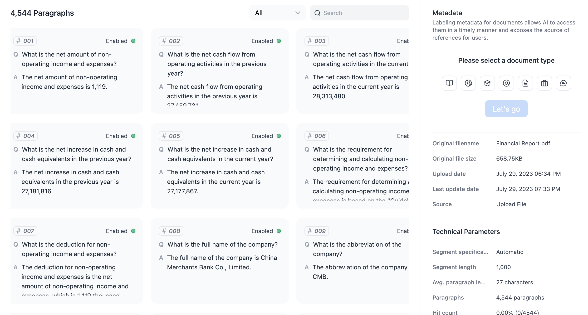
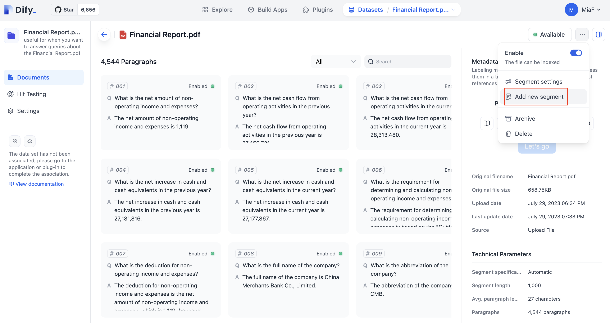

# Datasets\&Index

Most language models use outdated training data and have length limitations for the context of each request. For example, GPT-3.5 is trained on corpora from 2021 and has a limit of approximately 4k tokens per request. This means that developers who want their AI applications to be based on the latest and private context conversations must use techniques like embedding.

Dify' dataset feature allows developers (and even non-technical users) to easily manage datasets and automatically integrate them into AI applications. All you need to do is prepare text content, such as:

* Long text content (TXT, Markdown, JSONL, or even PDF files)
* Structured data (CSV, Excel, etc.)

Additionally, we are gradually supporting syncing data from various data sources to datasets, including:

* GitHub
* Databases
* Webpages
* ...


**Practice**: If your company wants to build an AI customer service assistant based on existing knowledge bases and product documentation, you can upload the documents to a dataset in Dify and create a conversational application. This might have taken you several weeks in the past and been difficult to maintain continuously.


### Datasets and Documents

In Dify, datasets (Datasets) are collections of documents (Documents). A dataset can be integrated as a whole into an application to be used as context. Documents can be uploaded by developers or operations staff, or synced from other data sources (typically corresponding to a file unit in the data source).

**Steps to upload a document:**

1. Upload your file, usually a long text file or a spreadsheet
2. Segment, clean, and preview
3. Dify submits it to the LLM provider for embedding as vector data and storage
4. Set metadata for the document
5. Ready to use in the application!

#### How to write a good dataset description

When multiple datasets are referenced in an application, AI uses the description of the datasets and the user's question to determine which dataset to use to answer the user's question. Therefore, a well-written dataset description can improve the accuracy of AI in selecting datasets.

The key to writing a good dataset description is to clearly describe the content and characteristics of the dataset. **It is recommended that the dataset description begin with this: `Useful only when the question you want to answer is about the following: specific description`**. Here is an example of a real estate dataset description:

> Useful only when the question you want to answer is about the following: global real estate market data from 2010 to 2020. This data includes information such as the average housing price, property sales volume, and housing types for each city. In addition, this dataset also includes some economic indicators such as GDP and unemployment rate, as well as some social indicators such as population and education level. These indicators can help analyze the trends and influencing factors of the real estate market. 
> With this data, we can understand the development trends of the global real estate market, analyze the changes in housing prices in various cities, and understand the impact of economic and social factors on the real estate market.

### Create a dataset

1. Click on datasets in the main navigation bar of Dify. On this page, you can see the existing datasets. Click on "Create Dataset" to enter the creation wizard.
2. If you have already prepared your files, you can start by uploading the files.
3. If you haven't prepared your documents yet, you can create an empty dataset first.

### Uploading Documents By upload file

1. Select the file you want to upload.We support batch uploads
2. Preview the full text
3. Perform segmentation and cleaning
4. Wait for Dify to process the data for you; this step usually consumes tokens in the LLM provider

### Text Preprocessing and Cleaning

Text Preprocessing and cleaning refers to Dify automatically segmenting and vectorizing your data documents so that user's questions (input) can match relevant paragraphs (Q to P), and generate results.

When uploading a dataset, you need to select a **indexing mode** to specify how data is matched. This affects the accuracy of AI replies.

In **High Quality mode**, OpenAI's embedding API is used for higher accuracy in user queries.

In **Economic mode**, offline vector engines, keyword indexing etc. are used to reduce costs at the expense of lower accuracy.

In **Segmenting in Question & Answer format**, instead of normal "Q to P" (question matches paragraphs), it uses "Q to Q" (question matches question) matching. After segmentation, Q\&A pairs are generated for each passage. When users ask questions, the system finds the most similar question and returns the corresponding passage as the answer. This is more precise because it directly matches the user's question and retrieves the information they need.

> Questions have complete syntax while keywords lack semantics and context. So Q to Q improves clarity and handles similar high-frequency questions better.

<figure><figcaption>
In Segmenting in Question &#x26; Answer format, the text is summarized into multiple QA pairs
</figcaption></figure>

<figure><figcaption>
The difference between Q to P and Q to Q indexing modes
</figcaption></figure>

### Modify Documents

Modify Documents For technical reasons, if developers make the following changes to documents, Dify will create a new document for you, and the old document will be archived and deactivated:

1. Adjust segmentation and cleaning settings
2. Re-upload the file

Dify support customizing the segmented and cleaned text by adding, deleting, and editing  paragraphs. You can dynamically adjust your segmentation to make your dataset more accurate. Click **Document -->  paragraph --> Edit** in the dataset to modify  paragraphs content. Click **Document -->  paragraph --> Add new segment** to manually add new  paragraph.

<figure><figcaption>
<strong>Add new segment</strong>
</figcaption></figure>

### Maintain Datasets via API

TODO

### Dataset Settings

Click **Settings** in the left navigation of the dataset. You can change the following settings for the dataset:

* Dataset **name** for identifying a dataset
* Dataset **description** to allow AI to better use the dataset appropriately. If the description is empty, Dify's automatic indexing strategy will be used.
* **Permissions** can be set to Only Me or All Team Members. Those without permissions cannot view and edit the dataset.
* **Indexing mode**: In High Quality mode, OpenAI's embedding interface will be called to process and provide higher accuracy when users query. In Economic mode, offline vector engines, keyword indexing, etc. will be used to reduce accuracy without consuming tokens.

Note: Upgrading the indexing mode from Economic to High Quality will incur additional token consumption. Downgrading from High Quality to Economic will not consume tokens.

### Integrate into Applications

Once the dataset is ready, it needs to be integrated into the application. When the AI application processes will automatically use the associated dataset content as a reference context.

1. Go to the application - Prompt Arrangement page
2. In the context options, select the dataset you want to integrate
3. Save the settings to complete the integration

### Q\&A

**Q: What should I do if the PDF upload is garbled?**

A: If your PDF parsing appears garbled under certain formatted contents, you could consider converting the PDF to Markdown format, which currently offers higher accuracy, or you could reduce the use of images, tables, and other formatted content in the PDF. We are researching ways to optimize the experience of using PDFs.

**Q: How does the consumption mechanism of context work?**
A: With a dataset added, each query will consume segmented content (currently embedding two segments) + question + prompt + chat history combined. However, it will not exceed model limitations, such as 4096.

**Q: Where does the embedded dataset appear when asking questions?**
A: It will be embedded as context before the question.

**Q: Is there any priority between the added dataset and OpenAI's answers?**
A: The dataset serves as context and is used together with questions for LLM to understand and answer; there is no priority relationship.

**Q: Why can I hit in test but not in application?**
A: You can troubleshoot issues by following these steps:

1. Make sure you have added text on the prompt page and clicked on the save button in the top right corner.
2. Test whether it responds normally in the prompt debugging interface.
3. Try again in a new WebApp session window.
4. Optimize your data format and quality. For practice reference, visit [https://github.com/langgenius/dify/issues/90](https://github.com/langgenius/dify/issues/90)
   If none of these steps solve your problem, please join our community for help.

**Q: Will APIs related to hit testing be opened up so that dify can access knowledge bases and implement dialogue generation using custom models?**
A: We plan to open up Webhooks later on; however, there are no current plans for this feature. You can achieve your requirements by connecting to any vector database.

**Q: How do I add multiple datasets?**
A: Due to short-term performance considerations, we currently only support one dataset. If you have multiple sets of data, you can upload them within the same dataset for use.
