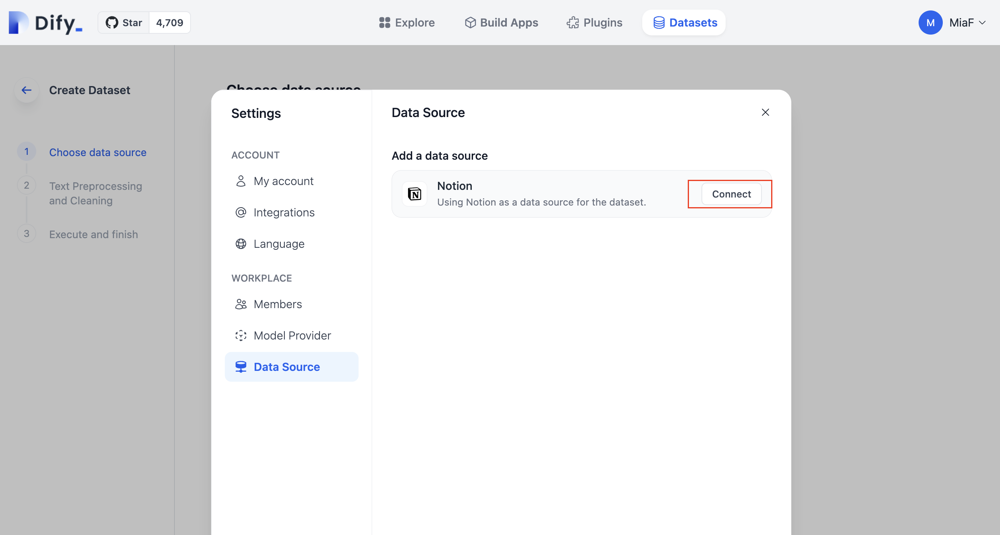
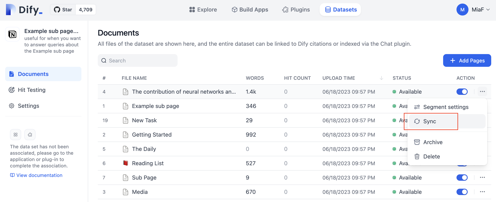

# Sync from Notion

Dify dataset supports importing from Notion and setting up **Sync** so that data is automatically synced to Dify after updates in Notion.

### Authorization verification

1. When creating a dataset, select the data source, click **Sync from Notion--Go to connect**, and complete the authorization verification according to the prompt.
2. You can also: click **Settings--Data Sources--Add  a Data Source**, click Notion Source **Connect** to complete authorization verification.

<figure><figcaption>
Connect Notion
</figcaption></figure>

### Import Notion data

After completing authorization verification, go to the dataset creation page, click **Sync from Notion**, and select the required authorization page to import.

### Segmentation and cleaning

Next, select your **segmentation settings** and **indexing method**, **save and process**. Wait for Dify to process this data, usually this step requires token consumption in LLM providers. Dify not only supports importing ordinary page types but also summarizes and saves the page attributes under the database type.

_**Note: Images and files are not currently supported for import. Table data will be converted to text.**_

### Sync Notion data

If your Notion content has been modified, you can click Sync directly on the Dify dataset document list page to sync the data with one click(Please note that each time you click, the current content will be synchronized). This step requires token consumption.

<figure><figcaption>
Sync Notion data
</figcaption></figure>
