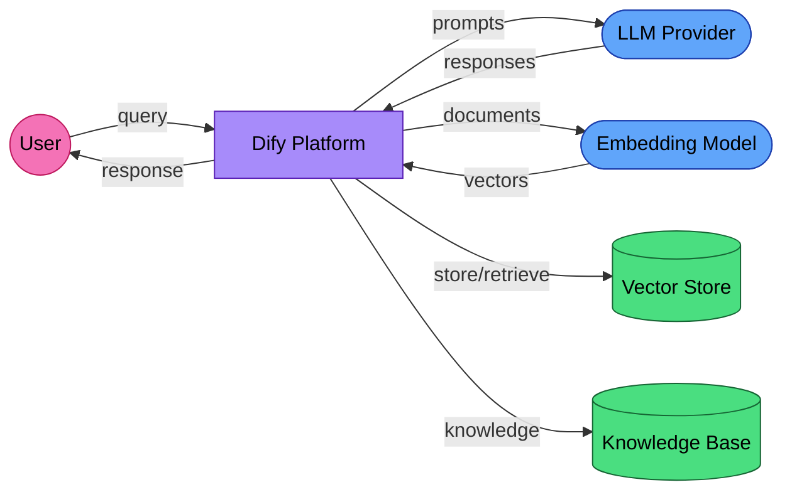

# EU AI Act Compliance Guide for Dify Deployers

Dify is an LLMOps platform for building RAG pipelines, agents, and AI workflows. If you deploy Dify in the EU — whether self-hosted or using a cloud provider — the EU AI Act applies to your deployment. This guide covers what the regulation requires and how Dify's architecture maps to those requirements.

## Self-hosted vs cloud: different compliance profiles

| Deployment | Your role | Dify's role | Who handles compliance? |
|-----------|----------|-------------|------------------------|
| **Self-hosted** | Provider and deployer | Framework provider (no obligations unless marketed as complete system) | You |
| **Dify Cloud** | Deployer | Provider and processor | Shared — Dify handles SOC 2 and GDPR for the platform; you handle AI Act obligations for your specific use case |

Dify Cloud already has SOC 2 Type II and GDPR compliance for the platform itself. But the EU AI Act adds obligations specific to AI systems that SOC 2 does not cover: risk classification, technical documentation, transparency, and human oversight.

## Supported providers and services

Dify integrates with a broad range of AI providers and data stores. The following are the key ones relevant to compliance:

- **AI providers:** HuggingFace (core), plus integrations with OpenAI, Anthropic, Google, and 100+ models via provider plugins
- **Model identifiers include:** gpt-4o, gpt-3.5-turbo, claude-3-opus, gemini-2.5-flash, whisper-1, and others
- **Vector database connections:** Extensive RAG infrastructure supporting numerous vector stores

Dify's plugin architecture means actual provider usage depends on your configuration. Document which providers and models are active in your deployment.

## Data flow diagram

A typical Dify RAG deployment:

**GDPR roles:**
- **Organizations operating cloud LLM providers (OpenAI, Anthropic, Google)** act as processors — requires DPA.
- **Organizations operating cloud embedding services** act as processors — requires DPA.
- **Self-hosted vector stores (Weaviate, Qdrant, pgvector):** Your organization remains the controller — no third-party transfer.
- **Organizations operating cloud vector stores (Pinecone, Zilliz Cloud)** act as processors — requires DPA.
- **Knowledge base documents:** Your organization is the controller — stored in your infrastructure.

## Article 11: Technical documentation

High-risk systems need Annex IV documentation. For Dify deployments, key sections include:

| Section | What Dify provides | What you must document |
|---------|-------------------|----------------------|
| General description | Platform capabilities, supported models | Your specific use case, intended users, deployment context |
| Development process | Dify's architecture, plugin system | Your RAG pipeline design, prompt engineering, knowledge base curation |
| Monitoring | Dify's built-in logging and analytics | Your monitoring plan, alert thresholds, incident response |
| Performance metrics | Dify's evaluation features | Your accuracy benchmarks, quality thresholds, bias testing |
| Risk management | — | Risk assessment for your specific use case |

Some sections can be derived from Dify's architecture and your deployment configuration, as shown in the table above. The remaining sections require your input.

## Article 12: Record-keeping

Dify's built-in logging covers several Article 12 requirements:

| Requirement | Dify Feature | Status |
|------------|-------------|--------|
| Conversation logs | Full conversation history with timestamps | **Covered** |
| Model tracking | Model name recorded per interaction | **Covered** |
| Token usage | Token counts per message | **Covered** |
| Cost tracking | Cost per conversation (if provider reports it) | **Partial** |
| Document retrieval | RAG source documents logged | **Covered** |
| User identification | User session tracking | **Covered** |
| Error logging | Failed generation logs | **Covered** |
| Data retention | Configurable | **Your responsibility** |

Set your data retention policy to at least 6 months for Article 12 compliance.

## Article 13: Transparency

For Dify applications serving end users:

1. **Disclose AI involvement** — tell users they are interacting with an AI system
2. **Source attribution** — Dify's RAG pipeline can show which documents informed the response. Enable this for transparency.
3. **Model identification** — document which LLM model generates responses
4. **Limitations** — disclose known limitations: hallucination risk, knowledge cutoff dates, confidence boundaries

Dify's "citation" feature in RAG applications directly supports transparency by showing users which knowledge base documents informed the answer.

## Article 14: Human oversight

For high-risk applications:

- **Annotation/feedback system:** Dify includes annotation features for human review of AI outputs
- **Moderation:** Built-in content moderation can filter responses before they reach users
- **Rate limiting:** Controls on API usage prevent runaway AI behavior
- **Workflow control:** Dify's workflow builder allows inserting human review steps between AI generation and output delivery

### Recommended pattern

For high-risk use cases (HR, legal, medical), configure your Dify workflow to require human approval before the AI response is delivered to the end user or acted upon.

## Knowledge base compliance

Dify's knowledge base feature has specific compliance implications:

1. **Data provenance:** Document where your knowledge base documents come from. Article 10 requires data governance for training data; knowledge bases are analogous.
2. **Update tracking:** When you add, remove, or update documents in the knowledge base, log the change. The AI system's behavior changes with its knowledge base.
3. **PII in documents:** If knowledge base documents contain personal data, GDPR applies to the entire RAG pipeline. Implement access controls and consider PII redaction before indexing.
4. **Copyright:** Ensure you have the right to use the documents in your knowledge base for AI-assisted generation.

## GDPR considerations

1. **Legal basis** (Article 6): Document why AI processing of user queries is necessary
2. **Data Processing Agreements** (Article 28): Required for each cloud LLM and embedding provider
3. **Data minimization:** Only include necessary context in prompts; avoid sending entire documents when a relevant excerpt suffices
4. **Right to erasure:** If a user requests deletion, ensure their conversations are removed from Dify's logs AND any vector store entries derived from their data
5. **Cross-border transfers:** Cloud providers based outside the EEA require Standard Contractual Clauses

## Resources

- [EU AI Act full text](https://artificialintelligenceact.eu/)
- [Dify documentation](https://docs.dify.ai/)
- [Dify SOC 2 compliance](https://dify.ai/trust)

---

*This is not legal advice. Consult a qualified professional for compliance decisions.*
