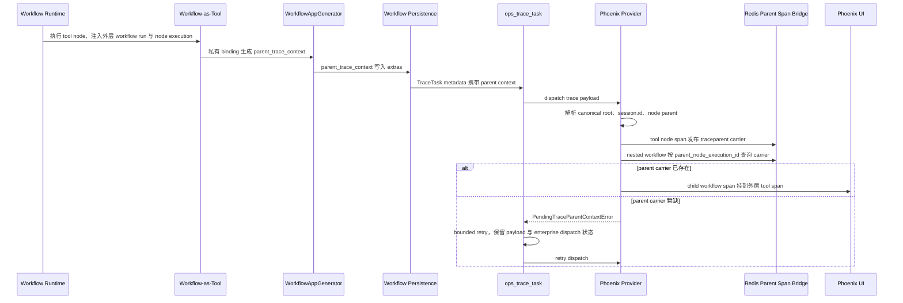
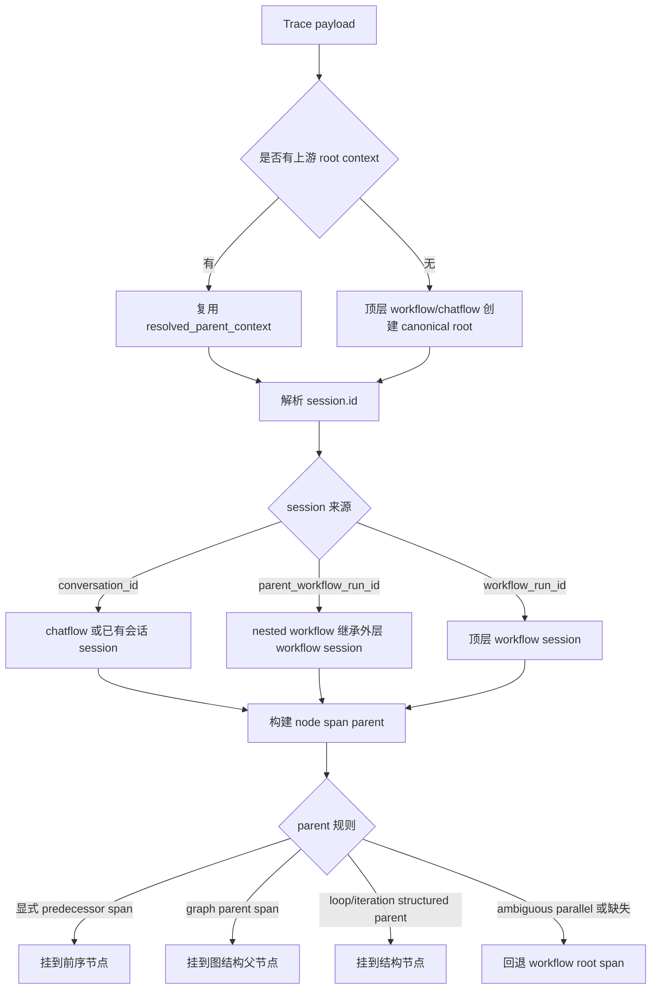

# Phoenix Trace Feature 总结

日期：2026-05-07

## 背景与目标

这个 feature 解决 Dify workflow 在 Phoenix tracing 中的层级与 session 展示问题。原始问题集中在三个方面：

- 顶层 workflow trace 容易形成 orphan root，Phoenix session 查询中可能出现 `rootSpan = null`。
- nested workflow 会被拆到独立 session，不能按外层 workflow 或 chatflow 的业务上下文聚合。
- workflow-as-tool 触发的 child workflow 即使进入同一 trace/session，也无法稳定挂回外层 tool span。

最终设计保持 Dify 既有 tracing contract：上游继续负责 trace payload 生成、workflow 执行上下文和异步 dispatch；Phoenix provider 只补齐 Phoenix/OpenTelemetry 展示所需的 canonical root、`session.id`、span hierarchy、provider-local parent span bridge。后续 review 又把 retry contract 收回 `core.ops`，避免通用 trace task 依赖 Phoenix provider 的具体 symbol。

## 整体设计

### Trace 生成与发送链路



### Phoenix 内部 hierarchy 规则



## 关键设计决策

| 决策 | 结论 | 原因 |
| --- | --- | --- |
| V1 边界 | hierarchy 与 session fallback 先留在 Phoenix provider 内，暂不改 `ops_trace_manager`、`trace_entity`、enterprise telemetry contract | 范围可控，能复用已有上游 parent context，同时避免和正在演进的 core tracing contract 产生冲突 |
| `session.id` 语义 | 顶层 workflow 使用 `workflow_run_id`，chatflow 使用 `conversation_id`，nested workflow 继承外层 session | `session.id` 是 Dify 业务 tracing 语义，不是 Phoenix 专属展示字段；Phoenix Sessions 只是消费该属性的产品能力 |
| canonical root | 顶层 workflow/chatflow span 必须是真正 root，不为 root 制造 synthetic parent | orphan root 会导致 Phoenix session 视图难以定位 root span，也是 `rootSpan = null` 的核心风险 |
| node parent 规则 | 按显式 predecessor、graph parent、structured parent、workflow root 依次 fallback，不用宽泛执行顺序猜测 | 规则可解释、可测试；对串行、分支、loop、iteration 有稳定表现，同时避免 parallel-like 场景错误挂载 |
| V1 范围 | 覆盖普通 workflow、chatflow message、nested workflow、workflow-as-tool、loop/iteration body node；复杂并发 merge 与完整跨 provider 抽象暂不纳入 | 这些是当前 Phoenix UI 调试价值最高的场景，复杂并发需要更强上游语义支撑 |
| nested workflow session 分阶段 | 先打通 `outer_workflow_run_id` 与 session 继承，再处理 parent tool span 精确挂载 | session 合并和 parent span 恢复难度不同，拆开能更快交付可见价值 |
| parent trace context 传递 | workflow-as-tool parent context 走私有 runtime binding，不走公开 `runtime_parameters` | review 发现公开参数可能覆盖用户同名输入，私有 binding 能隔离内部 trace metadata 与用户输入 |
| parent tool span bridge | Phoenix provider 用 Redis 保存 tool node span carrier，child workflow 按 `parent_node_execution_id` 读取 | trace task 异步发送，child task 可能早于 parent tool span；Redis bridge 是当前 provider-local 的最小协调方案 |
| pending parent retry | child workflow 找不到 parent carrier 时抛出 core 层 `PendingTraceParentContextError`，Celery bounded retry 并保留 payload | 首次缺 carrier 不应静默挂到 synthetic root；bounded retry 提高正确挂载概率，同时限制失败面 |
| provider-neutral retry contract | `ops_trace_task` 捕获 `RetryableTraceDispatchError`，Phoenix pending-parent 只是其中一个子类 | 通用 task 不应 import Phoenix provider 或在命名中编码 Phoenix 语义，后续 provider 可复用同一 retry 抽象 |
| enterprise trace 幂等 | retry payload 持久化 enterprise dispatch 状态，已发送成功后 retry 不重复发送 | pending parent retry 只应重试 provider dispatch，不应重复产生 enterprise telemetry |
| 测试文件整理 | 合并两个同名 `test_arize_phoenix_trace.py`，保留单一 provider 测试入口 | 避免 pytest 节点、review diff 和维护入口混乱 |

## 迭代过程摘要

1. 从 prototype 和 Phoenix session 表现切入，确认问题不是单字段缺失，而是 root context、`session.id` 和 node parent 规则没有统一语义。
2. 冻结 Phoenix root/session/hierarchy 预期后，在 provider 内实现 canonical root、session fallback、workflow node parent helper。
3. 发现 workflow-as-tool 缺少 nested workflow parent context，于是扩展 backend 调用链：`trace_id_helper`、workflow tool runtime、`WorkflowAppGenerator.generate()`、workflow persistence 共同透传 `parent_trace_context`。
4. 进一步发现 nested workflow 虽进入同一 trace/session，但仍无法挂到外层 tool span；因此增加 Phoenix-local Redis parent span bridge 与 pending-parent retry。
5. 代码审查后收紧边界：内部 trace metadata 改走私有 binding，通用 task 改依赖 provider-neutral retry contract，retry payload 记录 enterprise dispatch 状态。
6. 最后合并重复 Phoenix provider 测试文件，保留所有覆盖但减少文档和测试入口噪音。

## 测试覆盖

| 覆盖面 | 主要场景 |
| --- | --- |
| Phoenix root/session | 顶层 workflow 使用 canonical root；root span 命名使用 workflow run id 并处理 blank fallback；message trace 保留 conversation session；nested workflow 继承 parent workflow session；有 conversation_id 的 nested workflow 保留自身 conversation session 同时复用 parent root context |
| Phoenix node hierarchy | start node 挂 workflow span；串行节点挂 resolved predecessor；graph parent fallback；loop/iteration body node 挂 enclosing structure；重复 body node 不覆盖 parent；ambiguous parallel-like predecessor 回退 workflow span；graph node title 优先于 execution title |
| Phoenix parent span bridge | tool node span context 发布到 Redis；nested workflow 使用 published parent node context；缺失或 malformed carrier 被拒绝；parent context publish 失败时清理 span；缺 parent carrier 时抛出 pending-parent retry signal |
| Workflow-as-tool context | 从 runtime 提取 `parent_workflow_run_id` 与 `parent_node_execution_id`；runtime 不完整时省略 context；支持显式清空 parent context；用户输入里出现旧内部 key 名时不被覆盖 |
| Backend propagation | `WorkflowAppGenerator.generate()` 将 parent context 写入 extras；workflow persistence 在 graph succeeded/failed trace task 中继续透传 parent context |
| Trace dispatch retry | retryable dispatch failure 会保留 payload 并调度 bounded retry；retry 调度失败按 terminal failure 处理；耗尽 retry 后删除 payload；成功 dispatch 后删除 payload |
| Enterprise trace 幂等 | 首次 dispatch 后将 enterprise 状态写入 retry payload；retry 时跳过已经成功发送的 enterprise trace，避免重复上报 |
| Provider boundary | `ops_trace_task` 使用 `RetryableTraceDispatchError` 基类覆盖 retry 行为，不直接依赖 Phoenix provider；Phoenix 测试仍验证具体 `PendingTraceParentContextError` |
| Trace provider 既有行为 | Arize/Phoenix tracer setup、config validation、span status、metadata serialization、message/tool/moderation/dataset/generate-name trace 等既有 provider 行为继续覆盖 |

本 feature 最后记录的聚焦验证命令：

```bash
uv run --project api pytest api/providers/trace/trace-arize-phoenix/tests/unit_tests/arize_phoenix_trace/test_arize_phoenix_trace.py
```

结果：`67 passed`。

## 主要代码影响

- `api/core/ops/exceptions.py`：新增 provider-neutral trace dispatch retry exception contract。
- `api/core/helper/trace_id_helper.py`、`api/core/tools/workflow_as_tool/tool.py`、`api/core/workflow/node_runtime.py`：生成并携带 workflow-as-tool parent trace context。
- `api/core/app/apps/workflow/app_generator.py`、`api/core/app/workflow/layers/persistence.py`：将 parent trace context 写入 workflow extras 与 trace task metadata。
- `api/providers/trace/trace-arize-phoenix/src/dify_trace_arize_phoenix/arize_phoenix_trace.py`：实现 Phoenix root/session/hierarchy、parent span bridge 与 span naming。
- `api/tasks/ops_trace_task.py`：实现 provider-neutral bounded retry 与 enterprise dispatch 幂等保护。
- `api/tests/unit_tests/**` 与 `api/providers/trace/trace-arize-phoenix/tests/unit_tests/**`：覆盖上述行为。

## 后续迁移方向

当前 Phoenix-local helper 是过渡设计。若未来上游 tracing builder 暴露稳定的 provider-agnostic root/session/node-parent/parent-span contract，以下逻辑可以逐步迁出或删除：

- Phoenix provider 内的 session fallback。
- Phoenix provider 内的 workflow node hierarchy reconstruction。
- Redis parent span bridge。
- pending-parent retry 中 Phoenix 特有的触发条件。
