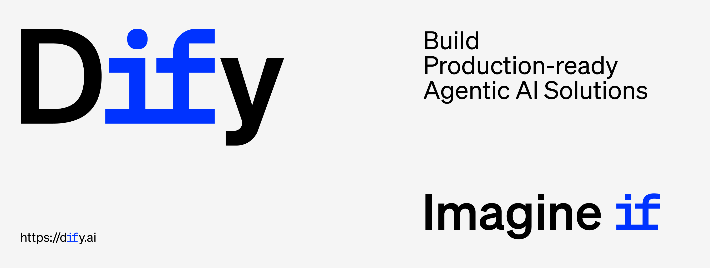

<p align="center">
  <a href="https://cloud.dify.ai">Dify Bulut</a> ·
  <a href="https://docs.dify.ai/getting-started/install-self-hosted">Kendi Sunucunuzda Barındırma</a> ·
  <a href="https://docs.dify.ai">Dokümantasyon</a> ·
  <a href="https://dify.ai/pricing">Dify ürün seçeneklerine genel bakış</a>
</p>

<p align="center">
    <a href="https://dify.ai" target="_blank">
        </a>
    <a href="https://dify.ai/pricing" target="_blank">
        </a>
    <a href="https://discord.gg/FngNHpbcY7" target="_blank">
        </a>
    <a href="https://reddit.com/r/difyai" target="_blank">  
        </a>
    <a href="https://twitter.com/intent/follow?screen_name=dify_ai" target="_blank">
        </a>
    <a href="https://www.linkedin.com/company/langgenius/" target="_blank">
        </a>
    <a href="https://hub.docker.com/u/langgenius" target="_blank">
        </a>
    <a href="https://github.com/langgenius/dify/graphs/commit-activity" target="_blank">
        </a>
    <a href="https://github.com/langgenius/dify/" target="_blank">
        </a>
    <a href="https://github.com/langgenius/dify/discussions/" target="_blank">
        </a>
    <a href="https://insights.linuxfoundation.org/project/langgenius-dify" target="_blank">
        </a>
    <a href="https://insights.linuxfoundation.org/project/langgenius-dify" target="_blank">
        </a>
    <a href="https://insights.linuxfoundation.org/project/langgenius-dify" target="_blank">
        </a>
</p>

<p align="center">
  <a href="../../README.md"></a>
  <a href="../zh-TW/README.md"></a>
  <a href="../zh-CN/README.md"></a>
  <a href="../ja-JP/README.md"></a>
  <a href="../es-ES/README.md"></a>
  <a href="../fr-FR/README.md"></a>
  <a href="../tlh/README.md"></a>
  <a href="../ko-KR/README.md"></a>
  <a href="../ar-SA/README.md"></a>
  <a href="../tr-TR/README.md"></a>
  <a href="../vi-VN/README.md"></a>
  <a href="../de-DE/README.md"></a>
  <a href="../it-IT/README.md"></a>
  <a href="../pt-BR/README.md"></a>
  <a href="../sl-SI/README.md"></a>
  <a href="../bn-BD/README.md"></a>
  <a href="../hi-IN/README.md"></a>
</p>

Dify, açık kaynaklı bir LLM uygulama geliştirme platformudur. Sezgisel arayüzü, AI iş akışı, RAG pipeline'ı, ajan yetenekleri, model yönetimi, gözlemlenebilirlik özellikleri ve daha fazlasını birleştirerek, prototipten üretime hızlıca geçmenizi sağlar. İşte temel özelliklerin bir listesi:
</br> </br>

**1. Workflow**:
Görsel bir arayüz üzerinde güçlü AI iş akışları oluşturun ve test edin, aşağıdaki tüm özellikleri ve daha fazlasını kullanarak.

**2. Kapsamlı model desteği**:
Çok sayıda çıkarım sağlayıcısı ve kendi kendine barındırılan çözümlerden yüzlerce özel / açık kaynaklı LLM ile sorunsuz entegrasyon sağlar. GPT, Mistral, Llama3 ve OpenAI API uyumlu tüm modelleri kapsar. Desteklenen model sağlayıcılarının tam listesine [buradan](https://docs.dify.ai/getting-started/readme/model-providers) ulaşabilirsiniz.


**3. Prompt IDE**:
Komut istemlerini oluşturmak, model performansını karşılaştırmak ve sohbet tabanlı uygulamalara metin-konuşma gibi ek özellikler eklemek için kullanıcı dostu bir arayüz.

**4. RAG Pipeline**:
Belge alımından bilgi çekmeye kadar geniş kapsamlı RAG yetenekleri. PDF'ler, PPT'ler ve diğer yaygın belge formatlarından metin çıkarma için hazır destek sunar.

**5. Ajan yetenekleri**:
LLM Fonksiyon Çağırma veya ReAct'a dayalı ajanlar tanımlayabilir ve bu ajanlara önceden hazırlanmış veya özel araçlar ekleyebilirsiniz. Dify, AI ajanları için Google Arama, DALL·E, Stable Diffusion ve WolframAlpha gibi 50'den fazla yerleşik araç sağlar.

**6. LLMOps**:
Uygulama loglarını ve performans metriklerini zaman içinde izleme ve analiz etme imkanı. Üretim ortamından elde edilen verilere ve kullanıcı geri bildirimlerine dayanarak, prompt'ları, veri setlerini ve modelleri sürekli olarak optimize edebilirsiniz. Bu sayede, AI uygulamanızın performansını ve doğruluğunu sürekli olarak artırabilirsiniz.

**7. Hizmet Olarak Backend**:
Dify'ın tüm özellikleri ilgili API'lerle birlikte gelir, böylece Dify'ı kendi iş mantığınıza kolayca entegre edebilirsiniz.

## Dify'ı Kullanma

- **Cloud </br>**
  Herkesin sıfır kurulumla denemesi için bir [Dify Cloud](https://dify.ai) hizmeti sunuyoruz. Bu hizmet, kendi kendine dağıtılan versiyonun tüm yeteneklerini sağlar ve sandbox planında 200 ücretsiz GPT-4 çağrısı içerir.

- **Dify Topluluk Sürümünü Kendi Sunucunuzda Barındırma</br>**
  Bu [başlangıç kılavuzu](#quick-start) ile Dify'ı kendi ortamınızda hızlıca çalıştırın.
  Daha fazla referans ve detaylı talimatlar için [dokümantasyonumuzu](https://docs.dify.ai) kullanın.

- **Kurumlar / organizasyonlar için Dify</br>**
  Ek kurumsal odaklı özellikler sunuyoruz. Kurumsal ihtiyaçları görüşmek için [bize bir e-posta gönderin](mailto:business@dify.ai?subject=%5BGitHub%5DBusiness%20License%20Inquiry). </br>

  > AWS kullanan startuplar ve küçük işletmeler için, [AWS Marketplace'deki Dify Premium'a](https://aws.amazon.com/marketplace/pp/prodview-t22mebxzwjhu6) göz atın ve tek tıklamayla kendi AWS VPC'nize dağıtın. Bu, özel logo ve marka ile uygulamalar oluşturma seçeneğine sahip uygun fiyatlı bir AMI teklifdir.

## Güncel Kalma

GitHub'da Dify'a yıldız verin ve yeni sürümlerden anında haberdar olun.


## Hızlı başlangıç

> Dify'ı kurmadan önce, makinenizin aşağıdaki minimum sistem gereksinimlerini karşıladığından emin olun:
>
> - CPU >= 2 Çekirdek
> - RAM >= 4GB

</br>
Dify sunucusunu başlatmanın en kolay yolu, [docker-compose.yml](../../docker/docker-compose.yaml) dosyamızı çalıştırmaktır. Kurulum komutunu çalıştırmadan önce, makinenizde [Docker](https://docs.docker.com/get-docker/) ve [Docker Compose](https://docs.docker.com/compose/install/)'un kurulu olduğundan emin olun:

```bash
cd docker
cp .env.example .env
docker compose up -d
```

Çalıştırdıktan sonra, tarayıcınızda [http://localhost/install](http://localhost/install) adresinden Dify kontrol paneline erişebilir ve başlangıç ayarları sürecini başlatabilirsiniz.

> Eğer Dify'a katkıda bulunmak veya ek geliştirmeler yapmak isterseniz, [kaynak koddan dağıtım kılavuzumuza](https://docs.dify.ai/getting-started/install-self-hosted/local-source-code) başvurun.

## Sonraki adımlar

Yapılandırmayı özelleştirmeniz gerekiyorsa, lütfen [.env.example](../../docker/.env.example) dosyamızdaki yorumlara bakın ve `.env` dosyanızdaki ilgili değerleri güncelleyin. Ayrıca, spesifik dağıtım ortamınıza ve gereksinimlerinize bağlı olarak `docker-compose.yaml` dosyasının kendisinde de, imaj sürümlerini, port eşlemelerini veya hacim bağlantılarını değiştirmek gibi ayarlamalar yapmanız gerekebilir. Herhangi bir değişiklik yaptıktan sonra, lütfen `docker-compose up -d` komutunu tekrar çalıştırın. Kullanılabilir tüm ortam değişkenlerinin tam listesini [burada](https://docs.dify.ai/getting-started/install-self-hosted/environments) bulabilirsiniz.

### Grafana ile Metrik İzleme

Uygulamalar, kiracılar, mesajlar ve daha fazlasının granularitesinde metrikleri izlemek için Dify'nin PostgreSQL veritabanını veri kaynağı olarak kullanarak panoyu Grafana'ya aktarın.

- [@bowenliang123 tarafından Grafana Panosu](%E9%93%BE%E6%8E%A5)

### Kubernetes ile Dağıtım

Yüksek kullanılabilirliğe sahip bir kurulum yapılandırmak isterseniz, Dify'ın Kubernetes üzerine dağıtılmasına olanak tanıyan topluluk katkılı [Helm Charts](https://helm.sh/) ve YAML dosyaları mevcuttur.

- [@LeoQuote tarafından Helm Chart](https://github.com/douban/charts/tree/master/charts/dify)
- [@BorisPolonsky tarafından Helm Chart](https://github.com/BorisPolonsky/dify-helm)
- [@Winson-030 tarafından YAML dosyası](https://github.com/Winson-030/dify-kubernetes)
- [@wyy-holding tarafından YAML dosyası](https://github.com/wyy-holding/dify-k8s)
- [🚀 YENİ! YAML dosyaları (Dify v1.6.0 destekli) @Zhoneym tarafından](https://github.com/Zhoneym/DifyAI-Kubernetes)

#### Dağıtım için Terraform Kullanımı

Dify'ı bulut platformuna tek tıklamayla dağıtın [terraform](https://www.terraform.io/) kullanarak

##### Azure Global

- [Azure Terraform tarafından @nikawang](https://github.com/nikawang/dify-azure-terraform)

##### Google Cloud

- [Google Cloud Terraform tarafından @sotazum](https://github.com/DeNA/dify-google-cloud-terraform)

#### AWS CDK ile Dağıtım

[CDK](https://aws.amazon.com/cdk/) kullanarak Dify'ı AWS'ye dağıtın

##### AWS

- [AWS CDK tarafından @KevinZhao (EKS based)](https://github.com/aws-samples/solution-for-deploying-dify-on-aws)
- [AWS CDK tarafından @tmokmss (ECS based)](https://github.com/aws-samples/dify-self-hosted-on-aws)

#### Alibaba Cloud

[Alibaba Cloud Computing Nest](https://computenest.console.aliyun.com/service/instance/create/default?type=user&ServiceName=Dify%E7%A4%BE%E5%8C%BA%E7%89%88)

#### Alibaba Cloud Data Management

[Alibaba Cloud Data Management](https://www.alibabacloud.com/help/en/dms/dify-in-invitational-preview/) kullanarak Dify'ı tek tıkla Alibaba Cloud'a dağıtın

#### AKS'ye Dağıtım için Azure Devops Pipeline Kullanımı

[Azure Devops Pipeline Helm Chart by @LeoZhang](https://github.com/Ruiruiz30/Dify-helm-chart-AKS) kullanarak Dify'ı tek tıkla AKS'ye dağıtın

## Katkıda Bulunma

Kod katkısında bulunmak isteyenler için [Katkı Kılavuzumuza](./CONTRIBUTING.md) bakabilirsiniz.
Aynı zamanda, lütfen Dify'ı sosyal medyada, etkinliklerde ve konferanslarda paylaşarak desteklemeyi düşünün.

> Dify'ı Mandarin veya İngilizce dışındaki dillere çevirmemize yardımcı olacak katkıda bulunanlara ihtiyacımız var. Yardımcı olmakla ilgileniyorsanız, lütfen daha fazla bilgi için [i18n README](https://github.com/langgenius/dify/blob/main/web/i18n-config/README.md) dosyasına bakın ve [Discord Topluluk Sunucumuzdaki](https://discord.gg/8Tpq4AcN9c) `global-users` kanalında bize bir yorum bırakın.

**Katkıda Bulunanlar**

<a href="https://github.com/langgenius/dify/graphs/contributors">
  
</a>

## Topluluk & iletişim

- [GitHub Tartışmaları](https://github.com/langgenius/dify/discussions). En uygun: geri bildirim paylaşmak ve soru sormak için.
- [GitHub Sorunları](https://github.com/langgenius/dify/issues). En uygun: Dify.AI kullanırken karşılaştığınız hatalar ve özellik önerileri için. [Katkı Kılavuzumuza](./CONTRIBUTING.md) bakın.
- [Discord](https://discord.gg/FngNHpbcY7). En uygun: uygulamalarınızı paylaşmak ve toplulukla vakit geçirmek için.
- [X(Twitter)](https://twitter.com/dify_ai). En uygun: uygulamalarınızı paylaşmak ve toplulukla vakit geçirmek için.

## Star history

[](https://star-history.com/#langgenius/dify&Date)

## Güvenlik açıklaması

Gizliliğinizi korumak için, lütfen güvenlik sorunlarını GitHub'da paylaşmaktan kaçının. Bunun yerine, sorularınızı security@dify.ai adresine gönderin ve size daha detaylı bir cevap vereceğiz.

## Lisans

Bu depo, temel olarak Apache 2.0 lisansı ve birkaç ek kısıtlama içeren [Dify Açık Kaynak Lisansı](../../LICENSE) altında kullanıma sunulmuştur.
