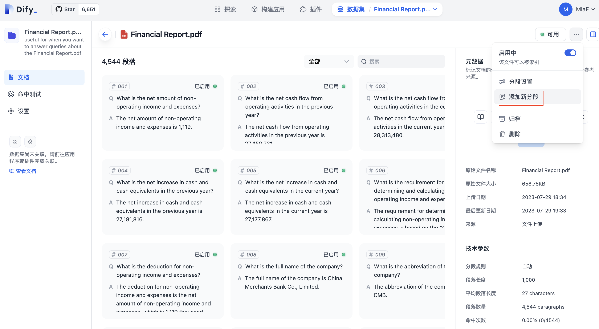

# 数据集管理

大多数语言模型采用较为陈旧的训练数据，并且对每次请求的上下文有长度限制。例如 GPT-3.5 是基于 2021 年的语料进行训练的，且有每次约 4K Token 的限制。这意味着开发者如果想让 AI 应用基于最新的、私有的上下文对话，必须使用类似嵌入（Embedding）之类的技术。

Dify 的数据集功能可以使开发者（甚至非技术人员）以简单的方式管理数据集，并自动集成至 AI 应用中。你只需准备文本内容，例如：

* 长文本内容（TXT、Markdown、JSONL 甚至是 PDF 文件）
* 结构化数据（CSV、Excel 等）

另外，我们正在逐步支持从诸多数据源同步数据至数据集，包括：

* 网页
* Notion
* Github
* 数据库
* ……


**情景**：如果你的公司想基于现有知识库和产品文档建立一个 AI 客服助手，你可以在 Dify 中将文档上传至数据集，并建立一个对话型应用。这在过去可能需要花费你数周的时间，且难以持续维护。


### 数据集与文档

在 Dify 中，**数据集（Datasets）**是一些**文档（Documents）**的集合。一个数据集可以被整体集成至一个应用中作为上下文使用。文档可以由开发者或运营人员上传，或由其它数据源同步（通常对应数据源中的一个文件单位）。

**上传文档的步骤：**

1. 上传你的文件，通常是长文本文件或表格文件。
2. 分段、清洗并预览
3. 由 Dify 提交至 LLM 供应商嵌入为向量数据，并存储
4. 为文档设置元数据
5. 可以在应用中使用了🎉！

### 创建数据集

在 Dify 主导航栏中点击**数据集**，在该页面你可以看到已有的数据集。你可以点击**创建数据集**进入创建向导：

* 如果你已经准备好了文件，可以从上传文件开始
* 如果你还没有准备好文档，可以先创建一个空数据集

如果你在创建数据集时选择了使用外部数据源，该数据集的类型不可更改。这是为了防止单一数据集存在多数据源而造成的管理困难。如果你需要使用多个数据源，建议创建多个数据集。

#### 编辑良好的数据集描述

当一个应用中引用多个数据集时，AI 会根据用户的提问和数据集的描述来决定使用哪个数据集来回答用户的问题。因此，良好的数据集描述能提升 AI 选择数据集的准确率。

编写良好的数据集描述的要点是写清楚数据集包含的内容和特点。**数据集的描述建议以这个开头：`仅当你想要回答的问题是关于以下内容时有用：具体描述`**。一个房地产数据集的描述：

> 仅当你想要回答的问题是关于以下内容时有用： 2010 年到 2020 年的全球房地产市场数据。这些数据包括每个城市的平均房价、房产销售量、房屋类型等信息。此外，该数据集还包括了一些经济指标，如 GDP、失业率等，以及一些社会指标，如人口数量、教育水平等，这些指标可以帮助分析房地产市场的趋势和影响因素。
>
> 通过这些数据，我们可以了解全球房地产市场的发展趋势，分析各个城市的房价变化，以及了解经济和社会因素对房地产市场的影响。

### 上传文档

* 选择你要上传的文件，支持批量上传；
* 预览全文；
* 进行分段和清洗；
* 等待 Dify 为你处理这些数据，通常该步骤在 LLM 供应商中需要消耗 Token。

### 文本分段与清洗

文本数据的分段与清洗是指 Dify 自动将你的数据进行段落分段 & 向量化处理，使得用户的提问（输入）能匹配到相关的文本段落（Q to P），最后输出结果。

上传一个数据集的文档，你需要选择文本的**索引方式**来指定数据的匹配方式。这会影响到 AI 在回复问题时的准确度。

**高质量模式**下，将调用 OpenAI 的嵌入接口进行处理，以在用户查询时提供更高的准确度。

**经济模式**下，会使用离线的向量引擎、关键词索引等方式，降低了准确度但无需花费 Token。

**Q\&A 分段模式**下，Q\&A 分段模式功能，与上述普通的「Q to P」（问题匹配文本段落）匹配模式不同，它是采用「Q to Q」（问题匹配问题）匹配工作，在文档经过分段后，经过总结为每一个分段生成 Q\&A 匹配对，当用户提问时，系统会找出与之最相似的问题，然后返回对应的分段作为答案。这种方式更加精确，因为它直接针对用户问题进行匹配，可以更准确地获取用户真正需要的信息。

> 问题文本是具有完整语法结构的自然语言，而不是文档检索任务中的一些关键字，所以 Q to Q （问题匹配问题）的模式会令语意和匹配更加清晰，并同时满足一些高频和高相似度问题的提问场景。

<figure><figcaption>
Q&#x26;A 分段模式下被总结成多个 Q&#x26;A 对的文本
</figcaption></figure>

<figure><figcaption>
Q to P 与 Q to Q 的索引模式区别
</figcaption></figure>

### 对文档进行修改

由于技术原因，如果开发者对文档进行以下修改，Dify 会为你创建一个新的文档，而旧的文档会被存档和停用：

* 调整分段和清洗设置
* 重新上传文件

我们支持对分段与清洗后的文本进行自定义增删改，你可以动态调整自己的分段信息，让你的数据集更加精准。通过点击数据集中 **文档 --> 段落 --> 编辑** 可修改段落内容。通过点击 **文档 --> 段落--> 添加新分段** 可手动新增新的分段内容。

<figure><figcaption>
新增新段落
</figcaption></figure>

### 通过 API 维护数据集

TODO

### 数据集设置

在数据集的左侧导航中点击**设置**，你可以改变数据集的以下设置项：

* 数据集名称，用于识别一个数据集。
* 数据集描述，能够让 AI 更好的适时取用数据集，如果描述为空则会使用 Dify 的自动索引策略
* 权限，可选择 只有我 或 所有团队成员，不具有权限的人将无法查阅和编辑数据集。
* 修改索引模式。注意：索引模式如果从经济升级为高质量会带来额外的 Token 消耗。而从高质量降级为经济则不会消耗 Token。

### 集成至应用

数据集准备完成后需集成到应用中，当 AI 应用处理用户请求时，会自动将与之关联的数据集内容作为上下文参考。

1. 进入**应用 - 提示词编排**页面
2. 在上下文选项中，选择需要集成的数据集
3. 保存设置以完成集成

### Q\&A

**Q: 上传 PDF 解析乱码怎么办？**

A: 如果你的 PDF 在特定格式内容下解析出现乱码的情况，可以考虑将 PDF 转成 Markdown 格式，或目前 Markdown 的准确度会更高，或减少 PDF 内的图片、表格等格式内容。对于 PDF 的使用体验我们正在研究优化方案。
