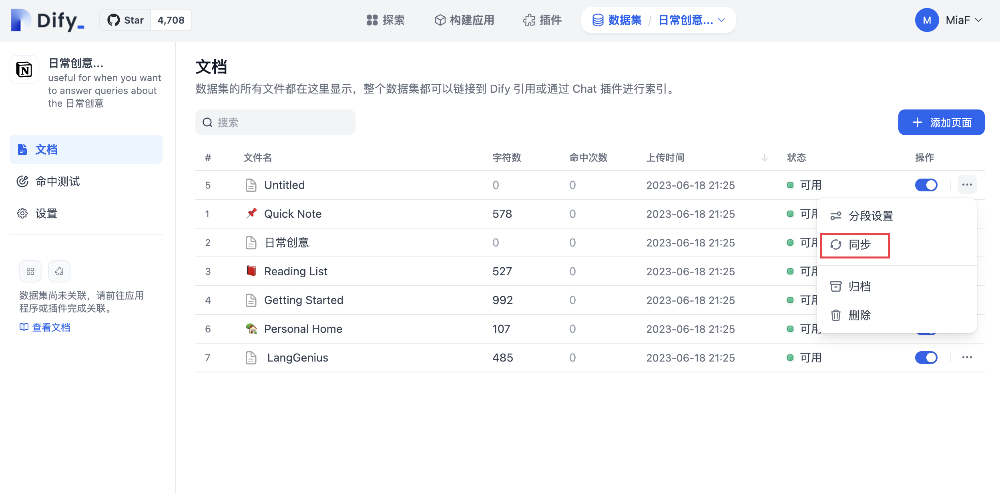

# 从 Notion 导入数据

Dify 数据集支持从 Notion 导入，并设置 **同步** 使得数据在 Notion 更新后便自动同步到 Dify。

### 授权验证

1. 在创建数据集，选择数据源时，点击 **同步自 Notion 内容-- 去绑定，**根据提示完成授权验证**。**
2. 你也可以：进入 **设置 -- 数据来源 -- 添加数据源** 中点击 Notion 来源 **绑定** ，完成授权验证。

<figure><figcaption>
绑定 Notion
</figcaption></figure>

### 导入 Notion 数据

完成验证授权后，进入创建数据集页面，点击 **同步自 Notion 内容 ，**选择需要的授权页面进行导入。

### 进行分段和清洗

接下来，选择你的**分段设置**和**索引方式**，**保存并处理**。等待 Dify 为你处理这些数据，通常该步骤在 LLM 供应商中需要消耗 Token。Dify 不仅支持普通类型页面导入，并且会将 database 类型下的页面属性进行汇总保存。

_**请注意：图片和文件暂不支持导入，表格类数据会被转换为文本展示。**_

### 同步 Notion 数据

如果您的 Notion 内容有修改，您可以直接在 Dify 数据集 **文档列表页**中点击 **同步** 即可进行数据一键同步，该步骤是需要消耗 Token。

<figure><figcaption>
同步 Notion 内容
</figcaption></figure>
