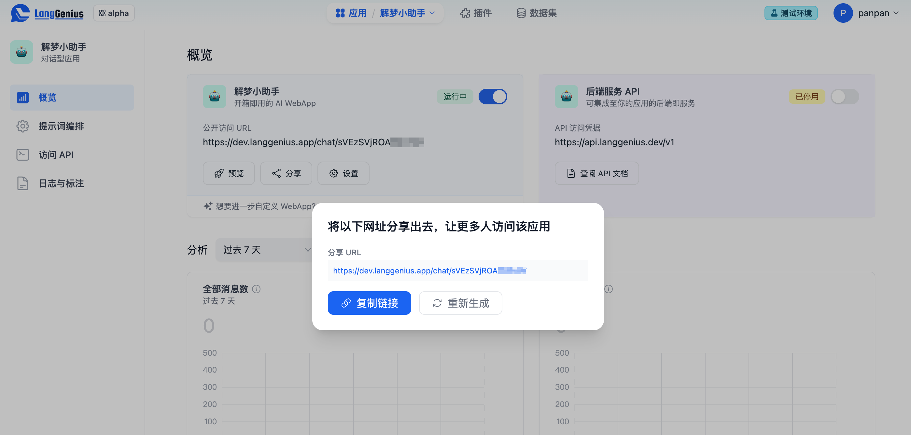

# 快速发布 AI 站点

使用 Dify 创建 AI 应用的一个好处在于，你可以在几分钟内就发布一个可供用户使用的 Web 应用，该应用将根据你的 Prompt 编排工作。

* 如果你使用的是自部署的开源版，该应用将运行在你的服务器上
* 如果你使用的是云服务，该应用将托管至 Dify.app

### 发布 AI 站点

在应用概览页中，你可以找到关于AI 站点（WebApp）的卡片。只需开启 WebApp 的访问，就可以得到一个可分享可分享给用户的链接了。

<figure><figcaption>
分享应用
</figcaption></figure>

我们对以下两种应用均提供了一个漂亮的 WebApp 界面：

* 文本生成型（前往预览）
* 对话型（前往预览）

### 设置你的 AI 站点

点击 WebApp 卡片上的**设置**按钮，可以为 AI 站点配置一些选项。它们都会被最终用户所见：

* 图标
* 名称
* 应用描述
* 界面语言
* 版权信息
* 隐私政策链接

### 嵌入你的 AI 站点

Dify 支持将你的 AI 应用嵌入到你的业务网站中，你可以使用该能力在几分钟内制作具有业务数据的官网 AI 客服、业务知识问答等应用。点击 WebApp 卡片上的嵌入按钮，复制嵌入代码，粘贴到你网站的目标位置。

* iframe 标签方式

    将 iframe 代码复制到你网站用于显示 AI 应用的标签中，如 `
`、`<section>` 等标签。

* script 标签方式

    将 script 代码复制到你网站 `<head>` 或 `<body>` 标签中。

<figure><figcaption></figcaption></figure>

例如，将 script 代码粘贴到官网的 `<body>` 处，你将得到一个官网 AI 机器人：

<figure><figcaption></figcaption></figure>
