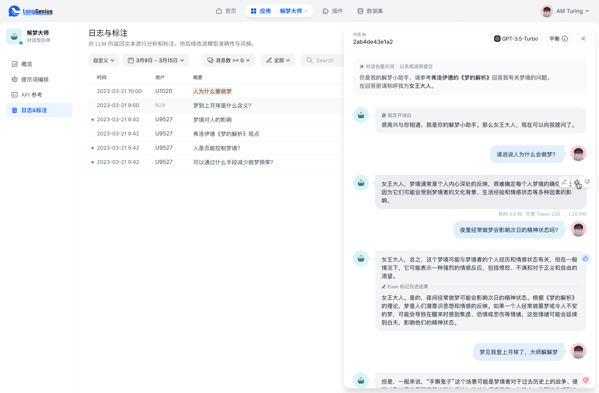

# 日志与标注


请确保您的应用在收集用户数据时遵守当地法规。通常的做法是发布隐私政策并征得用户的同意。


**日志（Logs）**功能用以观察与标记 Dify 应用的工作表现，Dify 为应用的全部交互过程记录了日志，无论你是通过 WebApp 或 API 调用的，如果你是 Prompt 工程师或 LLM 运营人员，它将为你提供可视化的 LLM 应用运营体验。

### 使用日志控制台

你可以在应用的左侧导航找到**日志（Logs）**，该页面通常展示了：

* 所选时间内用户与用户的交互记录
* 用户输入与 AI 输出的结果，对于对话型应用通常是一系列的消息流
* 用户、运营人员的评价，以及运营人员的改进标注

注意，如果团队中的多位协作者对同一条日志进行标注，最后标注的记录将覆盖此前的标注。

### 改进标注


这些标记将在 Dify 的后续版本中供模型微调使用，以提升模型的准确性与回复风格，当前预览版仅支持标记。


<figure><figcaption>
标记日志以改进
</figcaption></figure>

点击一条日志会在界面右侧打开日志详情面板，在该面板中运营人员可以对一次互动进行标注：

* 对表现较佳的消息点赞
* 对表现不佳的消息点踩
* 对改进的结果标记改进回复，这代表了你期望 AI 回复的文本

注意，如果团队中的多位管理员对同一条日志进行标注，最后标注的记录将覆盖此前的标注。

